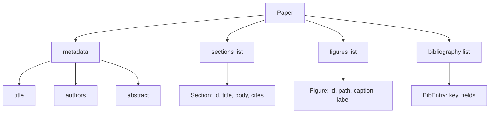
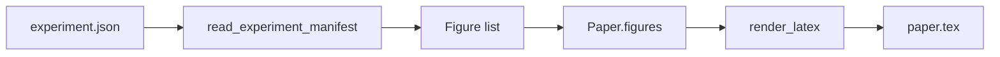
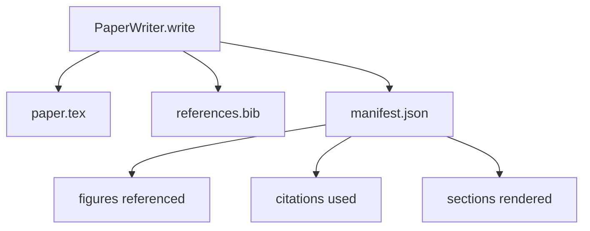

# 论文写作器 Le livre de la vie

> Le schéma LaTeX est le contrat entre le chercheur et le type-setter. Si le contrat est détruit, le document ne peut pas être compilé, et l'échec sera évident.

**Type:** Build
**Languages:** Python
**Prerequisites:** Phase 19 lessons 50-53
**Time:** ~90 minutes

## Objectifs d'apprentissage

- Le document de recherche doit être considéré comme un artefact structuré avec un graphique de section connu, et non comme un document sous forme libre.
- Avant d'écrire une prose, générez une déclaration abstraite, sections, espaces de chiffres et le squelette LaTeX des clés bibliographiques.
- à travers le mécanisme de slot déterministe, les figures des sorties de l'expérience  dans les chemins et sous-titres  entreront dans le squelette
- Connectez-vous à un générateur de prose ridicule, il remplit chaque section de la structure, laissez l'harnais peut être testé sans modèle.
- 输出单个 `paper.tex`Une.`references.bib`, ajouter une liste de chaque figure référencée et chaque citation utilisée de manifeste.


```figure
ch-paper-skeleton
```

## Pourquoi un squelette d'abord ?

De la prose  début de projet 会积累结构债务──introduction 增长出三段本应放到相关作品的内容──某个数字 在定义之前就被引用──bibliography 最终为同一篇论文 产生三个关键──等作者注意到时,重写成本 已经高于写成本──

Les chiffres sont avec des ids et des sous-titres. Les clés bibliographiques sont en haut des déclarations et avec des entrées orientées. Les parties peuvent être écrites dans n'importe quelle prose.

Ceci est appliqué à des plans, des appels d'outils et des traces de la discipline.

## La forme du papier



Chaque champ est un simple Python données.`Paper`À la fonction pure de la chaîne LaTeX. Harness peut être rendu en avant dans le papier: statistiques sections, liste des fichiers de figure manquants, chaque vérification `\cite{key}`Tout est en accord.`BibEntry`Il y a une autre.

## Le contrat de rendement

Le rendant garantit trois propriétés. Toutes les positions dans le squelette sont en train de sortir.`\begin{figure}`bloc,并带有稳定标签,格式为 `fig:<id>`Deuxièmement, chaque section en sort une.`\section{}`, et avec une étiquette stable, format pour`sec:<id>`, ainsi les références croisées peuvent être travaillées.`\bibliography`bloc,其 `references.bib`精确含文件 上声明的条目,不多也不少──

违反任何一条都是 rendre erreur, pas avertir. 骨架就是合同.

## Injection de figure à partir d'expériences

Le programme de recherche de l'expérience est basé sur la recherche de données et de données.`Figure`enregistrements



L'injection est déterministe de──Idés de la figure du nom de l'expérience 加上 monotone counter 派生──Capitations provenant du manifeste──Paths 会相对纸的输出目录做正常化,因此即使实验输出位于磁盘其他位置,LaTeX也能编译──

## Le générateur de prose ridicule

Le modèle n'est pas utilisé.`MockProseGenerator`读取概要形,并决定性 地输出散文──概要形是每个节 一条短字符串──生成器 会将该字符串扩展成两个短段落,并把节标题 编织进去──生成的散文 只会在概要 声明时名字-滴数字 和引用──

Ceci suffit à tester chaque comportement de l'écrivain. Il est vrai que l'on peut réaliser que le générateur est transformé en appel de modèle.

## La sortie manifeste

rédacteur 会向输出目录 输出三个文件──



Le manifeste est un évaluateur ou un cycle critique 读取的内容──它不解析 LaTeX;它读取 manifest──下一课评论循环会将这个 manifeste 作为输入,并产生反列表──这就是为什么 manifeste 作为合同的一部分,而 LaTeX 不是──

## Portes de validation

écrit dans n'importe quel fichier 之前运行四个门──

1. Le papier de chaque figure est unique.
2. Chaque section de`cites`字段引用的图书馆关键都已在纸上声明──
3. abstrait 非空──
4. titre 非空。

La porte de la défaite sera abandonnée .`PaperValidationError`,并给出精确原因──harness 将该原因作为失败模式 暴露出来──没有部分写:要么输出全部三个文件,要么一个也没有输出──

## Comment lire le code

`code/main.py` définit `Paper`- Je suis là.`Section`- Je suis là.`Figure`- Je suis là.`BibEntry`- Je suis là.`PaperValidationError`- Je suis là.`MockProseGenerator`- Je suis là.`PaperWriter`, ainsi qu' un .`render_latex`fonctionnement`write`méthode 接收 répertoire de sortie,并输出 `paper.tex`- Je suis là.`references.bib`et `manifest.json`Il y a une autre.`read_experiment_manifest`assistant 会将 expérimentation manifeste liste 转换为 `Figure`enregistrements

`code/tests/test_paper_writer.py`覆盖: 没有节目 时的骨格 render、带两个节目 和两个数字的完整 render、missing-citation gate、duplicate-figure-id gate、manifest content, ainsi que LaTeX-string contract(每个节目 输出一个`\section{}`, chaque chiffre en sort un`\begin{figure}`)。

## On va plus loin

Réellement réaliser va nécessiter deux extensions.`Paper`Les modèles peuvent être compilés pour les articles de blog, ainsi que les prévisualisations utilisées pour le HTML.`Paper`Deuxièmement, enrichissement de citations: given determin本地 DOI cache,writer de la clé de citation obtenir les entrées BibTeX── les deux ont une valeur, y compris dans le cas de non-touchage du contrat de squelette ⋅

Le schéma est le suivant. Les sections, les chiffres et les citations sont en forme de déclaration, la prose est produite en slots, le manifeste est en mode de sortie avec LaTeX.
