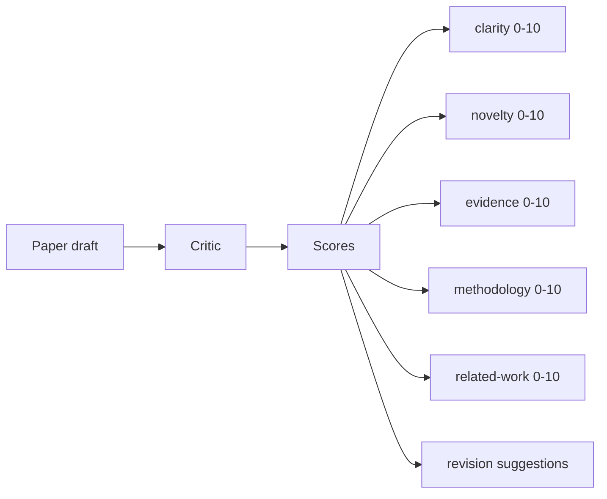
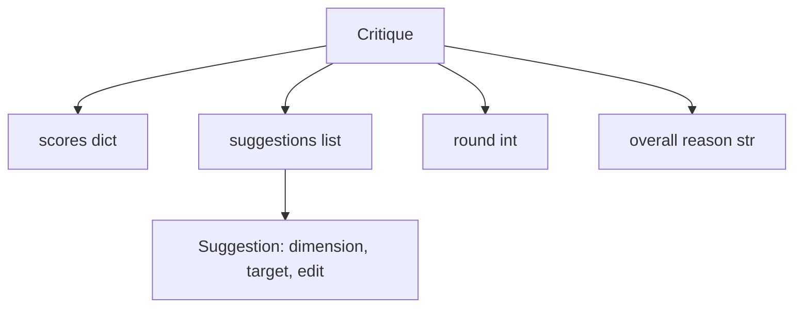
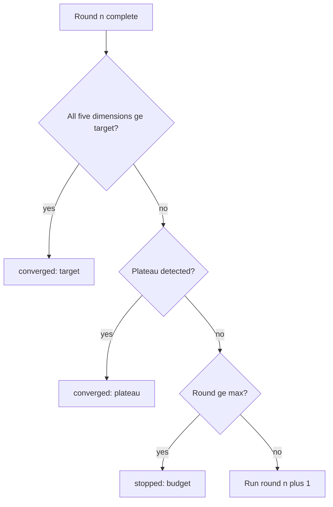
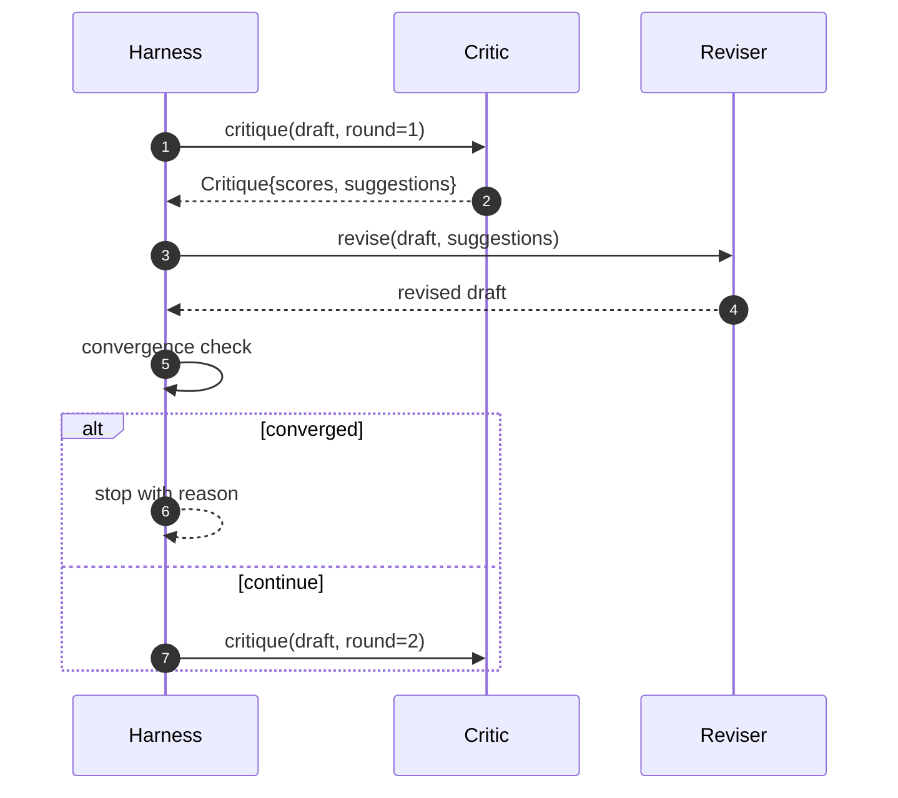

# Le cycle critique

> La première fois que je reviens sur le critique qui "a l'air bon" est un mauvais. Je reviens toujours sur le critique qui "a besoin de travail".

**Type:** Build
**Languages:** Python
**Prerequisites:** Phase 19 lessons 50-53
**Time:** ~90 minutes

## Objectifs d'apprentissage


```figure
ch-critic-converge
```

- 按五个固定维度为论文草稿打分:clairité, nouveauté, preuves, méthodologie, travaux connexes
- La rédaction de chaque critique est appliquée à la révision structurée différente, plutôt qu'à la rédaction libre.
-  par rapport à la réception de tests de plusieurs rounds;  par le plateau  par le temps de l'arrêt de l'atteinte de l'objectif ou du budget 
- Utilisez la max-iteration  budgétaire limitation de la circulation, éviter de recevoir des critiques 永远运行。
- 输出轮盘,让仪表板或下一阶段可以染分数轨迹──

## Pourquoi utiliser cinq dimensions fixes

La critique de libre forme est un modèle de retour de la recommandation de passage. La prochaine révision va considérer ce passage comme étant un environnement.

5 dimensions pour le harnais



Le nombre est un vecteur. Le harness observe chaque dimension des changements dans les doubles roues. Un élément améliore la clarté, mais permet de fournir des preuves de la révision à grande échelle, de la régression et de la vérification de la convergence.

## Critique 结构



Chaque suggestion porte une section de dimension, d'objectif et d'application de la révision.`edit`L'écriture est une méthode de révision de la définition de la définition de la définition de la définition de la définition de la définition de la définition de la définition de la définition de la définition de la définition de la définition de la définition de la définition de la définition de la définition de la définition de la définition de la définition de la définition de la définition de la définition de la définition de la définition de la définition de la définition de la définition de la définition de la définition de la définition de la définition de la définition de la définition de la définition de la définition de la définition de la définition de la définition de la définition de la définition de la définition de la définition de la définition de la définition de la définition de la définition de la définition de la définition de la définition de la définition de la définition de la définition de la définition de la définition de la définition de la définition de la définition de la définition de la définition de la définition de la définition de la définition de la définition de la définition de la définition de la définition de la définition de la définition de la définition de la définition de la définition de la définition de la définition de la définition de la définition de la définition de la définition de la définition de la définition de la définition de la définition de la définition de la définition de la définition de la définition de la définition de la définition de la définition de la définition de la définition de la définition de la définition de la définition de la définition de la définition de la définition de la définition de la définition de la définition de la définition de la définition de la définition de la définition de la définition de la définition de la définition de la définition de la définition.

## Convergence 规则, selon l'ordre d'exécution

La boucle critique se termine par un toucher quelconque des trois conditions.



L'objectif est la situation la plus stricte: chacune des cinq dimensions de clarté, de nouveauté, de preuve, de méthodologie, de travail lié doit être atteinte.`>= target_score`(默认)`8.0`),le circuit 才会回归成功──平均值很高但有一个弱度不够──盘检测会比较前轮平均值和上轮平均值──如果连续两轮改善 低于`plateau_epsilon`(默认)`0.1`), en cours de`plateau`Le budget est la limite de roulement du nombre de roulements.`5`),并以 `budget`- Je suis parti.

順序很重要──目標 優先於高原,高原 優先於預算──如果第三轮在同一时间代中既达到目标又会触发高原,结果是`target`- Je ne suis pas ...`plateau`Il y a une autre.

## Pourquoi la détection de plateau 跨两轮运行

 Un plateau de roues est un bruit  Un vrai critique même face à un projet fixe, chaque génération revient avec un petit nombre de points différents, car le score de certitude  dépend encore des suggestions et des séquences d'application                                                                                                                                                                                                                                 

## Détermination critique dans le cours

Le critère fourni est un appelable, sera basé sur trois signaux à un projet 打分: moyenne section 正文长度(clarity) 數字数 和引用数(證據), ainsi que des métadonnées papier 上的`originality_tag`Le réviseur sait comment faire chaque partie de la liste.

```text
clarity      在平均 section 正文长度增加时增长
novelty      在 originality_tag 设置为 "high" 时增长
evidence     在某个 section 的 figure_refs 非空时增长
methodology  在存在标题为 "Method" 且有正文的 section 时增长
related-work 在存在标题为 "Related Work" 且有正文的 section 时增长
```

Le réviseur va mettre chaque proposition en évidence pour une mise à jour orientée. Après la première ronde, l'utilisation peut être observée pour augmenter le nombre de points.

## 完整 loop 契约



Le contrôle de la convergence et de la trace.

## Trace 输出

Chaque tour produira un événement de trace, comprenant un nombre de vecteurs ronds, un score, un nombre de suggestions et un verdict de convergence.

## 防止坏批判 的预算

Un critique qui ne peut jamais élever le nombre de suggestions, va mettre la boucle à la limite maximale de l'iteration.`budget` L'utilisateur le considère comme un bug critique, et non un bug de projet.

## Comment lire la code

`code/main.py` définit `Critique`- Je suis là.`Suggestion`- Je suis là.`Critic`protocole`Reviser`protocole`CriticLoop`, ainsi qu' un .`make_deterministic_critic_pair`l'usine, il reviendra à la critique de la certitude et à la réviseur de l'équivalent.`Paper`结构, faire fonctionner cette classe indépendamment.

`code/tests/test_critic_loop.py`覆盖: première ronde de modifications uniques  projet de modifications modifiées  convergence cible  deux ronde de détection de plateau  aucune suggestion  pouvant être améliorée  épuisement budgétaire  réviseur de l'application de la suggestion, ainsi que de la trace  structure

##  explorer plus loin

Réaliser réellement deux élargissements. Premièrement, les poids de dimension: atelier 论文会更重视新品而不是方法; journal 则相反── convergence check 会变成加权平均值──`Critique`La structure de la ville

关键注是分数向量──一旦 critique est structurée, toutes les autres améliorations, règles de convergence, tableau de bord, critique partagée, peuvent être intégrées dans un cycle inchangé──
