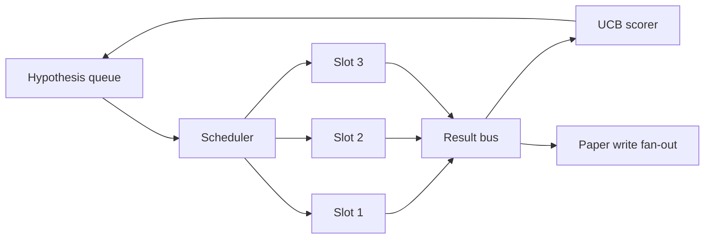
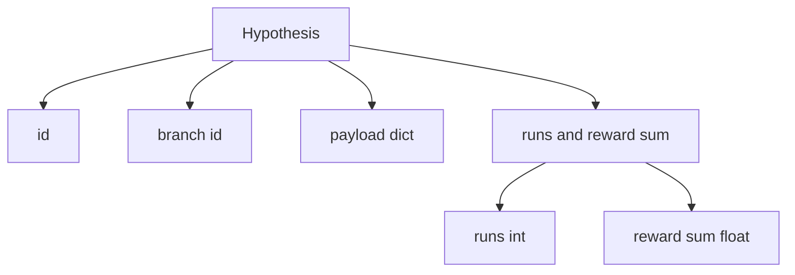
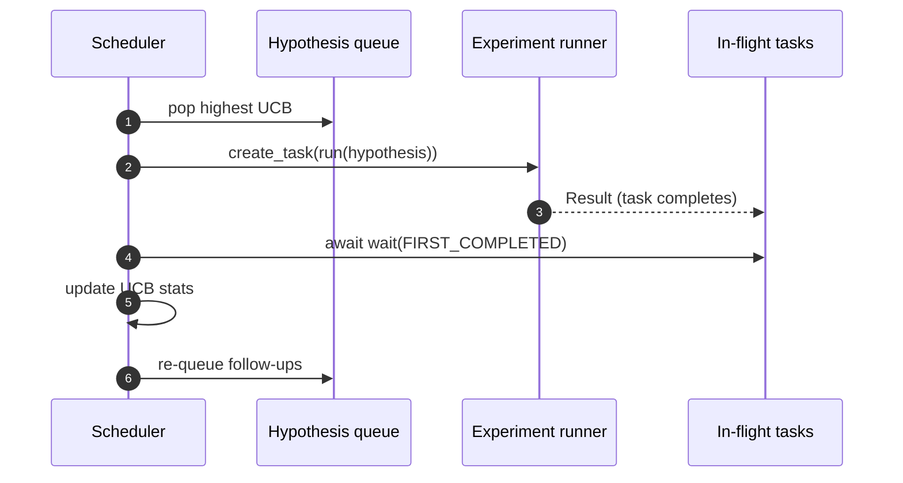

# Calendrier d'itération

>  La boucle de recherche sans planificateur, c'est une queue de fantasmes                                                                                                                                                                                                                                                     

**Type:** Build
**Languages:** Python
**Prerequisites:** Phase 19 lessons 50-53
**Time:** ~90 minutes

## Objectifs d'apprentissage


```figure
ch-ucb-scheduler
```

- Pour créer une file d'attente d'hypothèse, il faut faire des expériences et y ajouter un nouveau ventilateur.
- Avec le synchronisme et le lancement de plusieurs expériences, le planificateur peut garder tous les espaces occupés.
- UCB pour chaque branche hypothétique 打分, permet au planificateur de pouvoir en cas d'exploration non abandonnée, taille 低产出 ramasser 
- Les résultats seront ensuite diffusés à la phase de rédaction et de ré-couture, permettant de produire des hypothèses de suivi.
- 暴露逐代代步,包含分分分,占用率和剪裁决定──

## Pourquoi un planificateur, et non une liste de travail

平工作列表 会按提交顺序运行工作──当每个工作都独立时,这没有问题──研究不是独立:实验三的发现 会改变实验四和五的优先级──一个会读取结果粉丝-in 并重排队列的时间表,可以在单位计算内完成更有用的工作──

Il s'agit d'un modèle de conception de la stratégie de gestion de la gestion de la gestion de la gestion de la gestion de la gestion de la gestion de la gestion de la gestion de la gestion de la gestion de la gestion de la gestion de la gestion de la gestion de la gestion de la gestion de la gestion de la gestion de la gestion de la gestion de la gestion de la gestion de la gestion de la gestion de la gestion de la gestion de la gestion de la gestion de la gestion de la gestion de la gestion de la gestion de la gestion de la gestion de la gestion de la gestion de la gestion de la gestion de la gestion de la gestion de la gestion de la gestion de la gestion de la gestion de la gestion de la gestion de la gestion de la gestion de la gestion de la gestion de la gestion de la gestion de la gestion de la gestion de la gestion de la gestion de la gestion de la gestion de la gestion de la gestion de la gestion de la gestion de la gestion de la gestion de la gestion de la gestion de la gestion de la gestion de la gestion de la gestion de la gestion de la gestion de la gestion de la gestion de la gestion de la gestion de la gestion de la gestion de la gestion de la gestion de la gestion de la gestion de la gestion de la gestion de la gestion de la gestion de la gestion de la gestion de la gestion de la gestion de la gestion de la gestion de la gestion de la gestion de la gestion de la gestion de la gestion de la gestion de la gestion de la gestion de la gestion de la gestion de la gestion de la gestion de la gestion de la gestion de la gestion de la gestion de la gestion de la gestion de la gestion de la gestion de la gestion de la gestion de la gestion de la gestion de la gestion de la gestion de la gestion de la gestion de la gestion de la gestion de la gestion de la gestion de la gestion de la gestion de la gestion de la gestion de la gestion de la gestion de la gestion de la gestion de la gestion de la gestion de la gestion de la gestion de la gestion de la gestion de la gestion de la gestion de la gestion de la gestion de la gestion de la gestion de la gestion de la gestion de la gestion de la gestion de la gestion de la gestion de la gestion de la gestion de la gestion de la gestion de la gestion de la gestion de la gestion de la gestion de la gestion de la gestion de la gestion de la gestion de la gestion de la gestion de la

## 系统结构



L'expérience terminée va porter le résultat à la branche de l'UCB, et le rendement d'une branche va franchir le seuil.

## Hypothèse 结构



`branch`Il y a plusieurs hypothèses qui peuvent être partagées dans une seule branche: la branche est la direction de la recherche; l'hypothèse est l'un des essais)`runs`Le nombre d'expériences réalisées dans cette branche,`reward_sum`C'est une récompense cumulée.

## Score de l'UCB

Le formulaire UCB est le classique UCB1。

```text
ucb(branch) = mean_reward(branch) + c * sqrt( ln(total_runs) / runs(branch) )
```

`total_runs`Il y a un nombre total de branches de l'ensemble des expériences terminées.`c`Il s'agit d'une étude de la valeur de l'exploration.`sqrt(2)`Il y a une branche qui s'élance pour le zéro.`+inf`, donc les branches non tentées 总是先调调调. . . . . . . . . . . . . . . . . . . . . . . . . . . . . . . . . . . . . . . . . . . . . . . . . . . . . . . . . . . . . . . . . . . . . . . . . . . . . . . . . . . . . . . . . . . . . . . . . . . . . . . . . . . . . . . . . . . . . . . . . . . . . . . . . . . . . . . . . . . . . . . . . . . . . . . . . . . . . . . . . . . . . . . . . . . . . . . . . . . . . . . . . . . . . . . . . . . . . . . . . . . . . . . . . . . . . . . . . . . . . . . . . . . . . . . . . . . . . . . . . . . . . . . . . . . . . . . . . . . . . . . . . . . . . . . . . . . . . . . . . . . . . . . . . . . . . . . . . . . . . . . . . . . . . . . . . . . . . . . . . . . . . . . . . . . . . . . . . . . . . . . . . . . . . . . . . . . . . . . . . . . . . . . . . . . . . . . . . . . . . . . . . . . . . . . . . . . . . . . . . . . . . . . . . . . . . . . . . . . . . . . . . . . . . . . . . . . . . . . . . . . . . . . . . . . . . . . . . . . . . . . . . . . . . . . . . . . . . . . . . . . . . . . . . . . . . . .

La porte de taille et le cueilleur séparent-ils ?`prune_after_runs`Les prochains essais`3`) Après la moyenne de récompense 低于绝对 floor`0.2`), la taille va déplacer cette branche de la planification future dans le transfert.

## Utiliser des machines à sous

prédicateur 使用 `asyncio.create_task`驱动实验──每个任务 运行实验运行一个`async def`appelée),并返回一个 `Result` Main loop `asyncio.wait(..., return_when=asyncio.FIRST_COMPLETED)`Attendre les tâches en vol 集合, et chaque fois terminé 触发分数更新──



Trois fentes et une mise en marche. La boucle principale ne s'arrêtera jamais dans un seul expérience.

## Détecteur de la circulation: déclencheurs de papier

La récompense moyenne d' une branche est transversée .`paper_threshold`(默认)`0.7`), et cette branche  n'a pas encore été produite  lorsque le programmeur en fera une `paper.trigger`Dans cette classe, le déclencheur sera pris dans la liste, facilite les tests.

## Propositions de suivi

Lorsque le résultat de la production est atteint, le planificateur peut utiliser les offres des utilisateurs.`expander`Dans la même branche, il existe une ou plusieurs hypothèses de suivi.`Result`À la`list[Hypothesis]`Le résultat de cette formation est de deux suivis.

## Les budgets

Les deux budgets seront protégés, éviter les boucles de fuite.

```text
max_experiments    : 跨所有 branches 运行的 experiments 总数
max_seconds        : wall-clock cap (asyncio time)
```

Lorsque tout un touché est lancé, le programmeur va arrêter de régler de nouvelles tâches, attendre les tâches en vol, et retourner à la trace finale.`stop_reason`Il y a une autre.

## Trace et rapport final

Chaque décision de planification (pick, dispatch, result, prune, fan-out) produit un événement.

## Comment lire la code

`code/main.py` définit `Hypothesis`- Je suis là.`Result`- Je suis là.`BranchStats`- Je suis là.`IterationScheduler`, ainsi qu' un .`make_deterministic_runner`l'usine, il reviendra avec des récompenses prévisibles de l'expérience de coureur async...`delay_ms`(默认)`5ms`), faire la concurrence 可 observer。

`code/tests/test_scheduler.py`覆盖:UCB 优先选择未尝试分支、 paraillée slot occupation、跨越门时的纸引发器、低产出试验 后后的分支剪、粉丝-out follow-up hypotheses,以及预算出口(实验计和墙钟 两者)

##  explorer plus loin

La réalisation réelle nécessite trois élargissements. Premièrement, la durée des séances de la UCB est de statistiques: actuelles statistiques existentes 内存里; réelle planificatrice 会检查点 它们,让重启保留已经花掉的探索预算.

Le planificateur est un lieu de recherche qui dépasse la liste de travail. Une fois que UCB a accès à des machines à sous et qu'il est en cours de fonctionnement, toutes les autres améliorations peuvent être ajoutées à la liste.
