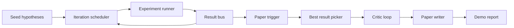
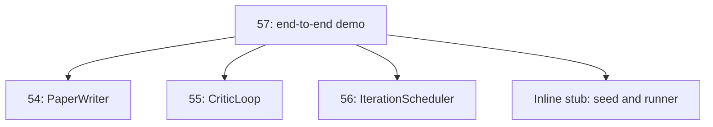
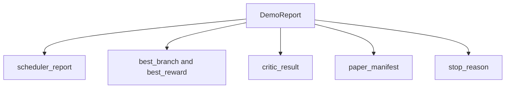

# Démo de fin à fin

> La démo est l'endroit où chaque contrat que vous avez écrit doit être assemblé. Si l'un d'entre eux est en panne, la démo est la partie qui l'a capturé.

**Type:** Build
**Languages:** Python
**Prerequisites:** Phase 19 lessons 50-53
**Time:** ~90 minutes

## Objectifs d'apprentissage


```figure
ch-research-pipeline
```

- Pour les résultats de l'analyse, il est nécessaire de mettre en place des analyses de la nature de l'analyse.
- 通过普通 Python imports 组合前四节 Track D 课程中的 primitives, plutôt que par le cadre。
- 运行循环 Till自行终止,并输出一个列出每一个阶段 输出单一 Demo report──
- 保持 démo déterministe, faire suite de test peut être déterminé forme finale.
- Lorsque l'étape de contrat est détériorée, exposer clairement le mode de défaillance, éviter la prochaine étape Utiliser l'entrée de rupture continue à fonctionner.

## C'est quoi ce truc ?



五个阶段──seed 是三条条假设的列表──scheduler Using three parallel slots 在它们之间运行六个实验──bus 报告一个或多个纸引发器──picker 选择单个最佳结果──critical loop 基于该结果 构建的草案 进行代──纸作家 输出最终的 LaTeX、BibTeX 和 manifesto──

## Pourquoi importer, plutôt que copier

Il y a une classe de données publiques et des fonctions.`main.py`◊ Démo 通过调整 `sys.path`Pour chaque section du répertoire de parents, il est nécessaire de les importer. Ce n'est pas un câblage de cadre; il est similaire à l'importation des fichiers de test déjà utilisés dans les cours précédents.



En ligne stub  représentant la 50ème à la 53ème classe: un petit générateur d'hypothèses de graines 和 une fonction de récompense synchrone。 l'utilisateur peut par la modification de deux importations, le stub en ligne  substituer pour les vrais primitifs de ces cours。

## Déterminisme 保证

Démo en construction est déterministe. Le coureur d'expérience utilise le numérique séché. Le réviseur de la boucle critique est en ordre fixe à travers les dimensions fixes.

给定相同种子,Demo 会输出相同报告――test 通过运行Demo 两次并比较 manifest 来断这一属性――

## Démo rapport de la forme



Chaque champ est tiré de l'étape en amont. La démo ne change aucune sortie.

## Mode d'échec 处理

Chaque étape doit réussir, il faut relever une erreur de typage.

```text
Scheduler ........ returns SchedulerReport with stop_reason
                   in {queue_empty, max_experiments, deadline}
Best-result pick . raises NoTriggerError if no paper trigger fired
Critic loop ...... returns LoopResult with status converged or stopped
Paper writer ..... raises PaperValidationError on contract break
```

L'échec de l'étape de l'essai est fixé par le contrat suivant:`test_no_triggers_raises_typed_error`et `test_best_picker_raises_when_no_triggers`Quand il n'y a pas de branche, le déclencheur va monter.`NoTriggerError`- Je suis là .`BestResultError`, et l'écrivain ne sera jamais utilisé.

## sélecteur de meilleur résultat

Le programmeur 会按分支 输出纸触发器──picker 选择所有触发器 中中 mean reward 最高的分支──ties 按分支 id 的字母顺序打破,使得Demo deterministic──picker 是一个小型纯函数;test 使用固定的计划器报告 固定它的行为──

## 串接 boucle critique

Le cycle critique de la 55e classe`MiniPaper`◊ Démo À travers la branche choisie 构建一个 `MiniPaper`: Utiliser l'id de la branche  remplir l'abstract,seed 两个 sections  Introduction 和 Results),并根据 branche 设置 `originality_tag`(si `>= 0.8`Pour le haut, si `>= 0.6`Pour les pays de l'Union européenne, la réduction des coûts de production est un facteur important.

Le réviseur va ensuite rédiger le projet 代到融合──output 会进入 paper writer──

## 串接 rédacteur en papier

Article 54                                                                                                                                                                                                                                                                                                                                                                                                                                                                                                                            `Paper`La forme... démo`mini_to_full_paper`升级 convergé `MiniPaper`, il ajoutera une figure pour une branche sélectionnée, et selon les recommandations du critique, il ajoutera des clés de citation et construira une petite bibliographie synthétique.

## Comment lire la code

`code/main.py` définit `BestResultError`- Je suis là.`NoTriggerError`- Je suis là.`DemoReport`- Je suis là.`pick_best_branch`- Je suis là.`build_mini_paper`- Je suis là.`mini_to_full_paper`et `run_demo`Les importations de la région seront ajustées une fois.`sys.path`, et de leurs cours.`PaperWriter`- Je suis là.`CriticLoop`et `IterationScheduler`Il y a une autre.

`code/tests/test_e2e.py`覆盖:Demo 端到端运行并输出一个五个字段 全部填充的报告;两次运行之间的确定性;没有分支 过了门时的 NoTriggerError;作者合同 破坏时的 PaperValidationError;纸质表 包含选定的分支的数字;以及安排器停止原因是预期值之一――

## continuer à se développer

Lorsque la démo 变绿后, il y a trois valeurs de la séquence 扩展──第一, l'état persistant: chaque étape résultat 写入一个小型JSON store,使重启可以不重新运行便宜的阶段 就恢复──第二, tableau de bord:planner 和 critique loop 染为单一时间线──第三, vrais modèles appels:将嘲笑散文生成器 和决定主义评论 替换为模型驱动的版本;

La démo est la tâche de démontrer la composition, c'est l'architecture, les cinq sections, les quatre importations, un rapport, la mise en ligne, la mise en ligne, la mise en ligne, la mise en ligne.
