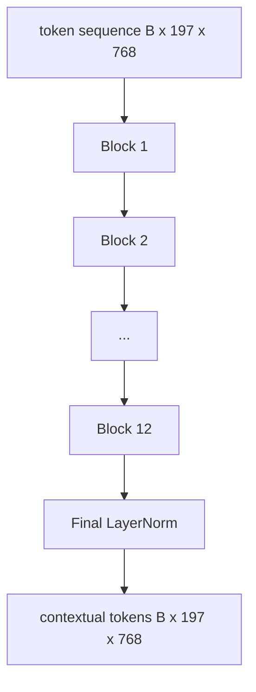
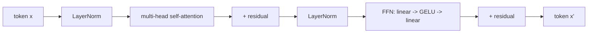

# 视觉 Transformer 编码器

> 补丁单独看不到──具有 12 个注意头的 12 层预 LN Transformer va transformer le séquence de fichiers de fichiers de fichiers de fichiers de fichiers de fichiers de fichiers de fichiers de fichiers de fichiers de fichiers de fichiers de fichiers de fichiers de fichiers de fichiers de fichiers de fichiers de fichiers de fichiers de fichiers de fichiers de fichiers de fichiers de fichiers de fichiers de fichiers de fichiers de fichiers de fichiers de fichiers de fichiers de fichiers de fichiers de fichiers de fichiers de fichiers de fichiers de fichiers de fichiers de fichiers de fichiers de fichiers de fichiers de fichiers de fichiers de fichiers de fichiers de fichiers de fichiers de fichiers de fichiers de fichiers de fichiers de fichiers de fichiers de fichiers de fichiers de fichiers de fichiers de fichiers de fichiers de fichiers de fichiers de fichiers de fichiers de fichiers de fichiers de fichiers de fichiers de fichiers de fichiers de fichiers de fichiers de fichiers de fichiers de fichiers de fichiers de fichiers de fichiers de fichiers de fichiers de fichiers de fichiers de fichiers de fichiers fichiers fichiers fichiers fichiers fichiers fichiers fichiers fichiers fichiers fichiers fichiers fichiers fichiers fichiers fichiers fichiers fichiers fichiers fichiers fichiers fichiers fichiers fichiers fichiers fichiers fichiers fichiers fichiers fichiers fichiers fichiers fichiers fichiers fichiers fichiers fichiers fichiers fichiers fichiers fichiers fichiers fichiers fichiers fichiers fichiers

**Type:** Build
**Languages:** Python
**Prerequisites:** 第19期第30-37课（B轨基础）
**Time:** ~90 分钟

## Objectif de l'apprentissage

- 实现 un bloc de transformateur pré-LN de plusieurs niveaux d'attention et de pré-子层.
- Les 12 blocs sont en complot, formant un codeur à base de ViT.
- Le correctif de la 58e classe est connecté au codeur et utilisé pour le transmettre.
- 验证 CLS token si les informations de chaque correction ont été regroupées.

##  problématique

补丁嵌生成一系列197 个标记, chaque token est un émetteur, ne connaît aucun autre补丁. 图片一张猫的图片需要每补丁才能知道哪些补丁包含胡须,哪些包含背景,哪些包含眼睛.  Transformer est un mécanisme de construction de cette conscience, une fois un niveau d'attention.

Le format standard est de 12 blocs de profondeur, 12 blocs de largeur, avec une couche pré préalable.

## 概念





### LN 前与 LN 后

Le LayerNorm est une version utilisée de chaque modèle de langage visuel moderne, car il n'a pas besoin d'apprendre le taux de préchauffement précoce.

### Une attention particulière

Chaque tête sera projetée par son propre volume`head_dim = hidden / num_heads``(query, key, value)`Il y a trois groupes.`hidden = 768`和`heads = 12`, chaque tête a`dim = 64` 12 têtes sont associées, puis leur sortie est reliée à 768 维并通过输出投影── Les points importants de plusieurs têtes sont que l'une peut apprendre à observer les yeux du chat, tandis que l'autre peut apprendre à observer le degré de l'arrière-plan sans être dérangé.

### Pourquoi faire 4 fois plus ?

FFN pour`hidden -> 4 * hidden -> hidden`,GELU 位于中间──因子 4 est expérimental, depuis 2017 il est toujours utilisé dans la transformation des langues et des visuels──较小 (2x) 缺合;过合固定数据预算下较大 (8x) ─ MLP est le lieu où la plupart des faits apprises sont stockées, tandis que la partie centrale plus large est le lieu où elles se trouvent──

|组件| ViT-Base 规模的参数 |
|-----------|------------------------------|
|每个块的 qkv 投影 | `3 * 768 * 768 = 1.77M` |
|每个块的输出投影| `768 * 768 = 590K` |
|每块 FFN（4 倍扩展）| `2 * 768 * 4 * 768 = 4.72M` |
|每块的 LayerNorm | `4 * 768 = 3K` |
|每块总计 |约 710 万 |
| 12 块 |约85M |
|加前端|总计约86M |

ViT-Base est un codeur de paramètres 86M. Selon les normes de 2026, cette valeur est très petite. SigLIP-So400M est 400M, Qwen-VL ViT est 675M, mais la structure est la même sur la largeur et la profondeur.

### Il y a des produits de la cuisine ?

Vision Transformer ne contient que le codeur et est à deux faces:`i`Vous pouvez participer à n'importe quel token.`j` Pas de facettes.  L'attention du codeur dans la section 61 sera centrée sur le cache des causes, mais à l'intérieur du codeur visuel, l'attention est entièrement connectée.

### CLS token a appris à quoi ?

Le jeton CLS commence par les paramètres d'apprentissage, sans contenu de correction propre, et passe par l'attention de chaque bloc pour accumuler des informations.


```figure
ch-cls-funnel
```

## - Je le construis.

`code/main.py`实现:

- `MultiHeadSelfAttention`, avec`qkv`Et les résultats de l'analyse sont les suivants:
- `FeedForward`,4 fois plus de GELU MLP
- `Block`, un bloc pré-LN, composé de la attention et de la couche de l'avant avec le résidu.
- `ViT`,12 blocs de pile, avec une couche finaleNorm.
- `VisionEncoder`Ça va arriver .`VisionFrontEnd`Depuis le 58e cours`ViT`堆,并公开返回上下文序列和池化 CLS 量向量`forward()`Il y a une autre.
- Une démonstration, à travers un encodeur complet 运行合成的224x224 fixture 图像,并每隔一层打印输入形状、输出形状、参数计数和CLS 范数──

Je vais le faire.

```bash
python3 code/main.py
```

输出: fixture 编码为`(1, 197, 768)`张量──CLS 范数 avec la composition des couches déménage à l'étage supérieur, puis se stabilise dans la dernière coucheNorm──总参数报告约为86M──

## Utilisez-le

Le codeur défini ici est le même en largeur et en profondeur que le bloc de VLM de chaque poids ouvert de 2025 à 2026.

- **宽度和深度。**ViT-Large`hidden=1024, depth=24, heads=16`; SigLIP So400M est `hidden=1152, depth=27, heads=16`Il y a un seul bloc.
- **池化头。**L'éducation et la formation sont des aspects essentiels de la formation.
- **位置处理。**固定正弦曲线 (第 58 课) avec le 1D de l'apprentissage  ALiBi avec le 2D RoPE 块数学没有变化 ⋅
- **注册token。**DINOv2 前置 4 个额外学习的代码.

Le bloc est composté en un fondement.

## 测试 Le détail

`code/test_main.py`incluant:

- 单块保留形状和对输入批量大小不变
-  le nombre total de fractions d'attention de l'axe clé est de 1 softmax 理智)
- 剩余路径已连接(零输入 encore via le jeton CLS générer非零输出)
- 4 couches de la mise en avant vers le transfert produisent une forme correcte
- 梯度 de CLS 输出流向面片投影

Ils vont les faire:

```bash
python3 -m unittest code/test_main.py
```

## 练习

1. 添加寄存器token(CLS 后添加 4 学习向量)并重新运行──通过最后层的软max 分布的来比较注意力图的平滑度──

2. Pour le remplacer par le remplacer par le remplacer, il est nécessaire de former une époque à l'aide de l'équipement de formation.

3. La mise en œuvre de la protection des données`attn_mask`Paramètres, afin que le même bloc puisse être utilisé à nouveau comme bloc de décodeur.`(seq, seq)`,下三角形──

4. Utilisation `torch.profiler`分析批量大小为 1、8、64 的前向传递── MLP Layer est axé sur le temps de paroi, et non sur l'attention──

5. Utilisez un adaptateur LoRA basse à l'aide d'un projecteur Q-k-v de tête d'attention, et le reste du tableau s'affiche dans la position que vous souhaitez.

## 关键术语

|术语 |这意味着什么 |
|------|---------------|
|预 LN | LayerNorm 应用在每个子层之前而不是之后 |
|自我关注 |每个token都以相同的顺序关注其他所有token |
|多头|隐藏的dim分布在 `H` 独立注意头中 |
| FFN 扩展 |前馈层在收缩之前加宽至 `4 * hidden` |
| CLS 池 |使用第一个token 的最终隐藏状态作为图像摘要 |

##  ultérieur

- Pour la composition du codeur, une image vaut 16x16 mots uniques.
- DINOv2 (2023) Us 用于注册token和自监督预训目标──
- SigLIP (2023), utilisé dans les classes 62   ⇒
