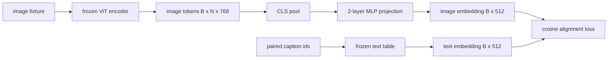

# Utilisé pour la projection de la couche de mode

> Un petit MLP de deux niveaux projettera des symboles d'image dans l'espace de texte emplacé, et c'est à la suite de ces deux espaces que les autres lignes de l'objet sont perdues pour les rendre cohérentes. Cette projection est la partie la plus petite du modèle de langage visuel, mais aussi la partie la plus importante du déplacement.

**Type:** Build
**Languages:** Python
**Prerequisites:** 第19期第30-37课（B轨基础）
**Time:** ~90 分钟

## Objectif de l'apprentissage

- Construire une projection de deux niveaux de PLM, et projeter les caractéristiques de l'image dans le texte.
- 构建一个模拟文本嵌入表(没有预训练的分词器,没有真正语料库) ⋅
- 计算投影图像代币和配对标题嵌入之间的余弦对齐损失──
- Utilisation de l'écriture et de la mise en page

##  problématique

Vous avez un codeur vidéo (n° 58-59)`vision_hidden = 768`Vous avez un déco, vous voulez être en mesure de fixer dans.`text_hidden = 512`之上 (任何其他数字也同样合理) ⋅解码器需要文本形象的符号──图像代码不是文本形象: elles existent dans le base de l'éditeur pendant la formation en pré-entraînement visuel, elles n'ont aucun lien avec le volume de mots du décodeur──

两层 MLP 投影(线性、GELU、线性) a comblé ce décalage.`768 * 1024 + 1024 * 512 = 1.3M`参数), peut être entraîné en quelques minutes sur un seul GPU, et c'est la seule partie de l'apprentissage à un stade complet. Le programmeur visuel doit être en mode mode mode de fonctionnement.

## 概念



### 投影前池化

Le codeur vidéo émet 197 tokens. Le côté du texte a un seul titre. Pour les intégrer, chaque échantillon a besoin d'un volume de classe d'image. Le CLS est le plus simple: il faut obtenir le premier token du codeur et le projeter.

### Pourquoi deux couches et non une ?

La projection de type simple peut être rotée et reconditionnée, mais si les deux courbes spatiales ne correspondent pas, il est impossible de fixer la base. La GELU entre deux couches de type type type type type type type type type type type type type type type type type type type type type type type type type type type type type type type type type type type type type type type type type type type type type type type type type type type type type type type type type type type type type type type type type type type type type type type type type type type type type type type type type type type type type type type type type type type type type type type type type type type type type type type type type type type type type type type type type type type type type type type type type type type type type type type type type type type type type type type type type type type type type type type type type type type type type type type type type type type type type type type type type type type type type type type type type type type type type type type type type type type type type type type type type type type type type type type type type type type type type type type type type type type type type type type type type type type type type type type type type type type type type type type type type type type type type type type type type type type type type type type type type type type type type type type type type type type type type type type type type type type type type type type type type type type type type type type type type type type type type type type type type type type type type type type type type type type type type type type type type type type type type type type type type type type type type type type type type type type type type type type type type type type type type type type type type type type type type type type type type type type type type type type type type type type type type type type type type type type type type type type type type type type type type type type type type type type type type type type type type type type type type type type type type type type type type type type type type type type type type type type type type type type type type type type type type type type type type type type type type type type type type type type type type type type type type type type type type type type type type type type type type type type type type type type type type type type type type type type type type type type type type type

|层|形状|参数|
|-------|-------|------------|
| FC1 | `(vision_hidden, projection_hidden)` | `768 * 1024 + 1024` |
|激活|格鲁| 0 |
| FC2 | `(projection_hidden, text_hidden)` | `1024 * 512 + 512` |

Une .`768 -> 1024 -> 512`Il y a environ 1,3M de paramètres.

### 余弦对齐损失

Ça ne veut pas dire`image_emb == text_emb`C'est ce que signifie "bien".`image_emb`Dans le cadre de l'espace`text_emb`Il y a une différence entre les deux.`1 - cos_sim(image, text)`, rangée de 0(complètement parallèlement) à 2 ((相反) ◦, la formation se tournera vers le parallèle pour le parallèle pour le parallèle pour les lots (InfoNCE), dont chaque image doit être plus proche de son propre titre que tout autre titre de la série; ce cours utilise chaque version, de sorte que le mouvement peut être vu.

### 结编码器是门

Le codeur visuel a 86M de paramètres. Il y a plusieurs millions de modèles. Il est impossible de les entraîner dans la base de données.


```figure
ch-projection-bridge
```

## - Je le construis.

`code/main.py`实现:

- `MLPProjector(in_dim, hidden_dim, out_dim)`, avec une LMP à deux niveaux GELU activée.
- `MockTextEmbedding(vocab_size, dim)`, une table intégrée, avec une détermination initiale de la semence.
- `make_pair(seed, vocab_size)`, synthèse un par rapport à une image, un titre) sample;; un titre est une séquence de courts caractères; un titre est un titre pour une mise en valeur moyenne de la valeur de la pièce.
- `cosine_alignment_loss(image_emb, text_emb)`, pour chaque`1 - cos_sim`Les miroirs.
- Un cycle de formation, en 32 cycles synthétiques, est réalisé sur 200 étapes de projection, de vidéo éditeur et de texte, et chaque 25 étapes sont imprimées une perte.

Je vais le faire.

```bash
python3 code/main.py
```

输出: le rapport de formation a montré que le jeton d'image peut être attiré vers l'espace texte en 200 étapes, de la perte initiale à environ 1,07 à environ 0,80, en indiquant que la similitude des derniers états de chaque jeu est imprimée uniquement par projection.

## Utilisez-le

Chaque VLM à pouvoir ouvert est le même modèle:

- **LLaVA 1.5.**De CLIP-ViT-L  cachée à LLaMA 嵌入的两层 GELU MLP 投影──结视觉编码器,结 LLM, 仅训练投影(然后在第二阶段解 LLM) 
- **BLIP-2.**Q-Former 通过针对图像代币的交叉关注获取32 学习查询代币,然后投投到LLM 嵌入dim;; Q-Former 最后投投头类似本课的MLP;;
- **MiniGPT-4.**De BLIP-2 Q-Former 输出到Vicuna 嵌入dim的单线性投影──
- **Qwen-VL.**Il y a plusieurs couches de l'adaptateur de concentration de croisement, mais le dernier bloc reste jusqu'à LM.

Les formes sont différentes, mais le rôle est le même:

## 测试 Le détail

`code/test_main.py`incluant:

-  projectionneur de forme et de configuration `out_dim`匹配
- 结文本嵌入表的 `requires_grad`参数为零
- Les pertes de résidu sont nulles sur le même vecteur, 2 sur le vecteur inverse.
- Unité de projection après transmission vers l'arrière
-  Le cycle d'entraînement a réduit les pertes entre les étapes 0 et 200 

Ils vont les faire:

```bash
python3 -m unittest code/test_main.py
```

## 练习

1. Le CLS est remplacé par 196 tokens de patch, et il est comparé à la perte finale après 200 étapes.

2. La température de l'échantillon habituel est ajoutée à la perte de résidu (`cos / tau`) 中,并观察当 `tau`Il y a beaucoup de bruit, trop de dégâts, trop de bruit.

3. Le remplacement de deux niveaux de MLP par une seule couche linéaire et la réduction des pertes quantifiées.

4. Dans le cas d'un projecteur, ajoutez un petit L2 à la charge du punteur, et observez comment il interagit avec le reste du string.

5. Garder le poids du projecteur, puis le charger et le faire fonctionner, sans avoir besoin d'un éditeur vidéo pour le transmettre, pour vérifier la mise en service.

## 关键术语

|术语 |这意味着什么 |
|------|---------------|
|模态对齐 |使图像和文本嵌入在一个共享空间中具有可比性的行为 |
|投影头|将一个空间映射到另一个空间的小模块，通常是 2 层 MLP |
|余弦相似度 |点积除以 L2 范数的乘积 |
|冻结编码器|视觉（或文本）模型的所有参数均带有 `requires_grad=False` |
|模拟语料库|使用合成对，因此训练不依赖于数据集下载 |

##  ultérieur

- Il est utilisé pour les deux phases de formation de LLaVA 论文(projets, puis de résoudre LM)
- Le projet BLIP-2 de Q-Former est un projet alternatif à apprendre.
- Le rapport technique Qwen-VL, sera utilisé pour des projections plus profondes.
