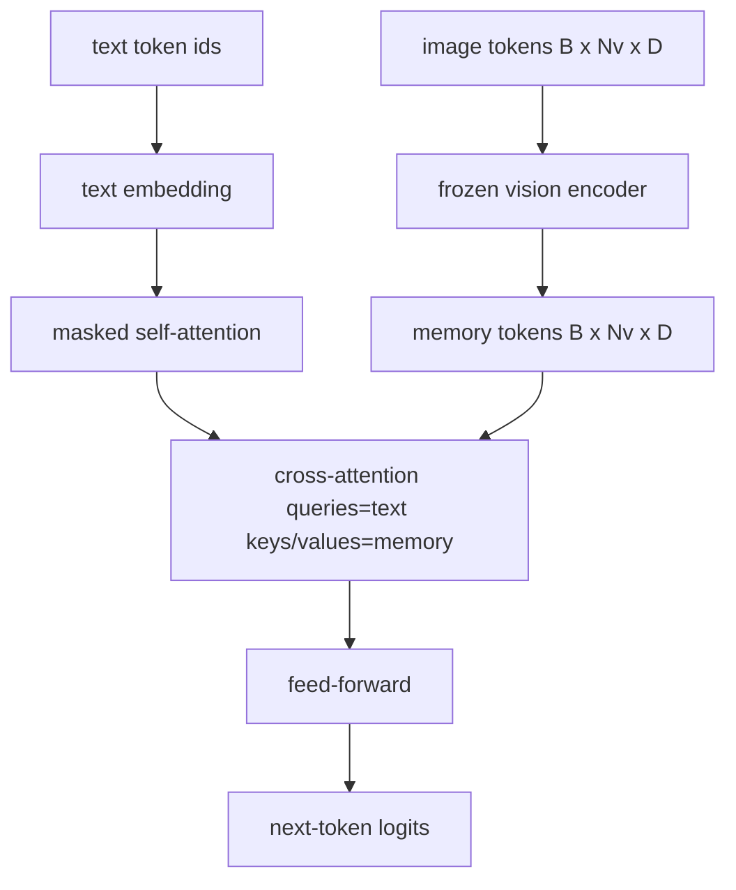
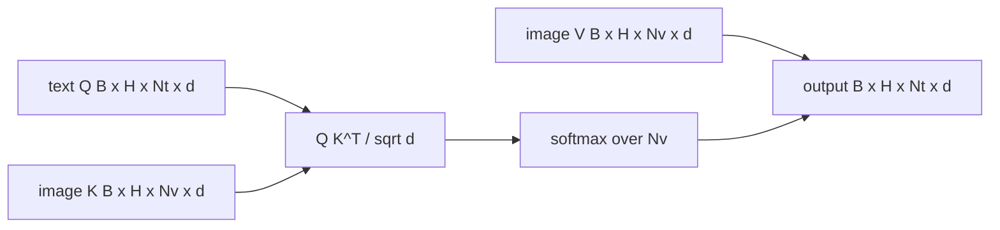

# 交叉注意力融合

> Le niveau de projection va faire face à un vecteur d'image et à un vecteur de titre. Le véritable décodeur de langage visuel a besoin de chaque texte à participer à chaque correction, de sorte que le modèle peut placer chaque mot dans une région. L'attention croisée est la façon dont cette connexion se produit.

**Type:** Build
**Languages:** Python
**Prerequisites:** 第19期第30-37课（B轨基础）
**Time:** ~90 分钟

## Objectif de l'apprentissage

- 实现多头交叉注意力, dont le flux de requête est le texte, le key/value stream est le visuel.
- 组成解码器块:因果自注意力+交叉注意力+前──
- 获得正确的掩模形: pour le masquer de l'attention personnelle, pour le masquer de l'attention transversale,
- Utilisation de jetons de texte en vrac et jetons d'image fixes

##  problématique

Le lien entre les symboles et les symboles de texte est un processus de fusion. Il est également possible de créer un lien entre les symboles et les symboles de texte.

Le dernier phase de fusion a deux avantages: d'abord, le flux de texte reste propre, le modèle reste pur à la fonction de texte. Deuxièmement, le flux d'image est calculé une fois pour chaque image et réutilisé à chaque étape de la décode.

## 概念





### 面具 forme

Deux attentes dans le bloc ont besoin de différentes masquées:

|注意|查询长度 |密钥长度|面膜|为什么 |
|-----------|--------------|------------|------|-----|
|自我关注 | `Nt`（文本）| `Nt`（文本）|因果：下三角 `(Nt, Nt)` |自回归期间文本token可能不会向前看 |
|交叉注意力| `Nt`（文本）| `Nv`（愿景）|没有口罩|整个图像对每个文本位置都是可见的 |

Ce cours comprend une fonction de test de forme, donc les mélanger ensemble comme `ValueError`Il y a une erreur, et non une perte de la ligne de destruction.

### Pourquoi la concentration ne se cache pas ?

Avant de créer un texte, regardez d'abord l'image.`t`On peut se concentrer sur n'importe quel supplément d'image; les blocs d'image ne sont pas en ordre de temps. Certains flamingos ajoutent un mode de masquage à chaque échantillon lorsqu'ils se croisent à plusieurs images et passages de texte, mais pour une seule image et un titre, l'attention croisée peut tout voir.

### 键/值缓存

图像键和值在解码开始时计算一次并存存储中──每一个新文本代码都使用缓存而无需重新计算──这就是推理时字幕快速运行的原因:重型ViT运行一次;交叉注意在每一步重复使用其键和值──本课程公开缓存并测试缓存中路径──

### 块组成

解码器块运行:预 LN -> 自注意力 -> 残差 -> 预 LN -> 交叉注意力 -> 残差 -> 预 LN -> 前 -> 残差──三个子层, chaque子层有自己的 LayerNorm。 Flamingo 论文添加一个关于交叉注意力的学习门,因此模型可以在训练时稳定性为代价选择退出图像路径;规范基线(这里使用)没有门──

```python
class DecoderBlock:
  def forward(self, text_tokens, image_tokens, text_mask, cross_mask):
      text_tokens = text_tokens + self.self_attn(self.ln1(text_tokens),
                                                 mask=text_mask)
      text_tokens = text_tokens + self.cross_attn(self.ln2(text_tokens),
                                                  image_tokens,
                                                  mask=cross_mask)
      text_tokens = text_tokens + self.ffn(self.ln3(text_tokens))
      return text_tokens
```


```figure
ch-crossattn-fan
```

## - Je le construis.

`code/main.py`实现:

- `CrossAttention(hidden, heads)`, ayant une seule`q`et `kv`投影的多头交叉注意力──
- `CausalSelfAttention(hidden, heads)`, de la protection de l'auto-attention du standard de décodeur.
- `DecoderBlock`, avec l'avance de LN restant composé de trois sous-couches.
- `VisionLanguageDecoder`, fourni par le modéliseur vidéo et le petit tableau de texte intégré fourni par le décodeur de fournisseur.
- `causal_mask(length)`Retour`(length, length)`Je suis en train de vous dire que vous êtes un homme.
- Une présentation, il fournit à un groupe de deux séries de texte de longueur de 10 la longueur de 197 images en mémoire, et imprime la forme de sortie de la forme de l'auto-attention et la taille de sortie de l'attention de chaque position.

Je vais le faire.

```bash
python3 code/main.py
```

输出: décodeur de production `(2, 10, text_vocab)`Les logits 张量──面罩形为`(10, 10)`◊ KV 缓存重用检查确认缓存和未缓存路径之间的逻辑──

## Utilisez-le

L'attention est présentée dans deux séries de production:

- **Flamingo 和 IDEFICS。**Chaque K 个语言模型块插入一个交叉注意力层,并使用结的 LM──视觉语言适配器是交叉注意力块及其门──
- **BLIP-2.**Q-Former utilisez un groupe fixe de 32 Tokens de requête pour passer l'attention à l'image caractéristique, puis la requête projeter à LM 嵌入空间中──

La forme du bloc de ce cours est directement mappée à ces deux.

## 测试 Le détail

`code/test_main.py`incluant:

- Le résultat est le masque du triangle inférieur et correspond à la forme du boul prévu
- Quelle que soit la longueur de la clé, la forme de sortie de l'attention est de taille.`(B, Nt, hidden)`
- Régulation de la différence de capacité de stockage en KV
- Les différences de forme entre le texte et le flux d'images ont provoqué une apparente disparité.`ValueError`
- Complet de décodeur avant vers le transfert produire la forme de série et de lot correcte

Ils vont les faire:

```bash
python3 -m unittest code/test_main.py
```

## 练习

1. Le modèle est ajouté à la formation de la formation de la formation de la formation de la formation de la formation de la formation de la formation de la formation de la formation de la formation de la formation de la formation de la formation de la formation de la formation de la formation de la formation de la formation de la formation de la formation de la formation de la formation de la formation de la formation de la formation de la formation de la formation de la formation de la formation de la formation de la formation de la formation de la formation de la formation de la formation de la formation de la formation de la formation de la formation de la formation de la formation de la formation de la formation de la formation de la formation de la formation de la formation de la formation de la formation de la formation de la formation de la formation de la formation de la formation de la formation de la formation de la formation de la formation de la formation de la formation de la formation de la formation de la formation de la formation de la formation de la formation de la formation de la formation de la formation de la formation de la formation de la formation de la formation de la formation de la formation de la formation de la formation de la formation de la formation de la formation de la formation de la formation de la formation de la formation de la formation de la formation de la formation de la formation de la formation de la formation de la formation de la formation de la formation de la formation de la formation de la formation de la formation de la formation de la formation de la formation de la formation de la formation de la formation de la formation de la formation de la formation de la formation de la formation de la formation de la formation de la formation de la formation de la formation de la formation de la formation de la formation de la formation de la formation de la formation de la formation de la formation de la formation de la formation de la formation de la formation de la formation de la formation de la formation de la formation de la formation de la formation de la formation de la formation de la formation de la formation de la formation de la formation de la formation de la formation de la formation de la formation de la formation de la formation de la formation de la formation de la formation de la formation de la formation de la formation de la formation de la formation de la formation de la formation de la formation de la formation de la formation de la formation de la formation de la formation de la formation de la formation de la formation de la formation de la formation de la formation de la formation de la formation de

2. 实现交错注意力, dont le même décodeur consomme plusieurs images et plusieurs sections de texte.

3. Dans le`Nt=64, Nv=576`(en 24x24 de plus haute résolution) sur l'analyse de l'attention de transfert et de l'attention de transfert de la couche de l'attention.`Nt * Nv`, et occupe une position dominante dans la résolution élevée des images.

4. Dans le diagramme de concentration de la taille de l'échantillon de la taille de l'échantillon de la taille de l'échantillon de la taille de l'échantillon de la taille de l'échantillon de la taille de l'échantillon de la taille de l'échantillon de la taille de l'échantillon de la taille de l'échantillon de la taille de l'échantillon de la taille de l'échantillon de la taille de l'échantillon de la taille de l'échantillon de la taille de l'échantillon de la taille de l'échantillon de la taille de l'échantillon de la taille de l'échantillon de la taille de l'échantillon de la taille de l'échantillon de la taille de l'échantillon de la taille de l'échantillon de la taille de la taille de l'échantillon de la taille de la taille de l'échantillon de la taille de la taille de l'échantillon de la taille de la taille de la taille de la taille de l'échantillon de la taille de la taille de la taille de la taille de la échantillon de la taille de la taille de la taille de la échantillon de la taille de la échantillon de la taille de la échantillon de la taille de la échantillon de la échantillon de la échantillon de la échantillon de la échantillon de la échantillon de la taille de la échon de la échon de la échon de la échon de la échon de la échon de la échon de la échon de la échon de la échon de la échon de la échon de la échon de la échon de la échon de la échon de la échon de la échon de la échon de la échon de la échon de la échon de la échon de la échon de la échon de la échon de la échon de la échon de la échon de la échon de la échon de la échon de la échon de la échon de la échon de la échon de la échon de la échon de la échon de la échon de la échon de la échon de la échon de la échon de la

5. Remplacer le niveau d'attention de l'image avec un bloc d'attention de type Q-Former, dont 32 points de référence sont fixés pour chaque niveau.

## 关键术语

|术语 |这意味着什么 |
|------|---------------|
|后期融合|文本和视觉位于不同的流中；交叉注意力在每个区块上架起了桥梁|
|交叉注意力| Q 来自一个流，K 和 V 来自另一个流 |
|因果面具|下三角布尔掩码，可防止在自回归过程中向前看 |
| KV缓存|图像键和值存储一次并在每个解码步骤中重复使用 |
|记忆token|解码器进入的冻结图像token |

##  ultérieur

- Flamingo (2022) est utilisé pour le design de la conception de la conception de la conception de la conception de la conception de la conception de la conception de la conception de la conception de la conception de la conception de la conception de la conception de la conception de la conception de la conception de la conception de la conception de la conception de la conception de la conception de la conception de la conception de la conception de la conception de la conception de la conception de la conception de la conception de la conception de la conception de la conception de la conception de la conception de la conception de la conception de la conception de la conception de conception de conception de conception.
- Q-Former's BLIP-2 (2023), il est un bloc de concentration de l'interrogatoire de l'apprentissage.
- IDEFICS (2023) utilisé pour la préparation de Flamingo 
