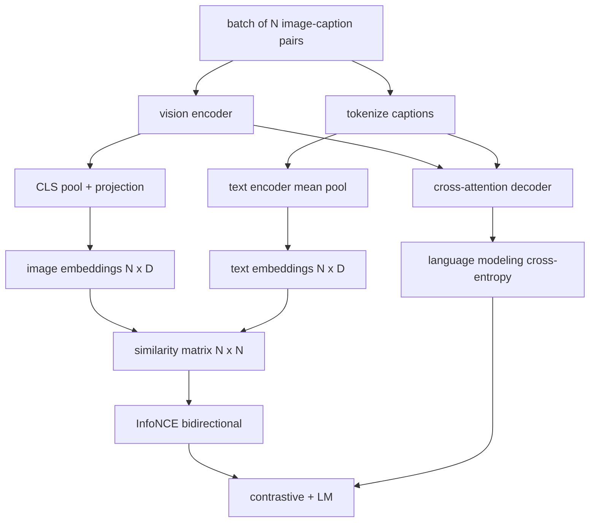

# 视觉语言预训练

> Les deux objectifs sont les suivants: comparer les images au texte perdu (InfoNCE), les adapter à la même environnement, ainsi que les construire des langues perdues, les demander à un décodeur pour chaque image ajouter un titre.

**Type:** Build
**Languages:** Python
**Prerequisites:** 第19期第30-37课（B轨基础）
**Time:** ~90 分钟

## Objectif de l'apprentissage

- Dans un ensemble de titres d'images, l'InfoNCE est réalisé en termes de perte de données.
- La formation de la langue de retour est une formation de formation de la langue de retour.
- Synthèse 200 pour la bibliothèque de langage de l'image en mode image, sans avoir besoin de télécharger un véritable ensemble de données.
- 运行 50 步演示训练循环并观察损失的减少──

##  problématique

Le modèle de langage visuel a besoin de deux compétences. Il doit être classé: un titre donné, trouver une image correcte dans de nombreuses images. Il doit être généré: un image donné, écrire un titre.

InfoNCE  responsable du classement de la moitié ⋅ pour un groupe de N ⋅, le modèle sera N ⋅ correspondant à la vue en tant que cas, sera ⋅`N^2 - N`Il ne correspond pas à l'exemple négatif, puis à celui généré.`(N, N)`La moitié de la production de LM est de la même taille que la moyenne de la production de LM. Les deux types de pertes sont de taille réduite et peuvent être partagées entre les éditeurs, les projecteurs et les éditeurs.

## 概念



### InfoNCE 在一段话中

Pour les deux, l'un est le résultat de l'analyse de l'image.`N x N`La réaction`S = I T^T / tau`, parmi lesquels `tau`Il est possible de trouver des solutions à la différence entre les différents types de données.`argmax`沿对角线运行:行 `i`Il faut que tu sois là .`i`Le nombre total est la valeur moyenne des deux.

### La température est importante

 température `tau`控制 softmax 的峰值程度──太小(例如 `tau = 0.01`) et la température vient seulement de la plus difficile de la valeur négative, entraînement avec le bruit.`tau`作为参数; la présentation ici fait la même chose.

### 语言建模损失

L'écran de l'écran est un écran de l'écran de l'écran de l'écran de l'écran de l'écran de l'écran de l'écran de l'écran de l'écran de l'écran de l'écran de l'écran de l'écran de l'écran de l'écran de l'écran de l'écran de l'écran de l'écran de l'écran de l'écran de l'écran de l'écran de l'écran de l'écran de l'écran de l'écran de l'écran de l'écran de l'écran de l'écran de l'écran de l'écran de l'écran de l'écran de l'écran de l'écran de l'écran de l'écran de l'écran de l'écran de l'écran de l'écran de l'écran de l'écran de l'écran de l'écran de l'écran de l'écran de l'écran de l'écran de l'écran de l'écran de l'écran de l'écran de l'écran de l'écran de l'écran de l'écran de l'écran de l'écran de l'écran de l'écran de l'écran de l'écran de l'écran de l'écran de l'écran de l'écran de l'écran de l'écran de l'écran de l'écran de l'écran de l'écran de l'écran de l'écran de l'écran de l'écran de l'écran de l'écran de l'écran de l'écran de l'écran de l'écran de l'écran de l'écran de l'écran de l'écran de l'écran de l'écran de l'écran de l'écran de l'écran de l'écran de l'écran de l'écran de l'écran de l'écran de l

### 合并损失

`total = contrastive + lm_weight * lm`, parmi lesquels `lm_weight`Il s'agit d'un modèle de multiples tâches utilisé par les modèles de type CoCa、BLIP et SigLIP, avec des poids différents.

|组件|损失面|影响|
|-----------|--------------|---------|
|信息NCE |联合空间中的配对排名 |编码器+投影+文字头|
| LM |以图像为条件的 token预测 |编码器+投影+解码器 |
|合并|多任务 |全栈|

### Pourquoi 50 étapes pour la démonstration suffisent-elles ?

La base de données simulée est un ensemble composé de 200 éléments, contenant des images aléatoires et des titres aléatoires. Après 50 étapes SGD de 16 en volume, même si la valeur absolue reste au-dessus du niveau atteint par le modèle de données réel, les deux pertes diminuent de manière significative.


```figure
ch-infonce-diagonal
```

## - Je le construis.

`code/main.py`实现:

- `MultimodalModel`, combiné à un petit éditeur de texte en format ViT, à un petit éditeur de texte en format MLP, à un petit éditeur de texte en format immatriculé, à un petit éditeur de texte en format de texte en format de texte en format de texte en format de texte en format de texte en format de texte en format de texte en format de texte en format de texte en format de texte en format de texte en format de texte en format de texte en format de texte en format de texte en format de texte en format de texte en format de texte en format de texte en format de texte en format de texte en format de texte en format de texte en format de texte en format de texte en format de texte en format de texte en format de texte en format de texte en format de texte en format de texte en format de texte en format de texte en format de texte en format de texte en format de texte en format de texte en format de texte en format de texte en format de texte en format de texte en format de texte en format de texte en format de texte en format de texte en format de texte en format de texte en format de texte en format de texte en format de texte en format de texte en format de texte en format de texte en format de texte en format de texte en format de texte en format en format de texte en format en format de texte en format en format de texte en format en format en format en format en format en format en format en format en format en format en format en format en format en format en format en format en format en format en format en format en format en format en format en format en format en format en format en format en format en format en format en format en format en format en format en format en format en format en format en format en format en format en format en format en format en format en format en format en format en format en format en format en format en format en format en format en format en format en format en format en format en format en format en format en format en format en format en format en format en format en format en format en format en format en format en format en format en format en format en format en format en format en format en format en format en format en format en format en format en format en format en format en format en format en format en format en format en format en format en format en format en format en format en format en format en format
- `info_nce_loss(image_emb, text_emb, temperature)`, double à CLIP 式对比损失──
- `lm_loss(logits, target_ids, padding_id)`Je suis en train de faire une petite histoire.
- `make_mock_corpus(seed, n_pairs)`, retour 200 个确定性 (图像, sous-titre)
-  entraînement cycle de fonctionnement 50 étapes, la taille de la masse est de 16,Adam 优化器和学习的对数温度参数──

Je vais le faire.

```bash
python3 code/main.py
```

输出: contrepartie de pertes à environ `ln(16) = 2.77`Réduit à 2,4; LM  Perte de`ln(512) ≈ 6.24`Les deux baisses ont démontré que la connexion de la taille était correcte.

## Utilisez-le

C'est la même disparition:

- **CLIP (2021)。**                                                                                                                                                                                                                                                              
- **CoCa (2022).**L'image dans un modèle est un texte par rapport à l'image sur le titre LM 损失── le modèle exact de la construction de ce cours──
- **BLIP (2022) 和 BLIP-2.**Pour le LM plus, le tableau correspond à la tête.
- **SigLIP (2023).**Pour les informationsNCE, le changement en sigmoïde pour les pertes; les mêmes contreparties, différentes formes de fonctionnement:
- **LLaVA 系列。**两阶段训练, dont la première étape est pour l'ensemble de l'ensemble de l'ensemble de l'ensemble de l'ensemble de l'ensemble de l'ensemble de l'ensemble de l'ensemble de l'ensemble de l'ensemble de l'ensemble de l'ensemble de l'ensemble de l'ensemble de l'ensemble de l'ensemble de l'ensemble de l'ensemble de l'ensemble de l'ensemble de l'ensemble de l'ensemble de l'ensemble de l'ensemble de l'ensemble de l'ensemble de l'ensemble de l'ensemble de l'ensemble de l'ensemble de l'ensemble de l'ensemble de l'ensemble de l'ensemble de l'ensemble de l'ensemble de l'ensemble de l'ensemble de l'ensemble de l'ensemble de l'ensemble de l'ensemble de l'ensemble de l'ensemble de l'ensemble de l'ensemble de l'ensemble de l'ensemble de l'ensemble de l'ensemble de l'ensemble de l'ensemble de l'ensemble de l'ensemble de l'ensemble de l'ensemble de l'ensemble de l'ensemble de l'ensemble de l'ensemble de l'ensemble de l'ensemble de l'ensemble de l'ensemble de l'ensemble de l'ensemble de l'ensemble de l'ensemble de l'ensemble de l'ensemble de l'ensemble de l'ensemble de l'ensemble de l'ensemble de l'ensemble de l'ensemble de l'ensemble de l'ensemble de l'ensemble de l'ensemble de l'ensemble de l'ensemble de l'ensemble de l'ensemble de l'ensemble de l'ensemble de l'ensemble de l'ensemble de l'ensemble.

## 测试 Le détail

`code/test_main.py`incluant:

- Les pertes entre les images et les textes sont en accord avec les autres.
- Lorsque la matrice de similitude est parfaite pour un grand nombre de points positifs, l'information est perdue et retourne à 0.
- LM perdus est vraiment masqué remplissage position
- 模型前向传递 génère deux types de perte et pas d'erreur
- Le cycle de formation 5 étapes a réduit les pertes de composition

Ils vont les faire:

```bash
python3 -m unittest code/test_main.py
```

## 练习

1. Remplacer l'InfoNCE en sigmoïde de style SigLIP pour les pertes et comparer la réception à la base de données de référence.

2. Addition de la phase de l'exploitation négative: chaque lot choisit le plus difficile des lots précédents à la fois non-contrôleur et ajoutera la partie.

3. Dans le même emplacement, ajouter des images-textes correspondant du second système de configuration (true/fals: ces correspondants?)

4. Le modèle de base de texte doit être remplacé par un séquence d'id de titre extrait de la chaîne de Markov, la matrice de transformation de la chaîne de Markov étant conditionnée à l'image hash.

5. Utilisation `lm_weight = 0`trainer le même modèle, puis utiliser `lm_weight = 1`Retour à la formation:

## 关键术语

|术语 |这意味着什么 |
|------|---------------|
|信息NCE |噪声对比估计：相似度矩阵上的交叉熵 |
|温度|控制对比 softmax 的峰值程度的标量 |
|硬阴性|模型发现的非对角线对令人困惑，但对于采样很有用 |
| LM 损失 |字幕侧的标准下一个token交叉熵 |
|联合嵌入空间|投影后图像和文本向量所在的共享空间 |

##  ultérieur

- Utilisé sur le papier original par rapport à la préparation.
- CoCa 紙, utilisé dans un modèle pour comparer et écrire.
- SigLIP 论文, introduit la sigmoïde à des causes de perte de variété et de sa plus grande expansion.
