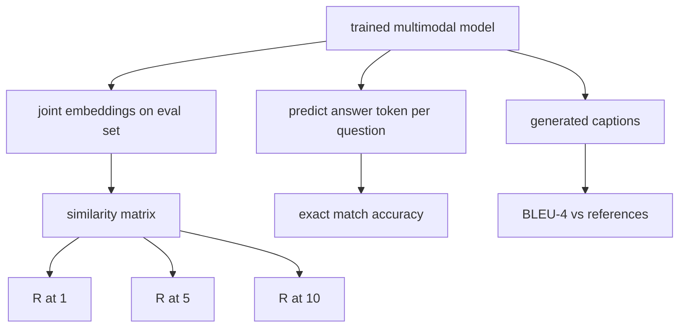

# Évaluation du mode

> Le cours est basé sur trois critères d'évaluation: le rapport de recherche de titre d'image est R@1、R@5、R@10; le rapport de réponse de question de vision est un rapport de correspondance précise; le rapport de scène d'image est BLEU-4;. Chaque indicateur est une fonction de sortie du modèle et un ensemble d'évaluation intégré qui fonctionne en quelques secondes.

**Type:** Build
**Languages:** Python
**Prerequisites:** 第19期第58-62课（Track E基础：编码器、Transformer、投影、交叉注意力融合、预训练）
**Time:** ~90 分钟

## Objectif de l'apprentissage

- 根据图像和标题嵌入之间的相似性矩阵计算Remember@K。
- 根据将(图像、问题) calculer la précision de la correspondance VQA de la carte à la réponse fixe
- Les séquences de jetons de référence et de génération sont calculées par BLEU-4, sans avoir besoin de toute base externe.
-  la mise en œuvre de tous les trois évaluations du ensemble complète de formation sur le modèle de formation de la section 62.

##  problématique

Lorsque la perte de formation tend à s'établir, nous déclarons très probablement que le modèle à plusieurs modèles est terminé. La mesure de perte de formation est adaptée à la distribution de formation; il ne peut pas mesurer si le modèle peut être classé, répondu à des questions ou rédigé pour les titres acceptés par l'homme dans les lots réservés.

- **检索（R@1，R@5，R@10）。**Pour la recherche, les titres sont intégrés ensemble; chaque image de la pile d'évaluation est classée selon le reste du string; le rapport correspond à la façon de fonctionnement de l'image de la forme de l'image est la même.
- **视觉问答（完全匹配）。**给定(图像,问题),模型输出一个答案token──精确匹配是每个样本一个:
- **字幕 (BLEU-4)。**Il est également possible de calculer la valeur moyenne géométrique de la précision de 1 à 4 k selon le titre de référence, et de sacrifier la simplicité.

Chaque mesure est une fonction mince. Ce cours les construira tous avec du code, donc la mathématiques est spécifique et la surface est toujours sous votre contrôle.

## 概念



### De la similitude à la même fréquence

 Construire des images et des titres entre les emplacements `(N, N)`Pour chaque ligne, l'indexation de la ligne est classée en fonction de la similarité. Pour chaque ligne, l'indexation de la ligne est classée en fonction de la position de la ligne. Pour chaque ligne, l'indexation de la ligne est classée en fonction de la position de la ligne.

### VQA 精确匹配

Pour chaque image, les questions, les réponses, les questions de codage, les questions d'intégration, la fusion de l'écoder, et la lecture du prochain token.

### Le projet de loi

```text
BLEU-4 = BP * exp(mean(log p1, log p2, log p3, log p4))
```

Parmi eux `p_n`est la précision de n 元语法 après modification ((apparaît dans toute référence n n n n n n n n n n n n n n n n n n n n n n n n n n n n n n n n n n n n n n n n n n n n n n n n n n n n n n n n n n n n n n n n n n n n n n n n n n n n n n n n n n n n n n n n n n n n n n n n n n n n n n n n n n n n n n n n n n n n n n n n n n n n n n n n n n n n n n n n n n n n n n n n n n n n n n n n n n n n n n n n n n n n n n n n n n n n n n n n n n n n n n n n n n n n n n n n n n n n n n n n n n n n n n n n n n n n n n n n n n n n n n n n n n n n n n n n n n n n n n n n n n n n n n n n n n n n n n n n n n n n n n n n n n n n n n n n n n n n n n n n n n n n n n n n n n n n n n n n n n n n n n n n n n n n n n n n n n n n n n n n n n n n n n n n n n n n n n n n n n n n n n n n n n n n n n n n n n n n n n n n n n n n n n n n n n n n n n n n n n n n n n n n n n n n n n n n n n n n n n n n n n n n n n n n n n n n n n n n n n n n n n n n n n n n n n n n n n n n n n n n n n n n n n n n n n n n n n n n n n n n n n n n n n n n n n n n n n n n n n n n n n n n n n n n n n n`BP`C'est une simple punition.

```text
BP = 1                if generated length > reference length
   = exp(1 - r/g)     otherwise, where r is reference length and g is generated
```

Pour certains.`p_n`Pour un petit échantillon de zéro, il faut effectuer un étalonnage. Pour réaliser cette méthode, il faut utiliser Chen 和 Cherry.

### 综合评估套件

Un ensemble d'évaluation de 50 échantillons est constitué de trois listes, construites dans la mémoire, selon le même modèle de base de données utilisée dans la classe 62:

- `pairs`:50 个(图像、caption_ids) pour le dépistage
- `vqa`:50 个(image、problème ID、答案 ID)
- `caps`:50 个(图像, référence_caption_ids,...]) 条目, chaque image le plus de 3 个引用。

Le ensemble est déterminé par le grain et conservé dans la base de données de formation, donc l'indicateur est basé sur des données calculées par le modèle jamais vues.

|指标|范围 |随机基线 (N=50) |
|--------|-------|------------------------|
| R@1 | 0 到 1 | 0.02（1/N）|
| R@5 | 0 到 1 | 0.10 |
| R@10 | 0 到 1 | 0.20 |
| VQA EM | 0 到 1 | 1 / 词汇 |
| BLEU-4 | 0 到 1 |小但非零 |

Pour les 50 étapes de formation qui fonctionnent sur des données synthétiques, les indicateurs prévisionnels ne sont pas très élevés; ils sont prévus pour être élevés sur des bases aléatoires, c'est le contenu de la démonstration.


```figure
ch-recall-window
```

## - Je le construis.

`code/main.py`实现:

- `recall_at_k(sim_matrix, k)`, en deux directions , retour`[0, 1]`Le nombre de points de référence
- `vqa_exact_match(predictions, references)`, retour `int`La valeur moyenne de la même chose.
- `bleu4(generated, references, smoothing=True)`, avec un soutien de plusieurs références.
- `build_eval_suite(seed, n_samples, vocab_size, max_len)`, retour à la liste des évaluations de trois déterminations:
- `evaluate(model, suite)`, il fonctionne tous les trois indicateurs et retourne `dict`Le nombre de mots.
- Une présentation, charger un modèle multimodale de nouvelle démarrage dans la classe 62 , l'évaluer, puis l'entraîner en 50 étapes et l'évaluer à nouveau, imprimer avant/après indicateur.

Je vais le faire.

```bash
python3 code/main.py
```

输出: avant/après des échantillons de mesure montrent la demande de réflexion de l'amélioration du signal de formation du modèle à la réflexion, VQA  amélioration à la réflexion, BLEU-4  amélioration (construction de la structure de la composition suffisant pour réaliser 4 克 amélioration de la précision)

## Utilisez-le

Chaque indicateur est directement mappé à la base de production:

- **检索。**MS-COCO 5K val、Flickr30K、ImageNet 零样本都是 les mêmes R@K 问题在相似性矩阵上的──将合成 eval 替换为真文件,函数签名保持不变──
- **VQA。**VQA v2、GQA、OK-VQA utilise le même modèle de correspondance précises, avec un acc-soft au lieu de l'EM unique de VQA v2.
- **BLEU-4.**MS-COCO 字幕、NoCaps、Flickr30K 字幕均使用BLEU-4加 CIDER 和 METEOR──添加 CIDER 是另一个功能──

Pour le vrai test de base, s'il vous plaît.`build_eval_suite`替换为真正加载程序并保留函数体──数学与基准无关──

## 测试 Le détail

`code/test_main.py`incluant:

-remember@k dans la parfaite ressemblance de la matrice retour 1.0, dans la revirement de la matrice retour 0.0 ((k < N)
- rappeler@k 尊重 `k <= N`La limite
- Lorsque bleu4 est totalement égal à l'une des citations, retournez 1.0
- bleu4 在不相交词汇上 retour 0.0
- vqa  exact match est égal à la proportion égale à la proportion
- construire_eval_suite  retour à l'attente de l'objectif

Ils vont les faire:

```bash
python3 -m unittest code/test_main.py
```

## 练习

1. CIDER utilise TF-IDF en plus de n-gramme, ce qui récompense des symboles riches en informations.

2.  Implementation de la VQA de précision: chaque question a plusieurs réponses personnelles, si elles correspondent, la précision est de `min(human_count / 3, 1)`❖ Répondre à VQA v2──

3. 添加 `bleu4`La séquence de production de NaN est gérable et ne s'effondre pas.

4. Avec R@K un à calculer la moyenne de la répartition (MRR) ⋅ MRR est très sensible à la position de l'objet qui est en haut de la partie K; R@K est très sensible à la situation de l'objet qui est en avant de la partie K ⋅

5. Pendant l'entraînement, cinq points de contrôle ont été effectués pour évaluer le fonctionnement du modèle.

## 关键术语

|术语 |这意味着什么 |
|------|---------------|
| R@K |正确匹配出现在前 K 个结果中的查询比例 |
|精确匹配 |最简单的VQA评分：预测答案等于参考|
| BLEU-4 | 1 到 4 克精度的几何平均值，带有简洁性代价 |
|多参考|字幕指标接受每个图像的多个参考字幕 |
|保留 |评估集是从与训练语料库不相交的种子中采样的 |

##  ultérieur

- Utilisé dans le logiciel de formules et de données statistiques de VQA v2 论文.
- Utilisé par TF-IDF 加权 n-gram 字幕的CIDEr 论文──
- BLEU 原始版本(Papineni 等人,2002) est utilisé pour le simple changement de forme.
- Il est utilisé pour le cadre de référence de mise en œuvre de l'écriture de l'évaluation de l'écriture MS-COCO.
