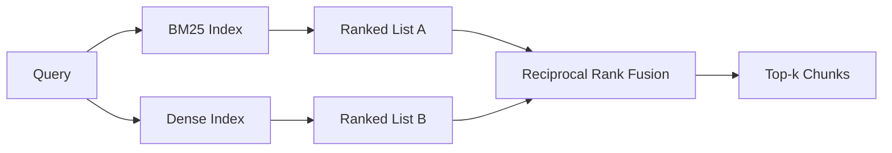

# BM25 et les tests mixtes de l'intégration

> 词汇和语义检索 字汇和语义检索 字汇和语义检索 字汇和语义检索 字汇和语义检索 字汇和语义检索 字汇和语义检索 字汇和语义检索 字汇和语义检索 字汇和语义检索 字汇和语义检索 字汇和语义检索 字汇和语义检索 字汇和语义检索 字汇和语义检索 字汇和语义检索 字汇和语义检索 字汇和语义检索 字汇和语义检索 字汇和语义检索 字汇和语汇和语义检索 字汇和语汇和语汇和语汇分类 字汇和语汇和语汇分类 字汇和语汇分类 字汇和语汇分类 字汇和语汇分类 字汇和语汇分类 字汇和语汇分类 字 字汇汇汇汇汇和语汇汇分类 字 字汇汇汇汇汇汇汇汇汇分类 字 字 字汇汇汇汇汇汇汇汇汇汇汇汇汇汇汇汇汇汇汇汇汇汇汇汇汇汇汇汇汇汇汇汇汇汇汇汇汇汇汇汇汇汇汇汇汇汇汇汇汇汇汇汇汇汇汇汇汇汇汇汇汇汇汇汇汇汇汇汇汇汇汇汇汇汇汇汇汇汇汇汇汇汇汇汇汇汇汇汇汇汇汇汇汇汇汇汇汇汇汇汇汇汇汇汇汇汇汇汇汇汇汇汇汇汇汇汇汇汇汇汇汇汇汇汇汇汇汇汇汇汇汇汇汇汇汇汇汇汇汇汇汇汇汇汇汇汇汇汇汇汇汇汇汇汇汇汇汇汇汇汇汇汇汇汇汇汇汇汇汇汇汇汇汇汇汇汇汇汇汇汇汇汇汇汇汇汇汇汇汇汇汇汇汇汇汇汇汇汇汇汇汇汇汇汇汇汇汇汇汇汇汇汇汇汇汇汇汇汇汇汇汇汇汇汇汇汇汇汇汇汇汇汇汇汇汇汇汇汇

**Type:** Build
**Languages:** Python
**Prerequisites:** 第 11 阶段课程 04（嵌入）、06（RAG）；第 19 阶段 Track B 基础（第 20-29 课）；第 19 阶段第 64 课（分块策略）
**Time:** ~90 分钟

## Objectif de l'apprentissage
- Selon Robertson et Spark Jones, la formule BM25 est mise en œuvre à partir du début, avec un pouvoir de dimensionnement, une standardisation de la longueur du dossier et des réglages de la longueur des documents.
- En effet, les données de l'équipe de recherche sont en train de se dérouler en ligne.
- 完全按照 Cormack、Clarke 和 Buettcher, réalisé comme publié en 2009倒数等级融合,并解释为什么它占据分数加权插值中的主导地位.
- 调整 RRF k 常数和每种模态权重, et dans un petit fichier 语料库上读取权重──

##  problématique

Lorsque la requête porte le langage contenant des caractères identifiants, le langage recherche la victoire.`AbortMultipartOnFail`La requête est répertoriée en BM25 en microsecondes pour retourner la fonction Go à la même fréquence.

Lorsque la requête est interprétée comme étant un texte éloigné de la bibliothèque de mots, la recherche intensive se réalise. Les utilisateurs se demandent comment traiter l'annulation de l'abort. BM25 返回 上传大文件的文档块, car cette page contient la seule parole.

La sélection entre les deux n'est pas totalement invariable. La distribution de la requête est variable.

## 概念



### BM25 一段话

BM25                                                                                                                                                                                                                                                                                                                                                                                                                                                                                                                            `k1`控制词频和度;默认值 1.5 是已发布的建议, vous ne devriez pas le déplacer en l'absence de fondation.`b`控制文档长度的重要性;默认值 0.75 Indique que les documents plus longs seront punis, mais pas liés à la nature.

IDF 公式使用平滑的Robertson 和 Spark Jones 定义,即 `log((N - df + 0.5) / (df + 0.5) + 1)`◊ Quand un terme apparaît dans plus de la moitié des archives de langage, l'ajout dans le journal permet à l'armée israélienne de maintenir une valeur normale.

字段加权可让你告诉 BM25, la correspondance sur le nom des symboles est plus importante que la correspondance dans le texte réel. La mise en œuvre est le nombre de fois du nombre de termes dans le processus d'indexation, et non le nombre de termes lors de l'évaluation. Ainsi, on peut garder la même mathématique, et éviter que chaque domaine ait des scores distincts.

### Une section de recherche intensive

Utilisation de modèle de mise en place chaque bloc sera inséré dans un flux de dimension fixe. En enquête, la requête de mise en place, en fonction de la similitude, effectue un référencement de chaque bloc, et revient à la précédente k 个. Le modèle est la variation de la qualité déterminante.

Ce cours utilise des emplacements de détermination basés sur le hash, donc vous n'avez pas besoin de réseaux de référencement.

### 倒数秩融合, déjà publié

两个排名榜―― Pour chaque candidat qui apparaît sur la liste, il y aura un nombre élevé de contributions à la liste.`1 / (k + rank)`,k équivaut à 60 en valeur par défaut.

Le nombre de candidats à la première place est de 60 à 60%, le nombre de candidats à la deuxième place est de 1 / 61, le nombre de candidats à la deuxième place est de 1 / 70%.

Nous avons réalisé deux choses qui peuvent être ajustées.`k`常数── un poids par rapport à chaque modèle, de sorte que lorsque vous avez des preuves préalables indiquant que l'un d'entre eux est meilleur dans votre base de données, vous pouvez augmenter la BM25 ou la densité── contribuer à la classification par le poids est le principe le plus simple à réaliser; il a conservé une forme de déclin de niveau et a maintenu l'immatriculation──

### Pourquoi la fusion est meilleure que la fraction plus le pouvoir de saisie

BM25 est un nombre non limité et dépendant de la base de langage.`alpha * bm25 + (1 - alpha) * cosine`Il faut que chaque base de mots soit alpha-adjustée, et chaque réindexation sera interrompue. Les deux niveaux sont comparables dans différents modes. Depuis 2010, les lignes de base RRF publiées sur chaque circuit public TREC ont remporté des points de classement. Cela correspond à ce que vous avez entendu dans les documents Vespa et Weaviate concernant RankFusion et RRF.


```figure
rrf-fusion
```

## - Je le construis.

`code/main.py`实现:

- `tokenize(text)`- 快速正则表达式token器──
- `BM25Index`- Avec le pouvoir.`add`et `search`Et peut être modifié.
- `mock_embed`- Je suis là.`DenseIndex`- est intégré à la même définition que la section 64, le bloc est donc comparable
- `rrf(rankings, k, weights)`- 多模态权重融合 已发布的多模态权重融合
- `HybridRetriever`- 结合了BM25和密集──
- Une démonstration .`main()`, charger un petit fichier 语料库, utiliser trois spécialement pour montrer les avantages et les défauts de chaque rechercheur, et imprimer le classement de chaque modèle généré ainsi que la liste de fusion

Je vais le faire.

```bash
python3 code/main.py
```

Il est également utilisé pour la recherche de données sur les données de référence, les données de référence et les données de référence, les données de référence et les données de référence.

## 调整旋

|旋钮|默认|何时调高|何时调低|
|------|---------|----------------|------------------|
| BM25 k1 | 1.5 |文档中的术语会重复，且你希望频率更重要 |文档很短，术语重复主要是噪音 |
| BM25 b | 0.75 |长文档确实每个词携带的信息更少 |文档长度与主题无关 |
| RRF k | 60 |较深排名的候选仍应投票 |Top-1 应该占主导 |
| BM25 weight | 1.0 |语料库包含字面标识符，查询也按字面匹配 |查询多为用户改写 |
| Dense weight | 1.0 |查询多为改写或语义表达 |查询多为字面表达 |

 réutiliser l'outil d'évaluation du cours 68 dans le cadre de la mise en œuvre de la révision des enquêtes conservées, et non par instinct.

## 演示将隐藏的故障模式

**词汇外token。**L'IDF de BM25 est calculée en fonction du contenu de la base, de sorte que la contribution des termes de la seule requête est de zéro. Les emplacements denses génèrent la même quantité de phénomène. Pour les identifiants de base de mots, le modèle densé revient à un voisin raisonnable mais erroné. La fusion a absorbé ce point, car BM25 ne revient pas à un contenu et la contribution de classement diminue, mais à condition que vous répétiez selon le document plutôt que selon le bloc.

**停止token统治。**BM25 针对单词the在语料库中产生统一的排名── 过索引器中停止token或接受高 IDF 术语自然占主导地位──

**跨模态的内容相同。**Si votre base de données est assez petite, jusqu'à ce que le top-1 de BM25 soit aussi le top-1 de l'intense, RRF vous fournira le même top-1 de l'autre voisinage. C'est un comportement correct, et non un échec, mais il rend la fusion invisible.

## Utilisez-le

Mode de production:

- 索引 BM25 正在处理中;瓶是词频字典,而不是向量──
- Dans le stockage individuel, nous utilisons la liste des plans dans cette classe; dans la production, vous utiliserez le HNSW)
- Il y a deux enquêtes en cours de réalisation: fusion est la cohésion constante du temps de l'ensemble.
- Gardez chaque requête dans le mode de vie, afin que les réorganisateurs de la campagne puissent voir quel mode de vote la soutient.

## 发货

Le système de recherche mixte de cette classe est la première étape du système de 69° classe à la fin.

## 练习

1. Il va`mock_embed`替换为供应商提供的真实模型──重新运行演示并报告 只有密集排名在释义查询上的变化──
2. 添加第三种模式:单独索引的块摘要并融合为第三排名列表──测量增益──
3. Pour le calcul de la valeur de la couche de couche, le rapport de la couche de couche est le résultat de la couche de couche de couche.
4. Il est possible de réaliser correctement BM25F (à chaque section de longueur standardisée plutôt que de multiplication des techniques) et de comparer sur la base de données les plus importantes de correspondance des symboles.

## 关键术语

|术语 |人们怎么说|它实际上意味着什么 |
|------|-----------------|------------------------|
| BM25 | “词汇搜索” | idf x 饱和 tf x 长度归一化的概率排名 |
|参考文献 | “等级融合”|各个排名列表的 1 / (k + 排名) 之和； k = 60 默认 |
| k1 | “TF 饱和度” |控制重复术语停止添加更多分数的速度 |
|乙| “长度惩罚” | 0 表示忽略文档长度，1 表示完全标准化 |
|场加权 | “符号提升”|在索引期间重复token以增强该字段中的匹配|
|基于排名与基于分数的融合 | “为什么 RRF 优于线性”|不同模式下的排名具有可比性；分数不|

##  ultérieur

- Cormack、Clarke、Buettcher, 倒数排名融合优于孔多塞和个人排名学习方法,SIGIR 2009
- Robertson、Walker、Beaulieu、Gatford、Payne,Okapi à la TREC-3(
- [Vespa：使用 BM25 和 Embeddings](https://docs.vespa.ai/en/tutorials/hybrid-search.html) effectuer un examen mixte
- [Weaviate：混合搜索](https://weaviate.io/developers/weaviate/search/hybrid)
- 第 11 阶段 第 06 课 - RAG 基础知识
- Section 19 阶段 Section 64 课 - 分块器的输出 在此编制索引
- 19ème étape 66ème étape - Réorganisation des échanges de données
