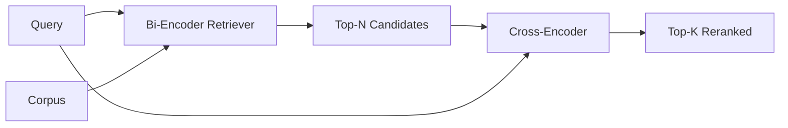

# 交叉编码器 重排序

> Le double codeur est le lecteur le plus intelligent, mais aussi le plus lent. Il est utilisé comme un double codeur de deuxième classe, il a une valeur en lui-même.

**Type:** Build
**Languages:** Python
**Prerequisites:** 第11期第06课（RAG）、第11期第07课（高级RAG）；第 19 阶段 Track B 基础（第 20-29 课）；第 19 阶段第 65 课（混合检索喂养此阶段）
**Time:** ~90 分钟

## Objectif de l'apprentissage
-  par le biais de la forme d'entrée  par le paramètre et de chaque requête, la différence entre deux coder coder coder et trans coder coder re-arrangement 
- Dès le début, un petit codeur de transfert est mis en œuvre comme un bloc transformateur, il consomme un tas de requêtes et émet un seul code connexe.
- 连接两阶段检索然后重新排序管道: utiliser un référentiel de recherche à bas prix检索前 N, utiliser un référentiel de transport N 重新排序为前 K, retourner à K。
- Dans la petite base de données de texte fixe, on mesure la retardation et le poids de la qualité, et on choisit correctement le N à l'aide d'un budget de retard donné.

##  problématique

Le double éditeur va cartographier la requête et le document dans le même espace métrique et en fonction du classement des cordes. Ces deux types de code ne se verront jamais l'un l'autre. Le modèle doit compresser tout le contenu utile du document dans un seul vecteur, sans tenir compte de la requête. C'est une requête rapide.

Le prix est l'exactitude. Deux documents ayant le même thème général peuvent avoir des emplacements presque identiques, même si l'un d'eux répond à une requête et l'autre ne répond pas.

交叉编码器通过一起阅读查询和文件来解决这个问题――该模型接收`[query] [SEP] [document]`En tant que séquence unique, une attention totale est accordée à la mise en œuvre de la connexion, et chaque symbole du dossier peut être décidément utilisé pour la recherche.

Les deux éditeurs sont intégrés une fois et en permanence, chaque éditeur est intermédiaire pour chaque requête, chaque document est intermédiaire pour chaque opération. Pour chaque requête, une base de données contenant 1000 millions de documents doit être effectuée 1000 millions de fois.

La solution est la partie suivante: la mise en place d'un système de référencement de N. La mise en place d'un système de référencement de N. La mise en place d'un système de référencement de N. La mise en place d'un système de référencement de N.

## 概念



### 交叉编码器的输入形状

标准包装为`[CLS] query_tokens [SEP] document_tokens [SEP]`◊ CLS 位置 output est envoyé à  envoyer à  tête de ligne unique des étiquettes connexes à la sortie ◊ certains réalisent l'utilisation de la pile de valeur moyenne au lieu de CLS; la différence est très petite ◊ point est que le modèle produit un chiffre par par par par par.

22M paramètres de codeurs`ms-marco-MiniLM-L-6-v2`Le poids de la production est un point de production typique. Un modèle plus petit perd de la qualité à une vitesse plus rapide que le retard de l'économie.`bge-reranker-v2-m3`) conservé pour le renouvellement ou le renouvellement de la première page de K 较小的首页.

### Pourquoi cette partie de l'entraînement est un petit enfant

Le véritable codeur de croisement est un codeur de transformateur à micro-modusation. Pendant la production, vous chargez un point de contrôle et le faites fonctionner. Dans ce cours, notre objectif est de vous montrer la forme du modèle et la forme de la courbe de qualité retardée, plutôt que de vous entraîner à l'ordre le plus avancé.`nn.Module`, qui contient un bloc transformateur, plusieurs têtes d'attention (en cas par défaut pour 4 têtes) et un tête de retour. Il est initialement démarré à partir de la séquence déterminée, de sorte que l'exposition peut être reproduite, sans avoir besoin de poids sur le disque.

 Modèle de jouets à partir de la base de données fixes: le modèle de jouets est classé correctement: les requêtes-documents associés sont associés à des données prédictives plus élevées.

### 延迟与质量

Le tube de deux étapes a un paramètre réglable: N. Dans le groupe de requêtes conservées, N sera passé de 5 à 100, soit une courbe.

|N |第 2 阶段的 recall@1 |每个查询的交叉编码器前向传递 |延迟 |
|---|--------------------|---------------------------------------|---------|
| 5 | 0.62 | 0.62 5 |低|
| 20 | 0.81 | 0.81 20 |中等|
| 50 | 50 0.86 | 0.86 50 | 50高|
| 100 | 100 0.86 | 0.86 100 | 100非常高|

Les chiffres ci-dessus indiquent simplement la forme, et non la valeur de mesure de cette pièce. La forme est réelle.

De la courbe d'évaluation choisir N en plus du budget de retard. Le codeur de transfert ne peut pas augmenter le taux de retrait de N à plus haut que celui du codeur double, donc le N faible limite la qualité, et non seulement le retard.


```figure
rerank-funnel
```

## - Je le construis.

`code/main.py`实现:

- `CrossEncoder`- Une petite .`torch.nn.Module`:Token Embedded, un bloc transformateur à plusieurs têtes et à plusieurs têtes, générant une pile de valeur moyenne de chaque marque.
- `tokenize_pair(query, document)`- mettre deux caractères en un seul séquence d'id, son type de symbole d'id
- `train_tiny(pairs)`- pour les symboles manuels de modification (enquêtes, documents, connexions) trois listes de faire une formation de surveillance, de sorte que le modèle peut produire un nombre raisonnable de partitions sur le fichier.
- `rerank(query, candidates, top_k)`- Produit et service.
- `pipeline(query, retriever, top_n, top_k)`- Il y a deux classes.
- 演示 `main()`, de la 65e classe à la mode chargement de la base de données, le premier N 个, réaffecté à l'avant K 个,并排 imprimé deux listes,并报告每阶段的延迟──

Je vais le faire.

```bash
python3 code/main.py
```

输出显示双编码器的顶-N、交叉编码器的顶-K以及时间序摘要──交叉编码器的调用需要更长时间,但不会运行在完整的语料库──当选择双编码器排名第二或第三的答案时,两阶段总数保持在请求预算范围内──

## 演示将隐藏的故障模式

**交叉编码器不对称。** `rerank(q, d)`et `rerank(d, q)`Si vous ne changez pas d'avis, les souvenirs se brisent.

**N 太低，无法暴露该 bug。**Si la mise en place N = K, le codeur de croisement ne peut pas être réarrangé; il ne peut être réarrangé que par le nombre de charges.

**训练数据泄漏到评估中。**Si l'entraînement de la marque manuelle est lié à la recherche d'évaluation, il est très curieux de revoir le classement.

**生产权重很密集。**22M paramètres de croisement de codeur en float32 时为 88MB── en promesse inférieure à 100 milis secondes de p95 之前规划模型服务器的内存──

**批处理很重要。**Le réel codeur de croisement est en cours de fonctionnement en un seul lot.`_batch_encode`En exécutant cette opération, il utilise `torch.tensor(...)`构建批量 id 和 type-id 张量并运行一次前向传递──跳过批处理,延迟会乘以 N──

## Utilisez-le

Mode de production:

- Le fait de mettre en place un double codeur, un codeur intermédiaire et un N connectés ensemble, tout changement en fait l'effet de l'évaluation.
- 通過 (query, document_id) 哈希缓存重排器的输出──稳定语料库上的相同查询会重排成相同顺序;缓存命中可以免费降低延迟──
- 记录排名第 1 的交叉编码器分数──top-1 分数低于语料库特定值的查询是域外命中;让LLM表达我不确定──

## 发货

Le système de répartition est le deuxième stade du système de répartition.

## 练习

1. Résoudre N de 5 à 50,并绘制重排输出回忆@1――找到该固定上的拐点――
2. Pour les éditeurs de données, il faut utiliser les données de l'époque de l'époque de l'époque de l'époque de l'époque de l'époque de l'époque de l'époque de l'époque de l'époque de l'époque de l'époque de l'époque de l'époque de l'époque de l'époque de l'époque de l'époque de l'époque de l'époque de l'époque de l'époque de l'époque de l'époque de l'époque de l'époque de l'époque de l'époque de l'époque de l'époque de l'époque de l'époque de l'époque de l'époque de l'époque.
3. Utilisez le symbole CLS 头替换平均值池── comparer la réception de ce fichier──
4. Ajouter un deuxième codeur de croisement, pour prévoir si la réponse dans le document est ainsi 标签── utiliser deux titres pour faire des recherches; un pour classer, un pour ouvrir──
5. La définition de l'image du double éditeur sera remplacée par celle du double éditeur de la classe 65 et les deux phases seront liées.

## 关键术语

|术语 |人们怎么说|它实际上意味着什么 |
|------|-----------------|------------------------|
|双编码器 | “矢量检索器” |独立编码查询和文档；余弦对它们进行排名 |
|交叉编码器 | “重排” |联合编码(query, doc)；输出一个相关标量 |
|两级管道 | “检索并重排” |便宜的检索器返回 N，昂贵的重排器保留 K |
| N（候选预算）| “重新排列池” |每个查询交叉编码器得分的候选者数量 |
|平均池头 | “最后隐藏的平均值” |将编码器的最后一层输出平均为一个向量 |

##  ultérieur

- Nogueira, Cho,Passage Rencontre avec BERT,2019 年 - 规范的交叉编码器排名论文
- Reimers, Gurevych,Sentence-BERT: utiliser le siame BERT 网络的句子嵌入,2019 年 - 关于双编码器与交叉编码器
- [SentenceTransformers 交叉编码器文档](https://www.sbert.net/examples/applications/cross-encoder/README.html)
- [BGE Reranker v2 模型卡](https://huggingface.co/BAAI/bge-reranker-v2-m3)
- 第19 阶段 第65 课 - 混合检索器 养育此重新排序阶段
- Section 19 - Évaluation de la réinsertion des salariés
