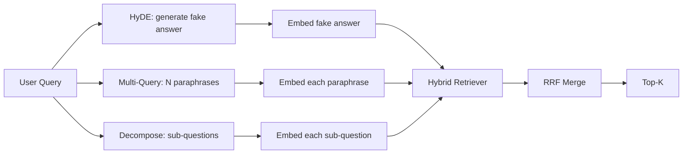

# 查询重写:HyDE、多查询和分解

> Les requêtes des utilisateurs n'ont pas été introduites par votre référencement. La réécriture a comblé le fossé précédent de la requête, de sorte que le contenu de l'index est plus proche de la réponse.

**Type:** Build
**Languages:** Python
**Prerequisites:** 第 11 阶段课程 04（嵌入）、06（RAG）；第 19 阶段 Track B 基础（第 20-29 课）；第 19 阶段第 64 和 65 课
**Time:** ~90 分钟

## Objectif de l'apprentissage
- 实现假设文档嵌入 (HyDE): générer une faux réponse, l'intégrer, effectuer une recherche en fonction de ce flux plutôt que de la demande de flux.
- 实现多查询扩展: réécrire une enquête en N个释义, chaque enquête, par l'intermédiaire de la réintégration de plusieurs niveaux de concentration et de concentration.
- 实现查询分解:将复杂问题分为子问题,按子问题检索,合并──
- Comparez les performances de trois rédacteurs dans un match,并解释每种策略何时胜──
-  connecter un modèle LLM, produire une sortie fixe de la définition, afin de réécrire le cycle de fonctionnement en ligne

##  problématique

Un document écrit dans le cache de texte:  AbortMultipartOnFail va suspendre les S3 segmentes de transmission et réduire le budget de réessayage de chaque bouquet 🏼 Lorsque les requêtes et les documents ne sont pas partagés  BM25 non destiné  Bi-encodeur classe les documents au troisième ou quatrième rang, car la direction de la requête est plus orientée vers la région de suppression des tâches  dans l'espace de mise en place, plutôt que vers la région de suppression  dans les archives    Si la réponse est entrée dans la première N, les deux phases de la classe 66 peuvent être réélues; mais si la réessayage n'est pas fondamentalement entrée en avant N, le réencodeur ne peut jamais le voir 

修复方法在查询触及检查器之前重写查询. 2023年论文 Precise Zero-Shot Dense Retrieval without Relevance Labels(Gao 等人) présente HyDE: Require LLM 编写一篇能回答查询的文档,嵌入这个假设文档,并将其嵌入用于检查向量.

两种近亲技术与HyDE相结合――多查询扩展(Utilisez le terme Microsoft's GraphRAG 术语) générer des requêtes de N 个释义并检查每个释义, puis合并――分解(en 2024 Stanford DSPy 工作中流行为子查询分解)

Ce cours réalisera ces trois projets et les gérera dans le même cadre.

## 概念



### HyDE  détails

HyDE utilise LLM 编写的假设文档向量替换用户的查询向量──提示很短:

```text
You are a domain expert. Write a one-paragraph passage that answers the question
below. Use the same vocabulary and phrasing the documentation in this domain would
use. Do not refuse. Do not say you do not know.

Question: {user_query}

Passage:
```

La réponse de LLM en tant que réponse de faits est erronée, parce que LLM ne connaît pas votre bibliothèque de texte. C'est très bien. Le référencement ne se préoccupe pas de la justesse de la réalité, il se préoccupe seulement des jetons de distribution.

En production, vous limiterez le document de la hypothèse à deux à trois phrases. Les hypothèses plus longues collecteront plus de bruit. Les mots plus courts perdront les signaux de vocabulaire nécessaires à HyDE.

### Détail de la demande

N 个释义──最简单的提示:

```text
Rewrite the following question in {N} different ways. Each rewrite must preserve
the original intent. Number them 1 to {N}. Do not add explanations.
```

检索每个释义的顶级k――将 N个排名列表与RRF 合并((与第65 课程中的算法相同) ∼廉价、并行、确定性──

Lorsque le phrasé de l'utilisateur est l'une des nombreuses façons de poser des questions aussi efficaces, la plupart des requêtes gagnent, et toute réécriture sera mieux posée.

### 详细分解

单检索不能满足多方面的问题――分解要求 LLM 将问题拆成子问题,系统再检索每个子问题――提示:

```text
The following question may require information from multiple distinct topics.
Decompose it into a list of sub-questions. Each sub-question must be answerable
independently. If the question is already atomic, return it unchanged.

Question: {user_query}
```

Pour les questions contenant des mots liés, des phrases comparées ou deux sujets non liés, la résolution est un outil correct.

### Pourquoi ces trois existent-ils ?

Les trois méthodes de production sont utilisées pour chaque requête et choisissent une stratégie adaptée.

## 模拟 LLM

Le cours est en ligne. Le modèle LLM est un petit formulaire de recherche clé pour les requêtes des utilisateurs, ainsi que les préparatifs pour les requêtes non consultées.

- Pour chaque pièce, une requête: 书面假设段落、三个释义和分解结果──
- Pour une requête inconnue: détermination transfert: obtenir le contenu de la requête, en passant par le même terme, la cartographie, puis retourner le résultat.

La forme de la simulation est importante, et non les données.


```figure
cd-hyde-vector
```

## - Je le construis.

`code/main.py`实现:

- `MockLLM`- Les définitions ci-dessus sont remplacées.
- `HyDERewriter`- 调用LLM编写假设文档,将重写机输出返回为`RewriteResult`, qui contient des hypothèses et des enquêtes à utiliser.
- `MultiQueryRewriter`- 调用LLM pour effectuerN个释义, retourner à la liste des demandes de renseignements
- `DecomposeRewriter`- 调用LLM pour se décomposer, retourner à la question
- `retrieve_with_rewriter`- - l'adoption de réécrivains et de références,
- Une démonstration, trois réécrivains sont utilisés sur la pièce et imprimé quelle stratégie est la première à retourner le dossier.

Réutilisation de la forme du référentiel de la section 65   课中检索器形状(混合 BM25 + dense) 融合仍然是相同的RRF──唯一的新形状是重写器接口,它很小──

Je vais le faire.

```bash
python3 code/main.py
```

输出是每个策略的排名和最终摘要―― HyDE 在措辞不匹配的查询中获胜──多查询在释义方差查询上获胜──分解在多主题查询上获胜──后备方案 (无重写机) 失败至少在三者之一──

## 演示将隐藏的故障模式

**HyDE 对语料库特定标识符的幻觉是错误的。**Le modèle a inventé un nom de fonction. Le modèle a été créé par le modèle de la méthode de calcul de la méthode de calcul de la méthode de calcul de la méthode de calcul de la méthode de calcul de la méthode de calcul de la méthode de calcul de la méthode de calcul de la méthode de calcul de la méthode de calcul de la méthode de calcul de la méthode de calcul de la méthode de calcul de la méthode de calcul de la méthode de calcul de la méthode de calcul de la méthode de calcul de la méthode de calcul de la méthode de calcul de la méthode de calcul de la méthode de calcul de la méthode de calcul de la méthode de calcul de la méthode de calcul de la méthode de calcul de la méthode de calcul de la méthode de calcul de la méthode de calcul de la méthode de calcul de la méthode de calcul de la méthode de calcul de la méthode de calcul de la méthode de calcul de la méthode de calcul de la méthode de calcul de la méthode de calcul de la méthode de calcul de la méthode de calcul de la méthode de calcul de la méthode de calcul de calcul de la méthode de calcul de la méthode de calcul de la méthode de calcul de calcul de la méthode de calcul de la méthode de calcul de la méthode de calcul de calcul de la méthode de calcul de la méthode de calcul de calcul de la méthode de calcul de la méthode de calcul de la méthode de calcul de calcul de la méthode de calcul de la méthode de calcul de calcul de la méthode de calcul de la méthode de calcul de calcul de la méthode de calcul de calcul de la méthode de calcul de calcul de la méthode de calcul de calcul de la méthode de calcul de calcul de calcul de la méthode de calcul de calcul de la méthode de calcul de la méthode de calcul de calcul de la méthode de calcul de la méthode de calcul de calcul de calcul de calcul de la méthode de calcul de la méthode de calcul de calcul de la méthode de calcul de la méthode de calcul de calcul de la méthode de calcul de calcul de la méthode de calcul de calcul de calcul de calcul de calcul de la méthode de calcul de calcul de la méthode de la méthode de calcul de la méthode de calcul

**多查询重写全部收敛。**弱模型 produira trois versions presque identiques. N 次检索返回相同的顶-k. RRF 合并并不比单检索好.

**分解过度分割。**Le détecteur de réflexion transformera le problème atomique en une liste. Toutes les recherches reviendront au même document, mais le classement sera réduit.

**延迟成倍增加。**HyDE 需要花费一次LLM 通话费用──多查询花费一次LLM 调用生成 N 次重写,然后生成 N 次检索──分解需要一次LLM 调用分解,然后进行M 次检索──检索并行进行;LLM 电话是发言权──

## Utilisez-le

Mode de production:

- 按查询长度选择每一个查询策略: Atom短查询得到多查询,复杂多子句查询得到分解,行话重查询得到HyDE──
- 通过查询哈希缓存重写器输出──许多查询重复──
- Il s'agit de la combinaison de trois stratégies de fusion.

## 发货

Le 69e cours mettra le réécritor à l'étape du 65e cours avant le réécritor et le mettra au niveau du 66e cours.

## 练习

1. 实现 RAG-Fusion (多查询的 2024年变体), dont la réécriture du réécrivain est intentionnellement diversifiée, puis re-排序步骤 (第 66 课)
2. 添加第四种策略:step-back prompting(向LLM 问问更一般问题,检索该问题,然后再缩小范围)
3. 通过添加问题是原子的头来训练分解器识别原子查询――测量前后的过分率――
4. Avec le modèle réel, il est possible de modifier le modèle de la formation en LLM.
5. Pour chaque réécriture ajouter la confiance à la partition.

## 关键术语

|术语 |人们怎么说|它实际上意味着什么 |
|------|-----------------|------------------------|
|海德 | “伪造文件检索”| LLM写出答案；嵌入并检索它而不是查询 |
|多查询 | “释义扩展”| N次重写查询；检索N次，按RRF合并|
|分解 | “子查询分割” |多主题查询拆分为子问题，单独检索 |
|原子查询 | “单一主题” |如果不发明假子问题就无法分解 |
|后退一步| “抽象查询”|提出更一般性的问题，检索，然后缩小范围 |

##  ultérieur

- Résultats de la recherche sur le sujet
- 微软研究院, 检索的多查询扩展
- 斯坦福大学 DSPy, 多跳 QA 的子查询分解
- [LlamaIndex 查询转换文档](https://docs.llamaindex.ai/en/stable/optimizing/advanced_retrieval/query_transformations/)
- 第11 阶段 第07 课 - Haut niveau RAG 模式
- 第19 阶段 第65 课 - Rechercheurs fournis par les rédacteurs
- 第19 阶段 第68 课 - 测重写器提升的评估
