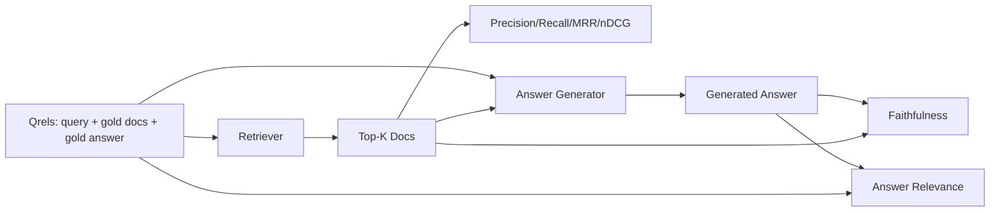

# Régulation de la RAC: taux d'exactitude, taux de recul, MRR, NDCG, fidélité, réponse

> Si vous ne pouvez pas évaluer simultanément la requête et la réponse, vous ne pouvez pas transporter le système.

**Type:** Build
**Languages:** Python
**Prerequisites:** 第11期第06课（RAG）、10（评估）；第 19 阶段 Track B 基础（第 20-29 课）；第 19 阶段课程 64, 65, 66, 67
**Time:** ~90 分钟

## Objectif de l'apprentissage
- Selon le Qrel de l'or, il existe quatre indicateurs de recherche: accuracy@k、recall@k、MRR(平均倒数排名) et nDCG@k。
- 计算两个答案等级指标: loyauté ()  ()  ()  ()  ()  ()  ()  ()  ()  ()  ()  ()  ()  ()  ()  ()  ()  ()  ()  ()  ()  ()  ()  ()  ()  ()  ()  ()  ()  ()  ()  ()  ()  ()  ()  ()  ()  ()  ()  ()  ()  ()  ()  ()  () )  ()  ()  ()  ()  ()  () )  ()  ()  ()
- Construire un fichier de calcul fixe 文件 (enquêtes, identifiants de documents d'or, réponses d'or) ]]
- 读取 Indicate value de l'emplacement de l'écart de la conduite de diagnostic: recherche, classement, production ou prise de terrain

##  problématique

Le système RAG a au moins quatre parties actives: le blocage, le référencement, le référencement, le générateur.

Utilisateur rapporté erreur réponse. Est-ce parce que le blocage a coupé la réponse dans la longueur? Est-ce parce que le référencement n'a pas mis la pièce dans le top-k ? Est-ce parce que le référencement a poussé la pièce correcte à la première place ? Est-ce parce que le générateur a ignoré la pièce et a créé le contenu ?

- 检索指标, utilisé pour évaluer les résultats du référencement.
- Pour la classification des indicateurs, l'évaluation de la position des blocs dans l'ordre est effectuée.
- 忠实地对生成器是否停留在检查到的上下文进行评测──
- La relation entre les réponses et les notes a-t-elle complètement résolu le problème ?

Ce cours est basé sur les six indicateurs de la formation. L'évaluation est hors ligne et déterminante.

## 概念



### 精度@k

Si l'or a 3 documents, et le top 3 retourne deux documents et un document erroné, alors la précision@3 est 2 / 3。 Lorsque le coût du bloc de recherche non lié est très élevé lorsque le générateur a gaspillé des jetons dessus, ou le bloc a détruit la réponse), veuillez utiliser l'exactitude。

### rappeler

Dans le dossier d'or, le top-k a pris combien de part ? Si l'or a 3 documents, et que le top-5 contient tous ces trois documents, alors rappelez-vous@5 pour 1.0。

Dans la production RAG, l'indicateur habituellement utilisé est recall@k. La production peut facilement supprimer des blocs non liés; elle ne peut pas émettre de réponse à partir de blocs qu'elle n'a jamais vus.

### Régime de la population

Pour chaque requête, trouvez la position du premier document pertinent dans la liste de classement. Le nombre de défauts de classement est de 1/ position. La valeur moyenne de l'ensemble du ensemble de requêtes.

REM pour la position 1 est très important. L'indicateur est principalement basé sur le top de la liste.

### nDCG@k

標準化贴现累积收益──: la formule complète pour chaque recherche de documents distribués augmente les bénéfices (habituellement 1 indique lié, 0 indique non lié), selon le nombre de paris de position, des réductions sont effectuées, et ensuite déduites par DCG idéal.

NDCG 适应分级相关性:黄金可以说文档 A 是 3,文档 B 是 2,文档 C 是 1──MRR 和recall@k 将所有内容平化为二进制──当语料库每查询有多部分相关文档时,请使用nDCG──

### 忠诚

Pour chaque déclaration de réponse générée, vérifier si le texte ci-dessus est à l'appui de cette déclaration.

La fidélité a saisi le mode de défaillance du générateur du contenu de l'élaboration du modèle. Même si le référentiel retourne le bon bloc, le générateur de l'élaboration de l'illusion se détériore également.

Ce cours, en utilisant une détermination simulée pour réaliser la fidélité, doit examiner si le jeton de chaque déclaration est conforme à la valeur de l'enregistrement.

### 答案相关性

La réponse à une question fidèle mais détournée est plus élevée dans la fidélité, moins élevée dans la relation. Une question courte, coupée, négligée dans la relation est plus élevée, mais moins élevée dans la fidélité. Les normes de mise en œuvre utilisent également le M pour juger:

## d'une valeur de 1 kg

```python
{
  "qid": "q1",
  "query": "what is the abort threshold for multipart uploads",
  "gold_doc_ids": ["d1", "d3"],
  "gold_answer_substring": "three failed parts",
  "graded_relevance": {"d1": 3, "d3": 2},
}
```

Chaque enquête est accompagnée de:
- - Je suis un homme.
- Une série d'identifiants de données (ID) utilisés pour l'identification de données (RDC)
- Pour les NDCG,
- 黄金答案字串( comme référence de chaque qrel de conservation de données; la fidélité dans ce cours est calculée en fonction du texte ci-dessus et non de cette phrase pour juger des déclarations extraites)

En production, vous pouvez effectuer ces événements. Ce cours fournit un fichier de construction manuelle, de sorte que l'évaluation peut être effectuée en un coup d'œil.


```figure
ci-rag-metric-ladder
```

## - Je le construis.

`code/main.py`实现:

- `precision_at_k(retrieved, gold, k)`- 字面定义──
- `recall_at_k(retrieved, gold, k)`- 字面定义──
- `mean_reciprocal_rank(retrieved_list_of_lists, gold_list)`- La valeur moyenne de la requête:
- `ndcg_at_k(retrieved, graded_relevance, k)`- DCG/IDCG  ayant un effet secondaire ou un effet secondaire
- `extract_claims(answer)`- Répondre à la question en une phrase de forme de sujet
- `faithfulness(claims, context_texts, judge)`- partie de la demande de soutien déterminée
- `answer_relevance(question, answer, judge)`- 判断答案是否解决问题──
- `MockJudge`- la détermination des indicateurs de mise en place de jugements afin d'évaluer la mise en œuvre de ces derniers.
- `evaluate_pipeline(pipeline_fn, qrels, ks)`- 运行每个指标的协调器──
-  pour le Qrel 运行三种管道变体(分块基线、混合检索、混合 + 重新排名) et imprimer la présentation de l'indice de répartition

Je vais le faire.

```bash
python3 code/main.py
```

输出显示单指标中每个变体的精度@k、recall@k、MRR、nDCG@k、忠诚度和答案相关性──混合检索行在召回方面击败分块器基线;重新排序在MRR上击败混合行──

## 读取标志来诊断故障

|症状|可能的原因 |修复什么问题 |
|---------|-------------|-------------|
|低召回率@k，低精度@k |分块剪切答案或检索器找不到它 |分块边界（第 64 课）或检索器模态（第 65 课） |
|不错的召回率@k，低 MRR |右块位于 top-k 中但不在位置 1 |重新排序（第 66 课）|
|高MRR，低忠诚度|尽管上下文正确，生成器仍然发明内容 |生成提示；强制引用或拒绝 |
|忠诚度高，相关性低 |答案有根据但偏离主题 |查询重写器（第 67 课）或生成提示 |
|均四高，用户仍抱怨|评估集不具有代表性 |使用真实用户查询扩展 qrels |

## 演示将隐藏的故障模式

**LLM-as-judge 偏差。**Le modèle juge sa propre sortie, et souvent considère qu'il est plus fidèle que la situation réelle.

**Qrel 腐烂。** Avec le changement de la base de langage, la réponse d'or va également changer

**忠诚度微观检查错过了宏观声明。**La fidélité de chaque phrase peut être approuvée, tandis que la structure de l'ensemble de la réponse génère des erreurs.

**Recall@k 掩盖了每个查询的失败。**Le taux moyen de retrait de 90% peut être caché dans une enquête classique, généralement dans une situation de perte.

## Utilisez-le

Mode de production:

- Pour chaque testeur ou générateur de changements de fonctionnement évaluation.
- Gardez un indice de suivi de chaque requête. Lorsque les utilisateurs se plaignent, recherchez des articles correspondants, voyez s'ils seront capturés.
- Pour les projets de répartition: 20 enquêtes de fumée menées au sein de l' CI; 200 enquêtes de retour menées par nuit; 2000 enquêtes menées par semaine.

## 发货

Section 69                                                                                                                                                                                                                                                                                                                                                                                                                                                                                                                            

## 练习

1. 添加第五个检索指标:hit-rate@k。将其与recall@k 进行比较──当它们不同时进行解释──
2. 实行分级忠诚度:0(不支持) 、1(部分支持) 、2(完全支持) ∼相应地更新指标──
3. Utiliser le modèle réel pour remplacer le modèle pour juger.
4. 添加查询类片(字面、释义、多主题) 报告──每片标──
5. 添加答案长度标标并将其与忠诚度相关联── 绘曲线──

## 关键术语

|术语 |人们怎么说|它实际上意味着什么 |
|------|-----------------|------------------------|
|精度@k | “命中率超过检索” | top-k 中黄金的比例 |
|recall@k | “命中了 gold 吗”| top-k 中包含 gold chunk 的比例 |
| MRR | “第一击位置”| 1 的平均值/第一个相关文档的排名 |
| nDCG@k | “分级排名质量”| top-k 上的 DCG 除以理想 DCG |
|诚信| “接地气” |检索到的上下文支持的答案声明的比例 |
|答案相关性 | “它解决了这个问题吗？” |答案是否符合问题的意图 |
|问题 | “金标”|带标签的查询集及其黄金文档和答案 |

##  ultérieur

- Buckley, Voorhees, évaluation évaluation de la stabilité de la mesure,SIGIR 2000 - 关于排名指标的规范论文
- Jarvelin、Kekalainen,IR 技术的基于累积增益的评估 - nDCG 论文
- [Ragas：RAG 管道的自动评估](https://docs.ragas.io)
- [人择，评估 RAG](https://www.anthropic.com/news/evaluating-rag)
- 第 11 阶段 第 10 课 - 评估框架基础
- 第19 阶段 cours 64-67 - Évaluation des éléments
- Section 19 阶段 第 69 课 - 本次评估评分的端到端管道
