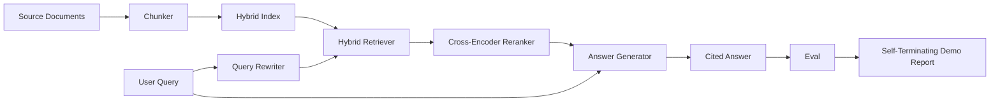

# Réglage de la répartition des données

> Un cycle d'évaluation, une démonstration d'arrêt automatique, c'est le système de livraison.

**Type:** Build
**Languages:** Python
**Prerequisites:** 第11期第06课（RAG）、10（评估）；第 19 阶段 Track B 基础（第 20-29 课）；第 19 阶段课程 64, 65, 66, 67, 68
**Time:** ~90 分钟

## Objectif de l'apprentissage
- Les systèmes de répartition de blocs, de référencement mixte, de réécriture de requêtes, de ré-arrangement et de génération de réponses sont composés d'un seul tube de bout en bout.
- 实现一个答案生成器,通过块点引用其声明,并具有低信任拒绝回退功能──
-  évaluation de la 68e classe du fonctionnement des tuyaux bien assemblés et démonstration de la qualité des étapes de construction sur chaque indicateur par rapport à la même composante individuelle 
- Construire une présentation CLI de finition automatique, qui capture une base de données fixes, exécute un ensemble de requêtes fixes et renvoie le rapport de résumé à zéro.

##  problématique

Les six composants isolés ne peuvent pas prouver quoi que ce soit. Les répertoires peuvent être utilisés dans le recall@5 mais ne réussissent pas dans le recall@5 du système, car les répertoires ne peuvent pas classer le contenu des répertoires. Les répertoires peuvent augmenter le MRR du groupe de candidats, mais ne peuvent pas traiter les vrais candidats du double éditeur, car le taux de répertoires des répertoires est trop faible. Les répertoires peuvent augmenter le dossier d'or sur une seule requête et être interrompus sur la requête suivante, car les LLM s'adaptent à l'hypothèse de retour à la régénération.

Le test d'intégration est un test de l'ensemble du tuyau pour le même fichier qui fonctionne de bout en bout, avec le même indicateur, et utilise un fichier d'édition qui reliera tout le contenu ensemble. C'est le contenu de ce cours. Si l'indicateur du tuyau d'intégration est supérieur à l'indicateur de la démonstration indépendante de chaque étape, vous avez prouvé le système.

## 概念



### 接线选择

Le tube est un petit diagramme. Chaque étape est une fonction avec une signature claire.

|舞台|输入|输出|
|-------|-------|--------|
|块块|文档正文 |块记录列表 |
|检索器 |查询字符串 | Top-N chunk 记录 |
|重写器（可选）|查询字符串 |重写列表+假设|
|重新排序 |查询，候选人 |带有交叉分数的 Top-K 块记录 |
|发电机|查询，top-K Chunk 记录 |带有引文的答案字符串 |

Quand chaque signature est stable, le composé est très simple.`Pipeline`Les classes comprennent cinq étapes et fonctionnent dans l'ordre.`query`方法── chaque étape est échangeable: transmettre différents blocs, contrôles, réécrivains, réécritures ou générateurs, les tuyaux peuvent encore fonctionner──

### générateur de réponses

Le générateur de l'électricité est le dernier et le plus facile à détériorer.

1. 取出前 K 个重新排序的块──
2. Le plus sélectionné de deux textes contient le plus haut niveau de contenu de jeton de la requête.
3. Envoyer une réponse, cette réponse est la liaison d'une phrase dans chaque bloc sélectionné, chaque phrase après une autre.`[doc_id:chunk_index]`Je suis là.
4. Si aucun bloc ne se compose plus que la valeur de rejet, alors émettez 我不知道且不带引用

En production, vous pouvez utiliser le modèle de suggestion qui sera simulé pour remplacer par un vrai LLM:

```text
You are answering a question using only the snippets below.
Cite every claim with the anchor in parentheses.
If the snippets do not answer the question, say "I do not know".

Question: {query}

Snippets:
{enumerated chunks with anchors}

Answer:
```

Le processus de rejet de la confiance est la cause complète de la classification des éditeurs de l'enregistrement à travers le codeur. Si elle est inférieure à la valeur de la base de données, le générateur le refusera.

### Depuis le début de l'exposition

La présentation imprime chaque étape de la requête, chaque étape de la mise en œuvre, sur quatre critères fixes d'évaluation de la mise en œuvre, imprime un indice, si tous les indices de la section 68 répondent à la valeur définie dans la présentation, alors il sort à l'état de zéro. Si un indice est inférieur à la valeur de zéro, la présentation sort et affiche un état non zéro, et affiche une information, indiquant des indices de défaillance.

C'est la forme de test de CI 冒烟. Le cours de la pipe de fonctionnement 快速 确定 值 de la fixation est intentionnellement strict, de sorte que le retour de n'importe quelle classe dans le cours de six épisodes entraînera l'échec de la démonstration.


```figure
rag-pipeline-flow
```

## - Je le construis.

`code/main.py`实现:

- `Chunk`- 贯穿所有阶段的记录 (en anglais seulement)
- `Chunker`- de la 64e classe 课中选择策略 ():
- `HybridIndex`- 捆绑 BM25 + 密集 + RRF depuis le 65ème cours
- `Rewriter`(可选) - Selon la longueur et la connexion des mots de la question, choisir HyDE 多查询 分解之一从第67 课中
- `Reranker`- 第66 课时训练过交叉编码器, utilisant un ensemble de formation plus petit, afin de pouvoir recevoir en quelques secondes.
- `Generator`- générateur de modèles de certitude avec référence et faible confiance
- `Pipeline`- Utilisez le retour`Result(answer, top_k, latency_ms_per_stage)``query(question)`方法组成五个阶段──
- `run_demo()`- 摄取语料库,运行三个 fixture 查询,运行评估,印结果,并按值设置退出代码──

Je vais le faire.

```bash
python3 code/main.py
```

输出 is a section of printed query trace、 complet evaluation表和最终通过/失败状态──在默认 fixture上返回退出代码 0──

## 演示将隐藏的故障模式

**分块器边界漂移。**Si vous échangez une stratégie de blocage entre le processus d'évaluation et la présentation, l'ID du document d'or ne sera pas réélu.

**Reranker 训练集泄漏到 eval 中。**Les 14 groupes de formation de la classe 66 comprennent des questions similaires à celles d'évaluation.

**模拟生成器隐藏了幻觉风险。**Le modèle ne peut pas produire de phénomène, car il ne sort que du bloc de recherche à celui de production.

**无流式传输。**Le tube à la fin de chaque étape revient à la réponse complète. Le système de production va transmettre les sorties des électrolytes.

**延迟是离线的。**模拟LLM 调用是恒定时间──真正LLM电话占主导地位──在请求范围内规划延迟预算;本课程的每阶段计时时仅测量CPU工作──

## Utilisez-le

Mode de production:

- Envoyer les fichiers du tuyau à un ordinateur avec une interface de phase spécifique.
- Dans chaque phase concernée, l'évaluation est effectuée avant la mise en œuvre. Si l'évaluation diminue, la mise en œuvre ne se fera pas.
- Gardez un suivi des indicateurs de chaque opération CI, afin que vous puissiez revenir en fonction des étapes de l'échange.
- 添加 20 查询的烟雾集(回归集的子集),运行时间不超过30秒;完整的回归集每晚运行──

## 发货

Le document de conduite de ce cours est la forme adoptée par le reste du cours de la 19e phase de la piste F. Le cours suivant sera complété par l'automatisation de la prise de vue, la réindexation des volumes, la remise en route et le niveau de service supérieur.

## 练习

1. Dans le réécrivain, ajoutez chaque enquête stratégie sélectionneur:
2. Env 标志后面添加对生成器的真正 LLM 调用──默认为模拟──测量延迟增量──
3.  Extension de la présentation pour obtenir des charges de vrais matériels de`--corpus path`标志──重新运行评估和值检查──
4. À la partie de l' appareil`--strategy`标志── Mesurer la contribution de chaque stratégie au rappel de bout en bout──
5. L'interface du générateur de flux est introduite dans l'évaluation.

## 关键术语

|术语 |人们怎么说|它实际上意味着什么 |
|------|-----------------|------------------------|
|管道| “RAG 管道”|从摄取到引用答案的撰写阶段|
|引文锚| “来源链接” |每个声明附加的 (doc_id, chunk_index) 引用 |
|低置信度拒答| “我不知道” |当重排器 top-1 分数低于阈值时，生成器不返回答案 |
|smoke set | “CI 评估”|每次 PR 检查中运行的最小 qrels 子集 |
|阶段接口| “函数签名”|各个管道阶段的稳定输入输出类型 |

##  ultérieur

- [人择、建筑搜索与检索](https://www.anthropic.com/news/contextual-retrieval)
- [Pinterest，MCP 内部搜索](https://medium.com/pinterest-engineering)- 参考生产架构
- [Ragas：RAG 管道的自动评估](https://docs.ragas.io)
- 第 11 阶段 第 06 课 - RAG 基础知识
- Section 19 - Les éléments constitutifs du programme 64-68
