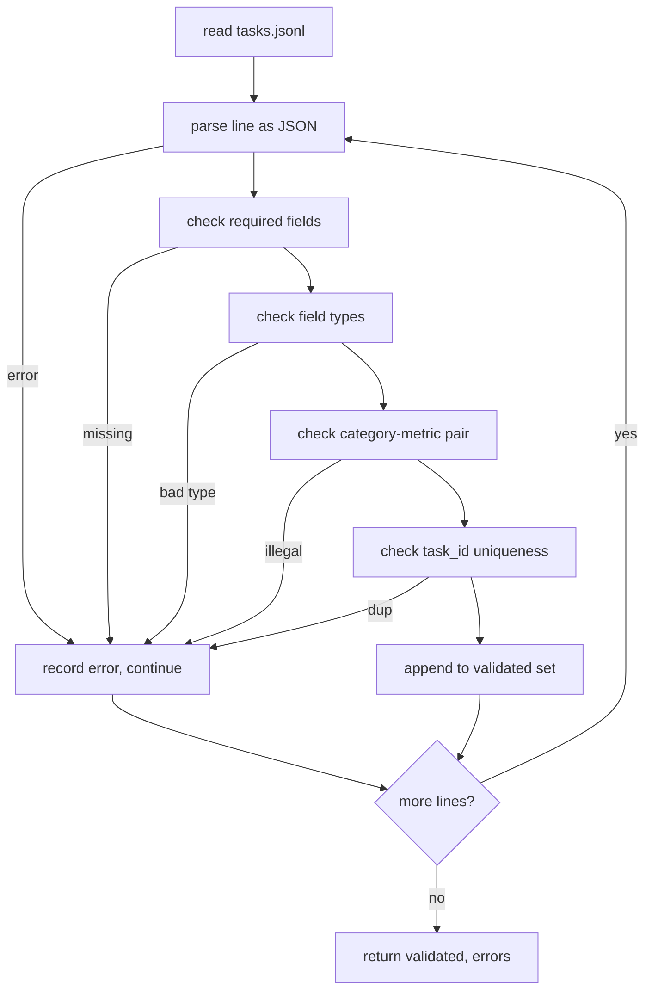

# 任务规范格式

> 评估安全带的好坏取决于其任务执行的合同―― 在编写单个评分函数之前,请结结 JSONL 形状和量词汇――

**Type:** Build
**Languages:** Python
**Prerequisites:** 19期B轨地基
**Time:** ~90 分钟

## Objectif de l'apprentissage


```figure
ci-task-spec-gate
```

- définir un modèle de registre des tâches JSONL, sous une forme qui comprend les calculs, les choix, les codes d'exécution, les classes et le résumé de texte libre.
- 固定量名称的封闭词汇表, afin que le cours de la formation (71-73) puisse être divisé en un seul passage.
- En effet, les exemples et les règles de traitement post-exemple sont déterminés comme faisant partie de la tâche, et non comme faisant partie du coureur, de sorte que les mêmes suggestions génèrent le même objectif entre les modèles.
- ¢ Implementer un vérificateur strict, avant que les enregistrements d'erreur de format ne soient arrivés à l'opérateur, il les rejettera¬­t.
- Publier un ensemble de fichiers contenant 10 tâches, pour chaque branche de la norme de test, afin que le testateur ait quelque chose de réel à faire.

## Pourquoi faire une conclusion ?

Le processus de réparation de la mise en œuvre de la mise en œuvre de la mise en œuvre de la mise en œuvre de la mise en œuvre de la mise en œuvre de la mise en œuvre de la mise en œuvre de la mise en œuvre de la mise en œuvre de la mise en œuvre de la mise en œuvre de la mise en œuvre de la mise en œuvre de la mise en œuvre de la mise en œuvre de la mise en œuvre de la mise en œuvre de la mise en œuvre de la mise en œuvre de la mise en œuvre de la mise en œuvre de la mise en œuvre de la mise en œuvre de la mise en œuvre de la mise en œuvre de la mise en œuvre de la mise en œuvre de la mise en œuvre de la mise en œuvre de la mise en œuvre de la mise en œuvre de la mise en œuvre de la mise en œuvre de la mise en œuvre de la mise en œuvre de la mise en œuvre de la mise en œuvre de la mise en œuvre de la mise en œuvre de la mise en œuvre de la mise en œuvre de la mise en œuvre de la mise en œuvre de la mise en œuvre de la mise en œuvre de la mise en œuvre de la mise en œuvre de la mise en œuvre de la mise en œuvre de la mise en œuvre de la mise en œuvre de la mise en œuvre de la mise en œuvre de la mise en œuvre de la mise en œuvre de la mise en œuvre de la mise en œuvre de la mise en œuvre de la mise en œuvre de la mise en œuvre de la mise en œuvre de la mise en œuvre de la mise en œuvre de la mise en œuvre de la mise en œuvre de la mise en œuvre de la mise en œuvre de la mise en œuvre de la mise en œuvre de la mise en œuvre de la mise en œuvre du mise en œuvre du mise en œuvre du mise en œuvre du mise en œuvre du mise en œuvre du mise en œuvre du mise en œuvre du mise en œuvre du mise en œuvre du mise en œuvre du mise en œuvre du mise en œuvre du mise en œuvre du mise en œuvre du du du du du du du du du du du du du du du du du du du du du du du du du du du du du du du du du du du du du du du du du du du du du du du du du du du du du du du du du du du du du du du du du du du du du du du du du du du du du du du du du du du du du du du du

Cette forme prend en compte l'idée de BIG-bench、HELM 和 lm-eval 风格线束, mais le titre de chaque section est ours。 chaque section a un propriétaire。 runner read tasks。

## 记录形状

任务是单行上的 JSON对象──线束读取 `tasks.jsonl`Il est vrai que les mauvaises lignes arrêtent le record, et non le fonctionnement.

```json
{
  "task_id": "arith_001",
  "category": "arithmetic",
  "prompt": "Compute the result. Question: 17 + 24\nAnswer:",
  "targets": ["41"],
  "metric_name": "exact_match",
  "few_shot_examples": [
    {"prompt": "Question: 2 + 2\nAnswer:", "completion": "4"}
  ],
  "post_process": "strip_whitespace",
  "metadata": {"difficulty": "easy"}
}
```

Il faut le remplir`task_id`- Je suis là.`category`- Je suis là.`prompt`- Je suis là.`targets`- Je suis là.`metric_name`- Je suis là.`post_process`Je suis là.`few_shot_examples`et `metadata`Il est possible de faire des choix.

## 字段规则

`task_id`C'est une chaîne de caractères sans espace. Le vérificateur oblige à la uniformité de l'ensemble du fichier.

`category`Oui `arithmetic`- Je suis là.`mcq`- Je suis là.`code_exec`- Je suis là.`classification`- Je suis là.`summary`L'un des critères de la catégorie est de limiter la mesure et le traitement postérieur à la loi.`code_exec`任务 doit être utilisé `metric_name = code_exec`- Je suis désolé .`mcq`任务 doit être utilisé `metric_name = exact_match`Il y a une autre.

`prompt`Il est un fil non vide. Le testateur interdit le rattrapage du vide et refuse de lui donner des informations sur le contenu de quelques blocs de l'image.

`targets`C'est une liste de caractères non vides.`exact_match`Tout élément correspondant est pris en compte.`f1`和`rouge_l`, le score le plus élevé de l'objectif de la victoire.`mcq`, la liste ne contient qu'un seul élément:

`metric_name`Oui `exact_match`- Je suis là.`f1`- Je suis là.`bleu_4`- Je suis là.`rouge_l`- Je suis là.`accuracy`- Je suis là.`code_exec`L'un de ses mots est "closed".

`few_shot_examples`Oui `{prompt, completion}`Pour les listes de contrôle, le testateur limitera la liste à huit articles, pour limiter les suggestions.

`post_process`Oui `none`- Je suis là.`strip_whitespace`- Je suis là.`lower`- Je suis là.`extract_letter`- Je suis là.`extract_code_block`- Je suis là.`extract_first_line`L'un des règlements a un comportement déterminant.

## 验证器 comportement



Le vérificateur retourne à deux listes: déjà vérifié et erreur enregistrée, qui contiennent des infractions à la réglementation, des infractions à la réglementation et des erreurs.`--allow-bad-tasks`Le signe.

## La couleur

Le coureur vous indiquera quelques exemples précédents liés à des segments de fil à vide. Chaque modèle fonctionne sur le même chemin de code, de sorte que la seule différence est la source du modèle lui-même.

```python
def render(task):
    parts = []
    for ex in task.get("few_shot_examples", []):
        parts.append(ex["prompt"] + " " + ex["completion"])
    parts.append(task["prompt"])
    return "\n\n".join(parts)
```

## 后处理规则

后处理步骤在生成后、指标之前运行── c'est une définition et un état.

- `none`返回字符串不变──
- `strip_whitespace`Pour le décomposer, il faut le faire.
- `lower`Je suis un petit garçon.
- `extract_letter`返回与 `[A-E]`匹配的第一个字符, utilisé dans le MCQ.
- `extract_code_block`Retour à la première résolution de l'objet de bloc d'isolement, utilisé pour l'exécution du code.
- `extract_first_line`Retour à la première ligne non vacante, utilisée pour le cours de l'année.

Les tâches de la règle qui sont en dehors de cette liste appartiennent à la nouvelle classe.

## 本课不做什么

Il ne doit pas comprendre. Il ne doit pas modifier le modèle. Il ne fonctionne pas avec le code.

10 个任务 fixture 覆盖两个算术项,两个 MCQ项,两个代码执行项,两个分类项和两个摘要项, 验证器通过所有10条规则, 两个 MCQ项, 两个代码执行项, 两个分类项和两个摘要项, 两个摘要项, 两个摘要项, 两个代码执行项, 两个代码执行项, 两个代码执行项, 两个摘要项, 两个摘要项, 两个摘要项, 两个摘要项, 两个摘要项, 两个个单独的 fixture (`tasks_bad.jsonl`) sera touché par chaque règle, et le nombre d'erreurs que le vérificateur renvoie correspondra exactement à ces erreurs.

## Comment lire la code

`main.py` définit `TaskSpec`- Je suis là.`validate_task`- Je suis là.`validate_file`Et le CLI est un point d'entrée.`load_fixtures`染和后处理助手 位于 à côté de la logique de vérification, donc le coureur de la 75e classe doit seulement importer un seul module

De haut en bas`main.py`然后读取 `code/tests/test_spec.py` Les tests fixeront chaque règle de test et chaque comportement de traitement ultérieurement.`main.py`Le fichier de la section de base est lié à l'exposition et est imprimé en résumé.

## Plus loin

Les méthodes d'évaluation réelles sont de façon à augmenter les classes de manière à augmenter les classes de manière modélisée. La décision de réveil consiste à refuser d'ajouter des classes sans ajouter des indicateurs.
