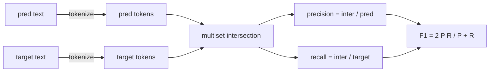
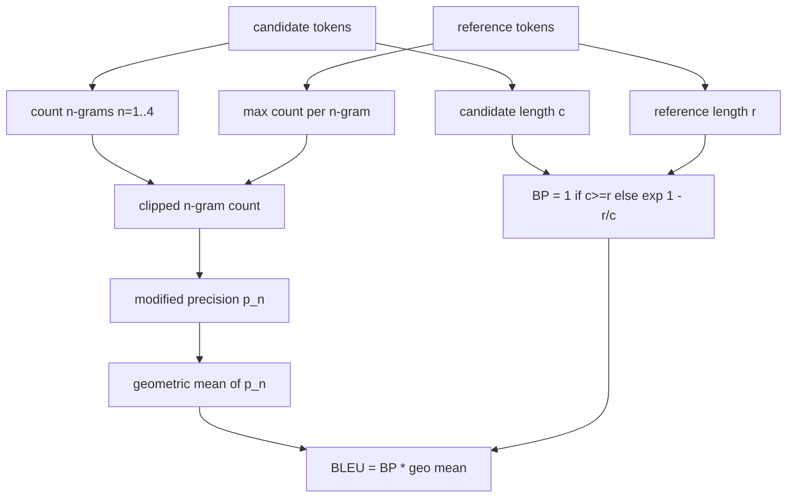

# 经典指标

> BLEU、ROUGE-L、F1、精确匹配、准确率──五个指标仍然占据了大多数已发布的LLM 评估数字──从第一性原理实现每个指标,这样你才知道数字的含义──

**Type:** Build
**Languages:** Python
**Prerequisites:** 第 19 期 Track B 基础，第 70 课
**Time:** ~90 分钟

## Objectif de l'apprentissage


```figure
cd-bleu-overlap
```

- 通过明确的代币化规则实现代币级精确匹配、F1 和准确性──
- Dès le début  Implementation BLEU-4: Modification n de l'exactitude de l'expression, n de la moyenne géométrique égale à 1 à 4,
- Utilisation de la plus longue séquence publique et des composés F-beta de précision et de récurrence pour réaliser ROUGE-L.
- 调度第 70 课中的 metric_name 字段, afin que le coureur puisse maintenir son état de non-identifiant.
- Utilisation de données de référence tirées de la bibliothèque de tiers pour fixer les comportements à partir d'exemples de travail et non pas de données de référence.

## Pourquoi la réécrire ?

Vous allez lire les articles de BLEU 28.3 et d'un autre article de BLEU 0.283 . Vous trouverez une différence de 10 points entre les deux livres de ROUGE-L, car un livre est coupé pour écrire en petits morceaux, tandis que l'autre livre ne le fait pas. La méthode la plus rapide de stop-mixing est de se rédiger un indicateur, puis de se diriger vers la ligne et l'application de l'appareil de détermination.

Le plus difficile est de choisir des jetons et de s'y concentrer.

## synonymisation

Le mot est `re.findall(r"\w+", text.lower())`◊小写、字母数字运行、删除标点符号── dans ce cours, chaque indicateur utilise cet égal分词器── courant n'a pas le droit de choisir── si vous échangez des mots, vous effectuerez différents tests de base──

```python
TOKEN_RE = re.compile(r"\w+", re.UNICODE)
def tokenize(text):
    return TOKEN_RE.findall(text.lower())
```

C'est une simplification intentionnelle. La configuration de production sera centrée sur le CJK, l'abréviation et l'identifiant de code.

##  精确匹配

```python
def exact_match(pred, targets):
    return float(any(pred.strip() == t.strip() for t in targets))
```

Chaque tâche retourne à 1,0 ou 0,0[6]. L'agglomération du ensemble de données est la valeur moyenne[6].

## étiquette F1

Settings pour prévoir et objectif de plusieurs clusters de jetons ⋅ précision est un cluster de plusieurs clusters de clusters de clusters de clusters de clusters de clusters de clusters de clusters de clusters de clusters de clusters de clusters de clusters de clusters de clusters de clusters de clusters de clusters de clusters de clusters de clusters de clusters de clusters de clusters de clusters de clusters de clusters de clusters de clusters de clusters de clusters de clusters de clusters de clusters de clusters de clusters de clusters de clusters de clusters de clusters de clusters de clusters de clusters de clusters de clusters de clusters de clusters de clusters de clusters de clusters de clusters de clusters de clusters de clusters de clusters de clusters de clusters de clusters de clusters de clusters de clusters de clusters de clusters de clusters de clusters de clusters de clusters de clusters de clusters de clusters de clusters de clusters de clusters de clusters de clusters de clusters de clusters de clusters de clusters de clusters de clusters de clusters de clusters de clusters de clusters de clusters de clusters de clusters de clusters de clusters de clusters de clusters de clusters de clusters de clusters de clusters de clusters de clusters de clusters de clusters de clusters de clusters de clusters de clusters de clusters de clusters de clusters de clusters de clusters de clusters de clusters de clusters de clusters de clusters de clusters de clusters de clusters de clusters de clusters de clusters de clus



Pour les tâches à plusieurs objectifs, nous avons choisi la meilleure F1 dans la liste des objectifs. Ceci est en accord avec le comportement du SQuAD rapporté dans la littérature.

## Le projet de loi

BLEU est un indicateur de traduction automatique de la norme, il est toujours présent dans le travail de résumé. La formule que nous utilisons est BLEU-4, de la classe de base de mots, avec un système de punition standard et un système de calcul de n'anciennes langues modifiées pour une augmentation de la valeur de l'équivalent, de sorte que les 4 langues qui manquent ne seront pas réduites à zéro.

Pour chaque candidat-référencement, nous avons calculé l'exactitude de n n n équivaut à 1、2、3、4 heures de modification. La précision de n équivaut à n équivaut à n équivaut à n équivaut à n équivaut à n équivaut à n équivaut à n équivaut à n équivaut à n équivaut à n équivaut à n équivaut à n équivaut à n équivaut à n équivaut à n équivaut à n équivaut à n équivaut à n équivaut à n équivaut à n équivaut à n équivaut à n équivaut à n équivaut à n équivaut à n équivaut à n équivaut à n équivaut à n équivaut à n équivaut à n équivaut à n équivaut à n équivaut à n équivaut à n équivaut à n équivaut à n équivaut à n équivaut à n équivaut à n équivaut à n équivaut à n équivaut à n équivaut à n équiva.



La règle de l'épargne est la méthode de Lin 和 Och: avant de prendre le nombre, chaque n élément de la molécule et de la fraction d'épargne est ajouté à 1 ⋅ lorsque le nombre de 4 grammes ne correspond pas et reste proche de la valeur de l'épargne du long, cela peut être évité.`log 0`Il y a une autre.

## 脂-L

ROUGE-L comparer la séquence de symboles de candidature et la plus longue sous-série publique de la séquence de symboles de référence. LCS  Capture de mots sans forcer la continuité, c'est pourquoi il est la quantité de résumé par défaut.`lcs / reference length`, pour l' épreuve`lcs / candidate length`,并与F-beta 结合, dont le titre F1 形式的β等于 1──

```python
def lcs_length(a, b):
    n, m = len(a), len(b)
    dp = numpy.zeros((n + 1, m + 1), dtype=int)
    for i in range(n):
        for j in range(m):
            if a[i] == b[j]:
                dp[i+1, j+1] = dp[i, j] + 1
            else:
                dp[i+1, j+1] = max(dp[i+1, j], dp[i, j+1])
    return int(dp[n, m])
```

Numpy 表使实现清晰易读; Pure Python 列表也可以工作──选择 ROUGE-L 的任务为每个任务支付 O(n m) 成本──对于保持在毫秒以下的典型摘要长度──

## 准确度

 Pour les tâches de classe multi-objectifs, la précision est réduite à une correspondance précise avec les objectifs de normalisation uniques.`metric_name`Il n'y a pas besoin de faire des comparaisons en ligne.

## 派遣合同

单一入口点是 `score(metric_name, prediction, targets)`Il revient.`[0, 1]`Le nombre de points de sortie intermédiaire. Le coureur ne se partagera pas selon le nom de l'indicateur. Il se transférera à l'appel et écrira le résultat.

```python
def score(metric_name, pred, targets):
    if metric_name == "exact_match":
        return exact_match(pred, targets)
    if metric_name == "f1":
        return max(f1_score(pred, t) for t in targets)
    if metric_name == "bleu_4":
        return max(bleu4(pred, t) for t in targets)
    if metric_name == "rouge_l":
        return max(rouge_l(pred, t) for t in targets)
    if metric_name == "accuracy":
        return accuracy(pred, targets)
    raise ValueError(f"unknown metric_name: {metric_name}")
```

`code_exec`Dans la 72e classe, il est traité et intégré dans le processus de régulation.

## 本课不做什么

Il ne réalise pas de modèles. Il n'a pas fait passer la normalisation au-delà de la portée de la règle de traitement post 70 de la classe. Il ne compte pas la confiance entre les classes. Il ne réalise pas de BLEURT ou de BERTScore.

## Comment lire la code

`main.py`Définir chaque indicateur comme une fonction libre plus un programme de régulation.`_reference_examples`块中── Cette présentation s'adresse à huit exemples de processus de régularisation de la fonctionnement et imprime le nombre de points de chaque indicateur──`code/tests/test_metrics.py`Le test de référence fixe et le test de référence fixe et le test de référence fixe et le test de référence fixe et le test de référence fixe et le test de référence fixe et le test de référence fixe et le test de référence fixe et le test de référence fixe et le test de référence fixe et le test de référence fixe et le test de référence fixe et le test de référence fixe et le test de référence fixe et le test de référence fixe et le test de référence fixe et le test de référence fixe et le test de référence fixe et le test de référence ().

De haut en bas`main.py` Ces fonctions sont classées selon leur complexité.

## Plus loin

Les indicateurs classiques sont nécessaires, mais ils ne suffisent pas. Ils récompensent la superficielle superposition et négligent le sens. Une fois que vous avez confiance en la base classique, la solution est de baser l'indicateur sur le modèle.
