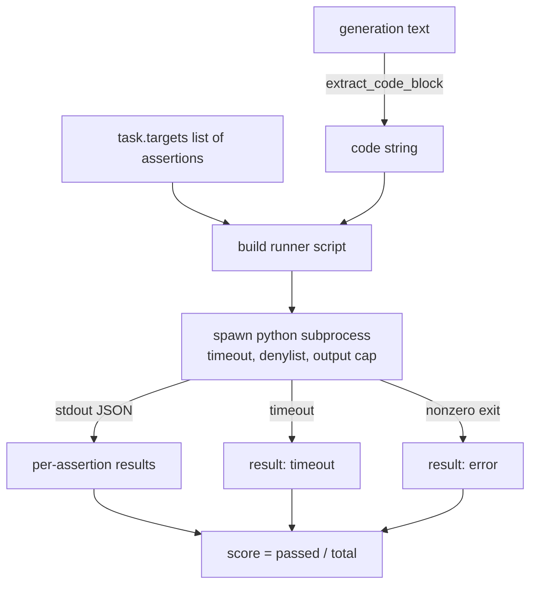
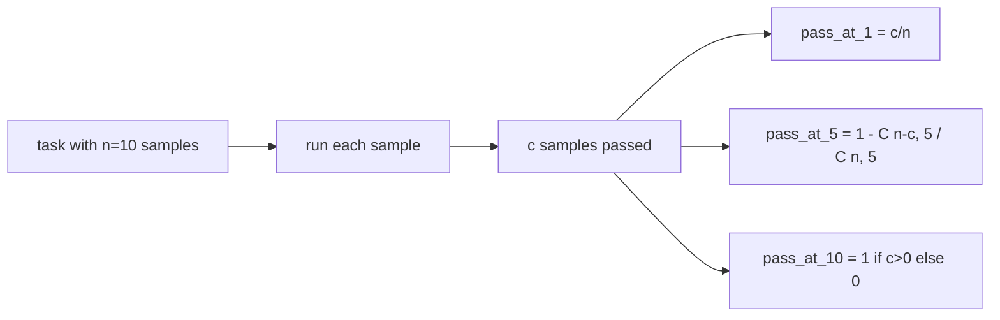

# 代码 exécuter

> Le code de production est correct après le test. L'outil d'évaluation doit extraire le code, le faire fonctionner en cas d'effondrement du système principal.

**Type:** Build
**Languages:** Python
**Prerequisites:** 第 19 期 Track B 基础，第 70 和 71 课
**Time:** ~90 分钟

## Objectif de l'apprentissage


```figure
sandbox-runner
```

- Le code est généré à partir de blocs de code de la libérité de format.
- En cours de processus d'isolement de la liste de rejet de sortie et d'importation, il est possible d'exécuter le code de candidature.
-  Évaluation des tâches en fonction du nombre de candidats passés par la liste des affirmations fournies 
- 计算从一个模型进行多代采用任务的通过-at-k――
- L'échec de la boîte de réception, les erreurs de langage et les erreurs de l'heure sont considérés comme un mode de défaite de première classe, et le coureur a des codes de sortie différents à enregistrer.

## Pourquoi un processus isolé est nécessaire ?

En-tête`exec`Il existe des risques de sécurité et de stabilité.`while True: pass`永远阻止 eval──生成的 `import shutil; shutil.rmtree('/')`确实像听起来如灾难性──解决方法是为每个候选人生成一个新的 Python 解释器,在 stdin 上传递代码,将断言结果写入 stdout,并在溢出时终止这个进程──主机 eval 进程继续运行──

HumanEval、MBPP、BigCodeBench 和 LiveCodeBench etc. Les véritables évaluations utilisent des processus sous-jacents. Certaines niveaux de Docker sont situés en haut. Nous sommes en retard sur le processus sous-jacente pour une raison: il est portable, il est stdlib, et il a capturé des défauts de mode essentiels à l'évaluation de l'éducation. La production déployée a ajouté un système de séquence, de séparation de réseau et de système de lecture-du papier.

## 代码 执行任务的形状 代码 执行任务的形状 代码 执行任务的形状

`code_exec`任务携带 `targets`Le constructeur de code extrait le bloc de code séparé de la génération, le contourne pour construire un outil de test, puis le produit est utilisé.



Le nombre est`[0, 1]`Le nombre moyen de frais. Il possède trois tâches, dont deux passent à 0,667. Quoi qu'il arrive, le coureur revient dans la même forme: le processus de l'effondrement est mappé au code standardisé d'erreur, plutôt que le Python de retour.

## 拒绝名单

 la liste de rejet est basée sur l'importation  avant la mise en œuvre du code de candidature, le scénario de course réécrira l'importation du module de risque à l'origine `ImportError("denied")`La liste est conservée:`os.system`- Je suis là.`subprocess`- Je suis là.`socket`- Je suis là.`requests`- Je suis là.`urllib`- Je suis là.`urllib.request`- Je suis là.`urllib.error`- Je suis là.`urllib.parse`- Je suis là.`ctypes`- Je suis là.`shutil`- Je suis désolé.`http.client`- Je suis là.`asyncio.subprocess`Il y a une autre.

Nous ne prétendons pas que c'est un code de résistance définie qui peut échapper à tout processus de Python.

```python
DENIED = {
    "os.system": True,
    "subprocess": True,
    "socket": True,
    "shutil": True,
    "requests": True,
    "urllib": True,
    "ctypes": True,
}
```

Nous sommes passés en avant.`import sys`Et un autre réparateur`os.system`Le débat a été lancé par le président de la République.`main.py`Dans le centre.

## 挂钟超时

Chaque processus a un budget par défaut de trois heures de seconde.`subprocess.run(..., timeout=t)`Si c'est trop, le coureur sera pris.`TimeoutExpired`, Terminer le processus, et enregistrer les tâches `timeout`退出原因──这个任务分数为零──跑步者继续进──

Chaque mission est superposée .`task.metadata.timeout_s`进行配置── un test en unité de longue durée peut exiger davantage; le testateur de la classe 70 sera limité à 30 secondes, afin de maintenir la limite du ensemble──

##  输出上限

Le processus peut être inondé standard output, consommer tout le temps nécessaire à la mise en cache.`exit_code = error`, détails de l'information`"output overflow"` lorsque la génération ne s'est pas soucie d'écrire un cycle sans fin imprimé, cela apparaît en pratique

## - Je suis là.

Pass-at-k est un instrument d'estimation sans préjugé utilisé par les humains et les amis pour déterminer chaque tâche.`n`独立样本和其中的 `c`- Je suis là.`n`De la taille`k`Le modèle contient au moins une solution de probabilité:

```text
pass_at_k(n, c, k) = 1 - C(n - c, k) / C(n, k)
```

- Je suis là .`n - c < k`时, molécules non définies, valeur `1`◊ La situation de traitement des frontières doit être réalisée directement.`pass_at_k(n, c, k)`供排行层使用──



## 退出代码

Le coureur revient sur cinq résultats de chaque mission:

- Quand chaque mot passe par le temps`pass`Il y a une autre.
- `assertion_fail`Le code fonctionne, mais au moins une affirmation échoue.
- `syntax_error`Lorsque le code n'est pas importé ou qu'il y a une erreur de langage
- `timeout`Quand il est temps de faire le tour.
- `error`Pour toute autre crise, y compris le refus de la liste de résolutions et de sorties.`"output overflow"`Le débit de la surface

Le nombre de débit est toujours zéro. Le code de sortie est de la valeur des données.

## 本课不做什么

Il ne vous donnera pas une vraie boîte à sable. Il ne fonctionnera pas avec des codes non fiables du réseau ouvert. Il ne traite pas des tâches en état, par exemple des fichiers I/O ou des références réseau.

## Comment lire la code

`main.py` définit `extract_code`- Je suis là.`run_candidate`- Je suis là.`score_code_exec`et `pass_at_k`△子进程runner脚本构建为字符串,并作为 `-c`传递给新的 Python 解释器──`code/tests/test_exec.py`Le test de l'exemple de travail de la recherche de l'HumanEval a été réalisé avec quatre codes de retour et un code de pass-à-pass.

De haut en bas`main.py`◊流道模板是承重件──着断言循环, jusqu'à ce que vous puissiez prévoir qu'il écrivait le processus JSON 信封──

## Plus loin

Une fois que le processus de forme fonctionne, le prochain problème est la portabilité. Les différentes versions de Python dans Windows traitent SIGKILL différemment. La solution la plus propre est de mettre l'opérateur dans Docker 镜像.
