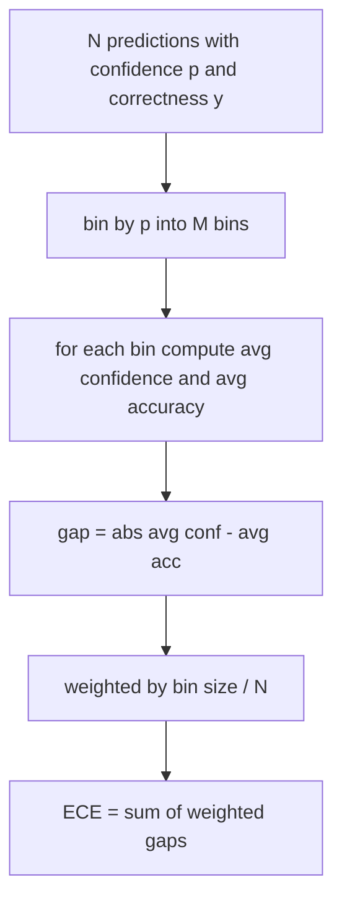
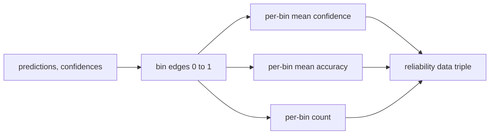

# 困惑度和校准

> Si votre modèle a 90% de confiance dans 1000 réponses et a correctement répondu à 600, cela montre qu'il n'a pas été bien calibré. La calibration est la moitié de l'évaluation digne de confiance. L'autre moitié est confusion, elle vous indique si le modèle considère que le texte conservé est crédible.

**Type:** Build
**Languages:** Python
**Prerequisites:** 第 19 期 Track B 基础，第 70 和 71 课
**Time:** ~90 分钟

## Objectif de l'apprentissage


```figure
cd-reliability-diagram
```

- 根据模型适配器提供的代币负对数概率计算保留语料库上的代币级困惑度──
- 根据分箱预测概率计算分类器或多项选择评估的预期校准误差 (ECE) ⋅
- 計算 Brier 分数 (en anglais seulement)
- Construire des données de fiabilité requises pour la trace de la croyance et de la précision des curves de dessin.
- Tous les trois seront connectés à la ligne d'évaluation, pour que le coureur puisse être.`perplexity`- Je suis là.`ece`et `brier`编号附加到模型报告中──

## 困惑 te dire quoi

困惑度是每个代币的指数平均负对数似然──越低越好──困惑度为 1 signifie modèle pour chaque détail de distribution de chaque détail 1──词汇量大小的困惑意味着模型是统一的并且没有学到任何东西──实际数字介于两者之间:

L'outil lui-même ne compte pas la probabilité numérique. Ces éléments proviennent du modèle adaptateur. L'outil est regroupé: il obtient la liste des probabilités numériques de chaque symbole, la liste des nombres de chaque séquence, et retourne à la confusion de la base de données.

```python
def perplexity(neg_log_probs, token_counts):
    total_nll = sum(neg_log_probs)
    total_tokens = sum(token_counts)
    return math.exp(total_nll / total_tokens)
```

Le traitement des tokens est négatif et la probabilité de résultat est négative.`log p`Au lieu de`-log p`La confusion de l'adaptateur est inférieure à 1, ce qui est impossible.

## Quelles sont les mesures de l'UE ?

 l'erreur de calibration prévue en fonction de la confiance sera prévue dans un groupe de boîtes de nombre fixe, puis mesurée la différence moyenne entre la confiance et la précision de chaque boîte, et augmentée en taille par boîte



标准公式在 `[0, 1]`Il faut utiliser 10 égales de largeur pour soutenir tout calcul intégral.`bins`参数, afin que le opérateur puisse choisir entre la publication de la norme (10) et la comparaison de la norme (15)

L'utilisation de 10 bidons et 100 prévisions vous empêche de distinguer entre 0,02 bidons et un bruit de temps.

## Brier 分数是 ECE 没有的

L'ECE ne se préoccupe que de la différence moyenne. Si le modèle est trop confiant envers la moitié des données, et manque de confiance envers l'autre moitié des données, son ECE peut être plus faible, mais son calibrage local est également très faible.

Pour les résultats, Brier est`mean((p_i - y_i)^2)` Il se décompose en fiabilité, résolution et incertitude.

```python
def brier(p, y):
    return float(np.mean((p - y) ** 2))
```

## Les données de la page

La fonction est de retourner à trois paramètres: chaque bin 平均 信心、 chaque bin 平均 准确度和每 bin 计数── le code est situé en bas de page; le cours est suspendu sur la forme des données──



返回的元组是调用层绘图或计算自定义 ECE 变体(自适应 ECE、扫描 ECE等) 返回的元组──我们返回 numpy 数组,因此下游代码不必进行转换──

## 置信来源

L'outil n'est pas supposé être fiable à la douceur.`[0, 1]`Pour les tâches de choix multiples, la confiance naturelle est`softmax over option log-likelihoods`Pour le livre libre, la confiance naturelle est la probabilité de rapport de soi ou la moyenne de l'indice de similitude numérique du modèle.

##  situation de bord

- Toutes les prédictions sont erronées: l'ECE est la moyenne de confiance, le Brieur est la haute valeur, la confusion est la perception du modèle du texte.
- Toutes les prévisions sont en bonne foi correct:ECE  proche de zéro,Brier  proche de zéro.
- P=0,5 时完全不确定的预测因子:ECE = 0,5 减去精度,Brier = 0,25 减去校正项──
- Air-input:ECE, Brier et retour fiable`0.0`(ou 0 remplissage) ◊ Pour la situation de 0 token, perplexité  retour `NaN` Ces voies ne sont pas mises en garde; le coureur examine ces valeurs et décide de signaler ou de sauter.

Ces cas sont inclus dans les tests. Les vrais modèles de test de base ne les battront pas, mais les adaptateurs ou les petits échantillons défaillants les battront, et les opérateurs ne devraient pas s'effondrer.

## 调度

L'indicateur de la formation est le même que celui de la F1 pour chaque mission.`(confidence, correct)`Pour, et calculé une fois ECE、Brier 和可靠性数据──困惑度, calculé sur la base de texte conservé, est divisé par les évaluations des tâches individuelles.

La première est:

```python
report = CalibrationReport.from_predictions(confidences, correct)
report.ece          # float
report.brier        # float
report.reliability  # tuple of three numpy arrays
report.populated_bins  # int
```

`PerplexityResult.from_token_nll(neg_log_probs, token_counts)`Retour à chaque token de confusion et moyenne négative à nombre similaire.

## 本课不做什么

Il ne réutilise pas de modèle. Il ne réalise pas de softmax. Il ne calcule pas la confiance des sorties; c'est le travail de l'adaptateur. Il ne réalise pas de température réduite ou de réduction de température.

## Comment lire la code

`main.py` définition `perplexity`- Je suis là.`expected_calibration_error`- Je suis là.`brier_score`- Je suis là.`reliability_diagram`et `CalibrationReport`- Je suis là .`PerplexityResult`Cette démonstration se déroule sur une prédiction complète des faits fondamentaux connus: un modèle bien calibré, un modèle trop confiant et un modèle insuffisamment confiant.`code/tests/test_calibration.py`Le test central fixe la situation de chaque bord et la valeur de référence de la variable de prévision globale.

De haut en bas`main.py` L'ordre des fonctions est effectué de la quantité à la quantité. Chaque fonction a une courte chaîne de documents, qui comprend les mathématiques et les contrats.

## Plus loin

La classification est l'axe le plus facilement négligé parmi les évaluations publiées. La plupart des classements rapportent un chiffre de précision et le qualifient de complet. Un modèle qui a gagné sur la précision et a échoué sur Brier est un modèle qui a obtenu des scores inférieurs mais qui rapporte de manière fiable son modèle d'incertitude à un déploiement de production pire. Une fois que le tuyau de classification est en place, il ajoute une température de réduction sur les feuilles de test conservées, recalcule la ECE, et observe la réduction des intervalles.
