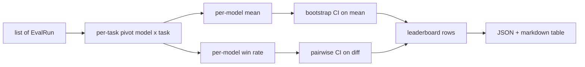
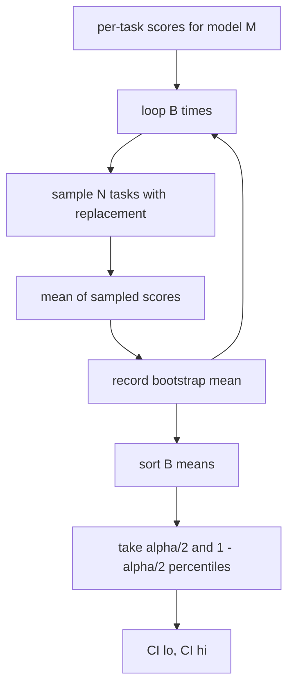

# 排行榜聚合

> Chaque tâche est facile à partager. Chaque modèle de tâche est plus difficile à classer.

**Type:** Build
**Languages:** Python
**Prerequisites:** 第19期B轨基础，第70、71、73课
**Time:** ~90 分钟

## Objectif de l'apprentissage


```figure
ci-leaderboard-ci
```

- Rassembler plusieurs modèles et chaque tâche de plusieurs tâches en un ensemble de modèles.
-  normalisation des différences de qualité, afin que le taux de passage et la valeur BLEU ne soient pas trop affectés par le total.
- ∈ R = R = R = R = R = R = R = R = R = R = R = R = R = R = R = R = R = R = R = R = R = R = R = R = R = R = R = R = R = R = R = R = R = R = R = R = R = R = R = R = R = R = R = R = R = R = R = R = R = R = R = R = R = R = R = R = R = R = R = R = R = R = R = R = R = R = R = R = R = R = R = R = R = R = R = R = R = R = R = R = R = R = R = R = R = R = R = R = R = R = R = R = R = R = R = R = R = R = R = R = R = R = R = R = R = R = R = R = R = R = R = R = R = R = R = R = R = R = R = R = R = R = R = R = R = R = R = R = R = R = R = R = R = R = R = R = R = R = R = R = R = R = R = R = R = R = R = R = R = R = R = R = R = R = R = R = R = R = R = R = R = R = R = R = R = R = R = R = R = R = R = R = R = R = R = R = R = R = R = R = R = R = R = R = R = R = R = R = R = R = R = R = R = R = R = R = R = R = R = R = R = R = R = R = R = R = R = R = R = R = R = R = R = R = R = R = R = R = R = R = R = R = R = R = R = R = R = R = R = R = R = R = R = R = R = R = R = R = R = R = R = R = R = R = R = R = R = R = R = R = R = R = R = R =
- 计算每个模型的平均分数和成对差异的引导置信区间
- Pour les résultats de la formation, le programme de formation est à la recherche de l'information et de la formation.

## 输入的形状

聚合器使用 `EvalRun`记录列表:

```python
@dataclass
class EvalRun:
    model_id: str
    task_id: str
    metric_name: str
    score: float          # in [0, 1]
    category: str
```

第 75 课中的 runner pour chaque `(model, task)`Pour émettre un enregistrement, le polyméteur ne s'intéresse pas à la façon dont le nombre de points est produit.`[0, 1]`Dans le centre.

## 输出

出来三张表:



排行行incluant:`model_id`- Je suis là.`mean_score`- Je suis là.`mean_ci_lo`- Je suis là.`mean_ci_hi`- Je suis là.`win_rate`- Je suis là.`tasks_completed`ainsi que pour chaque classe de valeur moyenne.`categories`Le plan.

##  normalisation

Si une mission est marquée`[0, 1]`, pour un autre mission .`[0, 100]`, , , , , , , , , , , , , , , , , , , , , , , , , , , , , , , , , , , , , , , , , , , , , , , , , , , , , , , , , , , , , , , , , , , , , , , , , , , , , , , , , , , , , , , , , , , , , , , , , , , , , , , , , , , , , , , , , , , , , , , , , , , , , , , , , , , , , , , , , , , , , , , , , , , , , , , , , , , , , , , , , , , , , , , , , , , , , , , , , , , , , , , , , , , , , , , , , , , , , , , , , , , , , , , , , , , , , , , , , , , , , , , , , , , , , , , , , , , , , , , , , , , , , , , , , , , , , , , , , , , , , , , , , , , , , , , , , , , , , , , , , , , , , , , , , , , , , , , , , , , , , , , , , , , , , , , , , , , , , , , , , , , , , , , , , , , , , , , , , , , , , , , , , , , , , , , , , , , , , , , , , , , , , , , , , , , , , , , , , , , , , , , , , , , , , , , , , , , , , , , , , , , , , , , , , , , , , , , , , , , , , , , , , , , , , , , , , , , , , , , , , , , , , , , , , , , , , , , , , , , , , , , , , , , , , , , , , , , , , , , , , , , , , , , , , , , , , , , , , , , , , , , , , , , , , ,`[0, 1]`Le code de référence doit être retourné à un nombre.

## 平均 valeur et taux de victoire

Ces deux programmes de classement servent à des objectifs différents.

Le score moyen est une valeur moyenne de chaque modèle de score de tâches. C'est le rapport de classement numérique du titre. Il est très sensible aux valeurs anormales et aux déséquilibres de tâches.

Le taux de victoire du modèle de calcul est la fréquence de battre tous les autres modèles sur la même tâche. Pour chaque tâche, le modèle qui obtient le plus de points gagne.

```python
def win_rate(model_id, runs_by_task, all_models):
    wins, total = 0, 0
    for task_id, runs in runs_by_task.items():
        scores = {r.model_id: r.score for r in runs if r.model_id in all_models}
        if model_id not in scores:
            continue
        total += 1
        best = max(scores.values())
        if scores[model_id] >= best:
            wins += 1
    return wins / total if total else 0.0
```

Le coureur de la classe 75 ̊ est également conservé par défaut en fonction de la moyenne de classement; la liste de marque du taux de victoire est également conservée pour que l'utilisateur puisse préférer ce point de vue lorsqu'il l'utilise.

## Autonomie

Chaque modèle a une valeur moyenne de la tâche à effectuer en reprise.`B`Il est en train de se faire remarquer.`alpha`La classe est de 100 places.



Pour la comparaison, nous guidons les différences de chaque tâche.`score_A - score_B`, obtenir un intervalle de 100 points et le rapporter. L'utilisateur lit si l'intervalle n'inclut pas zéro. Si c'est le cas, la différence est évidente sur l'alpha-hydravion.

低级助手`bootstrap_mean_ci`- Je suis là.`bootstrap_pairwise_diff`) considère`B=1000`; public聚合器`aggregate`- Je suis là.`pairwise_diffs`) selon`b=500`, donc la démonstration et le test garder rapidement. La valeur de l'alpha est de 0,05 .

## 类别

Si vous le voulez`EvalRun.category`, le polymère rapportera également la valeur moyenne de chaque catégorie.`math`- Je suis là.`reasoning`- Je suis là.`code`- Je suis là.`safety`Il permet au coureur de voir si le modèle est globalement bon mais que le code est faible, c'est la valeur moyenne cachée du titre.

## Le décompte

排行榜呈现为 Markdown 表:

```text
| Rank | Model | Mean | 95% CI | Win rate | Tasks |
|------|-------|------|--------|----------|-------|
| 1    | gpt   | 0.78 | 0.74-0.82 | 0.62 | 50 |
| 2    | claude| 0.75 | 0.71-0.79 | 0.34 | 50 |
| 3    | random| 0.10 | 0.07-0.13 | 0.04 | 50 |
```

Le tableau est classé en ordre de deux chiffres.

## 本课不做什么

Il ne fonctionne pas avec le modèle, il ne modifie pas les niveaux de mesure, il ne réalise pas l'adaptation à l'ECE ou à d'autres variables de programmation, ce sont les 73e classes, il ne réalise pas de tâches supplémentaires, ici, chaque tâche est tout aussi importante, la production de la liste des tâches de programmation, nous traversons.`weight`Le code sera maintenu ouvert, mais ignoré dans le polymère. Si nécessaire, il peut être ajouté au cours suivant.

## Comment lire la code

`main.py` définit `EvalRun`- Je suis là.`LeaderboardRow`- Je suis là.`aggregate`- Je suis là.`bootstrap_mean_ci`- Je suis là.`bootstrap_pairwise_diff`et `render_markdown` Cette présentation a constitué un ensemble composé de trois modèles et de douze tâches, un ensemble de classements et de tableaux de différences.`code/tests/test_leaderboard.py`Le test central fixe le démarrage, le démarrage, le taux de victoire et les comportements de l'entrée en vol.

De haut en bas`main.py` Les données`EvalRun`- Je suis là.`LeaderboardRow`) apparaît d'abord, suivie est le polymère, troisième est le bootstrap, enfin est le rendement.

## Plus loin

La prochaine étape naturelle est l'importance de la tâche de partage, et non la guidance de l'erreur de partage. Si les modèles A et B fonctionnent sur les mêmes centaines de tâches, le test approprié est le partage de la différence de tâche par tâche que nous avons réalisé.
