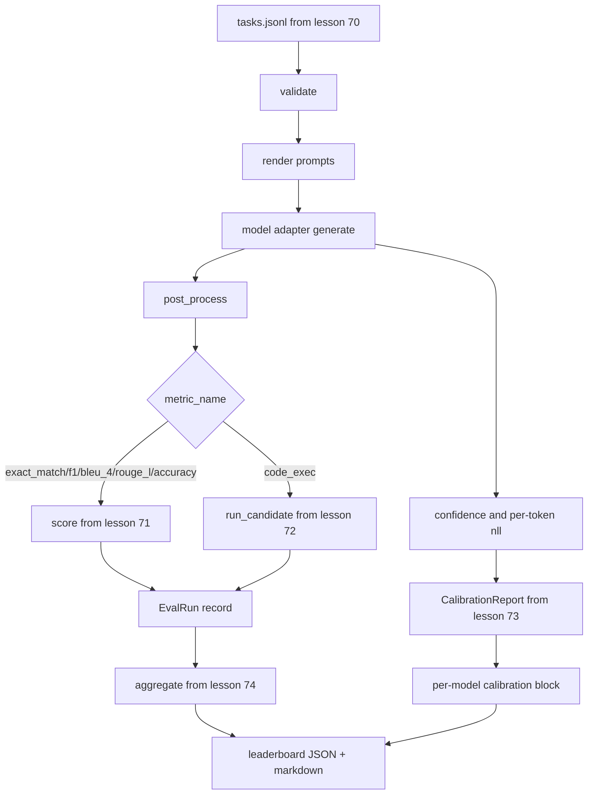

# 端到端评估运行器

> 五堂管道安装课,一堂水课, runner读取第70课中的任务规范,通过适配器调用模型,对第71课和第72课进行评分,附加第73课中的校准报告,并发发出第74课中的排行列,演示自闭终止──

**Type:** Build
**Languages:** Python
**Prerequisites:** 第 19 期 Track B 基础，第 70 至 74 课
**Time:** ~90 分钟

## Objectif de l'apprentissage


```figure
eval-grid
```

- 定义任何模型(模拟、本地、API) peut être réalisé à travers un petit processus de surface satisfait `ModelAdapter`Je suis là.
- Dans le cadre de la mise en œuvre de la mise en œuvre de la mise en œuvre de la mise en œuvre de la mise en œuvre de la mise en œuvre de la mise en œuvre de la mise en œuvre de la mise en œuvre de la mise en œuvre de la mise en œuvre de la mise en œuvre de la mise en œuvre de la mise en œuvre de la mise en œuvre de la mise en œuvre de la mise en œuvre de la mise en œuvre de la mise en œuvre de la mise en œuvre de la mise en œuvre de la mise en œuvre de la mise en œuvre de la mise en œuvre de la mise en œuvre de la mise en œuvre de la mise en œuvre de la mise en œuvre de la mise en œuvre de la mise en œuvre de mise en œuvre de la mise en œuvre de la mise en œuvre de mise en œuvre de la mise en œuvre de mise en œuvre de la mise en œuvre de mise en œuvre de la mise en œuvre de la mise en œuvre de mise en œuvre de la mise en œuvre de mise en œuvre de la mise en œuvre de la mise en œuvre de la mise en œuvre de mise en œuvre de la mise en œuvre de la mise en œuvre de la mise en œuvre de la mise en œuvre de la mise en œuvre de la mise en œuvre de la mise en œuvre de la mise en œuvre de la mise en œuvre de mise en œuvre de la mise en œuvre de la mise en œuvre de la mise en œuvre de mise en œuvre de mise en œuvre de la mise en œuvre de mise en œuvre de la mise en œuvre de mise en œuvre de mise en œuvre de la mise en œuvre de mise en en en.
- Une seconde dimension sera mise en place avec la phase de mise en conformité.
- 发发出每个模型的 `EvalRun`记录并将其直接输入排行榜聚合器──
- En même temps, les rapports JSON et les tableaux de marquage sont produits; en cas de défaillance de l'authentification ou de la mise en œuvre, ils sont produits à partir de zéro lors de la mise en œuvre nette.

## 管道



Le coureur est un point d'intégration. Chaque cours de la 70e à 74e classe a un module écrit par le coureur. Le coureur ne reproduit aucune logique de ces modules: il les introduit.

## 适配器接口

L'adaptateur est un interfaces entre un coureur et un modèle.

```python
class ModelAdapter:
    model_id: str

    def generate(self, prompt: str, task: TaskSpec) -> Generation: ...
```

`Generation`est un type de données, avec:

- `text`Modèle de libre format
- `confidence`- Le numéro de la liste:`[0, 1]`Le nombre de points de référence moyen, indiquant la probabilité de réponse du modèle de rapport de soi
- `token_nll`: générétoken des options négatives à nombre similaires
- `token_count`: générer des tokens

Les modèles adaptés dans les appareils de transport offrent trois types de modèles:`RuleBasedAdapter`(definition, presque parfaite),`NoisyAdapter`(surtout confiant, souvent faux) et`BiasedAdapter`(Bone à côté d'une classe, mauvais à l'autre) ◊ Le spectacle a fonctionné dans la classe 70  fixe tous les trois ◊

## Il n'a pas été exécuté

runner usage `concurrent.futures.ThreadPoolExecutor`Le nombre de lignes de travail est assez petit pour le modèle, car le modèle réel est un réseau I/O. Le code d'exécution est un processus qui se produit en fonction de la tâche.

Pour le test de certitude, le coureur est ouvert.`run_eval(adapters, tasks, parallel=False)`, afin que le test puisse déterminer l'ordre d'exécution.

## 单遍评分循环

Pour chaque tâche:

1. Je suis en train de faire une petite photo.
2. 呼叫适配器并为呼叫计时──
3.  La production et le traitement sont effectués conformément aux règles de l'entreprise.
4. La répartition des données est à la hauteur de la moyenne.
5. Utilisation de la composition des données et des indicateurs`EvalRun`- Je suis là.
6. Il va`(confidence, correct)`Pour les zones de formation complémentaire:

对于精确匹配样式标标 (à savoir:`exact_match`- Je suis là.`accuracy`- Je suis là.`code_exec`),`correct`Le signal est`score >= 1.0`, pour les indicateurs de classe,`score >= 0.5`Le signal est`score >= 0.5`                                                                                                                                                                                                                                                              `_correct_from_score`Le réseau de télécommunications est ouvert au public.

## 聚合

Après chaque mission, le coureur sera affecté à la classe 74.`aggregate`et `pairwise_diffs`Et dans la section 73`CalibrationReport.from_predictions`△输出 est un JSON 信封:

```json
{
  "leaderboard": [...],
  "pairwise": [...],
  "calibration": {
    "model_id_a": {"ece": 0.04, "brier": 0.10, "populated_bins": 8, ...},
    ...
  },
  "summary": {
    "tasks": 10,
    "models": 3,
    "wall_seconds": 1.2
  }
}
```

Le coureur va également mettre un point de repère dans les résultats de la publication afin que les utilisateurs puissent coller les résultats dans les commentaires de relations publiques.

## Depuis le début de l'exposition

La présentation se déroule sur 10 tâches fixes de la 70e classe  trois modèles adaptateurs ⋅ mur-horloge  temps devrait être inférieur à 10 secondes ⋅ netto ⋅ retrait de code pour zéro ⋅

清洁运行标准是:

- Article 70 课中验证的每项任务:
- Parmi les activités de l'enseignement secondaire et de l'enseignement secondaire, il y a une moyenne de 71.
- Article 73  课下汇总校准报告没有错误――
- Le classement sera basé sur des règles de l'adaptateur strictement classé sur l'adaptateur de l'événement.

Si l'une d'elles est interrompue, le coureur sortira à une valeur non nulle et une erreur structurée apparaîtra dans le message JSON.

## 本课不做什么

Il ne réalise pas de processus de traitement de la clé ou du taux de traitement de l'API. Il ne réalise pas de processus de production ou de production de partie.

## Comment lire la code

`main.py`C'est un petit groupe.`_load_sibling`L'aide à l'importation du programme à partir de cinq autres modules de cours, qui l'aide à les analyser par des voies relatives.`Generation`- Je suis là.`EvalReport`et `ModelAdapter`Il est définie en bas du fichier.

De haut en bas`main.py`◊ Browsing import, puis voir `run_eval`, puis c' est`_score_one`Puis, le dernier spectacle est un coup d'entrée.

`code/tests/test_runner.py`Tests intermédiaires de l'interface de l'adaptateur fixe, du cycle de canal unique, des lignes directrices et des séquences, des zones de mise en cache et des enveloppes de réseau JSON.

## Plus loin

Ce coureur est le terrain.`(task_id, model_id, model_version)`Les résultats de la mise en cache de la clé sont: le suivi des coûts de chaque opération de dollars et de jetons, le suivi des coûts de la mise en cache de la mise en cache de la mise en cache de la mise en cache de la mise en cache de la mise en cache de la mise en cache de la mise en cache de la mise en cache de la mise en cache de la mise en cache de la mise en cache de la mise en cache de la mise en cache de la mise en cache de la mise en cache de la mise en cache de la mise en cache de la mise en cache de la mise en cache de la mise en cache de la mise en cache de la mise en cache de la mise en cache de la mise en cache de la mise en cache de la mise en cache de la mise en cache de la mise en cache de la mise en cache de la mise en cache de la mise en cache de la mise en cache de la mise en cache de la mise en cache de la mise en cache de la mise en cache de la mise en cache de la mise en cache de la mise en cache de la mise en cache de la mise en cache de la mise en cache de la mise en cache de la mise en cache de la mise en cache.

模拟工作后,为真正提供程序添加适配器──选择一个免费级别,写三十行水,看排列清亮起──然后添加第二个提供程序并让线束完成工作──
