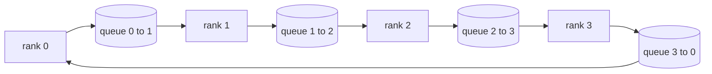

# De la réalisation à zéro des opérations collectives

> Les quatre opérations collectives combinées pour une formation distribuée sont allreduce, broadcast, allgather, 和reduce_scatter.`multiprocessing.Queue`Le reste de l'orbite est transformé en tuyau.

**Type:** Build
**Languages:** Python
**Prerequisites:** 第 19 阶段 Track C 课程 42-49
**Time:** ~90 分钟

## Objectif de l'apprentissage

- Dans les deux séries de transmission, il est possible de réaliser un cycle de réduction de tout (precedure_reduction_scatter, puis assembler) et de démontrer le volume de communication par élève 2 (N-1) /N 字节。
- Dans le`multiprocessing.Queue`Le point de départ est le point de départ.
- Selon la même entrée.`torch.distributed`Le monde entier est un monde de l'information.
- Dans le domaine de la formation collective, la différence entre la limite et la limite de largeur, la défense des choix des arbres et des anneaux.

##  problématique

Le niveau N est simple à tous réduire en général, en général, en général, en général, en général, en général, en général, en général, en général, en général, en général, en général, en général, en général, en général, en général, en général, en général, en général, en général, en général, en général, en général, en général.

Le système de formation de la TDP est basé sur les quatre premiers mots. Le système de formation de la TDP est basé sur la TDP. Le système de formation de TDP est basé sur la TDP. Le système de formation de TDP est basé sur la TDP.

## 概念



### Répondre à toutes les réductions

Pour chaque rangement, le nombre de blocs est divisé en N 个相等块, indexé en 0..N-1──, chaque rangement possède un nombre de blocs similaires.

|原语|每 rank 字节 |步骤|何时使用 |
|-----------|---------------|-------|-------------|
|Ring allreduce| 2T(N-1)/N | 2(N-1) |大 T、fat-pipe 同构集群 |
|Tree allreduce | T log2(N) | 2 log2(N) |小 T 或高延迟链路 |
|广播| T | log2(N) 树 |参数初始化，标量配置|
|allgather| T(N-1)/N | N-1 |分片转发，ZeRO 取消分片 |
|reduce_scatter | T(N-1)/N | N-1 | ZeRO 梯度分片 |

### 队列网格 en tant que remplacement de la NCCL

NCCL fonctionne sur PCIe et NVLink, et réduit le déchargement de matériel.`multiprocessing.Queue`Pour vous fournir des commandes avec un seul producteur et un seul consommateur, les points de livraison sont réduits dans l'espace utilisateur, vous devez donc payer Python, mais le mode de connexion avec le NCCL est réduit de manière similaire.

### 针对 gloo 进行验证

Chaque langue originale effectue un test de l'unité, en produisant des résultats similaires à ceux utilisés dans le même monde.`torch.distributed`Si votre ring réduit tous les déviations de l'angle par rapport à l'angle de l'angle de l'angle de l'angle de l'angle de l'angle de l'angle de l'angle de l'angle de l'angle de l'angle de l'angle de l'angle de l'angle de l'angle de l'angle de l'angle de l'angle de l'angle de l'angle de l'angle de l'angle de l'angle de l'angle de l'angle de l'angle de l'angle de l'angle de l'angle de l'angle de l'angle de l'angle de l'angle de l'angle de l'angle de l'angle de l'angle de l'angle de l'angle de l'angle de l'angle de l'angle de l'angle de l'angle de l'angle de l'angle de l'angle de l'angle de l'angle de l'angle de l'angle de l'angle de l'angle de l'angle de l'angle de l'angle de l'angle de l'angle de l'angle de l'angle de l'angle de l'angle de l'angle de l'angle de l'angle de l'angle de l'angle de l'angle de l'angle de l'angle de l'angle de l'angle de l'angle de l'angle de l'angle de l'angle de l'angle de l'angle de l'angle de l'angle de l'angle de l'angle de l'angle de l'angle de l'angle de l'angle de l'angle de l'angle de l'angle de l'angle de l'angle de l'angle de l'angle de l'angle de l'angle de l'angle de l'angle de l'angle de l'angle de l'angle de l'angle de l'angle de l'angle de l'angle de l'angle de l'angle de l'angle de l'angle de l'angle de l'angle de l'angle de l'angle de l'angle de l'angle de l'angle de l'angle deant.


```figure
ci-ring-allreduce
```

## - Je le construis.

`code/main.py`实现:

- `Mesh`类,将 N 个 `multiprocessing.Queue`                                                                                                                                                                                                                                                                                                                                                                                                                                                                                                                             `send(dst, tensor)`et `recv(src)`Il y a une autre.
- `ring_allreduce(mesh, rank, world_size, tensor)`Il y a deux ou trois algorithmes.
- Pour les arbres`broadcast(mesh, rank, world_size, tensor, src)`Il y a une autre.
- `allgather(mesh, rank, world_size, tensor)`Utilisation de N-1 轮换
- `reduce_scatter(mesh, rank, world_size, tensor)`作为allreduce的前半部分──
- `_gloo_reference(op, world_size, tensor)`- Je suis là.`torch.distributed`运行相同输入,并使用 gloo 进行字节相等比较──

Je vais le faire.

```bash
python3 code/main.py
```

输出: comparer la liste des éléments de la liste et le tableau de l'échantillon 输出, suivi d'une preuve 2T(N-1) /N 缩放的每列节计计器──

## 野外生产模式

Trois modes de rendre le fond assez solide, peut être livré.

**在 allreduce 之前对梯度进行分桶。**Le modèle 1B a plusieurs milliers de niveaux de volume. Chaque niveaux de volume sont effectués une fois pour toutes. La durée du paiement est réduite de 25 MB. Le DDP émet un bloc de stockage de niveaux pour chaque bac de stockage.

**通信与计算重叠。**Rétrograde en fonction de l'ordre de la plateforme de calcul à niveau. Lorsque la dernière plateforme est prête, commencez à la réduire, tandis que la dernière continue à la calculer. PyTorch DDP la connecte au baril.

**根据消息大小而不是宗教来选择环或树。**Le NCCL fournit un détecteur de données, pouvant être supérieur à ~ 1 MB, supérieur à 1 MB, supérieur à 1 MB. Le transfert est de plus en plus large et plus long.

## Utilisez-le

Mode de production:

- **PyTorch DDP。**Dans le cadre de la réforme des normes de sécurité`dist.all_reduce`Pour 100 Gbits et sur le Net, 25 MB est raisonnable.
- **DeepSpeed ZeRO。**发出减_scatter pour effectuer des fractions de la gradience, et effectuer avant le transfert tout le rassemblement pour reconstruire les paramètres complets.
- **FSDP.**Avant de commencer à rassembler des morceaux de couches, calculer, puis utiliser un réducteur, réduire et abandonner les morceaux de couches.

## 发货

Utilisez la ligne de ligne de 77-81 cours en français. La ligne de 77 cours en français est entièrement simplifiée en DDP. La section 78 de la série réduit la diffusion.

## 练习

1. Ajouter un arbre tout réduire les variétés, et selon les informations, faire des changements entre les cercles et les arbres.
2. 添加 `recv_timeout_ms`, afin que le classement en panne apparaisse à l'erreur de date de clôture, plutôt que de rester suspendu à jamais.
3. Je vais vous dire quatre choses.`multiprocessing.Queue`替换为 TCP 套接字──相同的测试,真线──
4. 添加带宽检测挂, afin de pouvoir enregistrer chaque élément du compteur jusqu'à JSONL。
5. Comparé à 1KB,1MB,16, le temps de la pendule de l'arbre avec 4 rangées de la taille de la taille de l'arbre.

## 关键术语

|术语 |人们怎么说|它实际上意味着什么 |
|------|----------------|------------------------|
|allreduce| “跨等级总和”|调用后，每个等级都保留相同的简化张量 |
|戒指| “快速拓扑”| N-1 个大小为 T/N 的块绕周期流动两次 |
|树| “日志拓扑”|归约遵循二叉树；深度为 log2(N) 跳 |
|allgather| “连接碎片”|每个等级都以其他等级的碎片结束 |
|reduce_scatter | “平分总和”|每个排名仅以一个块的总和结束 |
|桶| “融合小张量”|将N个小的全部合并为一个大的|

##  ultérieur

- [PyTorch 分布式：NCCL 集体](https://pytorch.org/docs/stable/distributed.html#collective-functions)
- [Horovod环全减纸](https://arxiv.org/abs/1802.05799)
- NCCL拓和算法选择]https://docs.nvidia.com/deeplearning/nccl/user-guide/docs/index.html)
- [Patarasuk 和 Yuan，带宽最优 allreduce 算法](https://www.cs.fsu.edu/~xyuan/paper/09jpdc.pdf)
- 第 10 阶段 第 05 课 - Répartition de la formation
- 第19 阶段 第77 课 - DDP 连接在这些原语之上
