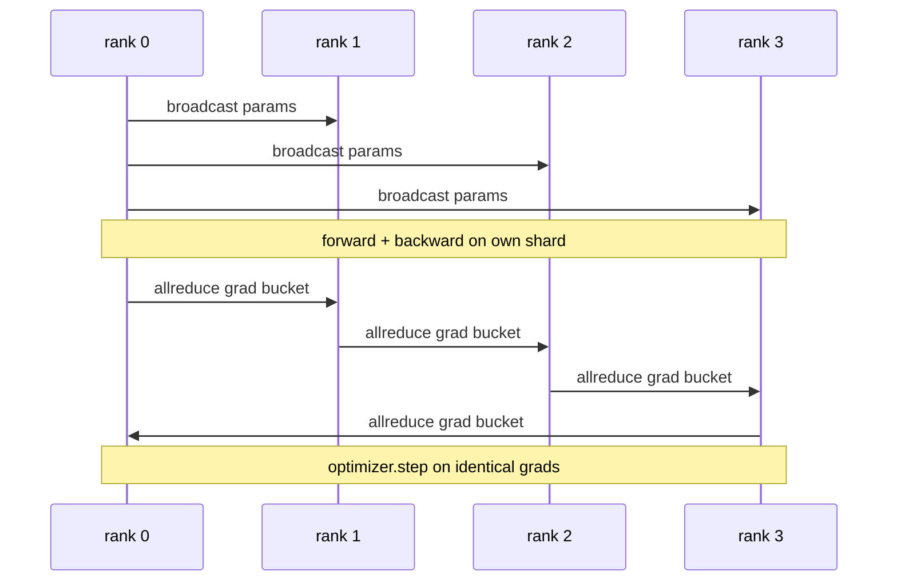

# Département de données du début

> Parallèle distribué des données est un 子 sur tout réduire 子. Emballe un modèle, de 0 级开始广播初始参数, de sorte que chaque niveau commence à être le même, installé un 子 sur chaque émission de gradient allreduce 子, le reste est la gradient descendante.

**Type:** Build
**Languages:** Python
**Prerequisites:** 第 19 期 Track C 课程 42-49
**Time:** ~90 分钟

## Objectif de l'apprentissage

-                                                                                                                                                                                                                                                                                                                                                                                                                                                                                                                              `DistributedDataParallel`形状包装器, cette poubelle diffuse les paramètres initiaux et réduit la gradience de l'arrière vers l'arrière.
- Spawn N CPU dans le monde de la réunion basée sur le fichier`torch.multiprocessing.spawn`Il y a une autre.
- En pratiquant la même méthode et en montrant l'équivalence des paramètres de chaque étape, la précision du degré de synchronisation est démontrée.
- L'utilisation de la décharge de stockage (la "réalisation") et de la "répertoire" (la "réalisation") seront utilisées comme deux changements dans la production de la "réalisation" du "réalisation" du "réalisation" du "réalisation" du "réalisation" du "réalisation" du "réalisation" du "réalisation" du "réalisation" du "réalisation" du "réalisation" du "réalisation" du "réalisation" du "réalisation" du "réalisation" du "réalisation" du "réalisation" du "réalisation" du "réalisation" du "réalisation" du "réalisation" du "réalisation" du "réalisation" du "réalisation" du "réalisation" du "réalisation" du "réalisation" du "réalisation" du "réalisation" du "réalisation" du "réalisation" du "réalisation" du "réalisation" du "réalisation" du "réalisation" du "réalisation" du "réalisation" du "réalisation" du "réalisation" du "réalisation" de "réalisation" de "réalisation" du "réalisation" de "réalisation" de "réalisation" de "réalisation" de "réalisation" de "réalisation" de "réalisation" de "réalisation" de "réalisation" de "réalisation" de "réalisation" de "réalisation" de "réalisation "réalisation" de "réalisation" de "réalisation"

##  problématique

 avec 12 Go de puissance active, le modèle de 10 milliards de paramètres ne convient pas à un GPU de niveau de consommation. Même si cela est approprié, la formation nécessite plusieurs semaines de temps.

Si le schéma n'est pas bien conçu, chaque paramètre est un allreducer, sans superposition, sans baril), le réseau devient un bouteilleur, le GPU se retrouve dans l'espace à attendre. La technique du DDP rend le schéma presque gratuit par rapport au calcul.

## 概念



### Les trois opérations nécessaires au DDP

|舞台|集体|为什么 |
|-------|-----------|-----|
|初始化|从排名 0 开始广播 |每个排名都以相同的参数开始 |
|后退|各梯度的 allreduce |平均梯度是优化器所采用的 |
|有时|缓冲区广播| Batchnorm 运行统计数据保持同步 |

### Pourquoi une valeur moyenne plutôt que un total ?

Toutes les réductions de la somme sont effectuées à la taille du monde. La moyenne de la taille du monde est inchangée: le taux d'apprentissage à un niveau de réglage est valide à quatre niveaux, car la longueur de chaque étape ne change pas. Toutes les réductions de la somme seront effectuées à chaque changement.

### Pourquoi utiliser le baril de la température ?

Le transformateur a des milliers de paramètres de volume. Pour chaque volume, une seule fois, il sera réduit en moyenne. Pour chaque module, le DDP va regrouper la température en un seul compartiment de stockage de 25 Mo. et en émettre un tout-réducteur.

### Pourquoi fixer les graines ?

Chaque rang doit être ajusté`torch.manual_seed(seed + rank)` faire la baignade, mais调用`torch.manual_seed(seed)` effectuer des paramètres initialization.  Un seul partage de semences signifie que chaque classe voit la même séquence de lots.  Battre les données de même ordre.  Les semences de paramètres spécifiques à la classe signifient que les paramètres initiaux ne correspondent pas à l'epsilon flottant.  Le gradient ne fait plus de copies identiques.  Obtenir le modèle de semence correct, sinon le test d'équivalence des paramètres échouera à l'étape 1.


```figure
ci-ddp-grad-sync
```

## - Je le construis.

`code/main.py`实现:

- `MiniMLP`3 L'équipe de MLP, petite à suffire pour recevoir en quelques secondes, grande à suffire pour exposer le fil.
- `DistributedDataParallel(model, world_size)`: en construisant, retourner un emballage, its `sync_grads`Reduire l'ensemble de l'accumulation de la demande et de la gradience divisée par la taille du monde.
- `worker(rank, world_size, ...)`Il est possible de faire des progrès.`torch.distributed`Le cycle complet de formation init.
- `_reference_single_process_loop(...)`: dans un niveau, en suivant l'ordre de formation sur les mêmes données, le même modèle, utilisé après chaque étape pour tester les phases et les paramètres et l'équivalence.

Je vais le faire.

```bash
python3 code/main.py
```

输出: Chaque étape de formation, comparer les pertes et les paramètres de processus individuels avec les DDP qui fonctionnent dans les 4 niveaux supérieurs.

## 野外生产模式

Trois modes permettent de durcir le DDP à suffisamment de charge.

**查找未使用的参数。** Certains itinéraires de transition sont conditionnés à sauter au-delà des paramètres                                                                                                                                                                                                                                                    `find_unused_parameters=True`Dites au DDP qu'avant de réduire, voyez quelles sont les variables obtenues. Le coût est le tracé de chaque étape, donc à moins que vous ne soyez en avance, ne le considérez pas.

**静态图优化。**Quand le changement est stable,`static_graph=True`让DDP 预先计算储备桶调度―― Optimisation en taille est importante: précomputation par étape a permis d'économiser quelques millisecondes, ce qui est complexe en 10000 étapes―

**梯度累积需要小心。**Dans les K 个微批次, la capacité de production peut être augmentée de 10 fois par étape par étape.`no_sync()`Public pour le gestionnaire de texte ci-dessous, pour le suspendre après tout réduire.

## Utilisez-le

Mode de production:

- **PyTorch DDP。**La réalisation de la règle.`torch.nn.parallel.DistributedDataParallel(model)`连接分桶、重叠和 no_sync 上下文──
- **HuggingFace Accelerate。**添加一个处理 `torchrun`环境变量和模型包装的启动器──底层的DDP 相同──
- **Megatron-LM 数据并行。**Combiner le DDP avec la cohésion de la quantité de données pour un modèle de taille; la cohésion de données est la même mode de réduction après rétrograde.

## 发货

Le niveau d'exposition de chaque élément est réduit en réduisant le scatter, de sorte que chaque élément ne stocke que le fractionnement de son état d'optimisateur.

## 练习

1. Ajouter un petit baril de gradience configurable, et mesurer sur un modèle plus profond avec chaque paramètre un allreduce de l'accélération ratio.
2. Il va`no_sync()`实现为上下文管理器,并验证梯度累积与K个微批次的单进程基线相相相匹配.
3. ajouter`find_unused_parameters`模式, dont le premier s'échappe parfois à l'un des niveaux MLP; sans ce signe, le fonctionnement tombe dans la traînée 局。
4. va être remplacé par`torch.distributed.barrier()`- seulement le même, la différence entre le même sur la base de l'allréduction et le même sur la base de la barrière.
5. La taille de la masse est de 1⁄16⁄256 degrés, et la distribution est réalisée dans le cadre de la période de croissance.

## 关键术语

|术语 |人们怎么说|它实际上意味着什么 |
|------|----------------|------------------------|
|DDP | “数据并行” |广播参数并减少每一步梯度的包装器 |
|桶| “保险丝梯度”| N组小都化为一大|
|重叠| “隐藏通讯” |当后面的层仍在向后计算时发出 allreduce |
|无同步 | 「积累」|跳过后向 allreduce 进行梯度累积 |
|查找未使用的 | “分支前进”|减少之前检测无梯度的参数 |

##  ultérieur

- [PyTorch 分布式数据并行文档](https://pytorch.org/docs/stable/generated/torch.nn.parallel.DistributedDataParallel.html)
- PyTorch DDP interno教程]https://pytorch.org/tutorials/intermediate/ddp_tutorial.html)
- [Li等人，PyTorch分布式：加速数据并行训练的经验](https://arxiv.org/abs/2006.15704)
- 第19 阶段 第76 课 - L' ensemble établi par le DDP
- 第19 阶段 第78 课 - ZeRO 分片将每个参数的全部减少 替换为减少_scatter
