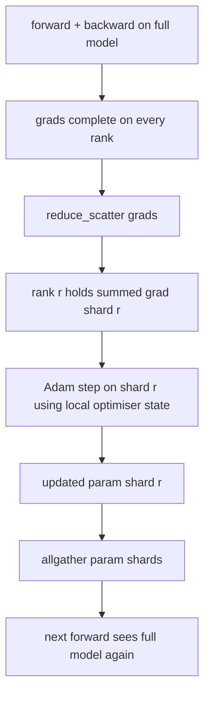

# ZeRO 优化器 état分片

> Adam utilise deux estimations pour chaque paramètre de stockage, en format float32 形式 de stockage. Le modèle de paramètre 7B est équipé d'un optimisateur de 56 Go. Le ZERO est le premier stade de la série.

**Type:** Build
**Languages:** Python
**Prerequisites:** 第 19 期 Track C 课程 42-49
**Time:** ~90 分钟

## Objectif de l'apprentissage

- N 个级别的碎片优化器状态(第一时刻、第二时刻、fp32 主副本), de sorte que chaque niveau possède 1/N。
- Utilisez réduire_scatter pour transmettre seulement chaque niveau de ses particules de gradient et, puis tout le monde va mettre à jour les particules de paramètres de diffusion de retour.
- Selon le RDP  计算阶段 1 阶段 2 阶段 3 的内存节省表──
- Dans le modèle de taille et de largeur budgétaire, défendre les choix de la première phase, de la deuxième phase et de la troisième phase.

##  problématique

Vanilla DDP  Copie tout: paramètres, gradients et l'état de l'optimisateur existent complètement sur chaque niveau. Pour le modèle de paramètres 7B de fp16, cela signifie que chaque niveau est de 14 Go de paramètres, 14 Go de gradients et 28 Go d'état de l'optimisateur.

ZeRO phase 1 effectue des fractions sur l'état de l'optimisateur. Chaque niveau possède un Adam de 1/N. À l'arrière, ZeRO ne réduit pas l'ensemble du gradient et entre en place, mais réduit_scatter, de sorte que chaque niveau ne reçoit que le total du gradient de son fragment. Le classement va appliquer les étapes de l'optimisateur à ses principaux paramètres. Les fragments de paramètres de mise à jour seront ensuite rassemblés, afin que chaque niveau ait un modèle complet de progression ultérieur.

## 概念



### ZERO de la phase

|阶段|分片对象 |每 rank 内存|每 step 通信|
|-------|----------------|------------------|---------------|
| DDP |无 |params + grads + optim | 1x allreduce |
| ZeRO-1 |optimizer state |params + grads + optim/N | 1x reduce_scatter + 1x allgather |
| ZeRO-2 |optim + grads |params + grads/N + optim/N | 1x reduce_scatter + 1x allgather |
| ZeRO-3 |optim + grads + params |params/N + grads/N + optim/N |每层 1x allgather + 每层 1x reduce_scatter |

La première phase est la plus faible de coûts, car l'état d'optimisation domine le budget. La deuxième phase nécessite une logique accumulée de la partition de la échelle, mais la largeur est la même. La troisième phase (FSDP) paie chaque niveau de frais de communication, avant et après, afin d'obtenir des paramètres de la partition de l'économie.

###                                                                                                                                                                                                                                                                                                                                                                                                                                                                                                                              

Pour l'utilisation de l'entraînement à l'accent mixte avec P paramètres:

|术语 |vanilla|ZeRO-1 |为什么 |
|------|---------|--------|-----|
| fp16 参数 | 2P字节| 2P字节|需要转发|
| FP16 梯度 | 2P字节| 2P字节|需要落后|
| fp32 母版 | 4P字节| 4P/N 字节 |只有最优化的人才会使用它 |
| fp32 第一时刻 | 4P字节| 4P/N 字节 |只有最优化的人才会使用它 |
| fp32 第二时刻 | 4P字节| 4P/N 字节 |只有最优化的人才会使用它 |
|总计 | 16P字节| 4P + 12P/N 字节 |   |

N=8 时:vanille 16P, ZeRO-1 5.5P, baisse de 65%♦ N=64 时:vanille 16P, ZeRO-1 4.19P, baisse de 74%♦

### Pourquoi réduire_scatter  est mieux que tout réduire-alors-partage

Tout réduit pour chaque niveau fournit une demande et une échelle complète. Si seulement il faut des morceaux, alors la échelle est réduite. Reduire_scatter 准确交付每个级别拥有的分片; Chaque rang de caractères est identique à tout réduit.


```figure
cd-zero-shard
```

## - Je le construis.

`code/main.py`实现:

- `flatten_params(module)`et `unflatten_into(module, flat)`Le modèle est composé de plusieurs éléments, les éléments sont enveloppés dans une quantité de volume continue et les détaille.
- `ZeroOptimizer(model, world_size, rank, lr)`- posséder des pièces de première classe et des pièces de seconde classe.
- `step()`Dans le plan de la gradience, le système réduit_scatter, utilise Adam  pour les fractions de classement, et recueille tous les paramètres actualisés.
- Une démonstration, entraînement de 3 niveaux de MLP 20 étapes, et imprimant le budget de mémoire de chaque étape ainsi que la ligne de base ordinaire de la DDP.

Je vais le faire.

```bash
python3 code/main.py
```

输出: chaque étape de perte et de mémoire montre que ZeRO-1 est conservé dans l'état d'optimisateur 1/N à chaque niveau par rapport à la copie complète du DDP.

## 野外生产模式

Les trois modes permettent à ZeRO de livrer.

**分片检查点很重要。**L'état de l'optimisateur de ZeRO-1 est classé par rangement; les points de contrôle doivent enregistrer quel rang possède quoi. La 80e classe a construit un liste de points de contrôle partagé, qui a repris la fonction de ZeRO dans le même monde. Sans elle, l'état de conservation ne peut être lu lors du redémarrage.

**混合精度是重点。**ZeRO est une technique de précision mixte; fp32 主副本是分片的. Dans le cas où la précision mixte n'existe pas, ZeRO va donner à la maîtresse de la fp32 un impôt sur le stockage, alors que la production de la fp16 ne sera pas en phase avec la distribution automatique ou la distribution de la bf16.

**第一阶段几乎是免费的。**通信在带宽方面与DDP相似──内存节省与N 成线性关系──唯一的成本是优化器分片的簿记──生产堆默认为阶段1,除非参数分片内存也是一个问题;然后第二或第三阶段用通信换取内存──

## Utilisez-le

Mode de production:

- **DeepSpeed ZeRO。**参考实现―― `deepspeed_config.json`选择阶段 1/2/3 和分区大小──
- **PyTorch FSDP。**PyTorch 原生等效项`ShardingStrategy.SHARD_GRAD_OP`est ZeRO-2; `FULL_SHARD`C'est le ZERO-3.
- **HuggingFace Accelerate。**La mise en place de la mise en œuvre de la mise en œuvre de la politique de sécurité et de la sécurité des données

## 发货

Le tube est composé de DDP + ZeRO, qui est un système de traitement de la structure du tube.

## 练习

1. par le degré de fractionnement étendu à ZeRO-2: chaque rang ne stocke que le degré de fractionnement, par le biais de la fractionnement à l'arrière-plan sera réalisé à l'extérieur de la fractionnement.
2. Ajouter un analyseur de mémoire, utilisé pour imprimer la situation de l'utilisation réelle des caractères fp32 et la situation de la prédiction de la formule 
3. 测量普通 DDP avec ZeRO-1 à chaque étape de la connexion, et le décomposer en avant direction 后 direction 通信。
4. Dans ZeRO-1, il faut réaliser une réduction de la taille: il faut passer par la réduction de la totalité du nombre de factions par quartier de l'ensemble des factions de calcul L2.
5. Utilisez tout réduire au lieu de réduire_scatter                                                                                                                                                                                                                                                                                                                                                                                                                                                                                                              

## 关键术语

|术语 |人们怎么说|它实际上意味着什么 |
|------|----------------|------------------------|
|ZeRO-1 | “优化器分片”|每个等级拥有 1/N 的 fp32 master + Adam 时刻 |
| ZeRO-2 | “grads 也分片”|每个 rank 在 reduce_scatter 后也会丢弃非本分片的梯度 |
|ZeRO-3 | “分片参数” |每个等级保存 1/N 的 fp16 参数；向前每层allgather |
|master copy| “fp32 权重”|高精度参数复制优化器更新|
|reduce_scatter | “平分总和”|仅提供每个等级其分片的梯度总和 |

##  ultérieur

- [Rajbhandari 等人，ZeRO：训练万亿参数模型的内存优化](https://arxiv.org/abs/1910.02054)
- [DeepSpeed ZeRO 文档](https://www.deepspeed.ai/tutorials/zero/)
- [PyTorch FSDP 文档](https://pytorch.org/docs/stable/fsdp.html)
- Section 19 阶段 第 76 课 - 本课涉及的减少_scatter和全集
- 第19 阶段 第80 课 - ZeRO 状态必须使用的分片检查点
