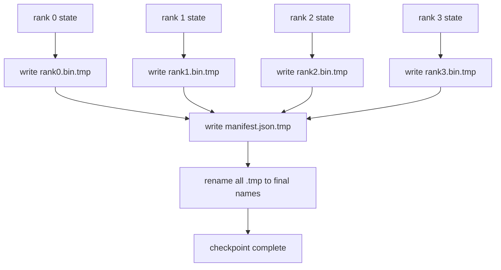

# Répartition et rétablissement de l'atome

> Chaque seconde, nous nous retrouvons à la suite d'une défaillance de nœud et suspendons les travaux de formation des paramètres 70B. La forme du point de contrôle détermine si vous êtes perdu 30 minutes ou 30 heures. Le point de contrôle de nœud est écrit sur chaque nœud de nœud et enregistre la propriété dans le répertoire.

**Type:** Build
**Languages:** Python
**Prerequisites:** 第 19 期 Track C 课程 42-49
**Time:** ~90 分钟

## Objectif de l'apprentissage

- Les points de contrôle de plusieurs niveaux seront conservés pour chaque classe de documents et pour la liste des documents de chaque classe.
- Utilisez un modèle d'écriture (en utilisant un modèle de rédaction), et vous pouvez donc utiliser un modèle de rédaction (en utilisant un modèle de rédaction) pour que le processus d'écriture ne soit jamais terminé.
- De la récupération dans le tableau, l'évaluation de chaque niveau sur les paramètres fp16 et l'état de l'optimisateur ZeRO   字节相等等等状态.
- Protection de l'architecture propre à être exempte de trois types de défaillances:

##  problématique

Le point d'inspection ordinaire prendra tous les paramètres et l'état de l'optimisateur jusqu'à niveau 0, collectera et écrira dans un seul fichier. Pour le modèle 70B, le port réseau de première classe fournit un état de 1.1 TB. L'inspection bloquera tous les autres niveaux, car ils sont vides et attendent la collecte.

Le point de contrôle de la vidéo a changé de mode: chaque niveau met sa propre vidéo et écrit dans son propre dossier. Le code enregistre le niveau qui possède le niveau qui possède le niveau, de sorte que la récupération peut renvoyer chaque élément à sa source.

## 概念



### 清单架构

```json
{
  "world_size": 4,
  "step": 1234,
  "wall_clock_seconds": 4521,
  "shards": [
    {"rank": 0, "path": "rank0.bin", "sha256": "...", "param_shard_offset": 0, "param_shard_numel": 65536},
    {"rank": 1, "path": "rank1.bin", "sha256": "...", "param_shard_offset": 65536, "param_shard_numel": 65536}
  ],
  "schema_version": 1
}
```

Les trois jeux sont tous en charge.`world_size`Il faut que les différentes parties de la vie échouent, et non qu'elles soient en ruine.`sha256`- Je sais pas. - Je sais.`param_shard_offset`et `param_shard_numel`Laissez le chargement à la bonne position.

### 原子写入

标准模式:将每个分片写入 `<name>.tmp`,将清单写入 `manifest.json.tmp`,fsync Chaque fragment, puis renommé. Dans le même système de fichiers, le POSIX renommé est atome; soit le nouveau fichier existe complètement, soit l'ancien fichier existe complètement. L'effondrement avant le renommé final rendra le point de contrôle précédent un point de contrôle d'activité. Si aucun élément d'atome n'est inscrit, l'effondrement peut laisser un autre élément avec une partie de son ordinateur actuel indiquée, et le chargement détruira l'état de l'optimisateur lors de sa récupération.

### 模式 must defend 的三种故障模式

|失败|症状|防御|
|---------|---------|---------|
|世界规模的变化|在 N=8 上恢复，并从 N=4 开始清单 |清单中的 world_size 不匹配，大声失败 |
|分片数量不匹配 |resume 看到的 rank*.bin 文件少于 manifest 中的分片 |枚举分片，验证每个分片都存在 |
|部分写入|分片文件在刷新过程中被截断|加载时进行 sha256 验证 |

Chaque défense rejettera le mauvais fardeau le plus tôt possible; l'autre option est la perte silencieuse, qui survient après 100 étapes lorsque la perte est réduite à NN.

### Pourquoi un dossier de chaque rang, et non un grand dossier ?

- Je suis là.`O_APPEND`Pour un fichier, la mise en ligne est utilisée pour la mise en ligne de caractères POSIX, mais en réalité, la déviation d'un fragment dans un fichier est de plus en plus grande et se situe dans une zone de MB et est donc en position de domination. Lorsque le système de fichiers de niveau inférieur est en phase avec le fichier de niveau de gamme (Lustre, GPFS) chaque fichier de niveau est sans intérêt et peut bénéficier de la mise en ligne.


```figure
ci-sharded-checkpoint
```

## - Je le construis.

`code/main.py`实现:

- `ShardManifest`Les données, avec les structures ci-dessus`to_json`- Je suis là.`from_json`Il y a une autre.
- `save_sharded(state_dict_per_rank, dir, step)`Utilisez le modèle de renommée temporaire de chaque niveau pour écrire son propre dossier, puis écrire dans le listament.
- `load_sharded(dir, expected_world_size)`读取清单,验证每个分片的 sha256,并返回每个级别的状态字典──
- 往返测试: construire chaque rangée de l'état, conservation, charge, affirmation, etc.

Je vais le faire.

```bash
python3 code/main.py
```

输出:4 个分片文件以及写入的清单, puis par le biais de la phase de l'essai et de la phase de la réchargement

## 野外生产模式

Trois modes permettent de faire des points de contrôle assez solides pour effectuer des transports.

**异步写入。**Le point de contrôle est envoyé sur un processus ou un processus individuel pour que l'entraînement puisse continuer.`async_io`Le programme est en cours de rédaction et il est donc possible de suivre les étapes suivantes:

**先本地快速磁盘，然后异步上传。**写入本地 NVMe(快速), puis异步上传到S3或GCS──两层模式使集群内检查点能够快速恢复,同时将持久副本发送到集群外进行存档──清单携带本地路径;上传清单携带远程路径──

**轮换很重要。**Le disque est rempli et le disque suivant échoue. En passant par le disque, la prochaine fois que le disque est conservé, il est supprimé le plus ancien, de sorte qu'il est libéré du budget.

## Utilisez-le

Mode de production:

- **DeepSpeed 检查点。** `deepspeed.save_checkpoint(tag=step)` écrire dans chaque niveau des documents et des étiquettes d'activité `latest`- Je suis en train de le faire.
- **PyTorch FSDP 检查点。** `torch.distributed.checkpoint`Utiliser pour décider de chaque niveau de mise en page `Planner`保存分片状态──
- **NeMo.**Utilisation de l' ajout de données`save_to_checkpoint`L'application est utilisée pour la mise en œuvre de la technologie de l'équipement.

## 发货

Le programme de révision des données de la RDC+ZRO est conservé de bout en bout et rechargé sur le même réseau mondial pour prouver la création du protocole de rétablissement.

## 练习

1. 添加异步写入: Initialize保存并让训练继续──阻止下一次保存,直到下一次保存完成──
2. 添加 `last_5_steps`Retour: conservez 5 points de contrôle récents, supprimez les plus anciens points de contrôle, puis conservez les nouveaux points de contrôle.
3. Pour le cycle de rechargement, ajouter uniquement le chemin de test rapide du CRC.
4. 添加跨世界小的负载: 通过读取清单、连接和重新分片, 分片将重新平衡从N=4到N=8──
5. Il est également possible de faire une liste de données de stockage de données.

## 关键术语

|术语 |人们怎么说|它实际上意味着什么 |
|------|----------------|------------------------|
|分片检查点 | “按等级保存”|每个rank并行写入自己的分片文件|
|清单 | “索引”|记录分片路径、偏移量和 sha256 的 JSON 文件 |
|原子写| “tmp 然后重命名” |写入 .tmp，然后 POSIX 重命名，以便崩溃使先前的文件保持活动状态 |
|部分写入| “截断的碎片” |写入过程中的崩溃会产生损坏的分片； sha256 抓住它 |
|旋转| “保留最后 K”|在写入新检查点以限制磁盘使用量之前删除最旧的检查点 |

##  ultérieur

- [DeepSpeed 检查点](https://www.deepspeed.ai/tutorials/checkpointing/)
- [PyTorch torch.distributed.checkpoint](https://pytorch.org/docs/stable/distributed.checkpoint.html)
- [POSIX重命名原子性](https://pubs.opengroup.org/onlinepubs/9699919799/functions/rename.html)
- Section 19 - 78 - Cet inspecteur vise à préserver l' état de l' OER
- Section 19 阶段 Section 81 课 - 端到端演示往返保存的状态
