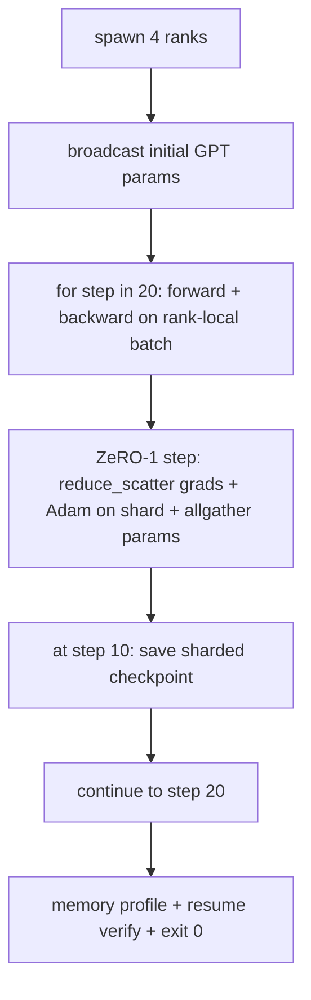

# Formation distribuée du bout au bout

> Le programme est composé de: un GPT de type micro entraîné sur 4 lignes de file d'images, effectuant un synchronisation de degré en utilisant le DDP, ZeRO-1 en utilisant des segments d'état de l'optimisateur, ainsi que des segments de contrôle de la zone intermédiaire.

**Type:** Build
**Languages:** Python
**Prerequisites:** 第 19 期 Track C 课程 42-49
**Time:** ~90 分钟

## Objectif de l'apprentissage

- Pour les étudiants, il est nécessaire de préparer un cycle de formation.
- Dans une petite bibliothèque de langages synthétiques, entraînement à 2 niveaux Transformer 语言模型, traversé 4 模拟等级, effectuer 20 步骤.
- imprimer chaque feuille de calcul perdue  chaque rangée de fichiers de config et liste des points de contrôle des phases de récupération des caractères dans le même monde 
- Defendre les œuvres: chaque œuvre peut être testée indépendamment dans les cours précédents, ce cours prouve qu'elles sont composées.

##  problématique

Capstone est la preuve que chaque partie est assemblée ensemble. Le cours 76 implémentera le collectif. Le cours 77 les intégrera au DDP. Le cours 78 utilise le réduit_scatter, le fragment optimisateur. Le cours 79 analyse le tube. Le cours 80 conserve un fragment de point de contrôle. Chaque cours a ses propres tests.

Ce cours est en cours de réalisation et est réalisé en quatre étapes: a) la perte de 20 étapes dans le bruit de floatation est réduite, b) chaque étape maintient le même paramètre dans chaque étape, c) chaque étape de l'optimisateur est égal à ZeRO-1 公式 12P/N 字节, ainsi que d) étape 10 du point de contrôle lors du redémarrage de la phase de redémarrage 字节, etc.

## 概念



### 迷你 GPT

Le modèle est intentionnellement très petit: 2 个Transformer bloc、 emplacementdim 32、4 个注意力头、词汇64、序列长度 16、批次4──几千个参数── assez grand pour exécuter chaque décision de connexion(多头注意力运行标准屏蔽路径;LayerNorm 需要同步权重;LM 头是返回词汇的单独线性投影)──足够小,4 CPU 级别上的20个步骤可以在几秒内完成──

### 组成规则

|课程片段 |它拥有什么 |它留给循环什么？
|--------------|--------------|----------------------------|
| DDP广播 |初始参数同步 |构建时一次调用 |
| ZeRO-1 步骤 |梯度同步、母版更新、参数广播 |每一步调用一次，替换 optimiser.step |
|分片检查点 |保持每等级状态，用 sha256 体现 |通过 allgather 收集状态，调用等级 0 |
|训练循环 |向前、向后、丢失记录 |按顺序调用以上三个 |

Le cycle ne sait pas ce qu'est la réduction de la dispersion ou le rendez-vous du dossier.

### Pourquoi un petit GPT et pas seulement un MLP ?

Le MLP de la 77e classe suffit à vérifier le degré de synchronisation. Un petit GPT ajoute trois choses: un seul LM de tête sur le vocable. Dans cette classe, pour une première vue claire, il sera dévoilé. Le GPT complet sera généralement lié à un emplacement de jetons.

### Depuis le bout du monde, c'est le départ.

20 étapes de cycle de fonctionnement fixe`while True`, sans interférence humaine, sans récupération de l'état extérieur. Vous pouvez le faire en fonctionnement sans valeur humaine et après avoir terminé, vous trouverez le Capstone complet du journal.


```figure
ci-distributed-assembly
```

## - Je le construis.

`code/main.py`实现:

- `MiniGPT`Il est également utilisé pour la transformation de la tête de l'autodéfense et de la tête de l'autodéfense.
- `make_corpus(seed, total_tokens)`: détermination de la situation
- `_train_worker`: selon les niveaux de génération; la diffusion initiale paramètres, le cycle de fonctionnement, la mise en œuvre de ZeRO 步骤, dans le pas 10 写入分片检查点。
- `verify_resume`: après le premier fonctionnement, le 10ème pas du processus de reloading, et affirme que le premier fragment de sauvegarde correspond au premier fragment du stockage.
- `main`: la mise en page de l'ensemble de la présentation, l'impression de la fiche perdue, le dossier de config et les résultats de vérification.

Je vais le faire.

```bash
python3 code/main.py
```

输出:20 行丢失表,4 行每列内存配置文件,检查点清单以及成功时的RESUME VERIFIED行──

## 野外生产模式

Les trois modes ont terminé la construction de la vraie fonctionnement.

**每 K 分钟检查一次，而不是每 K 步骤一次。**Le temps des étapes varie avec la longueur et le nombre de petits lots. Quelle que soit la taille du modèle, le rythme des points de contrôle de 10 minutes est le même.

**及早检测分歧。**Le processus de production est en retard. Ajouter la NaN 防护和丢失尖峰检测器; si la perte surpasse le 2 fois dans la phase, alors retourner à un point de contrôle précédent, plutôt que de laisser l'optimisateur entrer dans un état de dégradation.

**跨等级聚合内存配置文件。**Chaque classe a un niveau de fonctionnement réel différent de celui de la classe de production avec la plus grande capacité de fonctionnement.

## Utilisez-le

Mode de production:

- **DeepSpeed.**Dans une configuration, le DDP + ZeRO + tubes + activation de point de contrôle est combiné.
- **PyTorch FSDP。**Les résultats sont les mêmes.`FullyShardedDataParallel`et `ShardingStrategy.SHARD_GRAD_OP`C'est le ZERO-2.
- **NeMo 和 Megatron-LM。**Pour le plus grand modèle, la taille est ajoutée; sinon, la forme du composé est la même.

## 发货

完整曲目到此结束── Ces 6 cours constituent ensemble une véritable équipe qui construira un système de formation distribué avant l'adoption de DeepSpeed; cet abstrait a été démontré sur le globe et le modèle de faille a été mis en œuvre──第 17 阶段 (infrastructure et production) est le lieu où il sera transformé en un véritable cluster ──

## 练习

1.  Add attention head 张量并行 分裂并验证损失与单排基线匹配──二级:
2. Ajouter 4 petits lots de gradients accumulés, et prouver que le gradient équivaut à un grand lot de gradients.
3. Ajouter un article sur le chemin de récupération à partir de l'étape 10 qui continue de s'entraîner jusqu'à l'étape 20, et qui a la même perte finale que la marche initiale.
4. L'indicateur de la perte de temps sera ajouté à JSONL afin que les événements puissent être visualisés par la suite.
5. Ajouter un NaN  protection, ruler à un point de contrôle précédent lors du perte de pointe, et utiliser un seul étape LR  multiplication du nombre de pointe forcée pour effectuer le rollout.

## 关键术语

|术语 |人们怎么说|它实际上意味着什么 |
|------|----------------|------------------------|
|端到端| “将一切连接起来”|一次运行构成了每个部分，而不是每个部分的单元测试 |
|内存简介 | “每级 GB”|每个等级上保存的参数、梯度、优化器状态的字节数 |
|简历合同 | “保存并加载”|检查点往返后每列状态字节相等 |
|自动终止 | “有界奔跑”|固定步数，完成后退出 0，循环中没有人 |

##  ultérieur

- DeepSpeed端到端训练教程]https://www.deepspeed.ai/getting-started/)
- PyTorch FSDP进阶教程]https://pytorch.org/tutorials/intermediate/FSDP_advanced_tutorial.html)
- Megatron-LM entraînement脚本参考]https://github.com/NVIDIA/Megatron-LM)
- 第 19 阶段 第 76 - 80 课 - 本课组成的每首曲子
- 第17 阶段 - Le groupe sera déplacé vers le groupe réel
