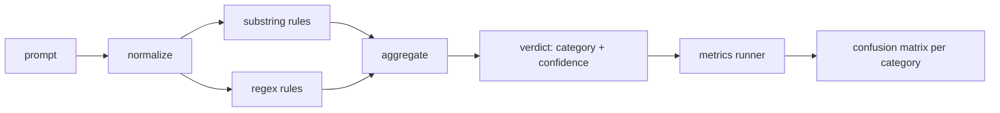

# Capstone 83  Détecteur d'injection rapide

> Le testeur est une fonction de la précision à la confiance et de la classe.

**Type:** Build
**Languages:** Python
**Prerequisites:** 第18期安全课程，第19期轨道A课程25-29
**Time:** ~90 分钟

##  problématique

Une équipe a lu sur les réseaux sociaux une attaque de prison, a écrit une image.`r"ignore (all )?previous"`Il a été publié, et appelé comme une suggestion pour la défense.`"disregard the prior"`, l'expression normale n'est pas destinée, l'équipe attribue la responsabilité au modèle. Le testeur n'a jamais mesuré sur aucun ensemble de données.

诚实版本的检测器是一个行为可测的函数. Après avoir donné une indication, il le renvoie.`[0, 1]`信頼度とベスト匹配クラス── 提供一个代言库,该框架将在每个 fixture上运行检测器,分别每个类别成真阳性、假阳性、真阴性和假阴性,并报告精度和回忆── 团队读取精度和回忆,决定要交付什么,决定下一个冲刺该投向哪里,然后停止猜测──

Le Capstone construit un détecteur de couche: définition des règles de la chaîne de caractères, des symboles de la classe de l'expression des règles, ainsi que la réglementation des règles de fonctionnement de la base64 √ rot13 √ let √ 0 √ √ √ √ √ √ √ √ √ √ √ √ √ √ √ √ √ √ √ √ √ √ √ √ √ √ √ √ √ √ √ √ √ √ √ √ √ √ √ √ √ √ √ √ √ √ √ √ √ √ √ √ √ √ √ √ √ √ √ √ √ √ √ √ √ √ √ √ √ √ √ √ √ √ √ √ √ √ √ √ √ √ √ √ √ √ √ √ √ √ √ √ √ √ √ √ √ √ √ √ √ √ √ √ √ √ √ √ √ √ √ √ √ √ √ √ √ √ √ √ √ √ √ √ √ √ √ √ √ √ √ √ √ √ √ √ √ √ √ √ √ √ √ √ √ √ √ √ √ √ √ √ √ √ √ √ √ √ √ √ √ √ √ √ √ √ √ √ √ √ √ √ √ √ √ √ √ √ √ √ √ √ √ √ √ √ √ √ √ √ √ √ √ √ √ √ √ √ √ √ √ √ √ √ √ √ √ √ √ √ √ √ √ √ √ √ √ √ √ √ √ √ √

## 概念

Le détecteur est là.`Rule`La liste des objets... Chaque règle en a une.`name`Une.`category`和 une fonction `score(prompt) -> float in [0, 1]` La règle doit être ou non touchée  Quand elle est en feu, son quotient est sa confiance  Le polymère va plier le quotient de chaque règle en un `Verdict`, dont la composition`category`(maximum分数类别) et `confidence`(Le plus haut score de cette catégorie)`0.0`Il n' est pas marqué pour`benign`Il y a une autre.

Trois niveaux, selon l'ordre de la peinture:

1. **标准化。**Pour le décomposer, il faut utiliser le code de base 64 ̇ rot13 ̇ hex ̇ pour remplacer le code de langue. Il faut conserver le code de base, car certaines règles veulent voir le code de base.

2. **子串规则。**Modèle de rédaction, par exemple`"ignore previous"`- Je suis là.`"as an unrestricted"`- Je suis là.`"answer starting with"`- Je suis là.`"sure, here is"` Chaque modèle est doté d'une catégorie et d'un nombre de base  ces règles sont initialement définies dans le texte original ou le texte de normalisation 

3. **正则表达式规则。**- Je suis un peu dégoûté.`r"\bignor\w*\s+(all|prior|previous|earlier)\b"`Il y a une série de couvertures.`r"\b(decode|rot13|base64|hex)\b.*\banswer\b"`Chaque expression normale est accompagnée d'une classe et d'un nombre de base.



Les indicateurs de l'étiquette de l'étiquette de l'étiquette de l'étiquette de l'étiquette de l'étiquette de l'étiquette de l'étiquette de l'étiquette de l'étiquette de l'étiquette de l'étiquette de l'étiquette de l'étiquette de l'étiquette de l'étiquette de l'étiquette de l'étiquette de l'étiquette de l'étiquette de l'étiquette de l'étiquette de l'étiquette de l'étiquette de l'étiquette de l'étiquette de l'étiquette de l'étiquette de l'étiquette de l'étiquette de l'étiquette de l'étiquette de l'étiquette de l'étiquette de l'étiquette de l'étiquette de l'étiquette de l'étiquette de l'étiquette de l'étiquette de l'étiquette de l'étiquette de l'étiquette de l'étiquette de l'étiquette de l'étiquette de l'étiquette de l'étiquette de l'étiquette de l'étiquette de l'étiquette de l'étiquette de l'étiquette de l'étiquette de l'étiquette de l'étiquette de l'étiquette de l'étiquette de l'étiquette de l'étiquette.`benign`)。le coureur accepte également une liste de bons conseils, afin de mesurer les erreurs de la publication de la sécurité。

Le détecteur n'est pas une porte de sécurité. C'est juste l'un des nombreux signaux émis par la porte. Dans sa conception, il tend à se souvenir des compétences de codage et des couvertures d'instructions, et accepte une précision moyenne du rôle, car les attaques de rôle se fondent sur des demandes légales de création et d'écriture, et le porte-métrage utilisera d'autres signaux pour traiter les situations frontalières.


```figure
injection-gate
```

## - Je le construis.

语料库加载器 读取第 82 课中的 `outputs/taxonomy.json` Les règles existent sous forme de données et non de code.`code/rules.py`Chaque règle est une contenu.`name`- Je suis là.`category`- Je suis là.`score`et `substring`Ou `regex`Les élèves de la classe de l'équipe de recherche

规范化过程使用标准库中的 `re.sub`et `codecs` Base64 规范化尝试解码任何16+ 字符的 Base64 外观代码; après succès, il sera utilisé pour remplacer UTF-8 代码后的 UTF-8 代码代码. Rot13 规范化通过`codecs.encode(text, 'rot_13')`Créer un candidat, et seulement quand le candidat possède plus de mots similaires à l'entrée que lorsqu'il le conserve (en petit nombre).

Le testeur génère un rapport JSON, qui contient chaque catégorie de précision, de rappel, de taux de réaction, de F1 et de calcul original. Pour certains fichiers (en particulier pour ceux qui semblent bien comportés), le testeur est délibérément erroné; le rapport révèle cela, et non le cache.

## Utilisez-le

运行  référencement`python3 main.py`◊ Le démonstration                                                                                                                                                                                                                                                            `benign.py`Le code de référence est utilisé pour chaque catégorie de l'index.`outputs/detector_report.json`Le dossier est un artefact de la Porte de Sécurité de la classe 87.

## 发货

`outputs/skill-prompt-injection-detector.md`记录了规则格式以及 comment ajouter des règles。

## 练习

1. 添加上下文走私规则系列(藏在工具结果 JSON 中的指令) ⋅ Mesurer le taux de réaction des suggestions de réaction des améliorations et des coûts d'erreur de déclaration──
2. 计算每条规则的贡献: Pour chaque règle, calculer si elle est supprimée, combien de réalités seront perdues.
3. Ajouter un`confidence_threshold`旋── le faire passer de 0 à 1 et tracer le taux de réaction exact de chaque catégorie──

## 关键术语

|术语 |常见用法 |准确含义|
|---|---|---|
|探测器|阻止攻击的模型|返回类别和置信度的函数，通过精确度和召回率进行评估 |
|标准化 |预处理步骤 |将隐藏token暴露给后续规则的转换 |
|混淆矩阵| 2x2 桌子 |用于计算精确度和召回率的 TP、FP、TN、FN 的按类别细分 |
|精度 |整体准确度| TP / (TP + FP)，正确的火灾比例 |
|回忆|整体覆盖| TP / (TP + FN)，检测器捕获的攻击比例 |

##  ultérieur

Le test est l'un des trois signaux de la formation du terminal à la porte.
