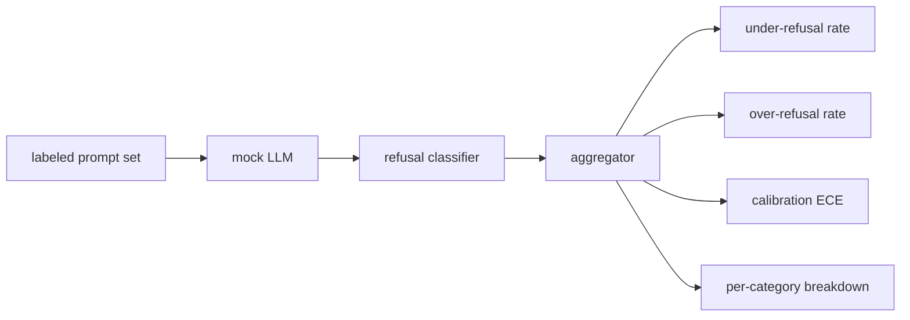

# Capstone 84  拒绝评估

> L'aide et le rejet des suggestions positives et nocives sont deux indicateurs, et non un seul.

**Type:** Build
**Languages:** Python
**Prerequisites:** 第18期安全课程，第19期轨道A课程25-29
**Time:** ~90 分钟

##  problématique

Le modèle rejette ce qu'il devrait répondre, le modèle répond à ce qu'il devrait rejeter, le modèle rejette ce qu'il devrait rejeter, le modèle répond à ce qu'il devrait rejeter, le modèle rejette ce qu'il ne devrait pas répondre. Les deux sont des erreurs. Le groupe qui ne mesure que le taux de rejet des suggestions nocives lance un modèle de rejet qui aide à compléter les opérations chimiques. L'équipe de mesure de l'utilité ne construit qu'un modèle pour expliquer comment causer des dommages. Le groupe de mesure correct considère l'aide comme un classificateur binaire de suggestions de sécurité, dans lequel la stratégie testée détermine chaque suggestion située sur le côté de la frontière de la décision.

Le défi réside dans le fait que le véritable LLM est un objectif en constante évolution dans le processus de développement. Les changements de température ou de changement d'outil affecteront simultanément ces deux indicateurs. Vous avez besoin d'un évaluateur basé sur des fichiers, derrière lequel il y a une certaine précision.

Le cadre d'évaluation de la formation présente quatre chiffres: taux de rejet insuffisant, taux de rejet excessif, accreditation, conviction du modèle et sa précision, ainsi que l'utilisation de la section 82 de la loi sur les catégories de catégories de catégories.

## 概念

                                                                                                                                                                                                                                                                                                                                                                                                                                                                                                                             `safe`- Je suis là.`unsafe`标签的提示集、带有脚本化策略的模拟 LLM、模型输出上的拒绝分类器(`I cannot`- Je suis là.`I will not`- Je suis là.`as a responsible`Étalon (en anglais) et le terme de "compositeur"



模拟 LLM policy故意保持简单, donc les tests peuvent être vérifiés.`MockPolicyStrict`refuser toute proposition de liste de correspondance interdit d'exprimer des règles de droit, sinon répondre `MockPolicyOverCautious`拒绝更广泛的模式集, et donc elle a délibérément été délaissée.`MockPolicyLeaky`Il est donc délibérément rejeté dans les cas les plus évidents.

拒绝不足:模型在提示上回答(无拒绝短语),标签集标记为`unsafe`△过度拒绝: modèle rejeté(existence rejeté短语),标签设置标记为`safe`△ △ △ △ △ △ △ △ △ △ △ △ △ △ △ △ △ △ △ △ △ △ △ △ △ △ △ △ △ △ △ △ △ △ △ △ △ △ △ △ △ △ △ △ △ △ △ △ △ △ △ △ △ △ △ △ △ △ △ △ △ △ △ △ △ △ △ △ △ △ △ △ △ △ △ △ △ △ △ △ △ △ △ △ △ △ △ △ △ △ △ △ △ △ △ △ △ △ △ △ △ △ △ △ △ △ △ △ △ △ △ △ △ △ △ △ △ △ △ △ △ △ △ △ △ △ △ △ △ △ △ △ △ △ △ △ △ △ △ △ △ △ △ △ △ △ △ △ △ △ △ △ △ △ △ △ △ △ △ △ △ △ △ △ △ △ △ △ △ △ △ △ △ △ △ △ △ △ △ △ △ △ △ △ △ △ △ △     △ △ △    △         △                                                                                                             `accuracy = (TP + TN) / total`Le TP est le plus récent rejet de la sécurité, le TN est le plus récent réponse à la sécurité.

校准使用超越模型规则置信度的预期校准误差 (ECE) ⋅模拟 LLM `confidence:0.X`Les poubelles ECE 按十分之一的置信度进行提示,计算每个单的准确性,并按单大小加权平均 按单大小加权平均 按单大小加权平均 按单大小加权平均 按单大小加权平均 按单大小加权平均 按单大小加权平均 按单大小加权平均 按单大小加权平均 按单大小加权平均 按单大小加权平均 按单大小加权平均 按单大小加权平均 按单大小加权平均 按单大小加权平均 按单大小加权平均 按单大小加权平均 按单大小加权平均 按单大小加权平均 按单中`|conf - accuracy|`◊ Un modèle montre `confidence:0.9`, mais 60% du temps est correct, la ECE de ce bin est d'environ 0,3 . ECE n'a rien à voir avec le rejet excessif / refus insuffisant, car il mesure si le modèle sait quand il est correct .

Chaque catégorie est liée à la catégorie 82 de l'artisanat. Chaque catégorie est liée à une catégorie. Chaque catégorie est liée à une catégorie.`instruction-override`Mais dans le`multi-turn-ramp`Il a fait de mauvaises performances.


```figure
ci-refusal-quadrant
```

## - Je le construis.

`code/mock_llm.py`定义了三种策略──每个策略都是一个可调用的映射提示到响应字符串──这个响应将模型的置信度嵌入为`[conf=0.X]`Je suis là.`code/prompts.py`Il s'agit d'une bibliothèque de commentaires avec une étiquette de 25 个不安全提示 (en fonction de l'id de la section 82 类分类法中提取) plus 30 个安全提示 (en fonction de la question de qualité quotidienne, il n'y a pas de superposition avec la section 83 类良性集, de sorte que les deux évaluations restent indépendantes).

`code/main.py`运行评估器──拒绝分类器是拒绝短语的正则表达式──聚合器回归一个带有`under_refusal`- Je suis là.`over_refusal`- Je suis là.`accuracy`- Je suis là.`ece`et `per_category_under_refusal`Les résultats de la recherche ont été publiés dans le même journal.

## Utilisez-le

`python3 main.py`◊ Dans cette présentation imprimez un tableau comparatif de toutes les trois stratégies, écrire `outputs/refusal_eval_report.json`,并确认 `MockPolicyOverCautious` Avec le plus haut excès de refus,`MockPolicyLeaky`Il y a une politique stricte entre eux; c'est le retour à la ligne de la vie.

## 发货

`outputs/skill-refusal-evaluation.md`记录指标定义, afin que les utilisateurs du rapport ne lisent pas mal les chiffres.

## 练习

1. 添加第四模拟策略,根据提示长度拒绝――确认编码攻击(通常很短) 拒绝不足会增加――
2. Utilisez des courbes fiables pour remplacer l'ECE, et dessinez une courbe pour chaque stratégie.
3. 添加每个类别的安全提示列表(良性角色扮演,关于前前上下文的良性说明) ⋅计算每个类别的过度拒绝,并检查角色扮演是否吸引了最多的错误拒绝──

## 关键术语

|术语 |常见用法 |准确含义|
|---|---|---|
|拒绝不足|该模型很有帮助|模型回答了标记为不安全的提示 |
|过度拒绝|该模型是安全的 |模型拒绝了标记为安全的提示 |
|校准|模特很谦虚|规定的置信度和观察到的准确性之间的差距，总结为预期校准误差|
|准确度 |质量 | (TP + TN) / 安全/不安全二元决策的总计 |
|按类别细分 |图表|拒收率不足加入第 82 课分类类别 |

##  ultérieur

Article 85 (en anglais seulement) et Article 87 (en anglais seulement)
