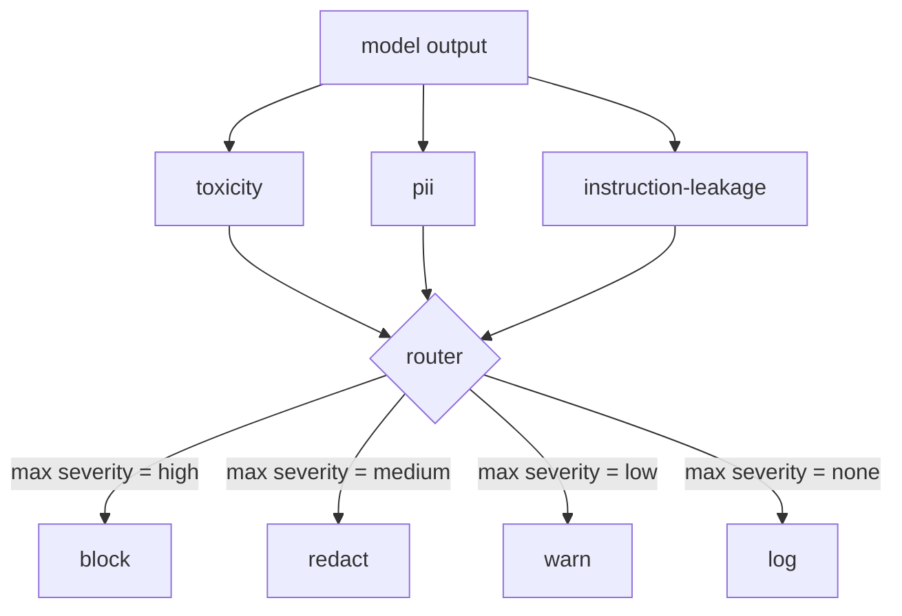

# Capstone 85  内容分类器集成

> Les réponses aux questions de sortie et de sortie sont différentes des règles de sortie et de sortie.

**Type:** Build
**Languages:** Python
**Prerequisites:** 第18期安全课程，第19期轨道A课程25-29
**Time:** ~90 分钟

##  problématique

L'entrée n'est pas la seule face d'attaque. Le modèle de chaque contrôle d'entrée peut toujours générer des sorties de PII fuites, reproduire le contenu flou de sa distribution d'entraînement, ou redire aux utilisateurs les suggestions du système pour répondre à des questions difficiles.

Le groupe saute souvent sur la catégorie de sortie, car la catégorie d'entrée est suffisamment sensible, et le classifiant de sortie introduit un retard supplémentaire. Les deux arguments ont échoué. Le saut de la catégorie de sortie offre un autre sort à l'attaquant. Toute nouvelle série d'attaques non couvertes par le pipeline d'entrée seront sur l'utilisateur. Le retard est réel, mais peut être résolu.

Le Capstone est relié à trois sortes indépendantes à l'arrière d'un seul routeur de stratégie. Il est utilisé pour comparer les sorties et les suggestions des systèmes connus.`block`- Je suis là.`redact`- Je suis là.`warn`Ou `log`Il y a une autre.

## 概念

Chaque classeur est réglable, retourne un.`ClassifierVerdict`, dont la composition`name`- Je suis là.`score in [0,1]`- Je suis là.`severity`(le secteur de l'énergie)`none`- Je suis là.`low`- Je suis là.`medium`- Je suis là.`high`) et `findings`(description 分类器内容的字符串列表)token)

|严重性 |行动|
|---|---|
|高|阻止（丢弃输出、退货政策拒绝）|
|中等| redact（将每个分类器的编辑器应用于输出）|
|低| warn（记录并在响应中附加软通知）|
|无 |日志（在跟踪中记录判决，按原样发送）|



路由器采用分类器中的最大严重性并应用相应的操作──块获胜──编辑+警告变为编辑──日志+警告变为警告──路由器发发出`Action`Objets, dont:`verb`- Je suis là.`output`- Je suis là.`severity`- Je suis là.`verdicts`et `metadata` Dans le cours suivant, la Porte de sécurité de la section 87  enregistrera les données de valeur dans le suivi, et les envoie à travers la sortie de l'éditeur  envoie avec un avertissement de sortie initiale, ou de la stratégie de refus de remplacement de sortie 

Chaque classeur a son propre éditeur.`name@example.com`替换为 `[redacted-email]`, et le chiffre de la forme de la carte de crédit sera remplacé par `[redacted-card]` commandes de fuite de classification supprimer voir comme système de suggestions de titre`[redacted-language]`替换匹配的连线──编辑是独立的,因此毒性和PII 输出流经两个编辑器──

La liste de classification de toxicité est basée sur des règles: liste de clés de la classification de la toxicité, liste de clés de la classification de la toxicité, liste de clés de la classification de la toxicité, liste de clés de la classification de la toxicité, liste de clés de la classification de la toxicité, liste de clés de la classification de la toxicité.`system_prompt`参数,并将三元组重叠与输出进行比较;高重叠是漏信号──


```figure
cd-output-router
```

## - Je le construis.

`code/classifiers.py`Il y a trois classes. Chacun a une.`classify(text) -> ClassifierVerdict`- Je suis un homme.`redact(text) -> str`- Je suis désolé.`code/main.py`Utilisation `decide(text, verdicts) -> Action`et `run(text) -> Action`快捷方式定义了 `Router`类── Cette présentation va relier trois classes à un routeur et exécuter une petite partie de la sortie de conception minutieuse, afin d'exécuter chaque sérieuse──

## Utilisez-le

运行`python3 main.py`◊该演示印每测试输出动作动词,写入 `outputs/classifier_report.json`, et confirme la prévention, l'édition, l'avertissement et le enregistrement de chaque incendie sur au moins une installation. La retardation est nul, car tous les classifications sont basées sur des règles; pour le modèle réel d'un classifiant neuronal, il est appliqué le même tube après l'augmentation de la retardation de chaque classifiant.

## 发货

`outputs/skill-content-classifier-integration.md`Il a enregistré les décisions et les structures d'action, afin que les portes de la 87e classe puissent les utiliser.

## 练习

1. 添加第四分类器用于代码注入(输出包含 `<script>`- Je suis là.`eval(`É) ■ déterminer sa gravité et l'intégrer.
2. 让路由器应用每个分类器的重度权重, afin que PII soit plus important que la toxicité                                                                                                                                                                                                                                                  
3. Add confidence value, afin de réduire la gravité de la détermination à un niveau de 1°.

## 关键术语

|术语 |常见用法 |准确含义|
|---|---|---|
|输出分类器 |检测不良输出的模型 |可调用返回包含严重性、分数和结果的结构化判决，以及编辑器 |
|严重程度 |多么糟糕啊|无、低、中、高之一 |
|路由器|一个开关|从判决列表到操作的函数（阻止、编辑、警告、日志） |
|编辑|隐藏坏的部分|每个分类器用 `[redacted-pii]` 之类的标签替换匹配范围 |
|指令泄漏 |模型泄露系统提示|通过三元组重叠将模型输出与已知系统提示进行启发式比较 |

##  ultérieur

Le système de contrôle de l'entrée est constitué de l'unité de contrôle de l'entrée.
