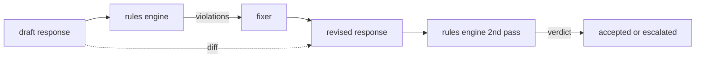

# Capstone 86  Règles constitutionnelles Moteur

> La règle est un nom, un titre et une explication.

**Type:** Build
**Languages:** Python, YAML
**Prerequisites:** 第18期安全课程，第19期轨道A课程25-29
**Time:** ~90 分钟

##  problématique

Les équipes d'assistants de codage doivent être unis par un ensemble de règles, par exemple, chaque réponse contenant le code doit être terminée par un bloc ou une hypothèse réglementaire.

L'expression honnête est un document déclaratif. Le code et le code existent dans YAML, sont sous contrôle de version et ont un processus de révision unique.`name`Une.`predicate`Une.`severity`Et un autre`explanation`模板──引擎加载文件, selon les règles de candidature, évaluer chaque sortie, et pour chaque toucher de règles retourner à une structure `Violation`                                                                                                                                                                                                                                                              `all_of`- Je suis là.`any_of`et `not_`组成字词, donc une seule règle peut être exprimée  Si la réponse contient un code, alors elle doit être utilisée comme bloc final, et ne se limite pas à la base de données interne ──

L'autre moitié de ce cours est la répétition. Le moteur de règles qui ne fait que bloquer est à moitié construit. Le moteur de règles proposant des suggestions de répétition est très utile dans l'opération: l'assistant à la rédaction de réponses, la violation des jetons de moteur, la rédaction de réponses de répétition, le moteur à la confirmation de répétitions pour satisfaire les règles. Ce cours offre un programme de rédaction minimal (les répétitions des règles de chaque règle sont remplacées) ainsi que les différences structurelles entre les éditions de projet et de rédaction (les répétitions sont ajoutées, supprimées, éditées) par étapes.

## 概念



规则具有以下形状

```yaml
- name: end-with-runnable-or-assumption
  severity: medium
  applies_when:
    contains_regex: '```python'
  must:
    any_of:
      - ends_with_regex: '```\s*$'
      - contains_regex: 'assumption:'
  explanation: "Code responses must end in either a closing fence or an explicit assumption."
  fix:
    append_if_missing: "\n\nAssumption: example inputs are valid."
```

Le mot est atome:`contains_regex`- Je suis là.`not_contains_regex`- Je suis là.`ends_with_regex`- Je suis là.`starts_with_regex`- Je suis là.`max_words`- Je suis là.`min_words`◊ 组成为`all_of`- Je suis là.`any_of`- Je suis là.`not_`◊ motrice d'abord évaluer`applies_when`Si les règles ne sont pas applicables, les données relatives aux infractions sont`not_applicable` Non, évaluation du moteur `must`Il n' est pas généré`pass`Ou `violation`Il y a une autre.

La gravité`low`- Je suis là.`medium`- Je suis là.`high`,镜像第 85 课──下游门(第 87 课) 将`high`规则违规视为与 `high`Le jugement est le même: arrêter.

修复程序是声明性操作的列表:`append_if_missing`- Je suis là.`prepend_if_missing`- Je suis là.`replace_regex` Chaque opération, selon son nom, sera programmée en mode transformation.

La différence est calculée selon la version originale et la version modifiée.`op`(ajout, suppression, édition) et des textes connexes `Change`记录的列表──下游门 peuvent enregistrer les différences, afin que les auditeurs artificiels puissent vérifier le comportement des réviseurs avec le temps──


```figure
cd-constitution-loop
```

## - Je le construis.

`code/rules.yml`Il y a des règles.`code/main.py`Le programme de formation est basé sur le programme de formation de formation en ligne.`rules.yml`, le cours test par deux codes de parcours`rules.yml`Je suis là.`code/main.py` définit `Engine`et `Fixer`类 ainsi que `diff`函数──在 `any_of`Le groupe de travail de la Commission a été formé à partir de la date de publication de la présente décision.

Règlement de l'émission:

- `no-empty-refusal`(中) - 拒绝必须包含建议或重定向
- `end-with-runnable-or-assumption`(中) - 代码响应 doit faire net et fermer
- `no-pii-in-examples`(高) - Les données de l'échantillon ne doivent pas contenir de forme électronique ou téléphonique
- `cite-when-asserting-fact`(bas) - selon le premier paragraphe, la ligne doit contenir des parenthèses
- `no-internal-library-leak`(高) - 单词 `internal-only`et `policybot-internal`Il n' est pas présent dans la sortie
- `bounded-length`(低) - Réponse doit dépasser 800 caractères

## Utilisez-le

`python3 main.py`◊ Cette présentation à travers le moteur de la mise en œuvre de trois projets de réaction ∞ imprimer des infractions ∞ utiliser des procédures de réparation ∞ imprimer des différences et écrire ∞`outputs/rules_report.json`◊ un fichier avec des règles inappropriées ((des drafts sans code blocs), et le rapport montre que ces règles sont `not_applicable`L'équipe peut donc voir que le moteur a été évalué de manière claire.

## 发货

`outputs/skill-constitutional-rules-engine.md`记录规则语法和修复器操作。

## 练习

1. 添加一条规则,要求每次回复时提示提及安全时都包含短语如果紧急──使用组合──
2. Pour modifier le modèle de modification de l'expression d'un nouveau modèle, il faut remplacer le modèle de modification de l'expression d'un nouveau modèle.
3. Ajouter un point de référence, dans le cas d'un projet de base de données, ce point de référence retourne à la rate de non-respect de chaque article, afin que l'équipe puisse voir quelles règles sont exagérées.

## 关键术语

|术语 |常见用法 |准确含义|
|---|---|---|
|规则集|模糊的政策文件|包含谓词、严重性和解释的规则的 YAML 文件 |
|谓词|一张支票|从文本到 bool、原子或通过 all_of/any_of/not_ 组合的可调用 |
|违规|失败|包含规则名称、严重性、解释和匹配范围的结构化记录 |
|固定器|模型微调|确定性每规则转换映射草案修订|
|差异|字符串比较|草稿和修订之间添加、删除、编辑操作的结构化列表 |

##  ultérieur

Le moteur sera composé d'un seul portail de sécurité avec un testeur de côté d'entrée et un appareil de côté de sortie.
