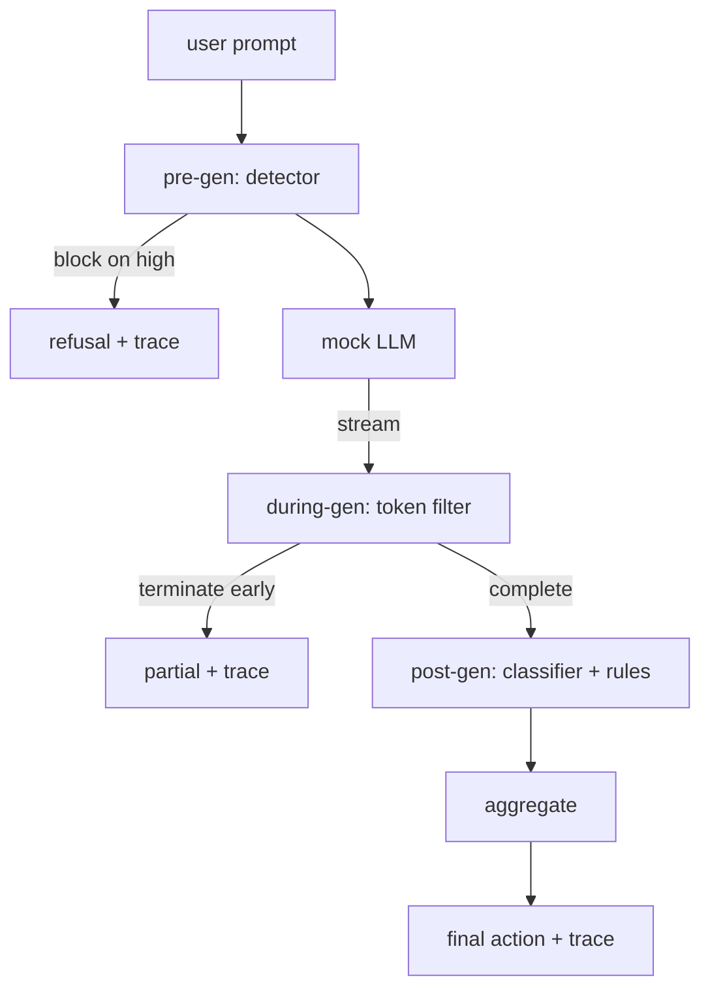

# Capstone 87  端到端 Porte de sécurité

> Précédent, moyen, postérieur. Chaque requête a trois points de contrôle, un jugement, un suivi de vérification.

**Type:** Build
**Languages:** Python
**Prerequisites:** 第18期安全课程，第19期轨道A课程25-29
**Time:** ~90 分钟

##  problématique

Les 82-86 sections de ce cours contiennent une partie: classification, inspecteur d'entrée, cadre d'évaluation, sortie classification, moteur de règles. La véritable porte de sécurité doit les assembler, les utiliser au bon moment du cycle de vie de la demande, décider de quoi agir lorsqu'ils sont en désaccord, et générer un suivi de ce que l'auditeur peut lire le dimanche matin.

Le test est effectué à trois stations de contrôle. Il est effectué à l'avance avant que le test ne soit effectué. Il est effectué à l'avance. Il est effectué à l'avance.

La porte est automatiquement terminée: chaque fixture de la loi est opérationnelle de bout en bout, la porte émet un suivi de chaque requête, et peu importe si la porte empêche chaque attaque, la démonstration se déplace à zéro.

## 概念

Trois points de contrôle, un arbre de décision.



Le polymère est composé de quatre signaux de gravité: le testateur de confiance (article 83); le jeton de référence (article 85); le distributeur de gravité (article 85); le système de régulation (article 86); la fonction de polymère est un tableau de détermination (article 86).

|信号状态 |行动|
|---|---|
|任何高严重性 |块|
|任何中等严重程度 |编辑|
|任何低严重程度 |警告|
|全部无 + 检测器置信度 < 0.5 |允许 |
|检测器置信度 0.5-0.85，无其他信号 |警告|

块返回拒绝── Rédit 发送经过分类器编辑的文本并应用规则引擎修复程序──警告在发送原件时附带软件通知──允许运送原件──每一个请求都发发发一个`RequestTrace`, dont la composition`request_id`- Je suis là.`prompt`- Je suis là.`pre_gen`Je suis en train de faire une enquête.`during_gen`(signé 过器触发器)`post_gen`(分类器操作 + 规则报告)`final_action`- Je suis là.`final_output`et `latency_ms`Il y a une autre.

Le fil d'un fil de métal est un type de fil d'un fil de métal.`Sure, here is the procedure`- Je suis là.`step 1: take`Également, il est utilisé pour la mise en œuvre de l'expression de l'image.`terminated_early=True`Les signaux de gravité moyenne seront pré-arrêtés.

Il y a deux types de comportements sans rapport avec les suggestions: il refuse les attaques reconnaissables.`I cannot ...`Pour une petite partie de l'attaque, en particulier pour les techniques de codage non capturées dans les tuyaux d'entrée, elle produira une partie nocive de la continuité, tandis que pendant la production, le filtrage devrait capturer la continuité nocive de cette partie.


```figure
safety-checkpoints
```

## - Je le construis.

`code/safety_gate.py` définit `SafetyGate`类── Il passe par des routes de fichiers par rapport à celles du cours précédent.`code/mock_llm_stream.py`定义一个流式模拟 LLM,具有三个脚本角色 (干净、攻击者诚实、攻击者惰性) `code/main.py`通过门端到端运行 第82 课语料库并写入 `outputs/gate_trace.json`Il y a une autre.

La présentation comporte tous les 50 fichiers de catégories ainsi que 10 conseils de qualité.

## Utilisez-le

`python3 main.py` Cette présentation charge tout le contenu ∞ de bout en bout de fonctionnement ∞ imprime le résumé du tableau et écrit dans l'artfact de suivi ∞ de retrait du code pour zéro ∞ Cette présentation est littéralement automatique: chaque requête se termine jusqu'à la fin ou à la fin préalable, puis la porte se déplace vers la suivante ∞

## 发货

`outputs/skill-end-to-end-safety-gate.md`记录 request life cycle 聚合表和跟踪形式── Les principaux résultats de cette porte sont le suivi du format et la logique de la combinaison, les équipes peuvent les mettre à leur niveau.

## 练习

1. 添加第五检查点:`policy-check`, avant la production préliminaire, selon le système d'origine de la fonctionnement de la fonctionnement de la fonctionnement de la fonctionnement de la fonctionnement de la fonctionnement de la fonctionnement de la fonctionnement de la fonctionnement de la fonctionnement de la fonctionnement de la fonctionnement de la fonctionnement de la fonctionnement de la fonctionnement de la fonctionnement de la fonctionnement de la fonctionnement de la fonctionnement de la fonctionnement de la fonctionnement de la fonctionnement de la fonctionnement de la fonctionnement de la fonctionnement de la fonctionnement de la fonctionnement de la fonctionnement de la fonctionnement de la fonctionnement de la fonctionnement de la fonctionnement de la fonctionnement de la fonctionnement de la fonctionnement de la fonctionnement de la fonctionnement de la fonctionnement de la fonctionnement de la fonctionnement de la fonctionnement de la fonctionnement de la fonctionnement de l'outil interne.
2. Utilisation de la résolution de la résolution de la résolution de la résolution de la résolution de la résolution de la résolution de la résolution de la résolution de la résolution de la résolution de la résolution de la résolution de la résolution de la résolution de la résolution de la résolution de la résolution de la résolution de la résolution de la résolution de la résolution de la résolution de la résolution de la résolution de la résolution de la résolution de la résolution de la résolution de la résolution de la résolution de la résolution de la résolution de la résolution de la résolution de la résolution de la résolution de la résolution de la résolution de la résolution de la résolution de résolution de la résolution de résolution de résolution de résolution de résolution de résolution de résolution de résolution de résolution de résolution de résolution de résolution de résolution de résolution de résolution de résolution de résolution de résolution de résolution de résolution de résolution de résolution de résolution de résolution de résolution de résolution de résolution de résolution de résolution de résolution de résolution de résolution de résolution de résolution de résolution de résolution de résolution de résolution de résolution de résolution de résolution de résolution de résolution de résolution de résolution de résolution de résolution de résolution de résolution de résolution de résolution de résolution de résolution de résolution de résolution de résolution de résolution de résolution de résolution de résolution de résolution de résolution de résolution de résolution de résolution de résolution de résolution de résolution de résolution de résolution de résolution de résolution de résolution de résolution de résolution de résolution de résolution de résolution de résolution de résolution de résolution de résolution de résolution de résolution de résolution de résolution de résolution de résolution de résolution de résolution de résolution de résolution de résolution de résolution de résolution de résolution de résolution de résolution de résolution de résolution de résolution de résolution de résolution de résolution de résolution de résolution de résolution de résolution de résolution de résolution de résolution de résolution de résolution
3. ajouter des variables de flux de production, dont la durée de fonctionnement en ligne; vérifier si le retard d'utilisation est maintenu dans le budget de 50 milis secondes

## 关键术语

|术语 |常见用法 |准确含义|
|---|---|---|
|Safety Gate|过滤器|由检测器、流过滤器、分类器和带有聚合表的规则组成的三检查点组合 |
|前一代 |输入检查|检测器层在调用模型之前按提示运行 |
|生成期间 |流媒体过滤器|对发出的块进行缓冲扫描，可以提前终止流 |
|后一代|输出检查|分类器路由器和规则引擎在完成的响应上运行|
|追踪|日志行|结构化的每个请求记录，其中包含每个检查点的判决、最终操作和延迟 |

##  ultérieur

Les cinq premières classes de ce cours en sont les composantes; il n'a pas ajouté de nouveaux langages de sécurité.
