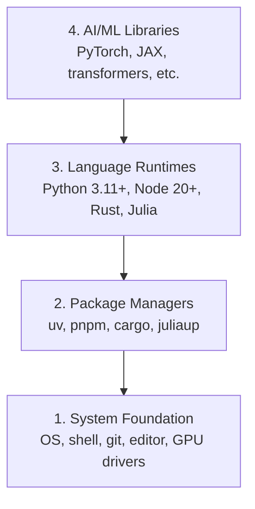

# विकास पर्यावरण

> आपके उपकरण आपके विचार को आकार देंगे एक बार, सही ढंग से।

**Type:** Build
**Languages:** Python, Node.js, Rust
**Prerequisites:** None
**Time:** ~45 分钟

## 学习目标
- से零 प्रारंभ सेट करें पायथन 3.11+、नोड.जेएस 20+ और रस्ट टूलचैन
- आकारणीय निर्माण को प्राप्त करने के लिए आभासी वातावरण और पैकेज प्रबंधक कॉन्फ़िगर करें
- उपयोग CUDA/MPS 验证 GPU एक्सेस,并运行一个测试 Tensor ऑपरेशन
- चार स्तरीय स्टैक को समझनाः सिस्टम, पैकेज, रनटाइम, एआई लाइब्रेरी

## 问题
आप पायथन, टाइपस्क्रिप्ट, रुस्ट और जूलिया का उपयोग करके 200+ से अधिक भागों की एआई इंजीनियरिंग की कक्षाएँ सीखेंगे। यदि आपका वातावरण खराब हो गया है, तो प्रत्येक भाग सीखने के बजाय संघर्ष करने के लिए उपकरण बन जाएगा।

अधिकांश लोग पर्यावरण सेटअप से बाहर निकल जाते हैं। फिर वे कुछ घंटे लगाते हैं आयात त्रुटियों को डिबग करने के लिए, संस्करण संघर्षों और अनुपस्थित CUDA ड्राइवरों को।

## 概念
एक एआई इंजीनियरिंग वातावरण चार स्तरों हैः



हम खुद से नीचे ऊपर स्थापित हैं। प्रत्येक स्तर पर नीचे की एक परत पर निर्भर है।


```figure
s0-env-stack
```

##  इसे निर्माण
### 步骤 1: सिस्टम फाउंडेशन

आपकी प्रणाली की जांच करें और बुनियादी घटक स्थापित करें

```bash
# macOS
xcode-select --install
brew install git curl wget

# Ubuntu/Debian
sudo apt update && sudo apt install -y build-essential git curl wget

# Windows (use WSL2)
wsl --install -d Ubuntu-24.04
```

### 步骤 2: यूवी के साथ पायथन

हम उपयोग `uv`यह पाइप 快 10-100x से अधिक है, और यह स्वचालित रूप से आभासी वातावरण संसाधित करेगा

```bash
curl -LsSf https://astral.sh/uv/install.sh | sh

uv python install 3.12

uv venv
source .venv/bin/activate  # or .venv\Scripts\activate on Windows

uv pip install numpy matplotlib jupyter
```

验证:

```python
import sys
print(f"Python {sys.version}")

import numpy as np
print(f"NumPy {np.__version__}")
a = np.array([1, 2, 3])
print(f"Vector: {a}, dot product with itself: {np.dot(a, a)}")
```

### 步骤 3: pnpm के साथ Node.js

टाइपस्क्रिप्ट 课程(एजेंट्स、MCP सर्वर、वेब ऐप) 👇

```bash
curl -fsSL https://fnm.vercel.app/install | bash
fnm install 22
fnm use 22

npm install -g pnpm

node -e "console.log('Node', process.version)"
```

### 步骤 4: जंग

उपयोग पर प्रदर्शन-महत्वपूर्ण 课程(उल्लेखन、 प्रणालियों)

```bash
curl --proto '=https' --tlsv1.2 -sSf https://sh.rustup.rs | sh

rustc --version
cargo --version
```

### 步骤 5: जूलिया (वैकल्पिक)

जूलिया के लिए अच्छा गणित-भारी कक्षाओं

```bash
curl -fsSL https://install.julialang.org | sh

julia -e 'println("Julia ", VERSION)'
```

### 步骤 6:GPU  सेटिंग( अगर आप है)

```bash
# NVIDIA
nvidia-smi

# Install PyTorch with CUDA
uv pip install torch torchvision torchaudio --index-url https://download.pytorch.org/whl/cu124
```

```python
import torch
print(f"CUDA available: {torch.cuda.is_available()}")
if torch.cuda.is_available():
    print(f"GPU: {torch.cuda.get_device_name(0)}")
```

没有GPU?没有问题──大多数课程可在CPU上运行──对于训练重的课程,使用Google Colab或云GPU──

### 步骤 7: सब कुछ सत्यापित करें

运行验证脚本:

```bash
python phases/00-setup-and-tooling/01-dev-environment/code/verify.py
```

## इसका उपयोग करें
आपके पर्यावरण को इस पाठ्यक्रम के प्रत्येक अनुभाग के लिए तैयार किया गया है। निम्नलिखित सामग्री का उपयोग किया जाएगाः

| Language | Used In | Package Manager |
|----------|---------|-----------------|
| Python | Phases 1-12 (ML, DL, NLP, Vision, Audio, LLMs) | uv |
| TypeScript | Phases 13-17 (Tools, Agents, Swarms, Infra) | pnpm |
| Rust | Phases 12, 15-17 (Performance-critical systems) | cargo |
| Julia | Phase 1 (Math foundations) | Pkg |

## 交付 यह
इस कक्षा में एक प्रमाण पत्र है जिसे कोई भी अपना स्वयं का सेटअप जांचने के लिए उपयोग कर सकता है।

查看 `outputs/prompt-env-check.md`, जिसमें से एक त्वरित, मददगार AI सहायक  पर्यावरण के मुद्दों का निदान करना है।

## अभ्यास
1. 运行验证脚本并修复任何失败项
2. इस कोर्स में एक पायथन वर्चुअल वातावरण बनाएं, और पायटॉर्च स्थापित करें
3. सभी चार भाषाओं के साथ एक "हैलो दुनिया" लिखें,并逐个运行
