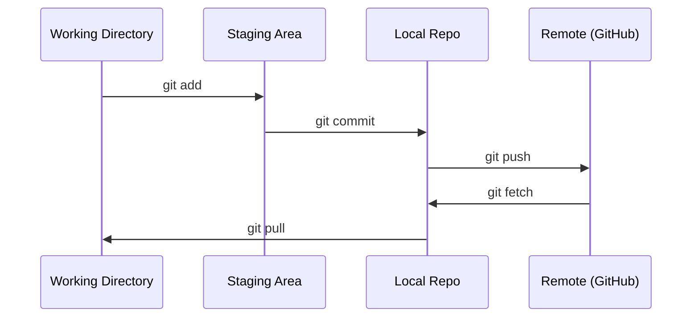

# Git & सहयोग

> संस्करण नियंत्रण नहीं है एक विकल्प है। आप यहाँ निर्माण प्रत्येक प्रयोग, प्रत्येक मॉडल, प्रत्येक अनुभाग को ट्रैक किया जाना चाहिए।

**Type:** Learn
**Languages:** --
**Prerequisites:** Phase 0, Lesson 01
**Time:** ~30 分钟

## 学习目标
- 配置 git identity,并使用 जोड़、 प्रतिबद्धता 和 push का दैनिक कार्यप्रवाह
- अलग-अलग प्रयोगों के लिए शाखाओं का निर्माण और विलय करना, मुख्य को नुकसान से बचने के लिए
- 编写一个 `.gitignore`, मॉडल चेकपोस्ट और बड़े द्विआधारी फ़ाइलों को बाहर करने
- उपयोग `git log`浏览 commit history, परियोजना विकास को समझना

## 问题
आप 20 चरणों के माध्यम से होंगे  सैकड़ों कोड फ़ाइलों को लिखने  बिना संस्करण नियंत्रण, आप खो देंगे काम  नष्ट करने के लिए अयोग्य है, और दूसरों के साथ सहयोग करने में असमर्थ 

Git यंत्र है। GitHub कोड है। यह केवल इस पाठ्यक्रम की आवश्यकताओं को कवर करता है।

## 概念


记住三件事:
1. 经常保存(`git commit`)
2. दूरस्थ तक धक्का दिया`git push`)
3. प्रयोगों के लिए  शाखा निर्माण`git checkout -b experiment`)


```figure
s0-commit-dag
```

##  इसे निर्माण
### 步骤 1: git को कॉन्फ़िगर करें

```bash
git config --global user.name "Your Name"
git config --global user.email "you@example.com"
```

### 步骤 2: दैनिक कार्यप्रवाह

```bash
git status
git add file.py
git commit -m "Add perceptron implementation"
git push origin main
```

### 步骤 3: प्रयोग के लिए शाखाएँ बनाना

```bash
git checkout -b experiment/new-optimizer

# ... make changes, commit ...

git checkout main
git merge experiment/new-optimizer
```

### 步骤 4: इस पाठ्यक्रम का उपयोग करें

```bash
git clone https://github.com/cluster1900/ai-engineering-from-scratch-zh.git
cd ai-engineering-from-scratch-zh

git checkout -b my-progress
# work through lessons, commit your code
git push origin my-progress
```

## इसका उपयोग करें
इस कोर्स के लिए, आप केवल इन आदेशों की जरूरत हैः

| Command | When |
|---------|------|
| `git clone` | 获取 course repo |
| `git add` + `git commit` | 保存你的工作 |
| `git push` | 备份到 GitHub |
| `git checkout -b` | 在不破坏 main 的情况下尝试东西 |
| `git log --oneline` | 查看你做过什么 |

इन सबको लेकर इस कोर्स को रीबेस, चेरी-पिक या सबमॉड्यूल की जरूरत नहीं है।

## अभ्यास
1. इस रेपो को क्लोन करें, एक नाम का निर्माण करें `my-progress`शाखा, एक फ़ाइल बनाएं, इसे संलग्न करें, इसे धक्का दें
2.  एक बनाओ `.gitignore`, चेकपॉइंट फ़ाइलों के मॉडल को बाहर करना`.pt``.pth``.safetensors`)
3. उपयोग `git log --oneline`查看这个 repo 的提交历史,并阅读教训是如何被添加的

## 关键术语
| Term | What people say | What it actually means |
|------|----------------|----------------------|
| Commit | “保存” | 你的整个 project 在某个时间点的 snapshot |
| Branch | “一个副本” | 指向某个 commit 的 pointer，会随着你的工作向前移动 |
| Merge | “合并 code” | 把一个 branch 的 changes 应用到另一个 branch |
| Remote | “云端” | 托管在其他地方的 repo 副本（GitHub、GitLab） |
