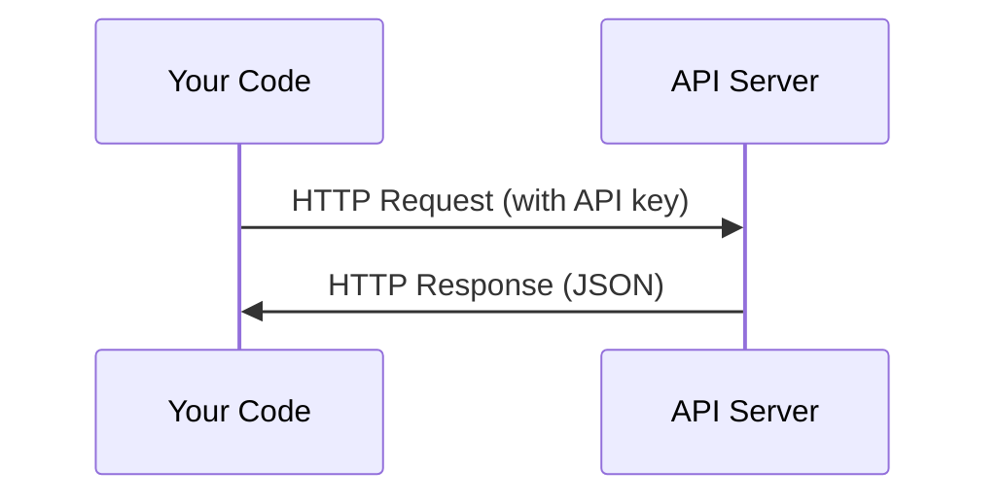

# एपीआई और कुंजी

> प्रत्येक एआई एपीआई का काम करने का तरीका एक ही हैः अनुरोध भेजें, प्रतिक्रिया प्राप्त करें।

**Type:** Build
**Languages:** Python, TypeScript
**Prerequisites:** Phase 0, Lesson 01
**Time:** ~30 分钟

## 学习目标
- पर्यावरण चर का उपयोग करना`.env`फ़ाइलें सुरक्षित भंडारण एपीआई कुंजी
- साथ ही साथ मानव पायथन SDK और कच्चे HTTP का उपयोग करते हुए एक बार LLM API कॉल शुरू करें
- तुलना SDK और कच्चे HTTP के अनुरोध / प्रतिक्रिया प्रारूपों के आधार पर, ताकि डिबगिंग
- 识别并处理常见API त्रुटियां, जिसमें प्रमाणीकरण तथा दर सीमाएं शामिल हैं

## 问题
चरण 11 से शुरू होकर, आप LLM एपीआई (Anthropic、OpenAI、Google) का उपयोग करेंगे। चरण 13-16 में, आप इन एपीआई के एजेंटों का उपयोग करके लूप्स में निर्माण करेंगे। आपको एपीआई कुंजी को जानने की आवश्यकता है कि कैसे काम करें, उन्हें सुरक्षित रूप से कैसे संग्रहीत करें, और अपनी पहली एपीआई कॉल कैसे करें।

## 概念


प्रत्येक एपीआई कॉल में शामिल हैंः
1. एक अंत बिंदु (URL)
2. एक एपीआई कुंजी ((प्रमाणन)
3. एक अनुरोध शरीर (आप क्या चाहते हैं)
4. एक प्रतिक्रिया शरीर ((आप क्या मिलता है)


```figure
s0-secret-inject
```

##  इसे निर्माण
### 步骤 1: सुरक्षित भंडारण एपीआई कुंजी

绝不要把API keys 放进代码──环境变量──

```bash
export ANTHROPIC_API_KEY="sk-ant-..."
export OPENAI_API_KEY="sk-..."
```

या उपयोग `.env`फ़ाइल( इसे जोड़ने `.gitignore`):

```
ANTHROPIC_API_KEY=sk-ant-...
OPENAI_API_KEY=sk-...
```

### 步骤 2: प्रथम एपीआई 调用 (पायथन)

```python
import anthropic

client = anthropic.Anthropic()

response = client.messages.create(
    model="claude-sonnet-4-20250514",
    max_tokens=256,
    messages=[{"role": "user", "content": "What is a neural network in one sentence?"}]
)

print(response.content[0].text)
```

### 步骤 3: प्रथम बार एपीआई 调用 (TypeScript)

```typescript
import Anthropic from "@anthropic-ai/sdk";

const client = new Anthropic();

const response = await client.messages.create({
  model: "claude-sonnet-4-20250514",
  max_tokens: 256,
  messages: [{ role: "user", content: "What is a neural network in one sentence?" }],
});

console.log(response.content[0].text);
```

### 步骤 4: कच्चे HTTP (कोई SDK)

```python
import os
import urllib.request
import json

url = "https://api.anthropic.com/v1/messages"
headers = {
    "Content-Type": "application/json",
    "x-api-key": os.environ["ANTHROPIC_API_KEY"],
    "anthropic-version": "2023-06-01",
}
body = json.dumps({
    "model": "claude-sonnet-4-20250514",
    "max_tokens": 256,
    "messages": [{"role": "user", "content": "What is a neural network in one sentence?"}],
}).encode()

req = urllib.request.Request(url, data=body, headers=headers, method="POST")
with urllib.request.urlopen(req) as resp:
    result = json.loads(resp.read())
    print(result["content"][0]["text"])
```

यह है कि SDKs के पीछे क्या करते हैं,, कच्चे HTTP कॉल को समझने में मदद करता है डिबगिंग,,

## इसका उपयोग करें
对于本课程:

| API | When you need it | Free tier |
|-----|-----------------|-----------|
| Anthropic (Claude) | Phases 11-16（agents, tools） | 注册赠送 $5 credit |
| OpenAI | Phase 11（comparison） | 注册赠送 $5 credit |
| Hugging Face | Phases 4-10（models, datasets） | Free |

आप अभी नहीं जरूरत है सभी सेट करना.

## 交付 यह
इस पाठ 会产出:
- `outputs/prompt-api-troubleshooter.md`- 诊断常见 API त्रुटियां

## अभ्यास
1. एक मानव एपीआई कुंजी प्राप्त करें, और अपनी पहली एपीआई कॉल शुरू
2. 尝试 raw HTTP  संस्करण,并将响应格式与SDK 版本进行比较
3. 故意使用错误的API कुंजी,并阅读错误消息

## 关键术语
| Term | What people say | What it actually means |
|------|----------------|----------------------|
| API key | "Password for the API" | 一个唯一字符串，用于标识你的 account 并授权 requests |
| Rate limit | "They're throttling me" | 每分钟/每小时最大 requests 数量，用于防止滥用并确保公平使用 |
| Token | "A word"（在 API 语境中） | 一个 billing unit：input 和 output Tokens 会被分别计数并收费 |
| Streaming | "Real-time responses" | 逐词获取 response，而不是等待完整 response |
