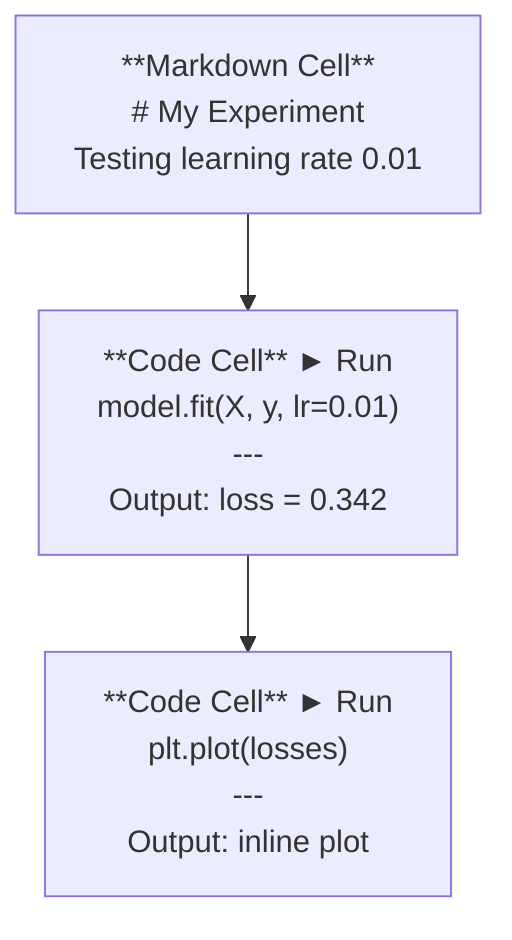
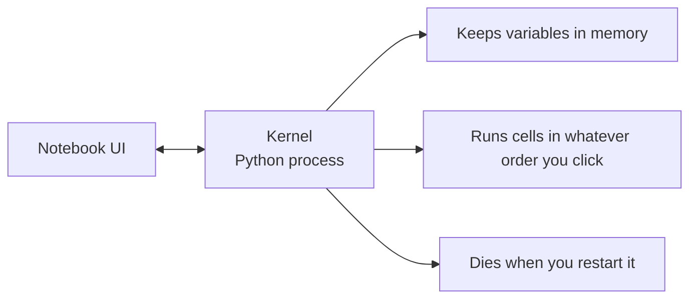

# ज्यूपिटर नोटबुक

> नोटबुक एआई इंजीनियरिंग का प्रयोग है। आप यहां प्रोटोटाइप बनाते हैं, फिर प्रभावी भाग उत्पादन में स्थानांतरित करते हैं।

**类型：**निर्माण
**语言：**पायथन
**前置要求：**चरण 0, पाठ 01
**时间：** 30 मिनट

## 学习目标

- स्थापित करें और JupyterLab、Jupyter Notebook, या Jupyter विस्तार के साथ VS कोड को चालू करें
- प्रयोग जादू आदेशों(`%timeit``%%time``%matplotlib inline`) बेंचमार्क और इनलाइन दृश्यता
- 区分何时使用笔记本、何时使用脚本,并应用在笔记本中探索,在脚本中交付的工作流
- 识别并避免常见笔记本 陷:乱序执行、隐藏状态和内存泄漏

## 问题

प्रत्येक AI पेपर、 ट्यूटोरियल 和 Kaggle प्रतियोगिता में Jupyter नोटबुक का उपयोग किया जाता है── वे आपको काम करने का एक अलग खंड देते हैं कोड、 इनलाइन 查看输出、混合代码与说明,并快速代── यदि आप नोटबुक का उपयोग नहीं करने की कोशिश करते हैं तो AI सीखें, जैसे गणित का काम करते हैं लेकिन कोई ड्राफ्ट पेपर नहीं है──

लेकिन नोटबुक में वास्तव में एक फंदा है। लोग उन्हें हर चीज के लिए उपयोग करते हैं, जिनमें वे बहुत खराब हैं।

## 概念

नोटबुक एक समूह की एक सूची है जिसमें प्रत्येक इकाई या तो कोड है या पाठ है।



कर्नेल एक पायथन प्रक्रिया है जो बाद में चलती है। जब आप एक सेल को चलाते हैं, तो यह कर्नेल को कोड भेजता है, कर्नेल निष्पादित करता है और परिणाम भेजता है। सभी कोशिकाएं एक ही कर्नेल साझा करती हैं, इसलिए चर कोशिकाओं के बीच बनाए रखा जाता है।



आपको जो क्रम है उस पर चलना है  यह सुपरकॅपेसिटी है, और आसानी से दस्तक देने की क्षमता भी है


```figure
s0-cell-order
```

## 构建

### 步骤 1:  选择你的界面

三种选择,同一种格式:

| Interface | Install | Best for |
|-----------|---------|----------|
| JupyterLab | `pip install jupyterlab` then `jupyter lab` | 完整 IDE 体验、多标签、文件浏览器、terminal |
| Jupyter Notebook | `pip install notebook` then `jupyter notebook` | 简单、轻量、一次一个 notebook |
| VS Code | Install "Jupyter" extension | 已在你的 editor 中、git 集成、debugging |

三者都读写同一个 `.ipynb`文件──选你喜欢的即可──JupyterLab AI 工作中最常见的选择──

```bash
pip install jupyterlab
jupyter lab
```

### 步骤 2: 重要键盘快捷键

आप दो प्रकार के मोड में संचालित होगा.`Escape`进入 कमांड मोड(左侧蓝色),按 `Enter`进入 संपादन मोड(绿色)。

**Command mode（最常用）：**

| Key | Action |
|-----|--------|
| `Shift+Enter` | 运行 cell，移动到下一个 |
| `A` | 在上方插入 cell |
| `B` | 在下方插入 cell |
| `DD` | 删除 cell |
| `M` | 转换为 markdown |
| `Y` | 转换为 code |
| `Z` | 撤销 cell 操作 |
| `Ctrl+Shift+H` | 显示所有快捷键 |

**Edit mode：**

| Key | Action |
|-----|--------|
| `Tab` | Autocomplete |
| `Shift+Tab` | 显示函数签名 |
| `Ctrl+/` | 切换 comment |

`Shift+Enter`हाँ, आप हर दिन एक हजार बार त्वरित कुंजी का उपयोग करेंगे।

### 步骤 3: सेल प्रकार

**Code cells**运行 Python 并显示输出:

```python
import numpy as np
data = np.random.randn(1000)
data.mean(), data.std()
```

输出:`(0.0032, 0.9987)`

**Markdown cells**染格式化文本── इन्हें उपयोग करके आप क्या कर रहे हैं और क्यों कर रहे हैं को रिकॉर्ड करें── समर्थन शीर्षकों、 bold、 italic、 LaTeX math(`$E = mc^2$`)、तालिकाएँ तथा चित्रों

### 步骤 4: जादू आदेश

ये पायथन नहीं हैं। ये ज्यूपिटर के विशेष आदेश हैं।`%`(लाइन जादू) या `%%`(सेल जादू) खोलना

**为你的代码计时：**

```python
%timeit np.random.randn(10000)
```

输出:`45.2 us +/- 1.3 us per loop`

```python
%%time
model.fit(X_train, y_train, epochs=10)
```

输出:`Wall time: 2.34 s`

`%timeit`̇ कई बार परिचालन कोड और औसत प्राप्त करना`%%time`बस एक बार चलना.`%timeit`माइक्रोबेन्चमार्क बनाएं, उपयोग करें`%%time`प्रशिक्षण रन करें।

**启用 inline plots：**

```python
%matplotlib inline
```

现在每个 `plt.plot()`या `plt.show()`शहर सीधे नोटबुक में 染

**不离开 notebook 安装 packages：**

```python
!pip install scikit-learn
```

`!`पूर्व会运行任意 शेल कमांड

**检查环境变量：**

```python
%env CUDA_VISIBLE_DEVICES
```

### 步骤 5: इनलाइन 显示 समृद्ध आउटपुट

नोटबुक स्वचालित रूप से सेल में अंतिम अभिव्यक्ति दिखाएगा. लेकिन आप इसे भी नियंत्रित कर सकते हैंः

```python
import pandas as pd

df = pd.DataFrame({
    "model": ["Linear", "Random Forest", "Neural Net"],
    "accuracy": [0.72, 0.89, 0.94],
    "training_time": [0.1, 2.3, 45.6]
})
df
```

यह एक प्रारूपित HTML तालिका, बजाय पाठ डंप में डाल देगा। प्लॉट भी एक ही हैः

```python
import matplotlib.pyplot as plt

plt.figure(figsize=(8, 4))
plt.plot([1, 2, 3, 4], [1, 4, 2, 3])
plt.title("Inline Plot")
plt.show()
```

प्लॉट 会出现在细胞 正下方── यही नोटबुक है 主导 AI 工作的原因──आप एक साथ डेटा、 प्लॉट 和 कोड देख सकते हैं──

对于图像:

```python
from IPython.display import Image, display
display(Image(filename="architecture.png"))
```

### 步骤 6: गूगल कोलाब

कोलाब एक मुफ्त Jupyter नोटबुक है। यह GPU, प्री-इंस्टॉल लाइब्रेरी और Google ड्राइव को एकीकृत करता है।

1. पूर्व में[colab.research.google.com](https://colab.research.google.com)
2. 上传本课程中的任意 `.ipynb`文件
3. रनटाइम > रनटाइम प्रकार बदलें > T4 GPU(免费)

कोलाब और स्थानीय ज्यूपिटर के बीच के अंतरः
- फ़ाइलें ञाग े बीच सत्रों में सहेजें
- 预装:नम्पी,पंडा,मैटप्लाटलिब,टर्च,टेंसॉर्फ्लो,स्क्लेर्न
- उपयोग `from google.colab import files`上传/डाउनलोड फ़ाइलें
- उपयोग `from google.colab import drive; drive.mount('/content/drive')`स्थायी भंडारण
- 免费层 सत्र में 90 मिनट निष्क्रिय बाद बैठक सुपर टाइम

## उपयोग

### नोटबुक बनाम स्क्रिप्टः何时使用哪一个

| Use notebooks for | Use scripts for |
|-------------------|-----------------|
| 探索 dataset | Training pipelines |
| Prototype model | Reusable utilities |
| 可视化结果 | 任何包含 `if __name__` 的东西 |
| 解释你的工作 | 按计划运行的 code |
| 快速 experiments | Production code |
| Course exercises | Packages and libraries |

规则:**在 notebooks 中探索，在 scripts 中交付**

सामान्य कार्यप्रवाह:
1. नोटबुक में खोज डेटा
2. नोटबुक में प्रोटोटाइप अपने मॉडल
3. एक बार जब यह संभव है, कोड को स्थानांतरित करें।`.py`फ़ाइलें
4. इन सब को रखो`.py`फ़ाइलें पुनः आयात करें, और अधिक प्रयोगों के लिए नोटबुक

### 常见陷

**乱序执行。**आप पहले सेल 5 चलाएँ, फिर सेल 2 चलाएँ, फिर सेल 7 चलाएँ, नोटबुक आपके मशीन पर इस्तेमाल हो सकता है, लेकिन अन्य लोग ऊपर से नीचे तक चलते समय खराब हो जाते हैं.

**隐藏状态。**आप एक सेल को हटा देते हैं, लेकिन यह बनाए जाने वाले चर अभी भी मेन्यू में हैं। नोटबुक साफ दिखता है, लेकिन एक पहले से मौजूद सेल पर निर्भर करता है।

**内存泄漏。**4GB डेटासेट को लोड करें, प्रशिक्षण मॉडल को पुनः लोड करें, एक और डेटासेट को पुनः लोड करें,`del variable_name`和 `gc.collect()`, या कर्नेल को फिर से शुरू करें

## 交付

本课会产出:
- `outputs/prompt-notebook-helper.md`, को调试 नोटबुक 问题

## अभ्यास

1. 打开 JupyterLab, एक नोटबुक बनाएं,并使用 `%timeit`सूची समझ की तुलना में numpy में निर्माण में 100,000 个随机数组 时差
2.                                                                                                                                                                                                                                                                                                                                                                                                                                                                                                                              
3. `code/notebook_tips.py`中的代码  Colab नोटबुक में पेस्ट करें 中,并使用免费GPU 运行

## 关键术语

| Term | What people say | What it actually means |
|------|----------------|----------------------|
| Kernel | “运行我代码的东西” | 一个独立的 Python process，用来执行 cells 并在内存中保存变量 |
| Cell | “一个 code block” | Notebook 中可独立运行的单元，可以是 code 或 markdown |
| Magic command | “Jupyter 技巧” | 以 `%` 或 `%%` 为前缀、用于控制 notebook 环境的特殊命令 |
| `.ipynb` | “Notebook file” | 一个包含 cells、outputs 和 metadata 的 JSON 文件。代表 IPython Notebook |

## 延伸阅读

- [JupyterLab Docs](https://jupyterlab.readthedocs.io/)查看完整功能集
- [Google Colab FAQ](https://research.google.com/colaboratory/faq.html)查看 कोलाब 特定限制与功能
- [28 Jupyter Notebook Tips](https://www.dataquest.io/blog/jupyter-notebook-tips-tricks-shortcuts/)查看进阶快捷键
