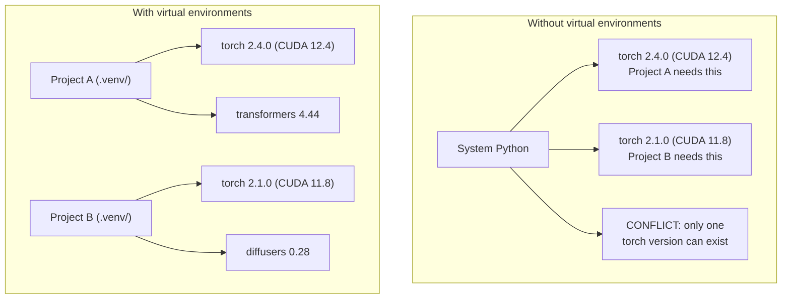

# पायथन वातावरण

> आश्रय नरक, वास्तविकता में मौजूद है।

**Type:** Build
**Languages:** Shell
**Prerequisites:** Phase 0, Lesson 01
**Time:** ~30 分钟

## सीखने के लक्ष्य

- उपयोग `uv``venv`या `conda`पृथक आभासी वातावरण का निर्माण
- 编写带有可选依赖群的 `pyproject.toml`, और लॉकफ़ाइल उत्पन्न करने के लिए सुनिश्चित करने के लिए पुनः प्रयोज्य
- 诊断并修复常见陷:वैश्विक स्थापनाएँ、pip/conda 混用、CUDA संस्करण असंगतताएँ
- संघर्ष निर्भरता के लिए परियोजनाओं को चरणबद्ध रूप से पर्यावरण रणनीति को प्राप्त करना

## 问题

आप एक ठीक-ट्यूनिंग परियोजना के लिए PyTorch 2.4 स्थापित किया है, अगला सप्ताह, दूसरे परियोजना के लिए PyTorch 2.1 की जरूरत है, क्योंकि इसके CUDA निर्माण फिक्स्ड है, आप पूर्ण स्तर पर उन्नयन के बाद, पहली परियोजना खराब है, आप गिरावट के बाद, दूसरी परियोजना फिर खराब है।

यह निर्भरता नरक है। यह अक्सर एआई/एमएल के काम में होता है, क्योंकि:

- PyTorch、JAX 和 TensorFlow प्रत्येक अपने स्वयं के CUDA बंधन के साथ ले
- मॉडल पुस्तकालयों को विशिष्ट ढांचे के संस्करणों को तय किया जाएगा
- 全局 `pip install`会覆盖 पहले से मौजूद सामग्री
- CUDA 11.8 निर्माण करता है 不能与 CUDA 12.x ड्राइवर 配合使用,反之亦然

समाधानः प्रत्येक परियोजना का अपना अलग वातावरण तथा अपने स्वयं के पैकेज होते हैं।

## 概念




```figure
s0-env-isolation
```

## इसे बनाओ

### 选项 1:uv venv(推)

`uv`यह एक उपकरण में वर्चुअल वातावरणों को संभालती है, पायथन संस्करणों और निर्भरता संकल्प में है।

```bash
curl -LsSf https://astral.sh/uv/install.sh | sh

uv python install 3.12

cd your-project
uv venv
source .venv/bin/activate
```

संचयन पैकेजः

```bash
uv pip install torch numpy
```

एक कदम निर्माण `pyproject.toml`परियोजना:

```bash
uv init my-ai-project
cd my-ai-project
uv add torch numpy matplotlib
```

### 选项 2:venv(内置)

यदि आप इसे स्थापित नहीं कर सकते हैं `uv`,पायथन स्वयात्रा`venv`:

```bash
python3 -m venv .venv
source .venv/bin/activate  # Linux/macOS
.venv\Scripts\activate     # Windows

pip install torch numpy
```

तुलना`uv`धीमी, लेकिन पायथन के स्थानों में स्थापित किया गया है सब काम कर सकते हैं।

### 选项 3:conda(需要时使用)

Conda 管理 CUDA toolkits、cuDNN 和 C पुस्तकालय等非 पायथन निर्भरताएँ──在以下情况下使用它:

- आप विशिष्ट CUDA टूलकिट संस्करण की जरूरत है, लेकिन सिस्टम-व्यापी स्थापना में नहीं करना चाहते
- आप साझा क्लस्टर ऊपर, सिस्टम पैकेज स्थापित करने में असमर्थ हैं
- 某某图书馆的安装说明写着 使用公寓

```bash
# Install miniconda (not the full Anaconda)
curl -LsSf https://repo.anaconda.com/miniconda/Miniconda3-latest-Linux-x86_64.sh -o miniconda.sh
bash miniconda.sh -b

conda create -n myproject python=3.12
conda activate myproject

conda install pytorch torchvision torchaudio pytorch-cuda=12.4 -c pytorch -c nvidia
```

एक नियमः यदि आप किसी वातावरण में कॉंडा का उपयोग करते हैं, तो उस वातावरण में सभी पैकेजों का प्रबंधन कॉंडा से करें।`pip install`混进 conda env会造成依赖冲突,而且调试起来很痛苦──

### इस कोर्स में चरण के अनुसार रणनीति

आप पूरे वर्ग के लिए एक वातावरण बना सकते हैं। ऐसा मत करो। विभिन्न चरणों में विभिन्न निर्भरताएं होती हैं।

策略:

```
ai-engineering-from-scratch/
├── .venv/                    <-- phases 0-3 共用的轻量 env
├── phases/
│   ├── 04-neural-networks/
│   │   └── .venv/            <-- PyTorch env
│   ├── 05-cnns/
│   │   └── .venv/            <-- 同一个 PyTorch env（symlink 或 shared）
│   ├── 08-transformers/
│   │   └── .venv/            <-- 可能需要不同的 transformer versions
│   └── 11-llm-apis/
│       └── .venv/            <-- API SDKs，不需要 torch
```

`code/env_setup.sh`मध्य लिपि इस पाठ्यक्रम के लिए आधार वातावरण का निर्माण करेगा।

## pyproject.toml 基础

प्रत्येक पायथन परियोजना एक होना चाहिए`pyproject.toml`यह एक फ़ाइल के साथ प्रतिस्थापित किया गया है `setup.py``setup.cfg`和 `requirements.txt`

```toml
[project]
name = "ai-engineering-from-scratch"
version = "0.1.0"
requires-python = ">=3.11"
dependencies = [
    "numpy>=1.26",
    "matplotlib>=3.8",
    "jupyter>=1.0",
    "scikit-learn>=1.4",
]

[project.optional-dependencies]
torch = ["torch>=2.3", "torchvision>=0.18"]
llm = ["anthropic>=0.39", "openai>=1.50"]
```

फिर स्थापित करेंः

```bash
uv pip install -e ".[torch]"    # base + PyTorch
uv pip install -e ".[llm]"     # base + LLM SDKs
uv pip install -e ".[torch,llm]" # everything
```

## तालाबंदी

लॉकफ़ाइल प्रत्येक निर्भरता को निश्चित संस्करण तक तय करेगी। यह सुनिश्चित करता हैः लॉकफ़ाइल से कोई भी पूरी तरह से एक ही पैकेज प्राप्त करेगा।

```bash
# uv generates uv.lock automatically when using uv add
uv add numpy

# pip-tools approach
uv pip compile pyproject.toml -o requirements.lock
uv pip install -r requirements.lock
```

अपने लॉक फ़ाइल को प्रतिबद्ध करें तक Git. अन्य लोगों के क्लोन रेपो के बाद, लॉक फ़ाइल से स्थापना, हम पूरी तरह से संगत संस्करण प्राप्त होगा.

## 常见错误

### 1. पूर्ण स्थापना

```bash
pip install torch  # BAD: installs to system Python

source .venv/bin/activate
pip install torch  # GOOD: installs to virtual environment
```

 चेकअप अपने पैकेज 会安装到哪里:

```bash
which python       # should show .venv/bin/python, not /usr/bin/python
which pip           # should show .venv/bin/pip
```

### 2. 混用 pip 和 conda

```bash
conda create -n myenv python=3.12
conda activate myenv
conda install pytorch -c pytorch
pip install some-other-package   # BAD: can break conda's dependency tracking
conda install some-other-package # GOOD: let conda manage everything
```

यदि आपको कॉम्पाइन में पाइप का उपयोग करना है तो कुछ पैकेज केवल पाइप का समर्थन करते हैं, पहले सभी कॉम्पाइन पैकेज स्थापित करें, अंतिम में पाइप पैकेज पुनः स्थापित करें।

### 3. 忘记 सक्रिय करें

```bash
python train.py           # uses system Python, missing packages
source .venv/bin/activate
python train.py           # uses project Python, packages found
```

你的 shell prompt 应显示 पर्यावरण का नाम:

```
(.venv) $ python train.py
```

### 4. इसे . . . . . . . . . . . . . . . . . . . . . . . . . . . . . . . . . . . . . . . . . . . . . . . . . . . . . . . . . . . . . . . . . . . . . . . . . . . . . . . . . . . . . . . . . . . . . . . . . . . . . . . . . . . . . . . . . . . . . . . . . . . . . . . . . . . . . . . . . . . . . . . . . . . . . . . . . . . . . . . . . . . . . . . . . . . . . . . . . . . . . . . . . . . . . . . . . . . . . . . . . . . . . . . . . . . . . . . . . . . . . . . . . . . . . . . . . . . . . . . . . . . . . . . . . . . . . . . . . . . . . . . . . . . . . . . . . . . . . . . . . . . . . . . . . . . . . . . . . . . . . . . . . . . . . . . . . . . . . . . . . . . . . . . . . . . . . . . . . . . . . . . . . . . . . . . . . . . . . . . . . . . . . . . . . . . . . . . . . . . . . . . . . . . . . . . . . . . . . . . . . . . . . . . . . . . . . . . . . . . . . . . . . . . . . . . . . . . . . . . . . . . . . . . . . . . . . . . . . . . . . . . . . . . . . . . . . . . . . . . . . . . . . . . . . . . . . . . . . . . . . . . . . . . . .

```bash
echo ".venv/" >> .gitignore
```

वर्चुअल वातावरण में आमतौर पर 200MB-2GB होते हैं। वे स्थानीय होते हैं, और मशीनों के बीच स्थानांतरित नहीं किए जा सकते हैं।`pyproject.toml`和 लॉकफ़ाइल

### 5. CUDA संस्करण असंगत

```bash
nvidia-smi                # shows driver CUDA version (e.g., 12.4)
python -c "import torch; print(torch.version.cuda)"  # shows PyTorch CUDA version

# These must be compatible.
# PyTorch CUDA version must be <= driver CUDA version.
```

## इसका प्रयोग करें

运行 सेटअप स्क्रिप्ट  अपने पाठ्यक्रम वातावरण का निर्माण करें:

```bash
bash phases/00-setup-and-tooling/06-python-environments/code/env_setup.sh
```

यह रेपो रूट में होगा  एक बनाने `.venv`,并安装和验证 कोर निर्भरताएँ──

## अभ्यास

1. 运行 `env_setup.sh`सभी जांच की पुष्टि की
2.  create a second virtual environment, in which install different versions of numpy,并 confirm two environments  mutually isolated 
3. एक साथ PyTorch और मानव SDK के परियोजना की आवश्यकता 编写 `pyproject.toml`
4. इसलिए, एक पैकेज स्थापित करना, इसे देखने के लिए, और फिर इसे उतारने के लिए।

## 关键术语

| Term | What people say | What it actually means |
|------|----------------|----------------------|
| Virtual environment | “A venv” | 一个隔离目录，包含 Python interpreter 和 packages，并与 system Python 分离 |
| Lockfile | “Pinned dependencies” | 一个列出每个 package 及其精确 version 的文件，保证跨机器安装一致 |
| pyproject.toml | “The new setup.py” | 标准 Python project 配置文件，替代 setup.py/setup.cfg/requirements.txt |
| Transitive dependency | “A dependency of a dependency” | Package B 依赖 C；如果你安装依赖 B 的 A，那么 C 就是 A 的 transitive dependency |
| CUDA mismatch | “My GPU isn't working” | PyTorch 编译所用的 CUDA version 与你的 GPU driver 支持的版本不同 |
