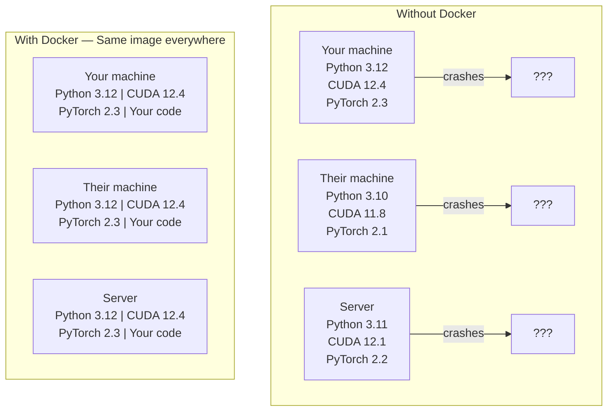

# एआई के लिए डॉकर

> कंटेनरों को मेरे यंत्र पर चलाने में सक्षम बनाओ।

**Type:** Build
**Languages:** Docker
**Prerequisites:** Phase 0, Lessons 01 and 03
**Time:** ~60 分钟

## सीखने के लक्ष्य

- Docker फ़ाइल से  GPU के Docker छवि सक्षम बनाने, CUDA, PyTorch और AI पुस्तकालयों शामिल
- होस्ट निर्देशिकाओं को मात्रा के रूप में माउंट करने के लिए, कंटेनर पुनर्निर्माण के बीच स्थाई मॉडल, डेटासेट और कोड
-  configure NVIDIA कंटेनर टूलकिट, कन्टेनर 内部 GPUs तक पहुँचने के लिए
- उपयोग Docker रचना 编排多服务 एआई अनुप्रयोगों(इन्फरेंस सर्वर + वेक्टर डेटाबेस)

## 问题

आप लैपटॉप पर PyTorch 2.3、CUDA 12.4 और Python 3.12 का उपयोग करते हैं  प्रशिक्षण एक मॉडल ∙ आपके सहकर्मी PyTorch 2.1、CUDA 11.8 और Python 3.10 का उपयोग करते हैं ∙ आपका मॉडल उनके मशीनों पर दुर्घटनाग्रस्त हो गया है ∙ आपका डॉकरफ़ाइल दोनों तरफ काम कर सकता है ∙

एआई परियोजनाएं निर्भरता की दुःस्वप्न हैं। एक विशिष्ट स्टैक में पायथन, पायटॉर्च, क्यूडीए ड्राइवर, क्यूडीएनएन, सिस्टम-स्तरीय सी पुस्तकालय, और फ्लैश-एटएन जैसे विशिष्ट संकलक संस्करणों के विशेष पैकेज शामिल हैं। डॉकर इन सभी को एक छवि में पैक करेगा, और कहीं भी उसी तरह से संचालित करेगा।

## 概念

डॉकर आपके कोड, रनटाइम, पुस्तकालयों और सिस्टम टूल को कंटेनर नामक एक पृथक इकाई में इकट्ठा करेगा। इसे एक हल्के वर्चुअल मशीन के रूप में देखा जा सकता है, बस यह होस्ट ओएस के kernel को साझा करता है, अपने स्वयं के kernel को चलाने के बजाय, इसलिए इसे लॉन्च करने में कुछ सेकंड लगते हैं, कुछ मिनटों के बजाय।



### क्यों AI परियोजनाओं अधिकांश परियोजनाओं की तुलना में अधिक Docker की जरूरत है

1. **GPU drivers 很脆弱。**CUDA 12.4 कोड 不能在 CUDA 11.8 上运行──Docker 会隔离容器内 CUDA टूलकिट,同时通过NVIDIA कंटेनर टूलकिट共享主机GPU चालक──

2. **Model weights 很大。**एक 7B पैरामीटर मॉडल fp16 में नीचे 14 GB है──आप नहीं सोचेंगे प्रत्येक बार पुनर्निर्माण में इसे पुनः डाउनलोड करें── डॉकर मात्रा आप होस्ट माउंट से एक मॉडल निर्देशिका 

3. **Multi-service architectures 很常见。**एक वास्तविक एआई अनुप्रयोग केवल एक पायथन स्क्रिप्ट नहीं है। यह एक अनुमान सर्वर है। RAG के वेक्टर डेटाबेस के लिए उपयोग किया जाता है।

### 关键词汇

| Term | What it means |
|------|---------------|
| Image | 只读 template。你的 recipe。由 Dockerfile 构建。 |
| Container | image 的运行实例。你的 kitchen。 |
| Dockerfile | 构建 image 的 instructions。逐层构建。 |
| Volume | 可在 container restarts 后保留的持久化 storage。 |
| docker-compose | 用 YAML 定义 multi-container applications 的工具。 |

### कंटेनर पैटर्न

```
Dev Container
  完整 toolkit。Editor support。Jupyter。Debugging tools。
  用于 development 和 experimentation。

Training Container
  最小化。只有 training script 和 dependencies。
  在 GPU clusters 上运行。没有 editor，没有 Jupyter。

Inference Container
  为 serving 优化。Small image。Fast cold start。
  在 production 中运行于 load balancer 后方。
```


```figure
s0-image-layers
```

## इसे बनाओ

### चरण 1: डॉकर को स्थापित करें

```bash
# macOS
brew install --cask docker
open /Applications/Docker.app

# Ubuntu
curl -fsSL https://get.docker.com | sh
sudo usermod -aG docker $USER
# Log out and back in for group change to take effect
```

验证:

```bash
docker --version
docker run hello-world
```

### चरण 2: NVIDIA कंटेनर टूलकिट स्थापित करें(带 NVIDIA GPU 的 Linux)

यह डॉकर कंटेनर को आपके GPU को एक्सेस करने में सक्षम बनाता है। macOS और Windows में, उपयोगकर्ता डॉकर डेस्कटॉप को इन प्लेटफार्मों पर अलग-अलग तरीकों से GPU को संसाधित करने में सक्षम होते हैं।

```bash
distribution=$(. /etc/os-release;echo $ID$VERSION_ID)
curl -fsSL https://nvidia.github.io/libnvidia-container/gpgkey | sudo gpg --dearmor -o /usr/share/keyrings/nvidia-container-toolkit-keyring.gpg
curl -s -L https://nvidia.github.io/libnvidia-container/$distribution/libnvidia-container.list | \
    sed 's#deb https://#deb [signed-by=/usr/share/keyrings/nvidia-container-toolkit-keyring.gpg] https://#g' | \
    sudo tee /etc/apt/sources.list.d/nvidia-container-toolkit.list

sudo apt-get update
sudo apt-get install -y nvidia-container-toolkit
sudo nvidia-ctk runtime configure --runtime=docker
sudo systemctl restart docker
```

कंटेनर में परीक्षण GPU पहुंचः

```bash
docker run --rm --gpus all nvidia/cuda:12.4.1-base-ubuntu22.04 nvidia-smi
```

यदि आप GPU जानकारी देखा है, तो उपकरण सेट को स्पष्ट करें

### चरण 3: आधार चित्रों को समझना

选择正确的基image可以节省数小时调试时间──

```
nvidia/cuda:12.4.1-devel-ubuntu22.04
  完整 CUDA toolkit。包含 compilers。
  Use for: 构建需要 nvcc 的 packages（flash-attn、bitsandbytes）
  Size: ~4 GB

nvidia/cuda:12.4.1-runtime-ubuntu22.04
  仅 CUDA runtime。没有 compilers。
  Use for: 运行 pre-built code
  Size: ~1.5 GB

pytorch/pytorch:2.3.1-cuda12.4-cudnn9-runtime
  基于 CUDA 预装 PyTorch。
  Use for: 跳过 PyTorch install step
  Size: ~6 GB

python:3.12-slim
  没有 CUDA。仅 CPU。
  Use for: CPU inference、lightweight tools
  Size: ~150 MB
```

### चरण 4: एआई विकास के लिए 编写 डॉकरफाइल

यह है`code/Dockerfile`मध्य में डॉकरफ़ाइल──逐段看一下:

```dockerfile
FROM nvidia/cuda:12.4.1-devel-ubuntu22.04

ENV DEBIAN_FRONTEND=noninteractive
ENV PYTHONUNBUFFERED=1

RUN apt-get update && apt-get install -y --no-install-recommends \
    python3.12 \
    python3.12-venv \
    python3.12-dev \
    python3-pip \
    git \
    curl \
    build-essential \
    && rm -rf /var/lib/apt/lists/*

RUN update-alternatives --install /usr/bin/python python /usr/bin/python3.12 1

RUN python -m pip install --no-cache-dir --upgrade pip setuptools wheel

RUN python -m pip install --no-cache-dir \
    torch==2.3.1 \
    torchvision==0.18.1 \
    torchaudio==2.3.1 \
    --index-url https://download.pytorch.org/whl/cu124

RUN python -m pip install --no-cache-dir \
    numpy \
    pandas \
    scikit-learn \
    matplotlib \
    jupyter \
    transformers \
    datasets \
    accelerate \
    safetensors

WORKDIR /workspace

VOLUME ["/workspace", "/models"]

EXPOSE 8888

CMD ["python"]
```

इसे बनाएँ:

```bash
docker build -t ai-dev -f phases/00-setup-and-tooling/07-docker-for-ai/code/Dockerfile .
```

पहली बार होगा कुछ समय खर्च करना होगा.

运行它:

```bash
docker run --rm -it --gpus all \
    -v $(pwd):/workspace \
    -v ~/models:/models \
    ai-dev python -c "import torch; print(f'PyTorch {torch.__version__}, CUDA: {torch.cuda.is_available()}')"
```

कंटेनर में ज्यूपायटर का संचालनः

```bash
docker run --rm -it --gpus all \
    -v $(pwd):/workspace \
    -v ~/models:/models \
    -p 8888:8888 \
    ai-dev jupyter notebook --ip=0.0.0.0 --port=8888 --no-browser --allow-root
```

### चरण 5: डेटा और मॉडल के लिए उपयोग किया जाने वाला वॉल्यूम माउंट

AI के लिए मात्रा बढ़ जाती है 工作至关重要──没有它们,你的14GB模型下载会在容器中 停止后消失──

```bash
# Mount your code
-v $(pwd):/workspace

# Mount a shared models directory
-v ~/models:/models

# Mount datasets
-v ~/datasets:/data
```

अपने प्रशिक्षण स्क्रिप्ट में, सवार पथ से लोडः

```python
from transformers import AutoModel

model = AutoModel.from_pretrained("/models/llama-7b")
```

मॉडल  स्थित है अपने होस्ट फ़ाइल सिस्टम 上── आप किसी भी तरह कंटेनर पुनर्निर्माण कर सकते हैं, और कोई आवश्यकता नहीं पुनः डाउनलोड करना──

### चरण 6: बहु-सेवा एआई अनुप्रयोगों के लिए Docker Composer

एक वास्तविक RAG अनुप्रयोग  निष्कर्षण सर्वर और वेक्टर डेटाबेस की आवश्यकता है── डॉकर कम्पोज प्रयोग एक条命令运行两者──

见 `code/docker-compose.yml`:

```yaml
services:
  ai-dev:
    build:
      context: .
      dockerfile: Dockerfile
    deploy:
      resources:
        reservations:
          devices:
            - driver: nvidia
              count: all
              capabilities: [gpu]
    volumes:
      - ../../../:/workspace
      - ~/models:/models
      - ~/datasets:/data
    ports:
      - "8888:8888"
    stdin_open: true
    tty: true
    command: jupyter notebook --ip=0.0.0.0 --port=8888 --no-browser --allow-root

  qdrant:
    image: qdrant/qdrant:v1.12.5
    ports:
      - "6333:6333"
      - "6334:6334"
    volumes:
      - qdrant_data:/qdrant/storage

volumes:
  qdrant_data:
```

启动所有服务:

```bash
cd phases/00-setup-and-tooling/07-docker-for-ai/code
docker compose up -d
```

अब आपका एआई डेव कंटेनर सेवा नाम के माध्यम से किया जा सकता है`http://qdrant:6333`访问 वेक्टर डेटाबेस──Docker Compose 会自动创建共享网络──

AI कंटेनर से 内测试连接:

```python
from qdrant_client import QdrantClient

client = QdrantClient(host="qdrant", port=6333)
print(client.get_collections())
```

停止所有服务:

```bash
docker compose down
```

                `-v`भी हटा देंगे qdrant मात्राः

```bash
docker compose down -v
```

### चरण 7: एआई 工作中实用 डॉकर कमांड

```bash
# List running containers
docker ps

# List all images and their sizes
docker images

# Remove unused images (reclaim disk space)
docker system prune -a

# Check GPU usage inside a running container
docker exec -it <container_id> nvidia-smi

# Copy a file from container to host
docker cp <container_id>:/workspace/results.csv ./results.csv

# View container logs
docker logs -f <container_id>
```

## इसका प्रयोग करें

आप अब एक पुनः प्रयोज्य एआई विकास वातावरण के मालिक हैंः

- उपयोग `docker compose up`अपने डेवलपर वातावरण और वेक्टर डेटाबेस के साथ ही शुरू
- कोड, मॉडल और डेटा को माउंट करने के लिए, पुनर्निर्माण के बीच कोई भी सामग्री नहीं खोना सुनिश्चित करें
- जब किसी पाठ के भाग के लिए एक नया पायथन पैकेज की जरूरत है, इसे जोड़ने के लिए Docker फ़ाइल और पुनर्निर्माण
- टीम के साथ अपनी डॉकर फ़ाइल साझा करें. उन्हें पूरी तरह से एक ही वातावरण मिलेगा.

### पीजीपी नहीं है?

移除 `--gpus all`ध्वज 和 NVIDIA डिप्लोय ब्लॉक── कंटेनर  अभी भी सीपीयू आधारित पाठों के लिए लागू होते हैं──PyTorch 会自动检测没有CUDA,并倒退到CPU──

## अभ्यास

1. Construct Dockerfile, और कंटेनर में अंदर运行 `python -c "import torch; print(torch.__version__)"`
2.  डॉकर-कंपोज स्टैक को प्रारंभ करें,并验证可从AI कंटेनर 访问 `http://qdrant:6333/collections`ऊपर का Qdrant
3. `flask`添加到Dockerfile,rebuild, और बंदरगाह 5000 上运行一个简单API सर्वर──使用 `-p 5000:5000`नक्शा 端口
4. उपयोग `docker images`测量图像大小──试把基image 从 `devel`切换到 `runtime`,并比较大小

## 关键术语

| Term | What people say | What it actually means |
|------|----------------|----------------------|
| Container | “Lightweight VM” | 使用 host kernel 的隔离进程，拥有自己的 filesystem 和 network |
| Image layer | “Cached step” | 每条 Dockerfile instruction 都会创建一个 layer。未变化的 layers 会被 cached，因此 rebuilds 很快。 |
| NVIDIA Container Toolkit | “GPU in Docker” | 一个 runtime hook，通过 `--gpus` flag 将 host GPUs 暴露给 containers |
| Volume mount | “Shared folder” | host 上映射进 container 的目录。container 停止后 changes 仍会保留。 |
| Base image | “Starting point” | 你的 Dockerfile 基于其构建的 `FROM` image。它决定了预装内容。 |
