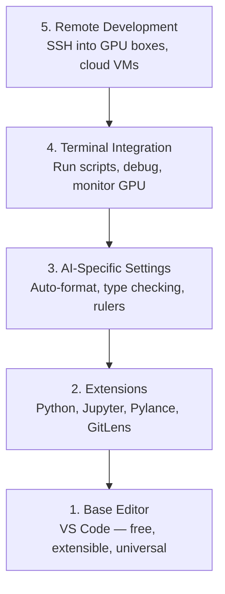

# संपादक सेटअप

> आपका संपादक आपका सहयोग करने वाला है। इसे एक बार में कॉन्फ़िगर करें, इसे रोकें और वास्तव में काम करना शुरू करें।

**Type:** Build
**Languages:** --
**Prerequisites:** Phase 0, Lesson 01
**Time:** ~20 分钟

## 学习目标
- VS कोड स्थापित करें, और Python, Jupyter, Linting और दूरस्थ SSH आवश्यक कोर एक्सटेंशन को कॉन्फ़िगर करें
- AI कार्यप्रवाहों के लिए  स्वरूप-ऑन-सेव प्रकार की जांच और नोटबुक आउटपुट स्क्रॉल
-  कॉन्फ़िगर रिमोट SSH, जैसे संपादन स्थानीय कोड दूरस्थ GPU  मशीन पर संपादन और डिबग  कोड
- 评估其他编辑器选择(Cursor、Windsurf、Neovim) तथा उनके एआई कार्य में उनके लिए

## 问题
आप संपादक में हजारों घंटे खर्च करेंगेः पायथन लिखना, नोटबुक चलाना, डिबग प्रशिक्षण लूप, साथ ही SSH से GPU मशीनों तक।

सही तैनाती केवल 20 मिनट में होती है।

## 概念
एआई इंजीनियरिंग के संपादक विन्यास के लिए पांच चीजें चाहिएः




```figure
s0-lsp-roundtrip
```

##  इसे निर्माण
### 步骤 1: VS कोड स्थापित करें

 VS Code का उपयोग करने की सिफारिश करें── यह मुफ़्त है, सभी OS पर चल सकता है── Jupyter नोटबुक के लिए एक流 समर्थन है, और एक्सटेंशन पर्यावरण एआई काम की आवश्यकताओं को कवर करता है──

से [code.visualstudio.com](https://code.visualstudio.com/)नीचे लो

टर्मिनल में परीक्षणः

```bash
code --version
```

यदि macOS 上找不到 `code`,打开 VS कोड,按 `Cmd+Shift+P`,输入 "शेल कमांड", फिर चयन "PATH में 'कोड' कमांड स्थापित करें"

### 步骤 2: स्थापना आवश्यक विस्तार

VS कोड में में एक एकीकृत टर्मिनल खोलें`Ctrl+`` `या `` Cmd+```),安装 AI काम 需要的扩展:

```bash
code --install-extension ms-python.python
code --install-extension ms-python.vscode-pylance
code --install-extension ms-toolsai.jupyter
code --install-extension eamodio.gitlens
code --install-extension ms-vscode-remote.remote-ssh
code --install-extension ms-python.debugpy
code --install-extension ms-python.black-formatter
code --install-extension charliermarsh.ruff
```

प्रत्येक विस्तार का प्रभावः

| Extension | Why |
|-----------|-----|
| Python | Language 支持、virtual env 检测、run/debug |
| Pylance | 快速 type checking、autocomplete、import resolution |
| Jupyter | 在 VS Code 内运行 notebooks、variable explorer |
| GitLens | 查看谁改了什么、inline git blame |
| Remote SSH | 像本地一样打开远程 GPU 机器上的文件夹 |
| Debugpy | Python 的 step-through debugging |
| Black Formatter | 保存时自动格式化，保持风格一致 |
| Ruff | 快速 linting，捕获常见错误 |

本课中 `code/.vscode/extensions.json`文件包含完整推列表──当你打开项目文件时,VS Code 会提示你安装它们──

### 步骤 3: कॉन्फ़िगरेशन सेटिंग

复制本课 `code/.vscode/settings.json`मध्य सेटिंग्स, या के माध्यम से `Settings > Open Settings (JSON)`हाथ से आवेदन

एआई काम की महत्वपूर्ण सेटिंग्सः

```jsonc
{
    "python.analysis.typeCheckingMode": "basic",
    "editor.formatOnSave": true,
    "editor.rulers": [88, 120],
    "notebook.output.scrolling": true,
    "files.autoSave": "afterDelay"
}
```

क्यों ये महत्वपूर्ण हैंः

- **Type checking on basic**: में运行前捕获错误的参数类型──能节省 डिबग Tensor आकार असंगत 和错误 API मापदंडों का समय──
- **Format on save**: फिर भी विचार करने की आवश्यकता नहीं है स्वरूपण.
- **Rulers at 88 and 120**: ब्लैक में 88 处换行──120 标记显示 docstrings 和 comments 什么时候过长──
- **Notebook output scrolling**प्रशिक्षण लूप्स 会印数千行──没有滚动时,输出板 会无限膨胀──
- **Auto-save**:You will forget save. आपका प्रशिक्षण स्क्रिप्ट पुराने कोड को चलाने के लिए होगा.

### 步骤 4: टर्मिनल 集成

VS Code का एकीकृत टर्मिनल है 您运行培训脚本、监控GPU、管理环境的地方──

सही ढंग से इसे कॉन्फ़िगर करेंः

```jsonc
{
    "terminal.integrated.defaultProfile.osx": "zsh",
    "terminal.integrated.defaultProfile.linux": "bash",
    "terminal.integrated.fontSize": 13,
    "terminal.integrated.scrollback": 10000
}
```

उपयोगी त्वरित कुंजीः

| Action | macOS | Linux/Windows |
|--------|-------|---------------|
| Toggle terminal | `` Ctrl+` `` | `` Ctrl+` `` |
| New terminal | `Ctrl+Shift+`` ` | `Ctrl+Shift+`` ` |
| Split terminal | `Cmd+\` | `Ctrl+\` |

विभाजित टर्मिनल  बहुत उपयोगीः एक आपके स्क्रिप्ट को चलाने के लिए उपयोग किया जाता है, अन्य उपयोग किया जाता है `nvidia-smi -l 1`या `watch -n 1 nvidia-smi`监控 GPU──

### 步骤 5:远程开发(SSH तक GPU 机器)

यह एआई काम का सबसे महत्वपूर्ण विस्तार है। आप दूरस्थ मशीनों पर प्रशिक्षण चलाने के लिए होंगे।

सेटअपः

1. स्थापना दूरस्थ SSH विस्तार ((已在 चरण 2 完成)
2. 按 `Ctrl+Shift+P`(या `Cmd+Shift+P`),输入 "Remote-SSH: Host से कनेक्ट करें"──
3. 输入 `user@your-gpu-box-ip`
4. वीएस कोड स्वचालित रूप से दूरस्थ मशीन पर इसके सर्वर घटक स्थापित करेगा.

यदि पासवर्ड रहित पहुँच की आवश्यकता है, तो SSH कुंजी कॉन्फ़िगर करेंः

```bash
ssh-keygen -t ed25519 -C "your-email@example.com"
ssh-copy-id user@your-gpu-box-ip
```

为了方便,把主播 添加到 `~/.ssh/config`:

```
Host gpu-box
    HostName 203.0.113.50
    User ubuntu
    IdentityFile ~/.ssh/id_ed25519
    ForwardAgent yes
```

现在 `Remote-SSH: Connect to Host > gpu-box` 会立即连接──

## विकल्प

### कर्सर

[cursor.com](https://cursor.com)यह एक अंतर्निहित एआई कोड पीढ़ी का VS कोड कांटा है। यह एक ही विस्तार का उपयोग करता है।`settings.json`和 `extensions.json`

### विंडसर्फ

[windsurf.com](https://windsurf.com)यह एक और AI-first VS Code fork है। स्थिति समान हैः समान एक्सटेंशन, समान सेटिंग्स, समान रिमोट SSH 支持।

### वीम/नियोवम

यदि आप Vim या Neovim का उपयोग कर चुके हैं और इसकी दक्षता बहुत अधिक है, तो AI Python काम के लिए न्यूनतम विन्यास का उपयोग करना जारी रखेंः

- **pyright**या **pylsp**प्रकार की जाँच के लिए प्रयोग किया गया है (मेसन या हाथ से स्थापित)
- **nvim-lspconfig**भाषा सर्वर एकीकरण के लिए उपयोग किया
- **jupyter-vim**या **molten-nvim**नोटबुक की तरह निष्पादन के लिए उपयोग किया
- **telescope.nvim**फ़ाइल / प्रतीक खोज के लिए उपयोग किया
- **none-ls.nvim**搭配 काला 和 ruff स्वरूपण/लैंकिंग के लिए उपयोग किया जाता है

यदि आप अभी तक विम का उपयोग नहीं कर रहे हैं, तो अभी शुरू न करें।

## इसका उपयोग करें
इस सेट के साथ, आपके दैनिक कार्यप्रवाह इस तरह दिखता हैः

1. VS Code में परियोजना फ़ोल्डर खोलें (या रिमोट SSH के माध्यम से GPU मशीन से कनेक्ट करें)
2. संपादक में संपादन पायथन, ऑटो-पूर्ण उपयोग करें, टाइप सुझाव और इनलाइन त्रुटियों
3. उपयोग ज्युपिटर एक्सटेंशन 内联运行 ज्युपिटर नोटबुक。
4. 运行 प्रशिक्षण स्क्रिप्टों का उपयोग करें`uv pip install`और जीपीयू निगरानी
5. 提交前用 GitLens समीक्षा परिवर्तनों。

## अभ्यास
1. स्थापना VS कोड और चरण 2 में सूचीबद्ध सभी एक्सटेंशन
2.  将本课的`settings.json`复制到你的 VS कोड कॉन्फ़िग 中
3. 打开一个Python文件,验证Pylance 显示类型提示,并且黑会在保存时格式化
4. यदि आप दूरस्थ मशीन का उपयोग कर सकते हैं, तो रिमोट SSH कॉन्फ़िगर करें और उस पर एक फ़ाइल खोलें

## 关键术语
| Term | What people say | What it actually means |
|------|----------------|----------------------|
| LSP | "Autocomplete engine" | Language Server Protocol：一种标准，让 editors 可以从特定 language 的 server 获取 type info、completions 和 diagnostics |
| Pylance | "The Python plugin" | Microsoft 的 Python language server，使用 Pyright 进行 type checking 和 IntelliSense |
| Remote SSH | "Working on the server" | VS Code extension，在远程机器上运行轻量 server，并将 UI stream 到本地 editor |
| Format on save | "Auto-prettier" | 每次保存时 editor 都会运行 formatter（Black、Ruff），因此 code style 始终一致 |
