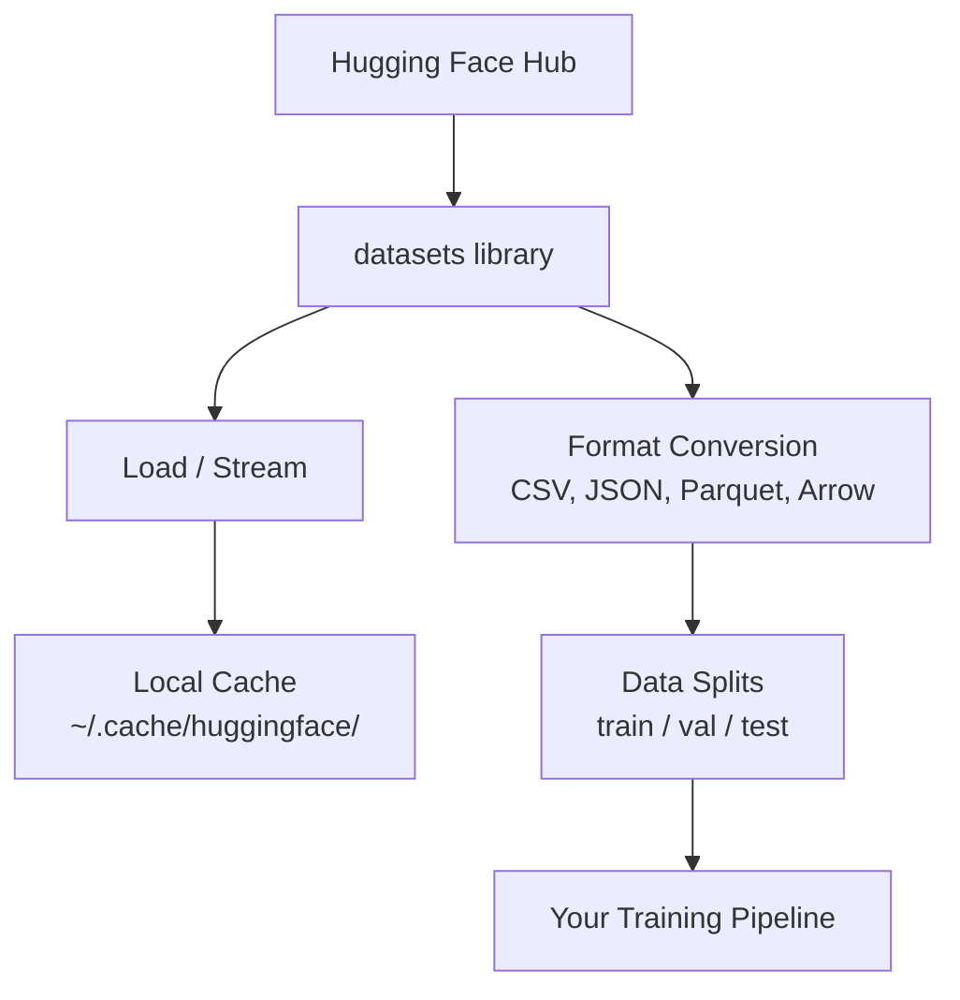

# डेटा प्रबंधन

> डेटा एक ईंधन है. आप इसे कैसे प्रबंधित करते हैं, यह तय करता है कि आप अधिक तेजी से चल सकते हैं.

**Type:** Build
**Language:**पायथन
**Prerequisites:** Phase 0, Lesson 01
**Time:** ~45 分钟

## 学习目标
- उपयोग गले लगाना चेहरा `datasets`पुस्तकालय 加载、流和缓存 डेटासेट
- CSV、JSON、Parquet और Arrow प्रारूपों के बीच में परिवर्तित करें, और उनके उपयोग की व्याख्या करें
- उपयोग फिक्स्ड रैंडम बीज 创建可复现的 ट्रेन/मान्यीकरण/परीक्षण विभाजन
- उपयोग `.gitignore`、Git LFS या DVC 管理 बड़े मॉडल तथा डेटासेट फ़ाइलें

## 问题
प्रत्येक एआई परियोजना डेटा से शुरू होती है। आपको डेटा सेट ढूंढने की आवश्यकता होती है, उन्हें डाउनलोड करने की आवश्यकता होती है, उन्हें प्रारूपों के बीच स्थानांतरित करने की आवश्यकता होती है, उन्हें प्रशिक्षण और मूल्यांकन के लिए विभाजित करने की आवश्यकता होती है, और उन्हें संस्करण बनाने की आवश्यकता होती है, प्रयोगों को पुनः प्राप्त करने की आवश्यकता होती है।

## 概念


गले लगाते हुए चेहरा `datasets`पुस्तकालय एआई के लिए काम करता है।


```figure
s0-data-pipeline
```

##  इसे निर्माण
### 步骤 1: डेटासेट लाइब्रेरी स्थापित करें

```bash
pip install datasets huggingface_hub
```

### 步骤 2: एक डेटासेट लोड करें

```python
from datasets import load_dataset

dataset = load_dataset("imdb")
print(dataset)
print(dataset["train"][0])
```

यह IMDB 电影评论数据集.`~/.cache/huggingface/datasets/`कैश लोड किया गया

### 步骤 3: बड़े डेटा सेट को प्रसंस्करण विधि

कुछ डेटासेट  बहुत बड़े हैं, डिस्क में पूरी तरह से नहीं डाल सकते हैं── स्ट्रीमिंग  से  तक लोड हो रही है, पूर्ण सामग्री  नहीं डाउनलोड कर रही है।

```python
dataset = load_dataset("wikimedia/wikipedia", "20220301.en", split="train", streaming=True)

for i, example in enumerate(dataset):
    print(example["title"])
    if i >= 4:
        break
```

स्ट्रीमिंग आपको एक देगा`IterableDataset`आप उन्हें संसाधित करने के लिए समय तक पंक्तियों में रहेंगे चाहे डेटासेट कितना बड़ा हो, मेमोरी उपयोग हमेशा स्थिर रहेगा

### 步骤 4: डेटासेट प्रारूप

`datasets`पुस्तकालय 底层 Apache Arrow का उपयोग करें. आप पाइपलाइन की आवश्यकता के अनुसार अन्य प्रारूपों में परिवर्तित कर सकते हैं.

```python
dataset = load_dataset("imdb", split="train")

dataset.to_csv("imdb_train.csv")
dataset.to_json("imdb_train.json")
dataset.to_parquet("imdb_train.parquet")
```

प्रारूप के लिए अनुपातः

| Format | Size | Read Speed | Best For |
|--------|------|-----------|----------|
| CSV | 大 | 慢 | Human readability、spreadsheets |
| JSON | 大 | 慢 | APIs、nested data |
| Parquet | 小 | 快 | Analytics、columnar queries |
| Arrow | 小 | 最快 | In-memory processing（`datasets` 内部使用的格式） |

AI कार्य के लिए,Parquet सबसे अच्छा भंडारण प्रारूप है──Arrow is the format you use in memory──CSV और JSON का उपयोग परस्पर विनिमय हेतु किया जाता है──

### 步骤 5: डेटा विभाजन

प्रत्येक एमएल परियोजना को तीन भागों की आवश्यकता होती हैः

- **Train**:model From यहाँ सीखना (आमतौर पर 80%)
- **Validation**:आप प्रशिक्षण प्रक्रिया में प्रगति की जांच करते हैं (आमतौर पर 10%)
- **Test**प्रशिक्षण 完成后的最终评估 (आमतौर पर 10%)

कुछ डेटासेट 已预先分割──没有时,自己分割:

```python
dataset = load_dataset("imdb", split="train")

split = dataset.train_test_split(test_size=0.2, seed=42)
train_val = split["train"].train_test_split(test_size=0.125, seed=42)

train_ds = train_val["train"]
val_ds = train_val["test"]
test_ds = split["test"]

print(f"Train: {len(train_ds)}, Val: {len(val_ds)}, Test: {len(test_ds)}")
```

始终设置种子以保证复制性──同一种子每次都产生相同的分化──

### 步骤 6: डाउनलोड并缓存模型

मॉडल बड़े दस्तावेज हैं।`huggingface_hub`पुस्तकालय 会处理 डाउनलोडिंग तथा कैशिंग

```python
from huggingface_hub import hf_hub_download, snapshot_download

model_path = hf_hub_download(
    repo_id="sentence-transformers/all-MiniLM-L6-v2",
    filename="config.json"
)
print(f"Cached at: {model_path}")

model_dir = snapshot_download("sentence-transformers/all-MiniLM-L6-v2")
print(f"Full model at: {model_dir}")
```

मॉडल को कैश किया जाएगा`~/.cache/huggingface/hub/`                                                                                                                                                                                                                                                              

### 步骤 7: बड़े फ़ाइलों को संभाल

मॉडल वजन तथा बड़े डेटा सेट git में प्रवेश नहीं करना चाहिए.

**Option A: .gitignore（最简单）**

```
*.bin
*.safetensors
*.pt
*.onnx
data/*.parquet
data/*.csv
models/
```

**Option B: Git LFS（在 git 中跟踪大型文件）**

```bash
git lfs install
git lfs track "*.bin"
git lfs track "*.safetensors"
git add .gitattributes
```

Git LFS आपके रेपो में भंडारण संकेतक, और वास्तविक फ़ाइलें एक अलग सर्वर पर संग्रहीत किया जाएगा ऊपर. GitHub  प्रदान करता है 1 GB  निः शुल्क राशि.

**Option C: DVC（data version control）**

```bash
pip install dvc
dvc init
dvc add data/training_set.parquet
git add data/training_set.parquet.dvc data/.gitignore
git commit -m "Track training data with DVC"
```

डीवीसी 会创建小型 `.dvc`文件,指向你的数据──数据本身存储在S3、GCS或其他远程存储后端中──

| Approach | Complexity | Best For |
|----------|-----------|----------|
| .gitignore | 低 | 个人项目、可重新获取的 downloaded data |
| Git LFS | 中 | 通过 git 共享 model weights 的团队 |
| DVC | 高 | 可复现 experiments、大型 datasets、团队 |

对于本课程,`.gitignore`已足够── जब आपको क्रॉस मशीन रिसेप सटीक प्रयोग 时, पुनः डीवीसी उपयोग करें──

### 步骤 8: भंडारण पैटर्न

**Local storage**                                                                                                                                                                                                                                                                                                                                                                                                                                                                                                                             

**Cloud storage** बड़े सामग्री के लिए उपयुक्त, या क्रॉस-मेकर साझा करने की आवश्यकता हैः

```python
import os

local_path = os.path.expanduser("~/.cache/huggingface/datasets/")

# s3_path = "s3://my-bucket/datasets/"
# gcs_path = "gs://my-bucket/datasets/"
```

डीवीसी सीधे एस3 और जीसीएस के साथ 集成 किया जा सकता हैः

```bash
dvc remote add -d myremote s3://my-bucket/dvc-store
dvc push
```

对于本课程,本地存储 足够──云存储会在您的远程GPU实例上进行细节调节时变得相关──

## इस कोर्स का उपयोग करने के लिए डेटासेट

| Dataset | Lessons | Size | What It Teaches |
|---------|---------|------|----------------|
| IMDB | Tokenization、classification | 84 MB | Text classification 基础 |
| WikiText | Language modeling | 181 MB | Next-token prediction |
| SQuAD | QA systems | 35 MB | Question answering、spans |
| Common Crawl (subset) | Embeddings | 不定 | Large-scale text processing |
| MNIST | Vision basics | 21 MB | Image classification fundamentals |
| COCO (subset) | Multimodal | 不定 | Image-text pairs |

आपको अब इन सबको डाउनलोड करने की आवश्यकता नहीं है। प्रत्येक वर्ग में यह समझाया जाएगा कि इसकी क्या आवश्यकता है।

## इसका उपयोग करें
运行 उपयोगिता स्क्रिप्ट 验证一切正常:

```bash
python code/data_utils.py
```

यह एक छोटा सा डेटासेट डाउनलोड करेगा, इसे परिवर्तित करेगा, इसे विभाजित करेगा, और सारांश मुद्रित करेगा।

## 交付 यह
本课产出:
- `code/data_utils.py`- पुनः प्रयोज्य डेटा लोड और कैशिंग उपयोगिता
- `outputs/prompt-data-helper.md`- उपयुक्त डेटासेट की खोज के लिए प्रयोग किया जाता है

## अभ्यास
1. उपयोग `mrpc`संरेखण 加载 `glue`डेटासेट,并检查前 5 个例子
2. धारा `c4`डेटासेट,并统计 10 秒内 में संसाधित किया जा सकता है
3. एक डेटासेट को पार्केट में परिवर्तित करना, और CSV के साथ फ़ाइल आकार को तुलना करना
4. उपयोग फिक्स्ड बीज 创建 70/15/15 ट्रेन/वॉल/टेस्ट विभाजन,并验证 आकार

## 关键术语
| Term | What people say | What it actually means |
|------|----------------|----------------------|
| Dataset split | "Training data" | 一个命名 subset（train/val/test），用于 ML lifecycle 的不同阶段 |
| Streaming | "Load it lazily" | 从远程 source 逐行处理 data，而不下载完整 dataset |
| Parquet | "Compressed CSV" | 一种 columnar file format，针对 analytical queries 和 storage efficiency 优化 |
| Arrow | "Fast dataframe" | `datasets` library 内部使用的 in-memory columnar format，用于 zero-copy reads |
| Git LFS | "Git for big files" | 一个 extension，将大型文件存储在 git repo 外，同时在 version control 中保留 pointers |
| DVC | "Git for data" | 一个用于 datasets 和 models 的 version control system，可与 cloud storage 集成 |
| Cache | "Already downloaded" | 之前获取过的 data 的本地副本，默认存储在 ~/.cache/huggingface/ |
