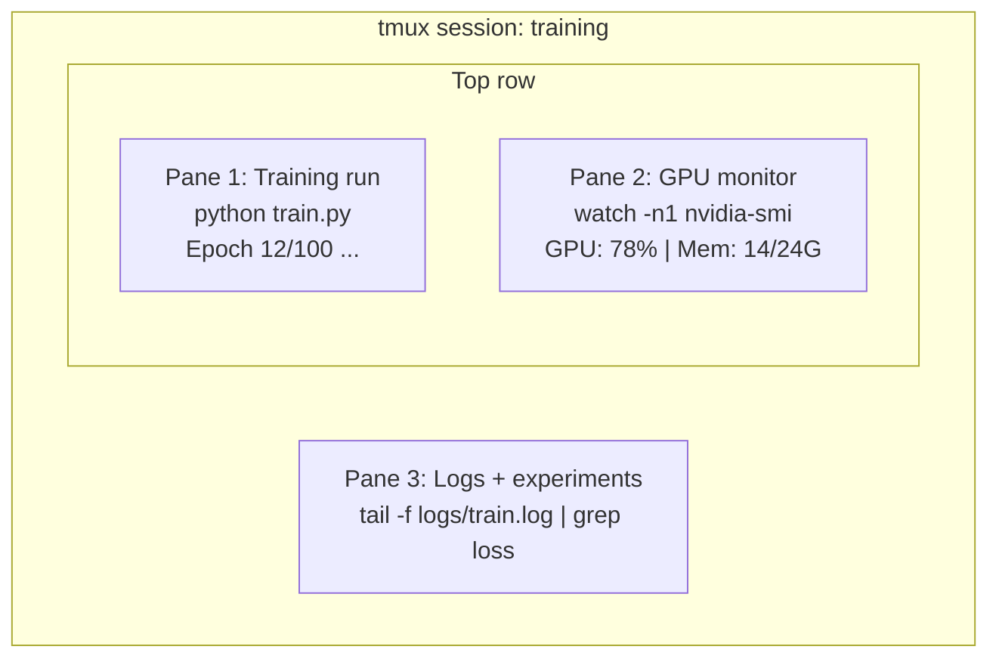

# टर्मिनल और शेल

> टर्मिनल एआई इंजीनियरों का मुख्य क्षेत्र है।

**类型：**学习
**语言：**-
**先修要求：**चरण 0, पाठ 01
**时间：**~ 35 मिनट

## 学习目标

- उपयोग पाइपिंग, रीडायरेक्ट्स और`grep`आदेश से क्रम से क्रम से क्रम से क्रम से क्रम से क्रम
- 创建包含多个面板的持久tmux सत्र,用于并发训练和GPU 监控
- उपयोग `htop``nvtop`和 `nvidia-smi` निगरानी प्रणाली तथा GPU  संसाधन
- SSH का प्रयोग करें`scp`和 `rsync`स्थानीय और दूरस्थ मशीनों के बीच संचरण फ़ाइलें

## 问题

आप टर्मिनल में समय बिताएंगे किसी भी संपादक से ज्यादा ️ प्रशिक्षण चलाने ️ GPU  निगरानी 日志 पूंछ  दूरस्थ SSH सत्र ️ पर्यावरण प्रबंधन ️ प्रत्येक AI कार्यप्रवाह को शेल से संपर्क में लाया जायेगा ️ यदि आप यहां धीमा हैं, तो कहीं भी धीमा हो जायेगा ️

本课覆盖 AI 工作真正需要的终端 技能──不讲 यूनिक्स 历史──不深入巴什脚本──只讲你需要的内容──

## 概念



तीन चीजें एक साथ चलती हैं एक टर्मिनल आप अलग हो सकते हैं, घर लौट सकते हैं, फिर SSH वापस आ सकते हैं, फिर फिर पुनः संलग्न हो सकते हैं प्रशिक्षण चलना जारी रखेगा


```figure
s0-shell-pipeline
```

##  इसे निर्माण

### 步骤 1: 了解你的贝

检查你正在运行哪个贝:

```bash
echo $SHELL
```

大多数系统使用 `bash`या `zsh` दोनों ही हो सकते हैं本课程中的命令在任意一个里都能工作

需要知道的关键内容:

```bash
# Move around
cd ~/projects/ai-engineering-from-scratch
pwd
ls -la

# History search (most useful shortcut you'll learn)
# Ctrl+R then type part of a previous command
# Press Ctrl+R again to cycle through matches

# Clear terminal
clear   # or Ctrl+L

# Cancel a running command
# Ctrl+C

# Suspend a running command (resume with fg)
# Ctrl+Z
```

### 步骤 2: पाइपिंग और पुनर्निर्देशन

पाइपिंग करेगा आदेश  कनेक्ट अप. यह है कि आप संभाल日志 过输出 串联工具. आप अक्सर उपयोग करेंगे यह है.

```bash
# Count how many times "loss" appears in a log
cat train.log | grep "loss" | wc -l

# Extract just the loss values from training output
grep "loss:" train.log | awk '{print $NF}' > losses.txt

# Watch a log file update in real time, filtering for errors
tail -f train.log | grep --line-buffered "ERROR"

# Sort experiments by final accuracy
grep "final_accuracy" results/*.log | sort -t= -k2 -n -r

# Redirect stdout and stderr to separate files
python train.py > output.log 2> errors.log

# Redirect both to the same file
python train.py > train_full.log 2>&1
```

आपको तीन रीडायरेक्ट्स को अपनाने की जरूरत हैः

| 符号 | 作用 |
|--------|-------------|
| `>` | 将 stdout 写入文件（覆盖） |
| `>>` | 将 stdout 追加到文件 |
| `2>` | 将 stderr 写入文件 |
| `2>&1` | 将 stderr 发送到与 stdout 相同的位置 |
| `\|` | 将一个 command 的 stdout 作为 stdin 发送给下一个 command |

### 步骤 3: 后台进程

प्रशिक्षण चलाने में कुछ घंटे लगते हैं.

```bash
# Run in background (output still goes to terminal)
python train.py &

# Run in background, immune to hangup (closing terminal won't kill it)
nohup python train.py > train.log 2>&1 &

# Check what's running in background
jobs
ps aux | grep train.py

# Bring a background job to foreground
fg %1

# Kill a background process
kill %1
# or find its PID and kill that
kill $(pgrep -f "train.py")
```

`&``nohup`和 `screen`/`tmux`区别:

| 方法 | 关闭 terminal 后还能继续？ | 可以 reattach？ |
|--------|-------------------------|---------------|
| `command &` | 否 | 否 |
| `nohup command &` | 是 | 否（查看 log file） |
| `screen` / `tmux` | 是 | 是 |

कुछ मिनट से अधिक के लिए, सभी काम करते हैं।

### 步骤 4: tmux

tmux 让你创建包含多个面板的持久终端会议── यह प्रबंधन प्रशिक्षण चलाने के लिए सबसे उपयोगी एकल उपकरण──

```bash
# Install
# macOS
brew install tmux
# Ubuntu
sudo apt install tmux

# Start a named session
tmux new -s training

# Split horizontally
# Ctrl+B then "

# Split vertically
# Ctrl+B then %

# Navigate between panes
# Ctrl+B then arrow keys

# Detach (session keeps running)
# Ctrl+B then d

# Reattach
tmux attach -t training

# List sessions
tmux ls

# Kill a session
tmux kill-session -t training
```

आइ वर्कफ़्लो सत्रः

```bash
tmux new -s train

# Pane 1: start training
python train.py --epochs 100 --lr 1e-4

# Ctrl+B, " to split, then run GPU monitor
watch -n1 nvidia-smi

# Ctrl+B, % to split vertically, tail the logs
tail -f logs/experiment.log

# Now detach with Ctrl+B, d
# SSH out, go get coffee, come back
# tmux attach -t train
```

### 步骤 5: 使用 htop 和 nvtop 监控

```bash
# System processes (better than top)
htop

# GPU processes (if you have NVIDIA GPU)
# Install: sudo apt install nvtop (Ubuntu) or brew install nvtop (macOS)
nvtop

# Quick GPU check without nvtop
nvidia-smi

# Watch GPU usage update every second
watch -n1 nvidia-smi

# See which processes are using the GPU
nvidia-smi --query-compute-apps=pid,name,used_memory --format=csv
```

तुम उपयोग करेंगे `htop`कुंजी बंधन
- `F6`या `>`按列排序(按 मेमोरी 排序可查找 मेमोरी लीक)
- `F5`切换 पेड़ दृश्य(查看 बच्चे प्रक्रियाओं)
- `F9`एक प्रक्रिया को मारने
- `/`搜索 प्रक्रिया नाम

### 步骤 6: SSH  कनेक्ट दूरस्थ GPU 机器

जब आप क्लाउड GPU ((Lambda、RunPod、Vast.ai) के साथ किराए पर लेते हैं, तो SSH 连接──

```bash
# Basic connection
ssh user@gpu-box-ip

# With a specific key
ssh -i ~/.ssh/my_gpu_key user@gpu-box-ip

# Copy files to remote
scp model.pt user@gpu-box-ip:~/models/

# Copy files from remote
scp user@gpu-box-ip:~/results/metrics.json ./

# Sync a whole directory (faster for many files)
rsync -avz ./data/ user@gpu-box-ip:~/data/

# Port forward (access remote Jupyter/TensorBoard locally)
ssh -L 8888:localhost:8888 user@gpu-box-ip
# Now open localhost:8888 in your browser

# SSH config for convenience
# Add to ~/.ssh/config:
# Host gpu
#     HostName 192.168.1.100
#     User ubuntu
#     IdentityFile ~/.ssh/gpu_key
#
# Then just:
# ssh gpu
```

### 步骤 7: AI 工作常用别名

इन सब को अपने साथ जोड़ें।`~/.bashrc`या `~/.zshrc`:

```bash
source phases/00-setup-and-tooling/10-terminal-and-shell/code/shell_aliases.sh
```

या आप चाहते हैं कि उन लोगों को दोहराएंः

```bash
# GPU status at a glance
alias gpu='nvidia-smi --query-gpu=index,name,utilization.gpu,memory.used,memory.total,temperature.gpu --format=csv,noheader'

# Kill all Python training processes
alias killtraining='pkill -f "python.*train"'

# Quick virtual environment activate
alias ae='source .venv/bin/activate'

# Watch training loss
alias watchloss='tail -f logs/*.log | grep --line-buffered "loss"'
```

完整集合见 `code/shell_aliases.sh`

### 步骤 8: 常见AI टर्मिनल पैटर्न

इनका प्रयोग में पुनरावृत्ति होती हैः

```bash
# Run training, log everything, notify when done
python train.py 2>&1 | tee train.log; echo "DONE" | mail -s "Training complete" you@email.com

# Compare two experiment logs side by side
diff <(grep "accuracy" exp1.log) <(grep "accuracy" exp2.log)

# Find the largest model files (clean up disk space)
find . -name "*.pt" -o -name "*.safetensors" | xargs du -h | sort -rh | head -20

# Download a model from Hugging Face
wget https://huggingface.co/model/resolve/main/model.safetensors

# Untar a dataset
tar xzf dataset.tar.gz -C ./data/

# Count lines in all Python files (see how big your project is)
find . -name "*.py" | xargs wc -l | tail -1

# Check disk space (training data fills disks fast)
df -h
du -sh ./data/*

# Environment variable check before training
env | grep -i cuda
env | grep -i torch
```

## इसका उपयोग करें

इस पाठ्यक्रम में प्रत्येक उपकरण का उपयोग करने का परिदृश्यः

| 工具 | 使用时机 |
|------|----------------|
| tmux | 每次训练运行（Phases 3+） |
| `tail -f` + `grep` | 监控训练日志 |
| `nohup` / `&` | 快速后台任务 |
| `htop` / `nvtop` | 调试慢训练、OOM errors |
| SSH + `rsync` | 在 cloud GPUs 上工作 |
| Piping + redirects | 处理实验结果 |
| Aliases | 节省重复 commands 的时间 |

## अभ्यास

1. स्थापना tmux, तीन पैनल के साथ एक सत्र बनाने, और उनमें से एक पर चलाने `htop`, एक और परिचालन `watch -n1 date`, तृतीय运行一个Python脚本――Detach, फिर फिर संलग्न करें――
2. `code/shell_aliases.sh`中的字名 添加到你的贝配置,并用 `source ~/.zshrc`(या `~/.bashrc`) पुनः लोड करना
3. उपयोग `for i in $(seq 1 100); do echo "epoch $i loss: $(echo "scale=4; 1/$i" | bc)"; sleep 0.1; done > fake_train.log` Create a fake training journal, फिर उपयोग करें `grep``tail`和 `awk`केवल हानि मूल्य प्राप्त करें
4. के लिए आप के पास पहुँच अधिकार है सर्वर  एक SSH विन्यास प्रविष्टि सेट करें(या उपयोग `localhost`练习语法) ⋅

## 关键术语

| 术语 | 人们怎么说 | 实际含义 |
|------|----------------|----------------------|
| Shell | “The terminal” | 解释你的 commands 的程序（bash、zsh、fish） |
| tmux | “Terminal multiplexer” | 一个让你在一个窗口中运行多个 terminal sessions，并支持 detach/reattach 的程序 |
| Pipe | “The bar thing” | `\|` operator，会把一个 command 的 output 作为 input 发送给另一个 command |
| PID | “Process ID” | 分配给每个运行中 process 的唯一编号，用于监控或 kill 它 |
| nohup | “No hangup” | 运行一个不受 hangup signal 影响的 command，因此关闭 terminal 不会 kill 它 |
| SSH | “Connecting to the server” | Secure Shell，一种用于在远程机器上运行 commands 的加密 protocol |
