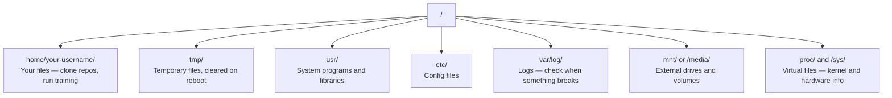

# 面向AI के लिनक्स

> अधिकांश एआई लिनक्स पर चलती हैं। आपको यह समझने की आवश्यकता है कि यह कैसे काम करता है।

**类型：**学习
**语言：**-
**先修要求：**चरण 0, पाठ 01
**时间：**~ 30 मिनट

## 学习目标

- 浏览 लिनक्स फ़ाइल सिस्टम,并从命令行执行基本文件操作
- उपयोग `chmod`和 `chown`फ़ाइल अनुमतियाँ प्रबंधित करें, "अनुमति अस्वीकृत" त्रुटियों को हल करने के लिए
- उपयोग `apt`इंस्टॉल सिस्टम पैकेज,并为AI 工作设置一台新GPU बॉक्स
- 识别 macOS से Linux पर स्विच करते समय, डेवलपर दूरस्थ मशीनों पर लगातार गड्ढे पर टकराता है

## 问题

आप macOS या Windows में हैं। लेकिन एक बार जब आप SSH को क्लाउड GPU बॉक्स में लाएं, Lambda इंस्टेंस का उपयोग करें, या EC2 मशीन को लॉन्च करें, तो आप Ubuntu में प्रवेश करेंगे। टर्मिनल आपका एकमात्र इंटरफ़ेस है। कोई Finder, कोई Explorer, कोई GUI नहीं है। यदि आप फ़ाइल सिस्टम ब्राउज़ करने के आदेश से नहीं गुजर सकते हैं, पैकेज स्थापित करने, प्रसंस्करण प्रबंधित करने की प्रक्रियाओं, तो आप एक तरफ GPU 付费, एक तरफ खोजें Linux में फ़ाइल को कैसे अनज़िप करें🏻

यह एक अस्तित्व गाइड है। यह केवल आपको दूरस्थ लिनक्स मशीनों पर एआई के काम करने के लिए आवश्यक सामग्री को कवर करता है।

## फ़ाइल प्रणाली 布局

लिनक्स सब कुछ एक ही जड़ में व्यवस्थित करता है ।`/`नीचे नहीं है`C:\`या `/Volumes`你实际会接触的目录:



आपका होम डायरेक्टरी है`~`या `/home/your-username` लगभग सभी ऑपरेशन यहाँ होता है

## अनिवार्य आदेश

नीचे 15 आदेश हैं जो आपके 95% ऑपरेशन को दूरस्थ जीपीयू बॉक्स में कवर करते हैं।

### 移动位置

```bash
pwd                         # Where am I?
ls                          # What's here?
ls -la                      # What's here, including hidden files with details?
cd /path/to/dir             # Go there
cd ~                        # Go home
cd ..                       # Go up one level
```

### 文件和目录

```bash
mkdir my-project            # Create a directory
mkdir -p a/b/c              # Create nested directories in one shot

cp file.txt backup.txt      # Copy a file
cp -r src/ src-backup/      # Copy a directory (recursive)

mv old.txt new.txt          # Rename a file
mv file.txt /tmp/           # Move a file

rm file.txt                 # Delete a file (no trash, it's gone)
rm -rf my-dir/              # Delete a directory and everything inside
```

`rm -rf`️️️️️️️️️️️️️️️️️️️️️️️️️️️️️️️️️️️️️️️️️️️️️️️️️️️️️️️️️️️️️️️️️️️️️️️️️️️️️️️️️️️️️️️️️️️️️️️️️️️️️️️️️️️️️️️️️️️️️️️️️️️️️️️️️️️️️️️️️️️️️️️️️️️️️️️️️️️️️️️️️️️️️️️️️️️️️️️️️️️️️️️️️️️️️️️️️️️️️️️️️️️️️️️️️️️️️️️️️️️️️️️️️️️️️️️️️️️️️️️️️️️️️️️️️️️️️️️️️️️️️️️️️️️️️️️️️️️️️️️️️️️️️️️️️️️️️️️️️️️️️️️️️️️️️️️️️️️️️️️️️️️️️️️️️️️️️️️️️️️️️️️️️️️️️️️️️️️️️️️️️️️️️️️️️️️️️️️️️️️️️️️️️️️️️️️️️️️️️️️️️️️️️️️️️️️️️️️️️️️️️️️️️️️️️️️️️️️️️️️️️️️️️️️️️️️️️️️️️️️️️️️️️️️️️️️️️️️️️️️️️️️️️️️️️️️️️️️️️️️️️️️️️️️️

### 读取文件

```bash
cat file.txt                # Print entire file
head -20 file.txt           # First 20 lines
tail -20 file.txt           # Last 20 lines
tail -f log.txt             # Follow a log file in real time (Ctrl+C to stop)
less file.txt               # Scroll through a file (q to quit)
```

### 搜索

```bash
grep "error" training.log           # Find lines containing "error"
grep -r "learning_rate" .           # Search all files in current directory
grep -i "cuda" config.yaml          # Case-insensitive search

find . -name "*.py"                 # Find all Python files under current dir
find . -name "*.ckpt" -size +1G     # Find checkpoint files larger than 1GB
```

## अनुमति

लिनक्स में प्रत्येक फ़ाइल में मालिक और अनुमति बिट्स होते हैं। जब स्क्रिप्ट  निष्पादित नहीं हो सकती है, या आप किसी निर्देशिका में नहीं लिख सकते हैं, तो यह समस्या होती है।

```bash
ls -l train.py
# -rwxr-xr-- 1 user group 2048 Mar 19 10:00 train.py
#  ^^^             owner permissions: read, write, execute
#     ^^^          group permissions: read, execute
#        ^^        everyone else: read only
```

常见修复方式:

```bash
chmod +x train.sh           # Make a script executable
chmod 755 deploy.sh         # Owner: full, others: read+execute
chmod 644 config.yaml       # Owner: read+write, others: read only

chown user:group file.txt   # Change who owns a file (needs sudo)
```

जब किसी बिंदु पर "अनुमति अस्वीकार" होता है, तो लगभग हमेशा अनुमतियां होती हैं 问题──`chmod +x`या `sudo`अधिकांश स्थिति को ठीक किया जा सकता है।

## पैकेज प्रबंधन (अनुकूलित)

उबंटू 使用 `apt`यह सिस्टम स्तर के सॉफ्टवेयर को स्थापित करने का तरीका है

```bash
sudo apt update             # Refresh the package list (always do this first)
sudo apt install -y htop    # Install a package (-y skips confirmation)
sudo apt install -y build-essential  # C compiler, make, etc. Needed by many Python packages
sudo apt install -y tmux    # Terminal multiplexer (keep sessions alive after disconnect)

apt list --installed        # What's installed?
sudo apt remove htop        # Uninstall
```

आप नए GPU बॉक्स में ऊपर स्थापित पैकेज देखेंगेः

```bash
sudo apt update && sudo apt install -y \
    build-essential \
    git \
    curl \
    wget \
    tmux \
    htop \
    unzip \
    python3-venv
```

## उपयोगकर्ता 和 sudo

आप आमतौर पर सामान्य उपयोगकर्ता 登录── कुछ ऑपरेशन रूट(admin) अधिकारों की आवश्यकता है──

```bash
whoami                      # What user am I?
sudo command                # Run a single command as root
sudo su                     # Become root (exit to go back, use sparingly)
```

क्लाउड जीपीयू उदाहरणों में, आप आमतौर पर एकमात्र उपयोगकर्ता हैं, और पहले से ही sudo पहुँच है। सब कुछ रूट पर नहीं चलाया जाता है।

## प्रक्रियाएँ तथा प्रणाली

जब आप अभ्यास करते हैं, या आपको चल रही सामग्री की जांच करने की आवश्यकता होती हैः

```bash
htop                        # Interactive process viewer (q to quit)
ps aux | grep python        # Find running Python processes
kill 12345                  # Gracefully stop process with PID 12345
kill -9 12345               # Force kill (use when graceful doesn't work)
nvidia-smi                  # GPU processes and memory usage
```

सिस्टम डी प्रबंधन सेवाएं (पछाड़ के डेमोन) 👇 यदि आप inference सर्वर चलाते हैं, तो आप इसे उपयोग करेंगेः

```bash
sudo systemctl start nginx          # Start a service
sudo systemctl stop nginx           # Stop it
sudo systemctl restart nginx        # Restart it
sudo systemctl status nginx         # Check if it's running
sudo systemctl enable nginx         # Start automatically on boot
```

## 磁盘空间

GPU बॉक्स के डिस्क स्थान आमतौर पर सीमित है।

```bash
df -h                       # Disk usage for all mounted drives
df -h /home                 # Disk usage for /home specifically

du -sh *                    # Size of each item in current directory
du -sh ~/.cache             # Size of your cache (pip, huggingface models land here)
du -sh /data/checkpoints/   # Check how big your checkpoints are

# Find the biggest space hogs
du -h --max-depth=1 / 2>/dev/null | sort -hr | head -20
```

常见省空间方式:

```bash
# Clear pip cache
pip cache purge

# Clear apt cache
sudo apt clean

# Remove old checkpoints you don't need
rm -rf checkpoints/epoch_01/ checkpoints/epoch_02/
```

## नेटवर्किंग

आप आदेश से मॉडल डाउनलोड करेंगे, फ़ाइलों का संचरण करेंगे, और एपीआई का उपयोग करेंगे।

```bash
# Download files
wget https://example.com/model.bin                   # Download a file
curl -O https://example.com/data.tar.gz              # Same thing with curl
curl -s https://api.example.com/health | python3 -m json.tool  # Hit an API, pretty-print JSON

# Transfer files between machines
scp model.bin user@remote:/data/                     # Copy file to remote machine
scp user@remote:/data/results.csv .                  # Copy file from remote to local
scp -r user@remote:/data/checkpoints/ ./local-dir/   # Copy directory

# Sync directories (faster than scp for large transfers, resumes on failure)
rsync -avz --progress ./data/ user@remote:/data/
rsync -avz --progress user@remote:/results/ ./results/
```

 किसी भी बड़े ट्रांसपोर्ट के लिए, प्राथमिकता का उपयोग `rsync`नहीं `scp` यह केवल परिवर्तनशील बाइट्स को संचरण करता है, और कनेक्शन का प्रसंस्करण कर सकता है

## tmux:保持 Sessions 存活

जब आप एसएसएच तक दूर के बॉक्स में, लैपटॉप पर संरेखित करेगा अपने प्रशिक्षण चलाने को मार देगा.

```bash
tmux new -s train           # Start a new session named "train"
# ... start your training, then:
# Ctrl+B, then D            # Detach (training keeps running)

tmux ls                     # List sessions
tmux attach -t train        # Reattach to session

# Inside tmux:
# Ctrl+B, then %            # Split pane vertically
# Ctrl+B, then "            # Split pane horizontally
# Ctrl+B, then arrow keys   # Switch between panes
```

长时间训练任务总是放在tmux 里运行――总是如此――

## 面向Windows उपयोगकर्ता के WSL2

यदि आप विंडोज पर हैं, तो डबल-बूट की आवश्यकता के बिना WSL2 वास्तविक लिनक्स वातावरण प्रदान कर सकता है।

```bash
# In PowerShell (admin)
wsl --install -d Ubuntu-24.04

# After restart, open Ubuntu from Start menu
sudo apt update && sudo apt upgrade -y
```

WSL2 运行真实Linux kernel──本课中的所有内容都能在其中工作──从 WSL 内部看,你的Windows文件 位于 `/mnt/c/Users/YourName/`

जीपीयू पास के माध्यम से 需要 Windows 侧安装 NVIDIA ड्राइवर──安装 Windows NVIDIA ड्राइवर(不是Linux ड्राइवर),CUDA 就会在 WSL2 内可用──

## macOS से लिनक्स तक

यदि आप macOS से हैं, इन बातों को आप पर निर्भर करेगाः

| macOS | Linux | 说明 |
|-------|-------|-------|
| `brew install` | `sudo apt install` | package names 有时不同。`brew install htop` 和 `sudo apt install htop` 效果相同，但 `brew install readline` 和 `sudo apt install libreadline-dev` 不同。 |
| `open file.txt` | `xdg-open file.txt` | 但远程 box 上通常没有 GUI。使用 `cat` 或 `less`。 |
| `pbcopy` / `pbpaste` | 不可用 | SSH 上不存在 pipe 到/来自 clipboard 的能力。 |
| `~/.zshrc` | `~/.bashrc` | macOS 默认使用 zsh。大多数 Linux servers 使用 bash。 |
| `/opt/homebrew/` | `/usr/bin/`, `/usr/local/bin/` | Binaries 位于不同位置。 |
| `sed -i '' 's/a/b/' file` | `sed -i 's/a/b/' file` | macOS sed 需要在 `-i` 后加一个空字符串。Linux 不需要。 |
| Case-insensitive filesystem | Case-sensitive filesystem | 在 Linux 上，`Model.py` 和 `model.py` 是两个不同文件。 |
| Line endings `\n` | Line endings `\n` | 相同。但 Windows 使用 `\r\n`，会破坏 bash scripts。运行 `dos2unix` 修复。 |

## 快速参考卡

```
Navigation:     pwd, ls, cd, find
Files:          cp, mv, rm, mkdir, cat, head, tail, less
Search:         grep, find
Permissions:    chmod, chown, sudo
Packages:       apt update, apt install
Processes:      htop, ps, kill, nvidia-smi
Services:       systemctl start/stop/restart/status
Disk:           df -h, du -sh
Network:        curl, wget, scp, rsync
Sessions:       tmux new/attach/detach
```


```figure
s0-process-fork
```

## अभ्यास

1. SSH को किसी भी लिनक्स मशीन में खोलें, और इसे अपने होम डायरेक्टरी में भेजें।`touch`创建三个空文件, फिर उपयोग `ls -la`列出它们──
2. उपयोग योग्य स्थापना `htop`, इसे चलाओ, और यह पता लगाओ कि कौन सी प्रक्रिया सबसे अधिक स्मृति का उपयोग करता है.
3. एक tmux सत्र शुरू करें, जिसमें से संचालन `sleep 300`, डिटेक,列出 सत्र, फिर पुनः संलग्न करें
4. उपयोग `df -h`检查可用磁盘空间, फिर उपयोग `du -sh ~/.cache/*`找出缓存 中占空间的内容──
5. उपयोग `scp`एक फ़ाइल को स्थानीय मशीन से दूरस्थ मशीन पर स्थानांतरित करने के लिए, और फिर उपयोग करें।`rsync`समान संचरण,并比较体验──
