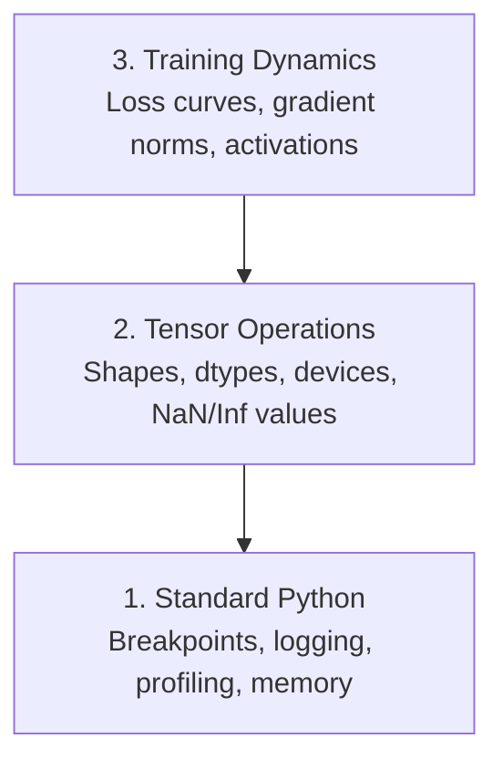

# डिबगिंग और प्रोफाइलिंग

> सबसे खराब एआई कीड़े टूट नहीं पाते हैं। वे चुपचाप कचरे के डेटा पर प्रशिक्षण देते हैं और एक सुंदर हानि वक्र की रिपोर्ट करते हैं।

**类型：**构建
**语言：**पायथन
**先修要求：**पाठ 1 (Dev Environment), बुनियादी पिटर्च 熟悉度
**时间：**~ 60 मिनट

## 学习目标

- उपयोग शर्त `breakpoint()`和 `debug_print`प्रशिक्षण के दौरान जांच टेन्सर आकारों, प्रकार और NaN मानों
- उपयोग `cProfile``line_profiler`和 `tracemalloc`प्रोफ़ाइल  प्रशिक्षण चक्र, बोतल के गले की तलाश
- 检测常见 AI बग्सः आकार असंगतियाँ、NaN हानि、डेटा रिसाव तथा गलत डिवाइस टेन्सर
- सेट TensorBoard 来可视化 हानि वक्रों, वजन हिस्टोग्राम और ग्रेडिएंट वितरण

## 问题

एआई कोड की विफलता सामान्य कोड से अलग है। वेब ऐप स्टैक ट्रैक के साथ होगा 崩──配置错误的训练循环会运行8小时,烧掉200美元 GPU 时间,然后产生一个对每个输入都预测平均值的模型──代码从未报错──bug可能是机在错误设备上、忘记.`.detach()`, या लेबल  विशेषताएं बाहर निकल

आप डिबगिंग उपकरण की जरूरत है, इन चुपके विफलता में अपने समय और गणना बर्बाद  से पहले उन्हें पकड़ने के लिए.

## 概念

एआई डिबगिंग तीन स्तरों में विभाजित हैः



अधिकांश लोग सीधे तीसरे स्तर पर कूदेंगे। लेकिन 80% एआई कीड़े पहले और दूसरे स्तर पर हैं।


```figure
s0-flame-hot
```

##  इसे निर्माण

### भाग 1: प्रिंट डिबगिंग ((是的, यह प्रभावी है)

प्रिंट डिबगिंग  अक्सर हल्के में लिया जाता है  लेकिन ऐसा नहीं करना चाहिए  टेन्सर कोड के लिए, एक उद्देश्यपूर्ण प्रिंट स्टेटमेंट  अक्सर चरण-दर-चरण调试器 से अधिक होता है, क्योंकि आपको एक बार आकारों, प्रकारों और मूल्य रेंज को देखने की आवश्यकता होती है

```python
def debug_print(name, tensor):
    print(f"{name}: shape={tensor.shape}, dtype={tensor.dtype}, "
          f"device={tensor.device}, "
          f"min={tensor.min().item():.4f}, max={tensor.max().item():.4f}, "
          f"mean={tensor.mean().item():.4f}, "
          f"has_nan={tensor.isnan().any().item()}")
```

प्रत्येक संशयित ऑपरेशन में इसे पुनः उपयोग करें, बग खोजें, इन प्रिंटों को हटा दें।

### भाग 2: पायथन डिबगर ((पीडीबी 和 ब्रेकपॉइंट)

इंटरेस्ट डिबगर एआई के काम में कम मूल्यांकन किया गया है।`breakpoint()`放入训练循环,并交互式检查 Tensors──

```python
def training_step(model, batch, criterion, optimizer):
    inputs, labels = batch
    outputs = model(inputs)
    loss = criterion(outputs, labels)

    if loss.item() > 100 or torch.isnan(loss):
        breakpoint()

    loss.backward()
    optimizer.step()
```

जब डिबगर पॉस्ट डाउन आ रहा है, उपयोगी आदेशः

- `p outputs.shape`检查 आकार
- `p loss.item()`查看 हानि मूल्य
- `p torch.isnan(outputs).sum()`统计 एनएएन
- `p model.fc1.weight.grad`检查 ग्रेडिएंट
- `c`继续,`q`退出

यह एक शर्त है डिबगिंग. यह केवल एक बार में ही रुक जाता है. 10,000 चरणों के प्रशिक्षण के लिए यह बहुत महत्वपूर्ण है.

### भाग 3: पायथन लॉगिंग

जब आप डिबगिंग 超出快速检查范围时, लॉगिंग के साथ प्रिंट स्टेटमेंट्स को बदल दें。

```python
import logging

logging.basicConfig(
    level=logging.INFO,
    format="%(asctime)s [%(levelname)s] %(message)s",
    handlers=[
        logging.FileHandler("training.log"),
        logging.StreamHandler()
    ]
)
logger = logging.getLogger(__name__)

logger.info("Starting training: lr=%.4f, batch_size=%d", lr, batch_size)
logger.warning("Loss spike detected: %.4f at step %d", loss.item(), step)
logger.error("NaN loss at step %d, stopping", step)
```

लॉगिंग  समयशीर्षक प्रदान करें  गंभीरता स्तर तथा फ़ाइल आउटपुट── जब प्रशिक्षण 3 बजकर 3 मिनट में विफल रहता है, तो आप लॉग फ़ाइल चाहते हैं, स्क्रीन पर आउटपुट के लिए पहले से ही बाहर निकल गया है।

### भाग 4: के लिए कोड क्षेत्र

知道时间花在哪里,是优化的第一步.

```python
import time

class Timer:
    def __init__(self, name=""):
        self.name = name

    def __enter__(self):
        self.start = time.perf_counter()
        return self

    def __exit__(self, *args):
        elapsed = time.perf_counter() - self.start
        print(f"[{self.name}] {elapsed:.4f}s")

with Timer("data loading"):
    batch = next(dataloader_iter)

with Timer("forward pass"):
    outputs = model(batch)

with Timer("backward pass"):
    loss.backward()
```

常见发现: डेटा लोड करना प्रशिक्षण समय का 60% है।`num_workers > 0`, बजाय एक तेजी से GPU के लिए एक बदलाव.

### भाग 5: cProfile 和 line_profiiler

जब आप मैनुअल टाइमर से अधिक जानकारी की जरूरत होती हैः

```bash
python -m cProfile -s cumtime train.py
```

यह प्रत्येक फ़ंक्शन कॉल को प्रदर्शित करेगा, और संचयी समय के अनुसार 排序── यदि आप प्रति लाइन प्रोफाइलिंग करना चाहते हैंः

```bash
pip install line_profiler
```

```python
@profile
def train_step(model, data, target):
    output = model(data)
    loss = F.cross_entropy(output, target)
    loss.backward()
    return loss

# Run with: kernprof -l -v train.py
```

### भाग 6: स्मृति प्रोफाइलिंग

#### उपयोग tracemalloc 查看 CPU मेमोरी

```python
import tracemalloc

tracemalloc.start()

# your code here
model = build_model()
data = load_dataset()

snapshot = tracemalloc.take_snapshot()
top_stats = snapshot.statistics("lineno")
for stat in top_stats[:10]:
    print(stat)
```

#### उपयोग स्मृति_प्रोफाइलर 查看 CPU स्मृति

```bash
pip install memory_profiler
```

```python
from memory_profiler import profile

@profile
def load_data():
    raw = read_csv("data.csv")       # watch memory jump here
    processed = preprocess(raw)       # and here
    return processed
```

उपयोग `python -m memory_profiler your_script.py`运行,以查看逐行 स्मृति उपयोग

#### उपयोग PyTorch 查看 जीपीयू मेमोरी

```python
import torch

if torch.cuda.is_available():
    print(torch.cuda.memory_summary())

    print(f"Allocated: {torch.cuda.memory_allocated() / 1e9:.2f} GB")
    print(f"Cached: {torch.cuda.memory_reserved() / 1e9:.2f} GB")
```

जब आप OOM से मिलने (Out of Memory)

1. 减小批量尺寸 (永远是第一个要尝试的)
2. उपयोग `torch.cuda.empty_cache()`释放 कैश मेमोरी
3. बड़े मध्यवर्ती के लिए उपयोग`del tensor`, फिर调用`torch.cuda.empty_cache()`
4. प्रयोग मिश्रित सटीकता`torch.cuda.amp`) स्मृति उपयोग  घटाएगी
5. बहुत गहरे मॉडल के लिए ग्रेडिएंट चेकपोइंटिंग का उपयोग करें

### भाग 7: 常见AI कीड़े और उन्हें कैसे पकड़े जाने

#### आकृति असंगत

सबसे आम बग--- किसी टेन्सर का आकार है`[batch, features]`, लेकिन मॉडल 期望 `[batch, channels, height, width]`

```python
def check_shapes(model, sample_input):
    print(f"Input: {sample_input.shape}")
    hooks = []

    def make_hook(name):
        def hook(module, inp, out):
            in_shape = inp[0].shape if isinstance(inp, tuple) else inp.shape
            out_shape = out.shape if hasattr(out, "shape") else type(out)
            print(f"  {name}: {in_shape} -> {out_shape}")
        return hook

    for name, module in model.named_modules():
        hooks.append(module.register_forward_hook(make_hook(name)))

    with torch.no_grad():
        model(sample_input)

    for h in hooks:
        h.remove()
```

एक नमूना बैच के साथ एक बार 运行一次──它会映射模型中每一次形状转变──

#### नॉन लॉस

कुछ चीज़ें टूट गई हैं।

- सीखने की दर 太高
- कस्टम हानि 中除以零
- शून्य या नकारात्मक संख्या के लिए लॉग
- आरएनएन मध्य ग्रेडिएंट  विस्फोट

```python
def detect_nan(model, loss, step):
    if torch.isnan(loss):
        print(f"NaN loss at step {step}")
        for name, param in model.named_parameters():
            if param.grad is not None:
                if torch.isnan(param.grad).any():
                    print(f"  NaN gradient in {name}")
                if torch.isinf(param.grad).any():
                    print(f"  Inf gradient in {name}")
        return True
    return False
```

#### डेटा लीक

आपका मॉडल परीक्षण सेट में 99% सटीकता तक पहुँच गया है।

```python
def check_data_leakage(train_set, test_set, id_column="id"):
    train_ids = set(train_set[id_column].tolist())
    test_ids = set(test_set[id_column].tolist())
    overlap = train_ids & test_ids
    if overlap:
        print(f"DATA LEAKAGE: {len(overlap)} samples in both train and test")
        return True
    return False
```

इसके अलावा समय रिसाव की जांच करना होगा: using futur डाटा预测过去── विभाजित पूर्व पूर्व पूर्व समय के अनुसार 排序──

#### गलत उपकरण

विभिन्न उपकरणों पर टेंसर चलाने के समय की त्रुटियों का कारण बनता है। लेकिन कभी-कभी एक टेंसर CPU पर चुपचाप रुक जाता है, जबकि बाकी सब कुछ GPU पर होता है, प्रशिक्षण केवल बहुत धीमा चल रहा है।

```python
def check_devices(model, *tensors):
    model_device = next(model.parameters()).device
    print(f"Model device: {model_device}")
    for i, t in enumerate(tensors):
        if t.device != model_device:
            print(f"  WARNING: tensor {i} on {t.device}, model on {model_device}")
```

### भाग 8: TensorBoard 基础

TensorBoard बैठक प्रशिक्षण प्रक्रिया के दौरान के भीतर हुआ था क्या दिखाएँ

```bash
pip install tensorboard
```

```python
from torch.utils.tensorboard import SummaryWriter

writer = SummaryWriter("runs/experiment_1")

for step in range(num_steps):
    loss = train_step(model, batch)

    writer.add_scalar("loss/train", loss.item(), step)
    writer.add_scalar("lr", optimizer.param_groups[0]["lr"], step)

    if step % 100 == 0:
        for name, param in model.named_parameters():
            writer.add_histogram(f"weights/{name}", param, step)
            if param.grad is not None:
                writer.add_histogram(f"grads/{name}", param.grad, step)

writer.close()
```

इसे शुरू करेंः

```bash
tensorboard --logdir=runs
```

ध्यान देने के लिए क्याः

- **Loss 不下降**:शिक्षा दर  बहुत कम, या मॉडल वास्तुकला  समस्या
- **Loss 剧烈震荡**:शिक्षा दर 太高
- **Loss 变成 NaN**: संख्यात्मक अस्थिरता ((see ऊपर की NaN 部分)
- **Train loss 下降，val loss 上升**ओवरफिटिंग
- **Weight histograms 坍缩到零**गिरते हुए ग्रेडिएंट
- **Gradient histograms 爆炸**: आवश्यकता ग्रेडिएंट क्लिपिंग

### भाग 9: वीएस कोड डिबगर

对于交互式调试,用 `launch.json`配置 VS कोड:

```json
{
    "version": "0.2.0",
    "configurations": [
        {
            "name": "Debug Training",
            "type": "debugpy",
            "request": "launch",
            "program": "${file}",
            "console": "integratedTerminal",
            "justMyCode": false
        }
    ]
}
```

点击 gutter 设置断点──使用变量表 检查子属性──Debug Console 让你在执行中途运行任意Python表达式──

यह डेटा प्रीप्रोसेसिंग पाइपलाइनों को चरणबद्ध रूप से देखने के लिए उपयोगी है, खासकर जब आप प्रत्येक परिवर्तन को देखना चाहते हैं।

## इसका उपयोग करें

निम्नलिखित डिबगिंग वर्कफ़्लो अधिकांश एआई बग को पकड़ सकता हैः

1. **训练前**:用 नमूना बैच 运行 `check_shapes`परीक्षण इनपुट एवं आउटपुट आयाम  अनुरूप अपेक्षित
2. **前 10 步**: हानि, आउटपुट तथा ग्रेडिएंट्स के लिए उपयोग`debug_print` पुष्टी नहीं की गई है, तथा मूल्य  उचित सीमा में 
3. **训练期间**: रिकॉर्ड हानि, सीखने की दर तथा ग्रेडिएंट मानदंडों का उपयोग करना
4. **出问题时**: ⇒ विफलता बिंदु  `breakpoint()`交互式检查 Tensors──
5. **针对性能**:计时数据 लोड, फॉरवर्ड, बैकवर्ड पास, यदि OOM के करीब हो, तो प्रोफाइल मेमोरी

## 交付 यह

运行 डिबगिंग टूलकिट स्क्रिप्टः

```bash
python phases/00-setup-and-tooling/12-debugging-and-profiling/code/debug_tools.py
```

查看 `outputs/prompt-debug-ai-code.md`, जिसमें से एक एआई-विशिष्ट बग का निदान करने में मदद करता है।

## अभ्यास

1. 运行 `debug_tools.py`, प्रत्येक खंड के आउटपुट को पढ़ें── संशोधित डमी मॉडल  एक NaN  परिचय
2. उपयोग `cProfile`प्रोफ़ाइल एक प्रशिक्षण लूप,并识别最慢的功能──
3. उपयोग `tracemalloc`找出数据 लोडिंग पाइपलाइन 中哪一行分配了最多的内存──
4. एक सरल प्रशिक्षण रन के लिए TensorBoard सेट करें,并识别模型
5. प्रशिक्षण लूप में उपयोग`breakpoint()`◊ अभ्यास से डिबगर प्रम्प्ट  जांच टेन्सर आकार、डिवाइसेस तथा ग्रेडिएंट मानों
