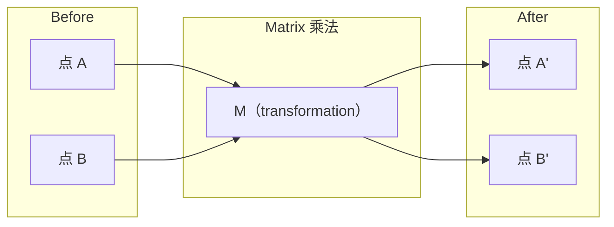
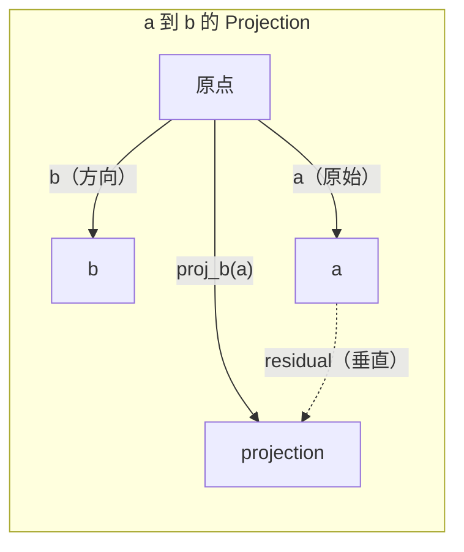

# रैखिक बीजगणित 直觉

> हर एआई मॉडल सिर्फ एक सुंदर टोपी के साथ मैट्रिक्स गणित का अध्ययन करता है।

**类型：**学习
**语言：**पायथन, जूलिया
**先修要求：**चरण 0
**时间：**~ 60 मिनट

## 学习目标

- Python में से शून्य से प्राप्त करने के लिए वेक्टर और मैट्रिक्स 运算 (加法点、 product、Matrix multiply)
- किस कोण से उत्पाद, प्रोजेक्शन और ग्राम-स्मिड प्रक्रिया को समझाएं
- प्रयोग पंक्ति घटाव 判断一组 वेक्टर की रैखिक स्वतंत्रता、 रैंक 和 आधार
- रैखिक बीजगणित के अवधारणाओं को एआई में उनके अनुप्रयोगों से जोड़नाः एम्बेडिंग्स, ध्यान स्कोर और लोरा

## 问题

打开任意一篇 ML论文──在第一页之内,你就会看到矢量、矩阵、点产品和转化──没有线性代数直觉时,这些只是符号──有它,你就能看到神经网络 实际上在做什么-- 在空间中移动点──

आपको गणितज्ञ बनने की जरूरत नहीं है. आपको यह देखना होगा कि इन संक्रमों का अर्थ क्या है, और फिर उन्हें स्वयं कोड में लिखना होगा.

## 概念

### वेक्टरों है点(यह भी दिशा)

वेक्टर केवल एक संख्यात्मक सूची है। लेकिन ये संख्याएँ अर्थपूर्ण हैं - वे अंतरिक्ष में स्थित हैं।

**2D Vector [3, 2]：**

| x | y | 点 |
|---|---|-------|
| 3 | 2 | 这个 Vector 从原点 (0,0) 指向平面上的 (3, 2) |

इस वेक्टर का परिमाण 为 वर्ग(3^2 + 2^2) = वर्ग(13), दिशा ऊपर और दाईं ओर──

AI में, वेक्टर हर चीज को प्रदर्शित करता हैः
- एक शब्द → एक एक 768 个数字的矢量包含的 (यह अंतरिक्ष में 含义)
- एक छवि → एक वेक्टर जिसमें लाखों चित्रों का मूल्य होता है
- एक उपयोगकर्ता → एक प्रदर्शित करने के लिए पसंदीदा वेक्टर

### मैट्रिक्स परिवर्तन हैं

मैट्रिक्स एक वेक्टर को दूसरे वेक्टर में बदल देगा। यह घूम सकता है, संकुचित हो सकता है, खिंचाया जा सकता है या परोसा जा सकता है।



एआई में, मैट्रिक्स यही मॉडल हैः
- न्यूरल नेटवर्क वजन → इनपुट  ट्रांसफर आउटपुट के मैट्रिक्स
- ध्यान अंक → निर्णय ध्यान देने के लिए क्या के मैट्रिक्स
- सम्मिलित → 将词映射到矢量的矩阵

### डॉट उत्पाद 衡量相似性

दो वेक्टरों के डॉट उत्पाद आपको बताएंगे कि वे बहुत समान हैं।

```
a · b = a₁×b₁ + a₂×b₂ + ... + aₙ×bₙ

方向相同：      a · b > 0  （相似）
相互垂直：      a · b = 0  （无关）
方向相反：      a · b < 0  （不相似）
```

यह खोज इंजन, सुझाव प्रणाली और RAG के काम करने का तरीका है - उच्च बिंदु उत्पाद वेक्टरों को खोजने के लिए।

### रैखिक स्वतंत्रता

यदि संच में कोई भी वेक्टर अन्य वेक्टरों के संयोजन में लिखा जा सकता है, तो ये वेक्टर रैखिक रूप से स्वतंत्र हैं। यदि v1、v2、v3 स्वतंत्र हैं, तो वे एक 3D अंतरिक्ष को कवर करेंगे। यदि उनमें से एक अन्य वेक्टरों का संयोजन है, तो वे केवल एक ही सतह को कवर करेंगे।

यह एआई के महत्व के लिए महत्वपूर्ण हैः आपकी विशेषता मैट्रिक्स में रैखिक रूप से स्वतंत्र स्तंभ होना चाहिए। यदि दो विशेषताएं पूरी तरह से संबंधित हैं, तो मॉडल उनके प्रभावों को अलग नहीं कर सकता है। यह रिग्रेशन में बहु-रैखिकता का कारण बनता है। वजन मैट्रिक्स में परिवर्तन होगा, इनपुट में छोटे बदलाव होने से उत्पादन में भारी बदलाव होगा।

**具体示例：**

```
v1 = [1, 0, 0]
v2 = [0, 1, 0]
v3 = [2, 1, 0]   # v3 = 2*v1 + v2
```

v1 तथा v2 स्वतंत्र हैं-- 二者都不是另一个标量倍数或组合──但 v3 = 2*v1 + v2,所以 {v1, v2, v3} एक निर्भर सेट है── ये तीन वेक्टर सभी xy-plane में स्थित हैं── चाहे आप उन्हें कैसे भी组合 करें,都无法达到 [0, 0, 1]── आपके पास तीन वेक्टर हैं, लेकिन केवल दो स्वतंत्र आयाम हैं──

डेटासेट मेंः यदि feature_3 = 2*feature_1 + feature_2, add feature_3 will not give the model  bring any new information  बुरी बात यह है कि यह सामान्य समीकरणों  को एकल  बना देगा  वजन  कोई अद्वितीय समाधान 

### आधार एवं रैंक

आधार एक समूह है सबसे छोटा रैखिक रूप से स्वतंत्र वेक्टर, वे पूरे अंतरिक्ष को कवर करते हैं।

3D 空间 का मानक आधार है {[1,0,0], [0,1,0], [0,0,1]}──लेकिन 3D में कोई भी तीन स्वतंत्र वेक्टर ांांा बना सकते हैं।

मैट्रिक्स का रैंक = रैखिक रूप से स्वतंत्र स्तंभों का संख्या = रैखिक रूप से स्वतंत्र पंक्तियों का संख्या。 यदि रैंक < min(पंक्तियाँ, कॉल), यह मैट्रिक्स है रैंक-अभावी── इसका अर्थ हैः
- इस प्रणाली के पास कई समाधान हैं
- परिवर्तन 中丢失信息
- मैट्रिक्स 不能被逆转

| 情况 | Rank | 对 ML 的含义 |
|-----------|------|---------------------|
| Full rank (rank = min(m, n)) | 最大可能值 | 存在唯一 least-squares solution。Model well-conditioned。 |
| Rank deficient (rank < min(m, n)) | 低于最大值 | Features 冗余。有无穷多个 weight solutions。需要 regularization。 |
| Rank 1 | 1 | 每一列都是某个 Vector 的缩放副本。所有数据都位于一条线上。 |
| Near rank-deficient（较小的 singular values） | 数值上较低 | Matrix ill-conditioned。极小的 input noise 会造成很大的 output changes。使用 SVD truncation 或 ridge regression。 |

### प्रक्षेपण

 将 वेक्टर **a**投影到 वेक्टर **b**ऊपर, मैं प्राप्त होगा **a****b**方向上分量:

```
proj_b(a) = (a dot b / b dot b) * b
```

शेष (a - proj_b(a)) के साथ b 垂直── इस प्रकार की स्थिरांक विघटन ही न्यूनतम वर्गों के फिट होने का आधार है──

प्रक्षेपण 在 ML 中无处不在:
- रैखिक प्रतिगमन न्यूनतम लघुकरण अवलोकन तक स्तंभ अंतरिक्ष की दूरी -- 解本身就是一个投影
- पीसीए अधिकतम भिन्नता के दिशा में डेटा का अनुमान लगाएगा
- ट्रांसफार्मर के बीच ध्यान 会 गणना कुंजी के लिए प्रश्नों के लिए अनुमान



**示例：**a = [3, 4], b = [1, 0]

proj_b(a) = (3*1 + 4*0) / (1*1 + 0*0) * [1, 0] = 3 * [1, 0] = [3, 0]

यह अनुमान y का भाग है। यह सबसे सरल रूप आयामता में कमी है।

### ग्राम-स्मिड्ट प्रक्रिया

任意一组独立向量 转换为正规基础──正规意思是每个向量 长度为 1,并且任意一对向量都互相垂直──

算法:
1.  पहला वेक्टर, इसे सामान्य होगा
2.  दूसरा वेक्टर ले लो, इसे पहले वेक्टर ऊपर पर प्रोजेक्शन में घटाएं, फिर से सामान्य
3.  ले तीसरा वेक्टर, इसे सभी में पहले वेक्टर ऊपर के अनुमानों को कम, पुनः सामान्यीकरण
4. शेष वेक्टरों के लिए 重复 इस प्रक्रिया

```
Input:  v1, v2, v3, ...（linearly independent）

u1 = v1 / |v1|

w2 = v2 - (v2 dot u1) * u1
u2 = w2 / |w2|

w3 = v3 - (v3 dot u1) * u1 - (v3 dot u2) * u2
u3 = w3 / |w3|

Output: u1, u2, u3, ...（orthonormal basis）
```

यही क्यूआर विघटन 内部的工作方式──Q है यांत्रिक आधार,R 捕获投影系数──क्यूआर विघटन इस प्रकार हैः
- 求解 रैखिक प्रणालियों (((比 गौशियन उन्मूलन 更稳定)
- 计算 स्वमूल्य(QR एल्गोरिथ्म)
- न्यूनतम वर्गों की regression (standard数值 विधि)


```figure
eigen-directions
```

##  इसे निर्माण

### 步骤 1: से शून्य को पूरा करने वेक्टरों(पायथन)

```python
class Vector:
    def __init__(self, components):
        self.components = list(components)
        self.dim = len(self.components)

    def __add__(self, other):
        return Vector([a + b for a, b in zip(self.components, other.components)])

    def __sub__(self, other):
        return Vector([a - b for a, b in zip(self.components, other.components)])

    def dot(self, other):
        return sum(a * b for a, b in zip(self.components, other.components))

    def magnitude(self):
        return sum(x**2 for x in self.components) ** 0.5

    def normalize(self):
        mag = self.magnitude()
        return Vector([x / mag for x in self.components])

    def cosine_similarity(self, other):
        return self.dot(other) / (self.magnitude() * other.magnitude())

    def __repr__(self):
        return f"Vector({self.components})"


a = Vector([1, 2, 3])
b = Vector([4, 5, 6])

print(f"a + b = {a + b}")
print(f"a · b = {a.dot(b)}")
print(f"|a| = {a.magnitude():.4f}")
print(f"cosine similarity = {a.cosine_similarity(b):.4f}")
```

### 步骤 2: From零实现 मैट्रिक्स(पायथन)

```python
class Matrix:
    def __init__(self, rows):
        self.rows = [list(row) for row in rows]
        self.shape = (len(self.rows), len(self.rows[0]))

    def __matmul__(self, other):
        if isinstance(other, Vector):
            return Vector([
                sum(self.rows[i][j] * other.components[j] for j in range(self.shape[1]))
                for i in range(self.shape[0])
            ])
        rows = []
        for i in range(self.shape[0]):
            row = []
            for j in range(other.shape[1]):
                row.append(sum(
                    self.rows[i][k] * other.rows[k][j]
                    for k in range(self.shape[1])
                ))
            rows.append(row)
        return Matrix(rows)

    def transpose(self):
        return Matrix([
            [self.rows[j][i] for j in range(self.shape[0])]
            for i in range(self.shape[1])
        ])

    def __repr__(self):
        return f"Matrix({self.rows})"


rotation_90 = Matrix([[0, -1], [1, 0]])
point = Vector([3, 1])

rotated = rotation_90 @ point
print(f"Original: {point}")
print(f"Rotated 90°: {rotated}")
```

### 步骤3: यह एआई के लिए महत्वपूर्ण क्यों है

```python
import random

random.seed(42)
weights = Matrix([[random.gauss(0, 0.1) for _ in range(3)] for _ in range(2)])
input_vector = Vector([1.0, 0.5, -0.3])

output = weights @ input_vector
print(f"Input (3D): {input_vector}")
print(f"Output (2D): {output}")
print("This is what a neural network layer does -- matrix multiplication.")
```

### 步骤 4: जूलिया 版本

```julia
a = [1.0, 2.0, 3.0]
b = [4.0, 5.0, 6.0]

println("a + b = ", a + b)
println("a · b = ", a ⋅ b)       # Julia supports unicode operators
println("|a| = ", √(a ⋅ a))
println("cosine = ", (a ⋅ b) / (√(a ⋅ a) * √(b ⋅ b)))

# Matrix-vector multiplication
W = [0.1 -0.2 0.3; 0.4 0.5 -0.1]
x = [1.0, 0.5, -0.3]
println("Wx = ", W * x)
println("This is a neural network layer.")
```

### 步骤 5: शून्य से प्राप्त रैखिक स्वतंत्रता 和 प्रोजेक्शन (पायथन)

```python
def is_linearly_independent(vectors):
    n = len(vectors)
    dim = len(vectors[0].components)
    mat = Matrix([v.components[:] for v in vectors])
    rows = [row[:] for row in mat.rows]
    rank = 0
    for col in range(dim):
        pivot = None
        for row in range(rank, len(rows)):
            if abs(rows[row][col]) > 1e-10:
                pivot = row
                break
        if pivot is None:
            continue
        rows[rank], rows[pivot] = rows[pivot], rows[rank]
        scale = rows[rank][col]
        rows[rank] = [x / scale for x in rows[rank]]
        for row in range(len(rows)):
            if row != rank and abs(rows[row][col]) > 1e-10:
                factor = rows[row][col]
                rows[row] = [rows[row][j] - factor * rows[rank][j] for j in range(dim)]
        rank += 1
    return rank == n


def project(a, b):
    scalar = a.dot(b) / b.dot(b)
    return Vector([scalar * x for x in b.components])


def gram_schmidt(vectors):
    orthonormal = []
    for v in vectors:
        w = v
        for u in orthonormal:
            proj = project(w, u)
            w = w - proj
        if w.magnitude() < 1e-10:
            continue
        orthonormal.append(w.normalize())
    return orthonormal


v1 = Vector([1, 0, 0])
v2 = Vector([1, 1, 0])
v3 = Vector([1, 1, 1])
basis = gram_schmidt([v1, v2, v3])
for i, u in enumerate(basis):
    print(f"u{i+1} = {u}")
    print(f"  |u{i+1}| = {u.magnitude():.6f}")

print(f"u1 · u2 = {basis[0].dot(basis[1]):.6f}")
print(f"u1 · u3 = {basis[0].dot(basis[2]):.6f}")
print(f"u2 · u3 = {basis[1].dot(basis[2]):.6f}")
```

## इसका उपयोग करें

अब NumPy के साथ एक ही काम करें - यह है कि आप अभ्यास में वास्तव में उपयोग करेंगे कैसेः

```python
import numpy as np

a = np.array([1, 2, 3], dtype=float)
b = np.array([4, 5, 6], dtype=float)

print(f"a + b = {a + b}")
print(f"a · b = {np.dot(a, b)}")
print(f"|a| = {np.linalg.norm(a):.4f}")
print(f"cosine = {np.dot(a, b) / (np.linalg.norm(a) * np.linalg.norm(b)):.4f}")

W = np.random.randn(2, 3) * 0.1
x = np.array([1.0, 0.5, -0.3])
print(f"Wx = {W @ x}")
```

### प्रयोग NumPy 处理 रैंक、प्रोजेक्शन 和 QR

```python
import numpy as np

A = np.array([[1, 2], [2, 4]])
print(f"Rank: {np.linalg.matrix_rank(A)}")

a = np.array([3, 4])
b = np.array([1, 0])
proj = (np.dot(a, b) / np.dot(b, b)) * b
print(f"Projection of {a} onto {b}: {proj}")

Q, R = np.linalg.qr(np.random.randn(3, 3))
print(f"Q is orthogonal: {np.allclose(Q @ Q.T, np.eye(3))}")
print(f"R is upper triangular: {np.allclose(R, np.triu(R))}")
```

### PyTorch -- Tensors है Autodiff के साथ वेक्टर

```python
import torch

x = torch.randn(3, requires_grad=True)
y = torch.tensor([1.0, 0.0, 0.0])

similarity = torch.dot(x, y)
similarity.backward()

print(f"x = {x.data}")
print(f"y = {y.data}")
print(f"dot product = {similarity.item():.4f}")
print(f"d(dot)/dx = {x.grad}")
```

बिंदु उत्पाद  के बारे में x का ग्रेडिएंट यैयैयैयैयैयैयैयैयैयैयैयैयैयैयैयैयैयैयैयैयैयैयैयैयैयैयैयैयैयैयैयैयैयैयैयैयैयैयैयैयैयैयैयैयैयैयैयैयैयैयैयैयैयैयैयैयैयैयैयैयैयैयैयैयैयैयैयैयैयैयैयैयैयैयैयैयैयैयैयैयैयैयैयैयैयैयैयैयैयैयैयैयैयैयैयैयैयैयैयैयैयैयैयैयैयैयैयैयैयैयैयैयैयैयैयैयैयैयैयैयैयैयैयैयैयैयैयैयैयैयैयैयैयैयैयैयैयैयैयैयैयैयैयैयैयैयैयैयैयैयैयैयैयैयैयैयैयैयैयैयैयैयैयैयैयैयैयैयैयैयैयैयैयैयैयैयैयैयैयैयैयैयैयैयैयैयैयैयैयैयैयैयैयैयैयैयैयैयैयैयैयैयैयैयैयैयैयैयैयैयैयैयैयैयैयैयैयैयैयैयैयैयैयैयैयैयैयैयैयैयैयैयैयैयैयैयैयैयैयैयैयैयैयैयैयैयैयैयै

तुम अभी शून्य से NumPy को एक लाइन कोड को पूरा करने के लिए कुछ बनाया है। अब तुम जानते हैं कि नीचे क्या हुआ है।

## 交付 यह

本课会产出:
- `outputs/prompt-linear-algebra-tutor.md`-- एक के लिए उपयोग किया जाता है करने के लिए एआई सहायक 通过几何直觉教授 रैखिक बीजगणित का संकेत

## 连接

इस कक्षा में प्रत्येक सामग्री आधुनिक एआई के विशिष्ट भागों से जुड़ी हैः

| 概念 | 出现位置 |
|---------|------------------|
| Dot product | Transformers 中的 Attention scores，RAG 中的 cosine similarity |
| Matrix multiply | 每个 Neural Network layer，每个 linear transformation |
| Linear independence | Feature selection，避免 multicollinearity |
| Rank | 判断一个系统是否可解，LoRA（low-rank adaptation） |
| Projection | Linear Regression（投影到 column space）、PCA |
| Gram-Schmidt / QR | Numerical solvers，eigenvalue computation |
| Orthonormal basis | 稳定的 numerical computation，whitening transforms |

लोरा विशेष विवरण के लायक है। यह वजन अपडेट को निम्न-रैंक मैट्रिक्स में विभाजित करके बारीक-तरह के एलएलएम में शामिल करता है। इसके साथ ही एक 4096x4096 के वजन मैट्रिक्स को अपडेट करता है। 16M पैरामीटर), लोरा 更新 दो आयामों के लिए 4096x16 और 16x4096 के मैट्रिक्स को अपडेट करता है। 131K पैरामीटर) 约束 约束 का अर्थ है लोरा 假设 वजन अपडेट  पूर्ण 4096 आयामी अंतरिक्ष में स्थित है।

## अभ्यास

1. 实现 `Vector.angle_between(other)`, दो वेक्टरों के बीच कोणों में लौटा
2.  Create a 2D स्केलिंग मैट्रिक्स, make x-coordinate 翻倍、y-coordinate 变为三倍, फिर इसे वेक्टर में लागू करें [1, 1]
3. 给定 5 个随机类词 矢量 (आयामी 50), कॉस्मीन समानता का उपयोग करें 找出最相似的两个
4. 验证 ग्राम-स्मिड्ट आउटपुट 确实是正规的:检查每一对的点产品都为 0,并且每个向量的大小都为 1
5. 创建一个排列 为 2 的 3x3矩阵──使用 `rank()`विधि 验证── फिर इन स्तंभों के क्षेत्रफल के बारे में व्याख्या करें
6. 将 भेक्टर [1, 2, 3] 投影到 [1, 1, 1] 上── परिणाम在几何上表示什么?

## 关键术语

| 术语 | 人们常说 | 实际含义 |
|------|----------------|----------------------|
| Vector | “一个箭头” | 一个数字列表，表示 n-dimensional space 中的点或方向 |
| Matrix | “一个数字表” | 一种 transformation，将 Vectors 从一个空间映射到另一个空间 |
| Dot product | “相乘再求和” | 衡量两个 Vectors 对齐程度的指标 -- similarity search 的核心 |
| Embedding | “某种 AI 魔法” | 一个表示某物含义（词、图像、用户）的 Vector |
| Linear independence | “它们不重叠” | 集合中没有任何 Vector 可以写成其他 Vector 的组合 |
| Rank | “有多少维” | Matrix 中 linearly independent columns（或 rows）的数量 |
| Projection | “影子” | 一个 Vector 在另一个 Vector 方向上的分量 |
| Basis | “坐标轴” | 一组最小的 independent Vectors，它们 span 该空间 |
| Orthonormal | “垂直的单位 Vectors” | 彼此互相垂直且各自长度为 1 的 Vectors |
