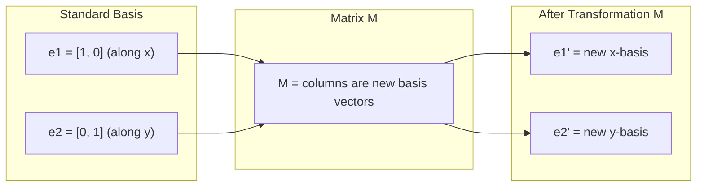
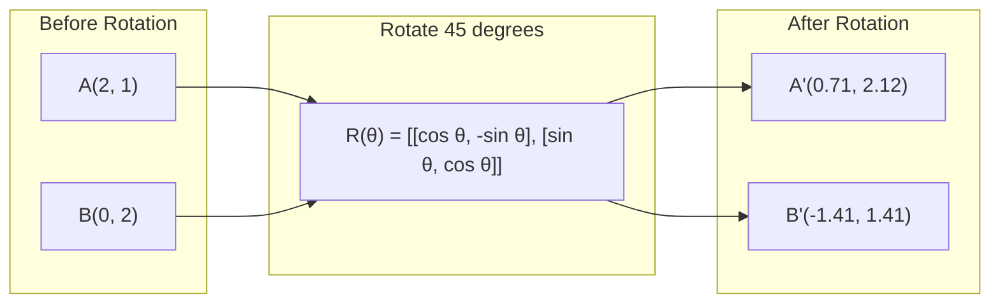
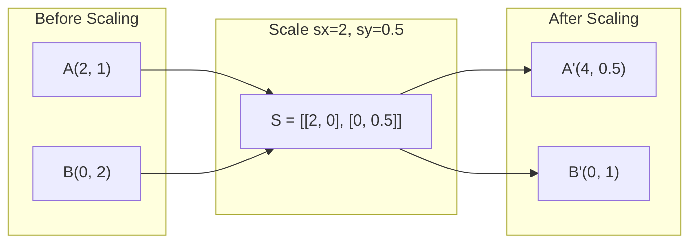
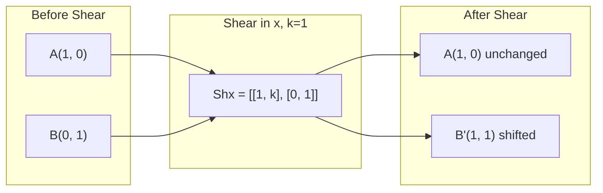
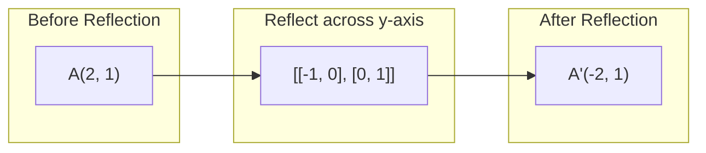
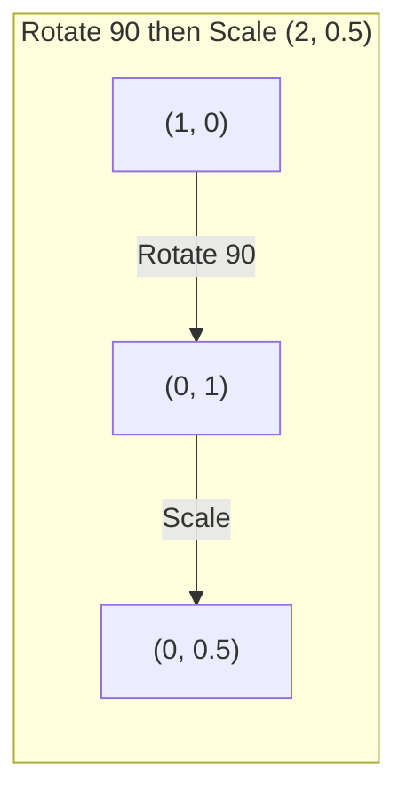
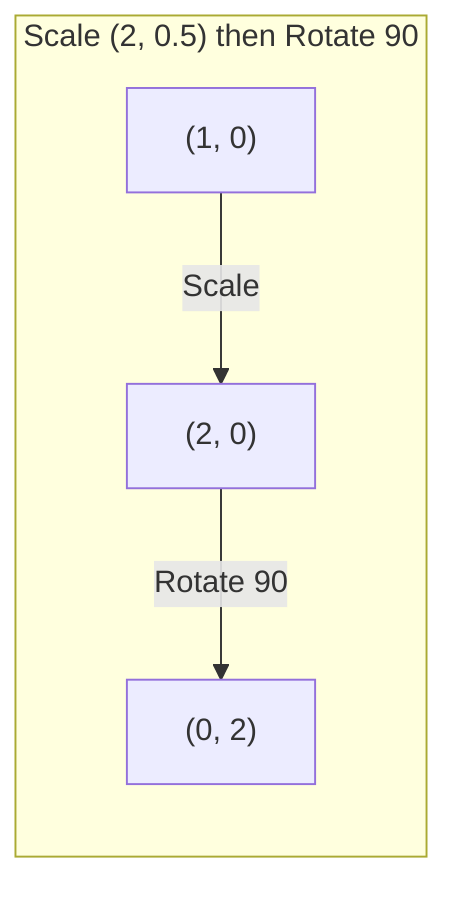

# मैट्रिक्स 变换

> मैट्रिक्स एक पुनर्निर्मित अंतरिक्ष की मशीन है. . . . . . . . . . . . . . . . . . . . . . . . . . . . . . . . . . . . . . . . . . . . . . . . . . . . . . . . . . . . . . . . . . . . . . . . . . . . . . . . . . . . . . . . . . . . . . . . . . . . . . . . . . . . . . . . . . . . . . . . . . . . . . . . . . . . . . . . . . . . . . . . . . . . . . . . . . . . . . . . . . . . . . . . . . . . . . . . . . . . . . . . . . . . . . . . . . . . . . . . . . . . . . . . . . . . . . . . . . . . . . . . . . . . . . . . . . . . . . . . . . . . . . . . . . . . . . . . . . . . . . . . . . . . . . . . . . . . . . . . . . . . . . . . . . . . . . . . . . . . . . . . . . . . . . . . . . . . . . . . . . . . . . . . . . . . . . . . . . . . . . . . . . . . . . . . . . . . . . . . . . . . . . . . . . . . . . . . . . . . . . . . . . . . . . . . . . . . . . . . . . . . . . . . . . . . . . . . . . . . . . . . . . . . . . . . . . . . . . . . . . . . . . . . . . . . . . . . . . . . . . . . . . . . . . . . . . . . . . . . . . . . . . . . . . . . . . . . . .

**类型：**构建
**语言：**पायथन, जूलिया
**先修要求：**चरण 1, पाठ 01-02 (रेखीय बीजगणित अंतर्ज्ञान, वेक्टर और मैट्रिक्स संचालन)
**时间：**~ 75 मिनट

## 学习目标

- ऱोटशन, स्केलिंग, कटिंग और प्रतिबिंबण मैट्रिक्स का निर्माण, और उन्हें 2D और 3D बिंदुओं पर लागू करेगा
-  组合多个变换,并验证顺序 बहुत महत्वपूर्ण है
- विशेषता समीकरण से  गणना 2x2 मैट्रिक्स के स्वयं मूल्य और स्वयं वेक्टर
-  व्याख्या क्यों स्वयं मूल्य PCA  दिशा  RNN  स्थिरता और स्पेक्ट्रल क्लस्टरिंग  व्यवहार

## 问题

आप पढ़ते हैं पीसीए, आप देखते हैं कि आप कोवैरिएंस मैट्रिक्स के स्व-वेक्टरों को ढूंढते हैं। आप देखते हैं कि सभी स्व-मूल्यों का परिमाण 1 से कम है या नहीं। आप देखते हैं कि डेटा बढ़ता है, आप यादृच्छिक घूर्णन को लागू करते हैं। आप एक भौगोलिक रूप से मैट्रिक्स को समझने के लिए अंतरिक्ष में क्या किया है, इससे पहले, ये सब वास्तव में मायने नहीं रखता है।

मैट्रिक्स सिर्फ डिजिटल जाल नहीं हैं। वे अंतरिक्ष यंत्र हैं। रोटेशन मैट्रिक्स 会旋转点── स्केलिंग मैट्रिक्स 会拉伸点── स्केलिंग मैट्रिक्स 会拉伸点── शेयरिंग मैट्रिक्स 会倾斜点── न्यूरल नेटवर्क डेटा के लिए प्रत्येक परिवर्तन, या इन कार्यों में से एक है, या उनकी संरचना── इस कक्षा में इन कार्यों को विशिष्ट बनाने के लिए किया जाएगा।

## 核心概念

### 作为矩阵的变化

2D में प्रत्येक रैखिक परिवर्तन को एक 2x2 मैट्रिक्स में लिखा जा सकता है। यह मैट्रिक्स आपको मूल वेक्टर [1, 0] और [0, 1] के बारे में बताती है।



### घूर्णन

 कोण के लिए थैटा का 2D घूर्णन होगा दूरी और कोण में परिवर्तन नहीं करेगा── यह प्रत्येक बिंदु को गोल आर्क के साथ स्थानांतरित करेगा──



3D में, आप एक अक्ष के चारों ओर घूमेंगे। प्रत्येक अक्ष में अपना घूर्णन मैट्रिक्स होता हैः

```
Rz(theta) = | cos  -sin  0 |     Rotate around z-axis
            | sin   cos  0 |     (x-y plane spins, z stays)
            |  0     0   1 |

Rx(theta) = | 1   0     0    |   Rotate around x-axis
            | 0  cos  -sin   |   (y-z plane spins, x stays)
            | 0  sin   cos   |

Ry(theta) = |  cos  0  sin |     Rotate around y-axis
            |   0   1   0  |     (x-z plane spins, y stays)
            | -sin  0  cos |
```

### स्केलिंग

स्केलिंग 会沿 प्रत्येक अक्ष स्वतंत्र रूप से खिंचाया या संपीड़ित



### कतरनी

शीरिंग एक अक्ष को स्थिर रखने के साथ ही दूसरी अक्ष को झुकाकर रखती है।



स्कार्फ मैट्रिक्सः
- `Shx = [[1, k], [0, 1]]` x 平移 k * y
- `Shy = [[1, 0], [k, 1]]`将 y 平移 k * x

### चिंतन

प्रतिबिंबित होगा एक अक्ष या एक सीधी रेखा पर एक बिंदु को अतीत के प्रतिबिंब के साथ।



प्रतिबिंबण मैट्रिक्सः
- य अक्ष पर प्रतिबिंबः`[[-1, 0], [0, 1]]`
- छोटी एक्स-अक्ष पर प्रतिबिंबः`[[1, 0], [0, -1]]`

### रचना:串联变换

पहले ए, फिर बी को बदलना, इनकी मैट्रिक्स को गुणा करने के बराबरः`result = B @ A @ point`◊ क्रम बहुत महत्वपूर्ण है―― पहले फिर से घुमाएं, पहले पैमाने के साथ फिर से घुमाएं, अलग परिणाम प्राप्त होंगे――



组合后:`S @ R = [[0, -2], [0.5, 0]]`



组合后:`R @ S = [[0, -0.5], [2, 0]]`

结果不同──矩阵乘法 不满足交换律──

### स्वमूल्य एवं स्वभेक्टर

अधिकांश वेक्टरों में मैट्रिक्स के प्रभाव के बाद सभी दिशाएं बदलती हैं।

```
A @ v = lambda * v

v is the eigenvector (direction that survives)
lambda is the eigenvalue (how much it stretches)

Example: A = | 2  1 |
             | 1  2 |

Eigenvector [1, 1] with eigenvalue 3:
  A @ [1,1] = [3, 3] = 3 * [1, 1]     (same direction, scaled by 3)

Eigenvector [1, -1] with eigenvalue 1:
  A @ [1,-1] = [1, -1] = 1 * [1, -1]  (same direction, unchanged)
```

यह मैट्रिक्स 会沿 [1, 1] 方向把空间拉伸 3x,并保持 [1, -1] 不变──其他各方向是这两方向的混合──

### स्वयं संरचना

यदि एक मैट्रिक्स में n 个线性无关的自向量 हैं, तो इसे विघटित किया जा सकता हैः

```
A = V @ D @ V^(-1)

V = matrix whose columns are eigenvectors
D = diagonal matrix of eigenvalues
V^(-1) = inverse of V

This says: rotate into eigenvector coordinates, scale along each axis, rotate back.
```

### क्यों स्वमूल्य महत्वपूर्ण है

**PCA。**स्व-वेक्टरों को मुख्य घटक हैं। स्व-मूल्य आपको बताएगा कि प्रत्येक घटक को कितना भिन्नता प्राप्त हुई है।

**稳定性。**पुनरावर्ती नेटवर्क और गतिशील प्रणालियों में, परिमाण > 1 के स्वमानों से आउटपुट विस्फोट होगा। परिमाण < 1 से आउटपुट गायब हो जाएगा।

**Spectral methods。**ग्राफ न्यूरल नेटवर्क उपयोग आसन्नता मैट्रिक्स के स्वमानों。 स्पेक्ट्रल क्लस्टरिंग उपयोग लैप्लाशियन के स्वमानों。Eigenvectors 会揭示 ग्राफ के संरचना。

### निर्धारक 作为体积缩放因子

परिवर्तन मैट्रिक्स के निर्धारक 会告诉你它把面积(2D) या体积(3D)缩小了多少──

```
det = 1:   area preserved (rotation)
det = 2:   area doubled
det = 0:   space crushed to lower dimension (singular)
det = -1:  area preserved but orientation flipped (reflection)

| det(Rotation) | = 1        (always)
| det(Scale sx, sy) | = sx * sy
| det(Shear) | = 1           (area preserved)
| det(Reflection) | = -1     (orientation flipped)
```


```figure
matrix-transform
```

##  इसे निर्माण

### 步骤 1: से शून्य परिवर्तन मैट्रिक्स प्राप्त करना (पायथन)

```python
import math

def rotation_2d(theta):
    c, s = math.cos(theta), math.sin(theta)
    return [[c, -s], [s, c]]

def scaling_2d(sx, sy):
    return [[sx, 0], [0, sy]]

def shearing_2d(kx, ky):
    return [[1, kx], [ky, 1]]

def reflection_x():
    return [[1, 0], [0, -1]]

def reflection_y():
    return [[-1, 0], [0, 1]]

def mat_vec_mul(matrix, vector):
    return [
        sum(matrix[i][j] * vector[j] for j in range(len(vector)))
        for i in range(len(matrix))
    ]

def mat_mul(a, b):
    rows_a, cols_b = len(a), len(b[0])
    cols_a = len(a[0])
    return [
        [sum(a[i][k] * b[k][j] for k in range(cols_a)) for j in range(cols_b)]
        for i in range(rows_a)
    ]

point = [1.0, 0.0]
angle = math.pi / 4

rotated = mat_vec_mul(rotation_2d(angle), point)
print(f"Rotate (1,0) by 45 deg: ({rotated[0]:.4f}, {rotated[1]:.4f})")

scaled = mat_vec_mul(scaling_2d(2, 3), [1.0, 1.0])
print(f"Scale (1,1) by (2,3): ({scaled[0]:.1f}, {scaled[1]:.1f})")

sheared = mat_vec_mul(shearing_2d(1, 0), [1.0, 1.0])
print(f"Shear (1,1) kx=1: ({sheared[0]:.1f}, {sheared[1]:.1f})")

reflected = mat_vec_mul(reflection_y(), [2.0, 1.0])
print(f"Reflect (2,1) across y: ({reflected[0]:.1f}, {reflected[1]:.1f})")
```

### 步骤 2: परिवर्तन की संरचना

```python
R = rotation_2d(math.pi / 2)
S = scaling_2d(2, 0.5)

rotate_then_scale = mat_mul(S, R)
scale_then_rotate = mat_mul(R, S)

point = [1.0, 0.0]
result1 = mat_vec_mul(rotate_then_scale, point)
result2 = mat_vec_mul(scale_then_rotate, point)

print(f"Rotate 90 then scale: ({result1[0]:.2f}, {result1[1]:.2f})")
print(f"Scale then rotate 90: ({result2[0]:.2f}, {result2[1]:.2f})")
print(f"Same? {result1 == result2}")
```

### 步骤 3: शून्य से गणना स्वयं मूल्य ((2x2)

एक 2x2 मैट्रिक्स के लिए `[[a, b], [c, d]]`,स्वमानें विशेषता समीकरण से 求解:`lambda^2 - (a+d)*lambda + (ad - bc) = 0`

```python
def eigenvalues_2x2(matrix):
    a, b = matrix[0]
    c, d = matrix[1]
    trace = a + d
    det = a * d - b * c
    discriminant = trace ** 2 - 4 * det
    if discriminant < 0:
        real = trace / 2
        imag = (-discriminant) ** 0.5 / 2
        return (complex(real, imag), complex(real, -imag))
    sqrt_disc = discriminant ** 0.5
    return ((trace + sqrt_disc) / 2, (trace - sqrt_disc) / 2)

def eigenvector_2x2(matrix, eigenvalue):
    a, b = matrix[0]
    c, d = matrix[1]
    if abs(b) > 1e-10:
        v = [b, eigenvalue - a]
    elif abs(c) > 1e-10:
        v = [eigenvalue - d, c]
    else:
        if abs(a - eigenvalue) < 1e-10:
            v = [1, 0]
        else:
            v = [0, 1]
    mag = (v[0] ** 2 + v[1] ** 2) ** 0.5
    return [v[0] / mag, v[1] / mag]

A = [[2, 1], [1, 2]]
vals = eigenvalues_2x2(A)
print(f"Matrix: {A}")
print(f"Eigenvalues: {vals[0]:.4f}, {vals[1]:.4f}")

for val in vals:
    vec = eigenvector_2x2(A, val)
    result = mat_vec_mul(A, vec)
    scaled = [val * vec[0], val * vec[1]]
    print(f"  lambda={val:.1f}, v={[round(x,4) for x in vec]}")
    print(f"    A@v = {[round(x,4) for x in result]}")
    print(f"    l*v = {[round(x,4) for x in scaled]}")
```

### 步骤 4:निर्धारक 作为体积缩放因子

```python
def det_2x2(matrix):
    return matrix[0][0] * matrix[1][1] - matrix[0][1] * matrix[1][0]

print(f"det(rotation 45) = {det_2x2(rotation_2d(math.pi/4)):.4f}")
print(f"det(scale 2,3)   = {det_2x2(scaling_2d(2, 3)):.1f}")
print(f"det(shear kx=1)  = {det_2x2(shearing_2d(1, 0)):.1f}")
print(f"det(reflect y)   = {det_2x2(reflection_y()):.1f}")

singular = [[1, 2], [2, 4]]
print(f"det(singular)     = {det_2x2(singular):.1f}")
print("Singular: columns are proportional, space collapses to a line.")
```

## इसका उपयोग करें

NumPy उपयोग करेगा अनुकूलित प्रथागत प्रक्रिया यह सब संभाल करने के लिए

```python
import numpy as np

theta = np.pi / 4
R = np.array([[np.cos(theta), -np.sin(theta)],
              [np.sin(theta),  np.cos(theta)]])

point = np.array([1.0, 0.0])
print(f"Rotate (1,0) by 45 deg: {R @ point}")

S = np.diag([2.0, 3.0])
composed = S @ R
print(f"Scale(2,3) after Rotate(45): {composed @ point}")

A = np.array([[2, 1], [1, 2]], dtype=float)
eigenvalues, eigenvectors = np.linalg.eig(A)
print(f"\nEigenvalues: {eigenvalues}")
print(f"Eigenvectors (columns):\n{eigenvectors}")

for i in range(len(eigenvalues)):
    v = eigenvectors[:, i]
    lam = eigenvalues[i]
    print(f"  A @ v{i} = {A @ v}, lambda * v{i} = {lam * v}")

print(f"\ndet(R) = {np.linalg.det(R):.4f}")
print(f"det(S) = {np.linalg.det(S):.1f}")

B = np.array([[3, 1], [0, 2]], dtype=float)
vals, vecs = np.linalg.eig(B)
D = np.diag(vals)
V = vecs
reconstructed = V @ D @ np.linalg.inv(V)
print(f"\nEigendecomposition A = V @ D @ V^-1:")
print(f"Original:\n{B}")
print(f"Reconstructed:\n{reconstructed}")
```

### प्रयोग NumPy  3D घूर्णन करने के लिए

```python
def rotation_3d_z(theta):
    c, s = np.cos(theta), np.sin(theta)
    return np.array([[c, -s, 0], [s, c, 0], [0, 0, 1]])

def rotation_3d_x(theta):
    c, s = np.cos(theta), np.sin(theta)
    return np.array([[1, 0, 0], [0, c, -s], [0, s, c]])

point_3d = np.array([1.0, 0.0, 0.0])
rotated_z = rotation_3d_z(np.pi / 2) @ point_3d
rotated_x = rotation_3d_x(np.pi / 2) @ point_3d

print(f"\n3D point: {point_3d}")
print(f"Rotate 90 around z: {np.round(rotated_z, 4)}")
print(f"Rotate 90 around x: {np.round(rotated_x, 4)}")
```

## 交付 यह

इस कोर्स में पीसीए (PCA) के लिए 2 चरण और न्यूरल नेटवर्क (Neural Network) के लिए एक ही एल्गोरिथ्म है, जो कि स्वयं-मूल्य/अयोजनवेक्टर (Eigenvector) कोड का निर्माण करता है।

## अभ्यास

1. 将旋转、scaling 和 shearing 应用于一个单位平方(角点为 [0,0], [1,0], [1,1], [0,1]) ∼分别打印每种变换后的角点──验证旋转 会保持角点之间的距离不变──

2. उपयोग करें विशेषता समीकरण 手算 मैट्रिक्स [[4, 2], [1, 3]] के स्वमानों── फिर प्रयोग करें आप से शून्य实现的函数和NumPy 进行验证──

3. 创建三个变换的组合(旋转30度,按 [1.5, 0.8] पैमाने,使用 kx=0.3 shear),并将其应用到按圆形排列的8个点上――印变换前后的坐标――计算组成矩阵的定数,并验证它等于各定数的乘积――

## 关键术语

| Term | 人们通常怎么说 | 它实际意味着什么 |
|------|----------------|----------------------|
| Rotation matrix | “旋转东西” | 一个 orthogonal matrix，会让点沿圆弧移动，同时保持距离和角度不变。Determinant 始终为 1。 |
| Scaling matrix | “让东西变大” | 一个 diagonal matrix，会沿每个轴独立地拉伸或压缩。Determinant 是 scale factors 的乘积。 |
| Shearing matrix | “让东西倾斜” | 一个 matrix，会让一个坐标按另一个坐标成比例平移，把矩形变成平行四边形。Determinant 为 1。 |
| Reflection | “镜像东西” | 一个 matrix，会把空间沿某个轴或平面翻转。Determinant 为 -1。 |
| Composition | “做两件事” | 通过相乘 transformation matrices 来串联操作。顺序很重要：B @ A 表示先应用 A，再应用 B。 |
| Eigenvector | “特殊方向” | 一个只会被 matrix 缩放、绝不会被旋转的方向。它是该变换的指纹。 |
| Eigenvalue | “拉伸了多少” | Matrix 缩放其 eigenvector 的标量因子。可以是负数（翻转），也可以是复数（rotation）。 |
| Eigendecomposition | “把 matrix 拆开” | 将一个 matrix 写成 V @ D @ V^(-1)，把它分离为基本缩放方向和幅度。 |
| Determinant | “来自 matrix 的一个数字” | 该变换缩放面积（2D）或体积（3D）的因子。零表示该变换不可逆。 |
| Characteristic equation | “eigenvalues 从哪里来” | det(A - lambda * I) = 0。它的根就是 eigenvalues。 |

## 延伸阅读

- [3Blue1Brown: Linear Transformations](https://www.3blue1brown.com/lessons/linear-transformations)-- 关于矩阵 如何重塑空间的视觉直觉
- [3Blue1Brown: Eigenvectors and Eigenvalues](https://www.3blue1brown.com/lessons/eigenvalues)-- स्व-वेक्टरों के लिए 几何含义 की सर्वोत्तम दृश्य व्याख्या
- [MIT 18.06 Lecture 21: Eigenvalues and Eigenvectors](https://ocw.mit.edu/courses/18-06-linear-algebra-spring-2010/)-- गिल्बर्ट स्ट्रैंग की क्लासिक व्याख्या
