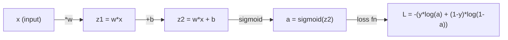
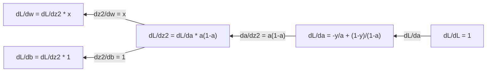
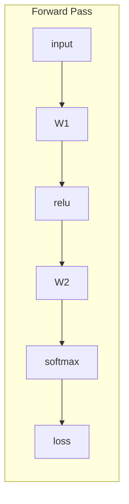
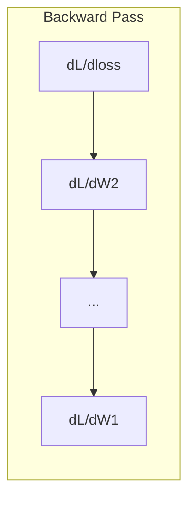

# मशीन लर्निंग 微积分

> 导数会告诉你哪边是下坡── यही न्यूरल नेटवर्क सीखने के लिए आवश्यक सब कुछ है──

**Type:** Learn
**Language:**पायथन
**Prerequisites:** Phase 1, Lessons 01-03
**Time:** ~60 minutes

## 学习目标

- 计算常见 ML 函数(x^2、सिग्मोइड、क्रॉस-एंट्रोपी) के मान निर्देशांक एवं समाधान निर्देशांक
- शून्य से प्राप्त करने के लिए ग्रेडिएंट गिरावट, 1D और 2D में न्यूनतम हानि समारोह
- 推导线性回归 模型的渐进,并通过手动更新权重来训练它
-  व्याख्या हेसियन मैट्रिक्स、टेयलर श्रृंखला 近似, तथा उनके अनुकूलन विधि के साथ संबंध

## 问题

आपके पास एक न्यूरल नेटवर्क है जिसमें लाखों वजन होते हैं। प्रत्येक वजन एक घुमावदार है। आपको यह पता लगाने की आवश्यकता है कि प्रत्येक घुमावदार को किस दिशा में जाना चाहिए, ताकि मॉडल की त्रुटि थोड़ा कम हो सके।

微积分, प्रशिक्षण तंत्रिका नेटवर्क का अर्थ है कि आप हर परिवर्तन को सही दिशा में समायोजित कर सकते हैं।

## 概念

### क्या है निर्देशक?

导数衡量变化率──对于函数 y = f(x),导数 f'(x) 会告诉你: यदि आप x 微小地推一点,y 会变化多少?

वस्तुतः निर्देशांक किसी न किसी बिंदु पर रेखा की झुकाव है।

**f(x) = x^2：**

| x | f(x) | f'(x)（斜率） |
|---|------|---------------|
| 0 | 0    | 0（平坦，在底部） |
| 1 | 1    | 2 |
| 2 | 4    | 4（该点处切线的斜率） |
| 3 | 9    | 6 |

जब x=2 , तब झुकाव दर 4  है। यदि आप x को दाईं ओर बहुत छोटा एक बिंदु पर ले जाते हैं, तो y लगभग इस गति को 4 गुना बढ़ाएगा।

形式化定义:

```
f'(x) = lim   f(x + h) - f(x)
        h->0  -----------------
                     h
```

कोड में, आप सीमा से अधिक कूद जाएगा, सीधे एक बहुत ही छोटे h का उपयोग करते हैं।

### 偏导数: एक बार केवल एक परिवर्तन देखें

वास्तविक फ़ंक्शन में बहुत सारे इनपुट होते हैं। तंत्रिका नेटवर्क का नुकसान हजारों वजन पर निर्भर करता है।

```
f(x, y) = x^2 + 3xy + y^2

df/dx = 2x + 3y     (treat y as a constant)
df/dy = 3x + 2y     (treat x as a constant)
```

प्रत्येक विकिरण संख्या का उत्तर हैः यदि मैं केवल वजन को कम करता हूं, तो नुकसान कैसे बदल जाएगा?

### ग्रेडिएंट: सभी ओरिएंट संख्याओं के गठन का वेक्टर

ग्रेडिएंट प्रत्येक विकिरण संख्या को एक वेक्टर में एकत्र करेगा।

```
grad f = [ df/dx, df/dy, df/dz ]
```

ग्रेडिएंट इंग््््हर सबसे ऊपरी दिशा में है।

**f(x,y) = x^2 + y^2 的等高线图：**

इस फ़ंक्शन में एक कटोरा आकार का आकार होता है, जैसे कि उच्च रेखा एक साथ एक केंद्र के साथ है।

| 点 | grad f | -grad f（下降方向） |
|-------|--------|----------------------------|
| (1, 1) | [2, 2]（指向上坡，远离最小值） | [-2, -2]（指向下坡，朝向最小值） |
| (0, 0) | [0, 0]（平坦，在最小值处） | [0, 0] |

यह एक चित्र में ग्रेडिएंट अवतरण है।

### अनुकूलन के साथ संपर्क

训练神经网络就是优化──你有一个损失函数 L(w1,w2, ..., wn),它衡量模型有多错──你想最小化它──

```
Gradient descent update rule:

  w_new = w_old - learning_rate * dL/dw

For every weight:
  1. Compute the partial derivative of loss with respect to that weight
  2. Subtract a small multiple of it from the weight
  3. Repeat
```

सीखने की दर  नियंत्रण  प्रगति  दीर्घ                                                                                                                                                                                                                                                           

**Loss landscape（1D 切片）：**

हानि फ़ंक्शन L(w)  वजन के परिवर्तन के साथ एक शिखर के साथ एक घाटी के वक्रों का गठन करना

| 特征 | 描述 |
|---------|-------------|
| Global minimum | 整条曲线上的最低点，即最佳解 |
| Local minimum | 比邻近位置更低、但不是整体最低点的谷 |
| Slope | Gradient Descent 会从任意起点沿斜率向下走 |

ग्रेडिएंट डेसेंट में उतार-चढ़ाव की दर से नीचे की ओर बढ़ना संभव है, लेकिन उच्चतम स्थानों में यह बहुत कम वास्तविक समस्या है।

### 数值导数 बनाम 解析导数

计算导数 के दो तरीके हैं:

解析方式:手动应用微积分规则──对于 f(x) = x^2,导数是 f'(x) = 2x──精确,快速──

संख्यात्मक विधिः प्रयोग परिभाषा को करीबी करना। एक बहुत छोटे से h पर गणना करना f (x+h) 和 f (x-h), फिर भिन्नता प्राप्त करना।

```
Numerical (central difference):

f'(x) ~= f(x + h) - f(x - h)
          -----------------------
                  2h

h = 0.0001 works well in practice
```

संख्या मूल्य निर्देशांक धीमा है, लेकिन किसी भी फ़ंक्शन के लिए उपयुक्त है।

### सरल फ़ंक्शन का निर्देशांक

ये वही हैं जो आप एमएल में बार-बार देखेंगे।

```
Function        Derivative       Used in
--------        ----------       -------
f(x) = x^2     f'(x) = 2x      Loss functions (MSE)
f(x) = wx + b  f'(w) = x        Linear layer (gradient w.r.t. weight)
                f'(b) = 1        Linear layer (gradient w.r.t. bias)
                f'(x) = w        Linear layer (gradient w.r.t. input)
f(x) = e^x     f'(x) = e^x     Softmax, attention
f(x) = ln(x)   f'(x) = 1/x     Cross-entropy loss
f(x) = 1/(1+e^-x)  f'(x) = f(x)(1-f(x))   Sigmoid activation
```

对于 f(x) = x^2:

```
f(x) = x^2    f'(x) = 2x

  x    f(x)   f'(x)   meaning
  -2    4      -4      slope tilts left (decreasing)
  -1    1      -2      slope tilts left (decreasing)
   0    0       0      flat (minimum!)
   1    1       2      slope tilts right (increasing)
   2    4       4      slope tilts right (increasing)
```

对于 f(w) = wx + b,且 x=3、b=1:

```
f(w) = 3w + 1    f'(w) = 3

The derivative with respect to w is just x.
If x is big, a small change in w causes a big change in output.
```

### 链式法则

जब फ़ंक्शन संश्लेषण होता है, तो चेन फलन नियम आपको बताता है कि मार्गदर्शन कैसे प्राप्त करें।

```
If y = f(g(x)), then dy/dx = f'(g(x)) * g'(x)

Example: y = (3x + 1)^2
  outer: f(u) = u^2       f'(u) = 2u
  inner: g(x) = 3x + 1    g'(x) = 3
  dy/dx = 2(3x + 1) * 3 = 6(3x + 1)
```

तंत्रिका नेटवर्क एक स्ट्रिंग फ़ंक्शन हैः इनपुट -> रैखिक -> सक्रियण -> रैखिक -> सक्रियण -> हानि。 बैकप्रपॉगैशन यानि आउटपुट से लेकर输入 तक दोहराए आवेदन श्रृंखला विधि── यही संपूर्ण एल्गोरिथ्म है。

### हेसियन मैट्रिक्स

ग्रेडिएंट 告诉你斜率──Hessian 告诉你曲率──

हेसियन का (i, j) 项 है:

```
H[i][j] = d^2f / (dx_i * dx_j)
```

对于二变量函数 f(x, y):

```
H = | d^2f/dx^2    d^2f/dxdy |
    | d^2f/dydx    d^2f/dy^2 |
```

**Hessian 在临界点（Gradient = 0 的地方）告诉你什么：**

| Hessian 性质 | 含义 | 示例曲面 |
|-----------------|---------|-----------------|
| 正定（所有 eigenvalues > 0） | Local minimum | 向上开口的碗 |
| 负定（所有 eigenvalues < 0） | Local maximum | 向下开口的碗 |
| 不定（eigenvalues 正负混合） | Saddle point | 马鞍形 |

**示例：**f(x, y) = x^2 - y^2(एक सaddle 函数)

```
df/dx = 2x       df/dy = -2y
d^2f/dx^2 = 2    d^2f/dy^2 = -2    d^2f/dxdy = 0

H = | 2   0 |
    | 0  -2 |

Eigenvalues: 2 and -2 (one positive, one negative)
--> Saddle point at (0, 0)
```

与 f(x, y) = x^2 + y^2(एक碗形函数)比较:

```
H = | 2  0 |
    | 0  2 |

Eigenvalues: 2 and 2 (both positive)
--> Local minimum at (0, 0)
```

**为什么 Hessian 在 ML 中重要：**

न्यूटन की विधि का उपयोग हेसियन से करने के लिए ग्रेडिएंट अवतरण से बेहतर अनुकूलन चरणों को लेना है। यह केवल झुकाव की गति के साथ नहीं है, बल्कि झुकाव को भी ध्यान में रखता हैः

```
Newton's update:    w_new = w_old - H^(-1) * gradient
Gradient descent:   w_new = w_old - lr * gradient
```

न्यूटन की विधि 收更快, क्योंकि हेसनियन 会 पुनः संक्षिप्त  ग्रेडिएंटः方向的步子更小,平坦方向的步子更大──

 समस्या यह है कि: N 参数 वाले तंत्रिका नेटवर्क के लिए, Hessian N x N है ∙ एक 100 मिलियन से अधिक तत्वों वाले मॉडल के लिए 1 बिलियन तत्वों वाले मैट्रिक्स की आवश्यकता होती है ∙ यही कारण है कि हम निकटता विधि का उपयोग करते हैं ∙

| 方法 | 使用什么 | 成本 | 收敛 |
|--------|-------------|------|-------------|
| Gradient Descent | 只使用一阶导数 | 每步 O(N) | 慢（线性） |
| Newton's method | 完整 Hessian | 每步 O(N^3) | 快（二次） |
| L-BFGS | 从 Gradient 历史近似 Hessian | 每步 O(N) | 中等（超线性） |
| Adam | 每参数自适应 rate（对角 Hessian 近似） | 每步 O(N) | 中等 |
| Natural gradient | Fisher information matrix（统计 Hessian） | 每步 O(N^2) | 快 |

अभ्यास में, एडम डीप लर्निंग का डिफ़ॉल्ट ऑप्टिमाइज़र है। यह प्रत्येक पैरामीटर के माध्यम से निम्न लागत के लिए औसत और औसत परिचालन अंतर का पालन करता है।

### टेलर श्रृंखला 近似

किसी भी समतल फ़ंक्शन को स्थानीय रूप से बहुपद के रूप में निकटता से किया जा सकता हैः

```
f(x + h) = f(x) + f'(x)*h + (1/2)*f''(x)*h^2 + (1/6)*f'''(x)*h^3 + ...
```

包含的项越多,近似越好, लेकिन केवल बिंदु x 附近成立──

**为什么 Taylor series 对 ML 重要：**

- **一阶 Taylor = Gradient Descent。**जब आप f(x + h) ~ f(x) + f'(x) *h 时, आप कर रहे हैं 线性近似──渐进下降 会最小化这个线性模型,从而选择 h = -lr * f'(x)。

- **二阶 Taylor = Newton's method。**उपयोग f(x + h) ~ f(x) + f'(x) *h + (1/2) *f'(x) *h^2 时, you get a二次模型──最小化它会得到 h = -f'(x) /f'(x),也就是牛顿的步──

- **Loss Function 设计。**एमएसई और क्रॉस-एंट्रोपी समतल हैं, जिसका अर्थ है कि उनके टेलर विस्तार का प्रदर्शन अच्छा है। यह कोई संयोग नहीं है। समतल हानि अनुकूलन को अधिक पूर्वानुमानजनक बनाती है।

```
Approximation order    What it captures    Optimization method
-------------------    -----------------   -------------------
0th order (constant)   Just the value      Random search
1st order (linear)     Slope               Gradient descent
2nd order (quadratic)  Curvature           Newton's method
Higher orders          Finer structure     Rarely used in ML
```

关键洞见是: सभी ग्रेडिएंट आधारित अनुकूलन, मूल रूप से सभी स्थानीय निकटता हानि फ़ंक्शन, और इस निकटता फ़ंक्शन के न्यूनतम मूल्य में कदम है।

### एमएल मध्य का积分

导数 आपको परिवर्तन दर बताता है 积分计算累积量, यानि वक्र के नीचे की सतह

एमएल में, आप बहुत कम हैंड-ऑन गणना गणना करते हैं, लेकिन यह अवधारणा कहीं नहीं हैः

**概率。**对于具有密度 p  x) के连续随机变量:
```
P(a < X < b) = integral from a to b of p(x) dx
```
概率 घनत्व वक्र एक और b के बीच की सतह पर, यही इस क्षेत्र के भीतर स्थित है 

**期望值。**概率加权的平均结果:
```
E[f(X)] = integral of f(x) * p(x) dx
```
डेटा वितरण पर अपेक्षित हानि एक积分── प्रशिक्षण को न्यूनतम करने के लिए इसका अनुभव निकटता है──

**KL divergence。**️ दो अलग-अलग वितरणों का माप करेंः
```
KL(p || q) = integral of p(x) * log(p(x) / q(x)) dx
```
VAEs, ज्ञान का डिस्टिलिशन तथा बेयिसियन इन्फेरेंस के उपयोग से

**归一化常数。**में बेयसियन निष्कर्ष 中:
```
p(w | data) = p(data | w) * p(w) / integral of p(data | w) * p(w) dw
```
分母 सभी संभावित पैरामीटर मानों के लिए एक积分 है। यह आमतौर पर अप्रचलित है, यही कारण है कि हम MCMC और भिन्नता निष्कर्ष आदि के निकटवर्ती तरीकों का उपयोग करते हैं।

| 积分概念 | 在 ML 中出现的位置 |
|-----------------|----------------------|
| 曲线下面积 | 由 density functions 得到概率 |
| 期望值 | Loss Functions、risk minimization |
| KL divergence | VAEs、policy optimization、distillation |
| 归一化 | Bayesian posteriors、softmax denominator |
| Marginal likelihood | Model comparison、evidence lower bound (ELBO) |

### गणना ग्राफ 中的多变量链式法则

链式法则不仅适用于一条线上的标量函数―― न्यूरल नेटवर्क में, 变量会分叉并合并―― नीचे दिखाया गया है कि कैसे एक सरल अग्रिम पास के माध्यम से निर्देशांक प्रवाहः



पिछड़ा पास 会从右到左计算 ग्रेडिएंट:



प्रत्येक तीर को स्थानिक निर्देशांक पर गुणा किया जाता है। किसी भी तत्व का ग्रेडिएंट, हानि से लेकर उस तत्व के मार्ग तक सभी स्थानिक निर्देशांक का गुणा है।

बैकप्रॉपेगरेशन का पूरा सामग्री यह हैः आउटपुट से लेकर इनपुट तक, सिस्टमियतः कम्प्यूटेशन ग्राफ में लागू श्रृंखला विधि।

### जैकोबियन मैट्रिक्स

जब एक फ़ंक्शन ्वेक्टर 映射到 ्वेक्टर 时(उदाहरण के लिए न्यूरल नेटवर्क परत), इसकी导数 एक मैट्रिक्स है。 जैकोबियन 包含 प्रत्येक आउटपुट के प्रति प्रत्येक इनपुट सभी偏导数。

对于 f: R^n -> R^m,Jacobian J 是一个 m x n

| | x1 | x2 | ... | xn |
|---|---|---|---|---|
| f1 | df1/dx1 | df1/dx2 | ... | df1/dxn |
| f2 | df2/dx1 | df2/dx2 | ... | df2/dxn |
| ... | ... | ... | ... | ... |
| fm | dfm/dx1 | dfm/dx2 | ... | dfm/dxn |

आप न्यूरल नेटवर्क के लिए जैकोबियन का हाथ से गणना नहीं करेंगे। पाइटॉर्च इसे संसाधित करेगा। लेकिन यह जानना, आपको बैकप्रॉपेगेशन के बीच के आकार को समझने में मदद करेगा। यदि एक परत R^n को R^m पर मैपिंग करती है, तो इसकी जैकोबियन यह है कि m x n──ग्रेडिएंट इस मैट्रिक्स के स्थानांतरण के माध्यम से पीछे की ओर प्रवाह करता है।

### यह तंत्रिका नेटवर्क के लिए महत्वपूर्ण क्यों है

न्यूरल नेटवर्क में प्रत्येक वजन एक ग्रेडिएंट प्राप्त होगा। ग्रेडिएंट आपको बताएगा कि इस वजन को कैसे समायोजित किया जाए ताकि हानि कम हो सके।





प्रत्येक बार अधिकार पुनः अपडेटः
- `W1 = W1 - lr * dL/dW1`
- `W2 = W2 - lr * dL/dW2`

आगे की ओर बढ़ना 计算预测和损失── पीछे की ओर बढ़ना 计算 हानि  प्रत्येक भार के ग्रेडिएंट के सापेक्ष── उसके बाद प्रत्येक भार नीचे की ओर बढ़े迈一小步──重复数百万步── यही है गहन शिक्षा──


```figure
derivative-tangent
```

##  इसे निर्माण

### 步骤 1: शून्य से प्राप्त करने के लिए मान निर्देशांक

```python
def numerical_derivative(f, x, h=1e-7):
    return (f(x + h) - f(x - h)) / (2 * h)

def f(x):
    return x ** 2

for x in [-2, -1, 0, 1, 2]:
    numerical = numerical_derivative(f, x)
    analytical = 2 * x
    print(f"x={x:2d}  f'(x) numerical={numerical:.6f}  analytical={analytical:.1f}")
```

संख्यात्मक और विश्लेषणात्मक निर्देशांक कई स्थानों पर मेल खाते हैं।

### 步骤 2: परिप्रेक्ष्य संख्या और ग्रेडिएंट

```python
def numerical_gradient(f, point, h=1e-7):
    gradient = []
    for i in range(len(point)):
        point_plus = list(point)
        point_minus = list(point)
        point_plus[i] += h
        point_minus[i] -= h
        partial = (f(point_plus) - f(point_minus)) / (2 * h)
        gradient.append(partial)
    return gradient

def f_multi(point):
    x, y = point
    return x**2 + 3*x*y + y**2

grad = numerical_gradient(f_multi, [1.0, 2.0])
print(f"Numerical gradient at (1,2): {[f'{g:.4f}' for g in grad]}")
print(f"Analytical gradient at (1,2): [2*1+3*2, 3*1+2*2] = [{2*1+3*2}, {3*1+2*2}]")
```

### 步骤 3: Using Gradient Descent 找到 f(x) = x^2 का न्यूनतम मूल्य

```python
x = 5.0
lr = 0.1
for step in range(20):
    grad = 2 * x
    x = x - lr * grad
    print(f"step {step:2d}  x={x:8.4f}  f(x)={x**2:10.6f}")
```

x=5 से शुरू होकर, प्रत्येक कदम x=0 ((कम से कम मूल्य) के करीब होगा।

### 步骤 4: 2D  फ़ंक्शन पर ग्रेडिएंट निशाना

```python
def f_2d(point):
    x, y = point
    return x**2 + y**2

point = [4.0, 3.0]
lr = 0.1
for step in range(30):
    grad = numerical_gradient(f_2d, point)
    point = [p - lr * g for p, g in zip(point, grad)]
    loss = f_2d(point)
    if step % 5 == 0 or step == 29:
        print(f"step {step:2d}  point=({point[0]:7.4f}, {point[1]:7.4f})  f={loss:.6f}")
```

### 步骤 5: संख्यात्मक मूल्य निर्देशांक और विश्लेषणात्मक निर्देशांक की तुलना करें

```python
import math

test_functions = [
    ("x^2",      lambda x: x**2,          lambda x: 2*x),
    ("x^3",      lambda x: x**3,          lambda x: 3*x**2),
    ("sin(x)",   lambda x: math.sin(x),   lambda x: math.cos(x)),
    ("e^x",      lambda x: math.exp(x),   lambda x: math.exp(x)),
    ("1/x",      lambda x: 1/x,           lambda x: -1/x**2),
]

x = 2.0
print(f"{'Function':<12} {'Numerical':>12} {'Analytical':>12} {'Error':>12}")
print("-" * 50)
for name, f, df in test_functions:
    num = numerical_derivative(f, x)
    ana = df(x)
    err = abs(num - ana)
    print(f"{name:<12} {num:12.6f} {ana:12.6f} {err:12.2e}")
```

### 步骤 6: संख्या मूल्य गणना हेसियन

```python
def hessian_2d(f, x, y, h=1e-5):
    fxx = (f(x + h, y) - 2 * f(x, y) + f(x - h, y)) / (h ** 2)
    fyy = (f(x, y + h) - 2 * f(x, y) + f(x, y - h)) / (h ** 2)
    fxy = (f(x + h, y + h) - f(x + h, y - h) - f(x - h, y + h) + f(x - h, y - h)) / (4 * h ** 2)
    return [[fxx, fxy], [fxy, fyy]]

def saddle(x, y):
    return x ** 2 - y ** 2

def bowl(x, y):
    return x ** 2 + y ** 2

H_saddle = hessian_2d(saddle, 0.0, 0.0)
H_bowl = hessian_2d(bowl, 0.0, 0.0)
print(f"Saddle Hessian: {H_saddle}")  # [[2, 0], [0, -2]] -- mixed signs
print(f"Bowl Hessian:   {H_bowl}")    # [[2, 0], [0, 2]]  -- both positive
```

सेडल  फ़ंक्शन का हेसियन है eigenvalues 2 和 -2(符号混合,确认是 सेडल पॉइंट) ・碗  फ़ंक्शन है eigenvalues 2 和 2(均为正,确认是最小) ・

### 步骤 7:टेलेर 近似的实际效果

```python
import math

def taylor_approx(f, f_prime, f_double_prime, x0, h, order=2):
    result = f(x0)
    if order >= 1:
        result += f_prime(x0) * h
    if order >= 2:
        result += 0.5 * f_double_prime(x0) * h ** 2
    return result

x0 = 0.0
for h in [0.1, 0.5, 1.0, 2.0]:
    true_val = math.sin(h)
    t1 = taylor_approx(math.sin, math.cos, lambda x: -math.sin(x), x0, h, order=1)
    t2 = taylor_approx(math.sin, math.cos, lambda x: -math.sin(x), x0, h, order=2)
    print(f"h={h:.1f}  sin(h)={true_val:.4f}  order1={t1:.4f}  order2={t2:.4f}")
```

 x0=0 附近,sin(x) ~ x(一阶 Taylor)                                                                                                                                                                                                                                                     

### 步骤 8: यह तंत्रिका नेटवर्क के लिए महत्वपूर्ण क्यों है 

```python
import random

random.seed(42)

w = random.gauss(0, 1)
b = random.gauss(0, 1)
lr = 0.01

xs = [1.0, 2.0, 3.0, 4.0, 5.0]
ys = [3.0, 5.0, 7.0, 9.0, 11.0]

for epoch in range(200):
    total_loss = 0
    dw = 0
    db = 0
    for x, y in zip(xs, ys):
        pred = w * x + b
        error = pred - y
        total_loss += error ** 2
        dw += 2 * error * x
        db += 2 * error
    dw /= len(xs)
    db /= len(xs)
    total_loss /= len(xs)
    w -= lr * dw
    b -= lr * db
    if epoch % 40 == 0 or epoch == 199:
        print(f"epoch {epoch:3d}  w={w:.4f}  b={b:.4f}  loss={total_loss:.6f}")

print(f"\nLearned: y = {w:.2f}x + {b:.2f}")
print(f"Actual:  y = 2x + 1")
```

प्रत्येक ग्रेडिएंट आधारित प्रशिक्षण चक्र इस मोड का पालन करता हैः पूर्वानुमान, गणना हानि, गणना ग्रेडिएंट, अद्यतन वजन।

## इसका उपयोग करें

प्रयोग NumPy 时, उसी प्रकार ऑपरेशन होगा अधिक तेजी से 

```python
import numpy as np

x = np.array([1, 2, 3, 4, 5], dtype=float)
y = np.array([3, 5, 7, 9, 11], dtype=float)

w, b = np.random.randn(), np.random.randn()
lr = 0.01

for epoch in range(200):
    pred = w * x + b
    error = pred - y
    loss = np.mean(error ** 2)
    dw = np.mean(2 * error * x)
    db = np.mean(2 * error)
    w -= lr * dw
    b -= lr * db

print(f"Learned: y = {w:.2f}x + {b:.2f}")
```

आप अभी शून्य से ग्रेडिएंट डाउनसेंट का निर्माण कर चुके हैं।

## अभ्यास

1. उपयोग दो बार`numerical_derivative``numerical_second_derivative(f, x)`验证 x^3 में x=2 处的二阶导数是12──
2. उपयोग ग्रेडिएंट अवतरण 找到 f(x, y) = (x - 3) ^ 2 + (y + 1) ^ 2 का न्यूनतम मूल्य── से (0, 0) 开始──答案应收到 (3, -1)──
3.                                                                                                                                                                                                                                                               

## 关键术语

| 术语 | 人们常说 | 实际含义 |
|------|----------------|----------------------|
| Derivative | “斜率” | 函数在某一点的变化率。告诉你输入每变化一个单位，输出会变化多少。 |
| Partial derivative | “一个变量的导数” | 在保持其他所有变量不变时，对某一个变量求导。 |
| Gradient | “最陡上升方向” | 由所有偏导数组成的 Vector。指向让函数增长最快的方向。 |
| Gradient Descent | “往下坡走” | 从参数中减去 Gradient（乘以 learning rate），从而降低 Loss。Neural Network 训练的核心。 |
| Learning rate | “步长” | 控制每一步 Gradient Descent 有多大的标量。太大：发散。太小：收敛缓慢。 |
| Chain rule | “把导数相乘” | 对复合函数求导的规则：df/dx = df/dg * dg/dx。Backpropagation 的数学基础。 |
| Jacobian | “导数 Matrix” | 当一个函数把 Vector 映射到 Vector 时，Jacobian 是所有输出相对于输入的偏导数组成的 Matrix。 |
| Numerical derivative | “有限差分” | 通过在两个相邻点上评估函数并计算它们之间的斜率来近似导数。 |
| Backpropagation | “Reverse-mode autodiff” | 使用链式法则，从输出到输入逐层计算 Gradient。Neural Network 就是这样学习的。 |
| Hessian | “二阶导数 Matrix” | 所有二阶偏导数组成的 Matrix。描述函数的曲率。在临界点处 Hessian 正定意味着 local minimum。 |
| Taylor series | “多项式近似” | 使用函数的导数在某一点附近近似函数：f(x+h) ~ f(x) + f'(x)h + (1/2)f''(x)h^2 + ... 它是理解 Gradient Descent 和 Newton's method 为什么有效的基础。 |
| Integral | “曲线下面积” | 某个量在一个范围内的累积。在 ML 中，积分定义概率、期望值和 KL divergence。 |

## 延伸阅读

- [3Blue1Brown: Essence of Calculus](https://www.3blue1brown.com/topics/calculus)- दिशात्मक संख्या 积分 एवं श्रृंखला नियम के बारे में विज़ुअल सिद्धि
- [Stanford CS231n: Backpropagation](https://cs231n.github.io/optimization-2/)- ग्रेडिएंट  कैसे प्रवाह नेरल नेटवर्क परत के माध्यम से
