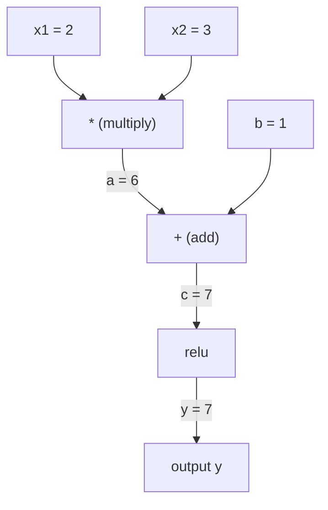
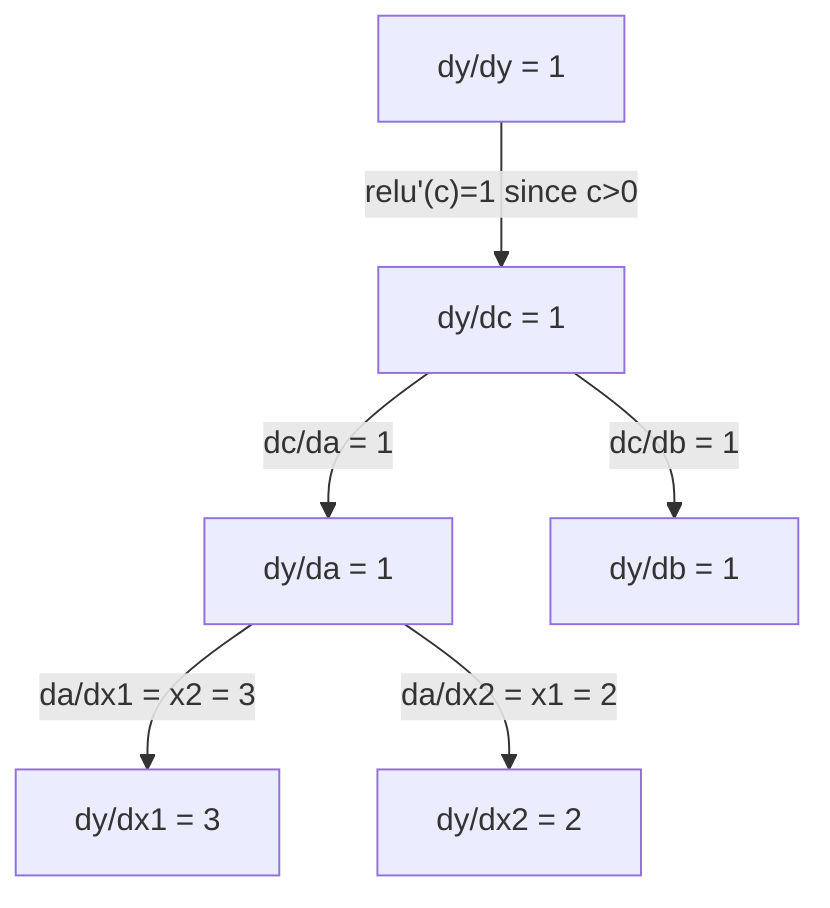

# चेन नियम और स्वचालित अंतरण

> चेन नियम प्रत्येक व्यक्ति के सीखने में सक्षम तंत्रिका नेटवर्क के पीछे का इंजन है।

**类型：**निर्माण
**语言：**पायथन
**前置要求：**चरण 1, पाठ 04 (उत्पादक और ग्रेडिएंट)
**时间：**≈ 90 मिनट

## 学习目标

- 构建一个极简 autograd 引擎(मूल्य वर्ग),记录操作并通过逆模式的自动调节 计算 Gradient
- उपयोग टोपोलॉजिकल प्रकार में गणना ग्राफ 中实现 आगे और पीछे पास
-  केवल शून्य से प्राप्त ऑटोग्रेड  इंजन का उपयोग करके, XOR पर एक बहु-परत परिक्ट्रॉन का निर्माण और प्रशिक्षण
- उपयोग ग्रेडिएंट जांच, स्वचालित रूप से संख्यात्मक मूल्य के साथ अंतहीन अंतर के लिए तुलना, सत्यापन सटीकता

## 问题

आप सरल फ़ंक्शन के निर्देशांक की गणना कर सकते हैं। लेकिन न्यूरल नेटवर्क कोई सरल फ़ंक्शन नहीं है। यह एक सौ फ़ंक्शन संयोजनों से बना हैः मैट्रिक्स गुणा, जोड़ पूर्वाग्रह, लागू सक्रियण, फिर से मैट्रिक्स गुणा, सॉफ्टमैक्स, क्रॉस-एंट्रोपी हानि।

यह असंभव है कि लाखों मापदंडों के साथ यह काम पूरा किया जाए।

श्रृंखला नियम  देना गणित आधार── स्वचालित भिन्नता  देना एल्गोरिथ्म── दूसरा संयोजन, आपको एक बार आगे के साथ पारित करने में सक्षम बनाने के लिए, सही समय के भीतर, किसी भी प्रकार के कार्यसंयोजन का गणना करने में सक्षम बनाने के लिए सटीक ग्रेडिएंट──

यह है PyTorch, TensorFlow और JAX का काम करने का तरीका. आप शून्य से एक माइक्रोटाइप संस्करण का निर्माण करेंगे.

## 核心概念

### श्रृंखला नियम

यदि `y = f(g(x))`, तो फिर `y`तुलना `x`导数是:

```
dy/dx = dy/dg * dg/dx = f'(g(x)) * g'(x)
```

沿着链条将导数相乘―― प्रत्येक环节贡献自己的局部导数――

उदाहरण:`y = sin(x^2)`

```
g(x) = x^2       g'(x) = 2x
f(g) = sin(g)     f'(g) = cos(g)

dy/dx = cos(x^2) * 2x
```

                                                                                                                                                                                                                                                              

```
y = f(g(h(x)))

dy/dx = f'(g(h(x))) * g'(h(x)) * h'(x)
```

तंत्रिका नेटवर्क के भीतर प्रत्येक स्तर, इस कड़ी पर एक कड़ी है।

### कम्प्यूटेशनल ग्राफ

कम्प्यूटेशनल ग्राफ 让链规则可视化── प्रत्येक ऑपरेशन都将成为一个节点──数据沿着图向前流动──渐进向后流动──

**Forward pass（计算值）：**



**Backward pass（计算 Gradient）：**



पिछड़ा पास प्रत्येक खंड में लागू श्रृंखला नियम, होगा ग्रेडिएंट से आउटपुट प्रसार करने के लिए इनपुट

### पूर्ववर्ती मोड बनाम विपरीत मोड

दो प्रकार के तरीके हैं जो रेखांकित में लागू किए जा सकते हैं।

**Forward mode**से输入开始,将导数向前推――它计算 `dx/dx = 1`,并通过每操作传播――适合输入少、输出多场景――

```
Forward mode: seed dx/dx = 1, propagate forward

  x = 2       (dx/dx = 1)
  a = x^2     (da/dx = 2x = 4)
  y = sin(a)  (dy/dx = cos(a) * da/dx = cos(4) * 4 = -2.615)
```

**Reverse mode**से आउटपुट शुरू, होगा ग्रेडिएंट करने के लिए पीछे वापस.`dy/dy = 1`, और प्रत्येक ऑपरेशन के माध्यम से विपरीत क्रम में प्रसारित किया गया।

```
Reverse mode: seed dy/dy = 1, propagate backward

  y = sin(a)  (dy/dy = 1)
  a = x^2     (dy/da = cos(a) = cos(4) = -0.654)
  x = 2       (dy/dx = dy/da * da/dx = -0.654 * 4 = -2.615)
```

न्यूरल नेटवर्क में कई मिलियन इनपुट हैं (वजन) और एक आउटपुट (हानि) 

| Mode | Seed | Direction | Best when |
|------|------|-----------|-----------|
| Forward | `dx_i/dx_i = 1` | 输入到输出 | 输入少、输出多 |
| Reverse | `dy/dy = 1` | 输出到输入 | 输入多、输出少（neural nets） |

### आगे मोड के लिए उपयोग किया जाता है

आगे का मोड दोहरे संख्याओं के साथ किया जा सकता है 优雅地实现──双数的形式是`a + b*epsilon`, उनमें से `epsilon^2 = 0`

```
Dual number: (value, derivative)

(2, 1) means: value is 2, derivative w.r.t. x is 1

Arithmetic rules:
  (a, a') + (b, b') = (a+b, a'+b')
  (a, a') * (b, b') = (a*b, a'*b + a*b')
  sin(a, a')         = (sin(a), cos(a)*a')
```

प्रत्येक ऑपरेशन के माध्यम से स्वचालित रूप से प्रसारित होगा।

### 构建 ऑटोग्राड 引擎

एक ऑटोग्रेड इंजन तीन चीजों की जरूरत हैः

1. **Value wrapping。**प्रत्येक संख्या को एक वस्तु में पैक करके, उसके मूल्य और ग्रेडिएंट को संग्रहीत करने के लिए उपयोग किया जाता है।
2. **Graph recording。**प्रत्येक ऑपरेशन में इसके इनपुट और स्थानीयकरण का रिकॉर्ड होता है।
3. **Backward pass。**ग्राफ के लिए एक टोपोलॉजिकल प्रकार बनाएं, फिर विपरीत दिशा में, प्रत्येक बिंदु पर श्रृंखला नियम लागू करें

यह ठीक है PyTorch की `autograd`जो करना है`torch.Tensor`वर्ग 包裹值, में `requires_grad=True`时记录操作, और आप调用 `.backward()`时计算 ग्रेडिएंट。

### पायटॉर्च ऑटोग्राड 底层如何工作

जब आप PyTorch कोड लिखने के लिएः

```python
x = torch.tensor(2.0, requires_grad=True)
y = x ** 2 + 3 * x + 1
y.backward()
print(x.grad)  # 7.0 = 2*x + 3 = 2*2 + 3
```

PyTorch में आंतरिक बैठकः

1. `x` एक बनाओ `Tensor`节点,并设置 `requires_grad=True`
2. प्रत्येक ऑपरेशन`**``*``+`) सभी एक नया नोड बना देंगे, और पीछे की ओर रिकॉर्ड  फ़ंक्शन
3. `y.backward()`触发对已记录图的反转模式自动调节
4. प्रत्येक बिंदु के `grad_fn`计算局部 ग्रेडिएंट,并将它们传给父节点
5. ग्रेडिएंट 通过加法(不是替换)累积到 `.grad`属性中

यह ग्राफ है गतिशील का ((परिभाषित-द्वारा-रन)  प्रत्येक बार आगे गुजरने से शहर एक नया ग्राफ बना देगा यही कारण है कि PyTorch 支持在模型中使用控制流 (यदि/अन्य 循环) 


```figure
chain-rule
```

##  इसे निर्माण

### 步骤 1:मूल्य वर्ग

```python
class Value:
    def __init__(self, data, children=(), op=''):
        self.data = data
        self.grad = 0.0
        self._backward = lambda: None
        self._prev = set(children)
        self._op = op

    def __repr__(self):
        return f"Value(data={self.data:.4f}, grad={self.grad:.4f})"
```

प्रत्येक `Value` अपने स्वयं के संख्यात्मक डेटा  Gradient初始为零)  एक पिछड़े 函数, तथा इसके उत्पन्न करने वाले बाल नोड्स के संकेतों को संग्रहीत करें

### 步骤 2:带渐进跟踪 的算术操作

```python
    def __add__(self, other):
        other = other if isinstance(other, Value) else Value(other)
        out = Value(self.data + other.data, (self, other), '+')
        def _backward():
            self.grad += out.grad
            other.grad += out.grad
        out._backward = _backward
        return out

    def __mul__(self, other):
        other = other if isinstance(other, Value) else Value(other)
        out = Value(self.data * other.data, (self, other), '*')
        def _backward():
            self.grad += other.data * out.grad
            other.grad += self.data * out.grad
        out._backward = _backward
        return out

    def relu(self):
        out = Value(max(0, self.data), (self,), 'relu')
        def _backward():
            self.grad += (1.0 if out.data > 0 else 0.0) * out.grad
        out._backward = _backward
        return out
```

प्रत्येक ऑपरेशन एक बंद बनाने के लिए होगा, यह पता है कैसे गणना करने के लिए स्थानीय ग्रेडिएंट,并乘以上游 ग्रेडिएंट(`out.grad`)。`+=`处理 एक ऐसी स्थिति है जब किसी मान का उपयोग कई ऑपरेशनों द्वारा किया जाता है।

### 步骤 3: पीछे की ओर पास

```python
    def backward(self):
        topo = []
        visited = set()
        def build_topo(v):
            if v not in visited:
                visited.add(v)
                for child in v._prev:
                    build_topo(child)
                topo.append(v)
        build_topo(self)

        self.grad = 1.0
        for v in reversed(topo):
            v._backward()
```

टोपोलॉजिकल प्रकार  सुनिश्चित करें कि प्रत्येक खंड का ग्रेडिएंट  पहले से ही पूर्ण गणना में है 

### 步骤 4: पूर्ण इंजन की आवश्यकता अधिक संचालन

基础 मूल्य वर्ग 支持加法、乘法和 rel rel. . . वास्तविक ऑटोग्रेड  इंजन को अधिक क्षमता की आवश्यकता है.

```python
    def __neg__(self):
        return self * -1

    def __sub__(self, other):
        return self + (-other)

    def __radd__(self, other):
        return self + other

    def __rmul__(self, other):
        return self * other

    def __rsub__(self, other):
        return other + (-self)

    def __pow__(self, n):
        out = Value(self.data ** n, (self,), f'**{n}')
        def _backward():
            self.grad += n * (self.data ** (n - 1)) * out.grad
        out._backward = _backward
        return out

    def __truediv__(self, other):
        return self * (other ** -1) if isinstance(other, Value) else self * (Value(other) ** -1)

    def exp(self):
        import math
        e = math.exp(self.data)
        out = Value(e, (self,), 'exp')
        def _backward():
            self.grad += e * out.grad
        out._backward = _backward
        return out

    def log(self):
        import math
        out = Value(math.log(self.data), (self,), 'log')
        def _backward():
            self.grad += (1.0 / self.data) * out.grad
        out._backward = _backward
        return out

    def tanh(self):
        import math
        t = math.tanh(self.data)
        out = Value(t, (self,), 'tanh')
        def _backward():
            self.grad += (1 - t ** 2) * out.grad
        out._backward = _backward
        return out
```

**每个操作为什么重要：**

| Operation | Backward rule | Used in |
|-----------|--------------|---------|
| `__sub__` | 复用 add + neg | Loss 计算（pred - target） |
| `__pow__` | n * x^(n-1) | Polynomial activations、MSE（error^2） |
| `__truediv__` | 复用 mul + pow(-1) | Normalization、learning rate scaling |
| `exp` | exp(x) * upstream | Softmax、log-likelihood |
| `log` | (1/x) * upstream | Cross-entropy loss、log probabilities |
| `tanh` | (1 - tanh^2) * upstream | 经典 activation function |

巧妙之处在:`__sub__`和 `__truediv__`यह पहले से ही परिभाषित ऑपरेशनों के साथ होता है। वे स्वचालित रूप से सही ग्रेडिएंट प्राप्त करते हैं, क्योंकि चेन नियम नीचे के स्तर के जोड़ों / मल / पव ऑपरेशन को संकलित करता है।

### 步骤 5: मिनी एमएलपी को शून्य से प्राप्त करना

एक पूर्ण मूल्य वर्ग के साथ, आप न्यूरल नेटवर्क का निर्माण कर सकते हैं।

```python
import random

class Neuron:
    def __init__(self, n_inputs):
        self.w = [Value(random.uniform(-1, 1)) for _ in range(n_inputs)]
        self.b = Value(0.0)

    def __call__(self, x):
        act = sum((wi * xi for wi, xi in zip(self.w, x)), self.b)
        return act.tanh()

    def parameters(self):
        return self.w + [self.b]

class Layer:
    def __init__(self, n_inputs, n_outputs):
        self.neurons = [Neuron(n_inputs) for _ in range(n_outputs)]

    def __call__(self, x):
        return [n(x) for n in self.neurons]

    def parameters(self):
        return [p for n in self.neurons for p in n.parameters()]

class MLP:
    def __init__(self, sizes):
        self.layers = [Layer(sizes[i], sizes[i+1]) for i in range(len(sizes)-1)]

    def __call__(self, x):
        for layer in self.layers:
            x = layer(x)
        return x[0] if len(x) == 1 else x

    def parameters(self):
        return [p for layer in self.layers for p in layer.parameters()]
```

एक `Neuron`计算 `tanh(w1*x1 + w2*x2 + ... + b)` एक `Layer`列表――一个 `MLP`堆叠多层── प्रत्येक वजन `Value`, तो调用 `loss.backward()`प्रत्येक तत्व पर एक ग्रेडिएंट का प्रसार होगा।

**在 XOR 上训练：**

```python
random.seed(42)
model = MLP([2, 4, 1])  # 2 inputs, 4 hidden neurons, 1 output

xs = [[0, 0], [0, 1], [1, 0], [1, 1]]
ys = [-1, 1, 1, -1]  # XOR pattern (using -1/1 for tanh)

for step in range(100):
    preds = [model(x) for x in xs]
    loss = sum((p - y) ** 2 for p, y in zip(preds, ys))

    for p in model.parameters():
        p.grad = 0.0
    loss.backward()

    lr = 0.05
    for p in model.parameters():
        p.data -= lr * p.grad

    if step % 20 == 0:
        print(f"step {step:3d}  loss = {loss.data:.4f}")

print("\nPredictions after training:")
for x, y in zip(xs, ys):
    print(f"  input={x}  target={y:2d}  pred={model(x).data:6.3f}")
```

यह है माइक्रोग्रेड। एक पूर्ण तंत्रिका नेटवर्क प्रशिक्षण चक्र जो शुद्ध पायथन और स्वचालित भिन्नता के साथ पूरा होता है। प्रत्येक व्यावसायिक डीप लर्निंग फ्रेमवर्क विशाल पैमाने पर किया जाता है।

### 步骤 6: ग्रेडिएंट जांच

आप कैसे जानते हैं कि आपका ऑटोडिफ़ सही है? इसे संख्यात्मक निर्देशांक से तुलना करें।

```python
def gradient_check(build_expr, x_val, h=1e-7):
    x = Value(x_val)
    y = build_expr(x)
    y.backward()
    autodiff_grad = x.grad

    y_plus = build_expr(Value(x_val + h)).data
    y_minus = build_expr(Value(x_val - h)).data
    numerical_grad = (y_plus - y_minus) / (2 * h)

    diff = abs(autodiff_grad - numerical_grad)
    return autodiff_grad, numerical_grad, diff
```

एक जटिल अभिव्यक्ति में परीक्षण यहः

```python
def expr(x):
    return (x ** 3 + x * 2 + 1).tanh()

ad, num, diff = gradient_check(expr, 0.5)
print(f"Autodiff:  {ad:.8f}")
print(f"Numerical: {num:.8f}")
print(f"Difference: {diff:.2e}")
# Difference should be < 1e-5
```

实现新操作时,梯度检查 至关重要―― यदि आपका बैकवर्ड पास कोई बग है, तो संख्यात्मक मूल्य जांच इसे पाएगी―― प्रत्येक गंभीर गहन सीखने 实现都会在开发期间运行梯度检查――

**什么时候使用 gradient checking：**

| Situation | Do gradient check? |
|-----------|-------------------|
| 向 autograd 添加新操作 | 是，始终要做 |
| 调试无法收敛的训练循环 | 是，先检查 Gradient |
| 生产训练 | 否，太慢（每个参数需要 2 次 forward pass） |
| autograd 代码的 unit tests | 是，将它自动化 |

### 步骤 7: सह-घोषणा परिणाम सत्यापन

```python
x1 = Value(2.0)
x2 = Value(3.0)
a = x1 * x2          # a = 6.0
b = a + Value(1.0)    # b = 7.0
y = b.relu()          # y = 7.0

y.backward()

print(f"y = {y.data}")          # 7.0
print(f"dy/dx1 = {x1.grad}")   # 3.0 (= x2)
print(f"dy/dx2 = {x2.grad}")   # 2.0 (= x1)
```

手动检查:`y = relu(x1*x2 + 1)`由于 `x1*x2 + 1 = 7 > 0`, रीलू ही पहचान है
`dy/dx1 = x2 = 3``dy/dx2 = x1 = 2`引擎的结果一致──

## इसका उपयोग करें

### 与 PyTorch 验证

```python
import torch

x1 = torch.tensor(2.0, requires_grad=True)
x2 = torch.tensor(3.0, requires_grad=True)
a = x1 * x2
b = a + 1.0
y = torch.relu(b)
y.backward()

print(f"PyTorch dy/dx1 = {x1.grad.item()}")  # 3.0
print(f"PyTorch dy/dx2 = {x2.grad.item()}")  # 2.0
```

ग्रेडिएंट 相同──आपके इंजन का परिणाम PyTorch के साथ एक致, क्योंकि गणित की आधारशिला समान हैः चेन नियम के माध्यम से 实现 रिवर्स मोड ऑटोडिफ──

### एक अधिक जटिल अभिव्यक्ति

```python
a = Value(2.0)
b = Value(-3.0)
c = Value(10.0)
f = (a * b + c).relu()  # relu(2*(-3) + 10) = relu(4) = 4

f.backward()
print(f"df/da = {a.grad}")  # -3.0 (= b)
print(f"df/db = {b.grad}")  #  2.0 (= a)
print(f"df/dc = {c.grad}")  #  1.0
```

## 交付内容

本课会产出:
- `outputs/skill-autodiff.md`-- एक निर्माण और ऑटोग्रेड सिस्टम के परीक्षण के लिए एक कौशल
- `code/autodiff.py`-- एक विस्तार करने के लिए जारी रख सकते हैं कि बहुत ही सरल ऑटोग्रेड  इंजन

इस में निर्मित मूल्य वर्ग चरण 3 में तंत्रिका नेटवर्क प्रशिक्षण चक्र का आधार है।

## अभ्यास

1. 添加  मूल्य वर्ग`__pow__`, तो तुम कर सकते हैं गणना `x ** n`验证在 `x=2`时,`d/dx(x^3)`और `12.0`

2. 添加 `tanh`作为激活函数──验证 `tanh'(0) = 1`且 `tanh'(2) = 0.0707`(असमान मूल्य)

3. एक ही न्यूरॉन के लिए गणना ग्राफ का निर्माण करेंः`y = relu(w1*x1 + w2*x2 + b)`计算全部五个 Gradient,并与 PyTorch 验证──

4. दोहरे संख्याओं का उपयोग करें  आगे के मोड ऑटोडिफ़ को प्राप्त करें `Dual`वर्ग,并验证 यह दिया गया निर्देशांक रिवर्स मोड इंजन के समान है।

## 关键术语

| Term | What people say | What it actually means |
|------|----------------|----------------------|
| Chain rule | “把导数相乘” | 组合函数的导数等于每个函数在正确位置处的局部导数之积 |
| Computational graph | “网络图” | 一个有向无环图，其中节点是操作，边承载值（forward）或 Gradient（backward） |
| Forward mode | “向前推导数” | 将导数从输入传播到输出的 autodiff。每个输入变量需要一次 pass。 |
| Reverse mode | “Backpropagation” | 将 Gradient 从输出传播到输入的 autodiff。每个输出变量需要一次 pass。 |
| Autograd | “自动 Gradient” | 一个系统：记录对值执行的操作、构建 graph，并通过 Chain Rule 计算精确 Gradient |
| Dual numbers | “值加导数” | 形式为 a + b*epsilon（epsilon^2 = 0）的数字，可以在算术运算中携带导数信息 |
| Topological sort | “依赖顺序” | 对 graph 节点排序，使每个节点都位于其所有依赖之后。正确传播 Gradient 所必需。 |
| Gradient accumulation | “相加，不要替换” | 当一个值流入多个操作时，它的 Gradient 是所有传入 Gradient 贡献的总和 |
| Dynamic graph | “Define by run” | 每次 forward pass 都重新构建的 computation graph，允许模型内部使用 Python 控制流（PyTorch 风格） |
| Gradient checking | “数值验证” | 将 autodiff Gradient 与数值 finite-difference Gradient 对比，以验证正确性。调试时必不可少。 |
| MLP | “Multi-layer perceptron” | 一个包含一层或多层隐藏 neuron 的 Neural Network。每个 neuron 计算加权和加 bias，然后应用 activation function。 |
| Neuron | “加权和 + activation” | 基本单元：output = activation(w1*x1 + w2*x2 + ... + b)。weights 和 bias 是可学习参数。 |

## 延伸阅读

- [3Blue1Brown: Backpropagation calculus](https://www.youtube.com/watch?v=tIeHLnjs5U8)-- न्यूरल नेटवर्क के लिए मध्य श्रृंखला नियम की दृश्य व्याख्या
- [PyTorch Autograd mechanics](https://pytorch.org/docs/stable/notes/autograd.html)-- 真实系统的工作方式
- [Baydin et al., Automatic Differentiation in Machine Learning: a Survey](https://arxiv.org/abs/1502.05767)-- 综合参考
