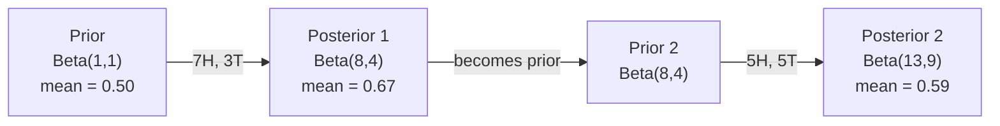

# बेयज़ का प्रमेय

> संभावना  चिंता है कि आप क्या होने की उम्मीद है  बेयज़ का सिद्धांत  चिंता है कि आप क्या सीखा है 

**类型：**निर्माण
**语言：**पायथन
**前置要求：**चरण 1, पाठ 06 (संभाव्यता मूल बातें)
**时间：**~ 75 मिनट

## 学习目标

-  Bayes के प्रमेय को लागू करें, पूर्वोत्तर संभावना और साक्ष्य के आधार पर  गणना पिछली संभावना
- शून्य से निर्माण एक के साथ लैप्लेस चिकनाई और लॉग-स्पेस गणना के Naive Bayes 文本分类器
- तुलना MLE और MAP अनुमान,并解释 MAP 如何应对L2 नियमन
- उपयोग बीटा-बाइनोमीअल संयुग्मित पूर्ववर्ती के लिए ए / बी परीक्षण  अनुक्रमिक बेयिसियन अद्यतन प्राप्त करने के लिए

## 问题

एक मेडिकल जांच में 99% सटीकता होती है। आपका परीक्षण सकारात्मक निकला है। आपके वास्तव में बीमार होने की संभावना कितनी है?

अधिकांश लोग कहेंगे 99%। वास्तविक उत्तर इस बीमारी के दुर्लभ होने पर निर्भर करता है। यदि प्रति 10,000 लोगों में से केवल 1 व्यक्ति ही बीमार है, तो एक बार सकारात्मक परिणाम का मतलब है कि आपके पास लगभग 1% रोग होने की संभावना है। शेष 99% सकारात्मक परिणाम स्वस्थ व्यक्ति द्वारा उत्पन्न गलत सूचनाएं हैं।

यह मस्तिष्क का त्वरित परिवर्तन नहीं है। यह बेयज़ का सिद्धांत है। प्रत्येक स्पैम फ़िल्टर, प्रत्येक चिकित्सा निदान, प्रत्येक अनिश्चितता का एमएल मॉडल पूरी तरह से एक ही तर्क का उपयोग करता है।

यदि आप इस बिंदु को नहीं समझते हैं तो एमएल सिस्टम का निर्माण करते समय, मॉडल आउटपुट को गलत तरीके से समझते हैं, खराब सीमाएं निर्धारित करते हैं, और अत्यधिक आत्मविश्वास वाली भविष्यवाणियां जारी करते हैं।

## 概念

### संयुक्त संभावना से बेयज़ तक

आप पहले से ही पाठ 06 में जानते हैं कि सशर्त संभावना हैः

```
P(A|B) = P(A and B) / P(B)
```

称地:

```
P(B|A) = P(A and B) / P(A)
```

 दो अभिव्यक्ति साझा एक ही अणु:P(A और B)。令它们相等并重新整理:

```
P(A and B) = P(A|B) * P(B) = P(B|A) * P(A)

Therefore:

P(A|B) = P(B|A) * P(A) / P(B)
```

यही बेयज़ का सिद्धांत है।

### चार भाग

| Part | Name | What it means |
|------|------|---------------|
| P(A\|B) | Posterior | 看到 evidence B 之后，你对 A 的更新后 belief |
| P(B\|A) | Likelihood | 如果 A 为真，evidence B 出现的概率有多大 |
| P(A) | Prior | 在看到任何 evidence 之前，你对 A 的 belief |
| P(B) | Evidence | 在所有可能性下看到 B 的总概率 |

साक्ष्य 项 P(B) 起到归一化因子的作用── आप कुल संभावना नियम के साथ इसे विकसित कर सकते हैंः

```
P(B) = P(B|A) * P(A) + P(B|not A) * P(not A)
```

### 医学检测 उदाहरण

एक बीमारी प्रति 10,000 लोगों में से 1 व्यक्ति को प्रभावित करती है। जांच की सटीकता दर 99% है।

```
P(sick)          = 0.0001     (prior: disease is rare)
P(positive|sick) = 0.99       (likelihood: test catches it)
P(positive|healthy) = 0.01    (false positive rate)

P(positive) = P(positive|sick) * P(sick) + P(positive|healthy) * P(healthy)
            = 0.99 * 0.0001 + 0.01 * 0.9999
            = 0.000099 + 0.009999
            = 0.010098

P(sick|positive) = P(positive|sick) * P(sick) / P(positive)
                 = 0.99 * 0.0001 / 0.010098
                 = 0.0098
                 = 0.98%
```

% तक नहीं पहले प्रधानता  जब किसी प्रकार की स्थिति बहुत दुर्लभ होती है, तो भी सटीक परीक्षण से झूठी सकारात्मकता भी उत्पन्न होती है यही कारण है कि डॉक्टरों को पुष्टि परीक्षण करने की आवश्यकता होती है

### स्पैम फ़िल्टर उदाहरण

आपको एक ईमेल मिला जिसमें "लॉटरी" शब्द शामिल था। क्या यह स्पैम है?

```
P(spam)                = 0.3      (30% of email is spam)
P("lottery"|spam)      = 0.05     (5% of spam emails contain "lottery")
P("lottery"|not spam)  = 0.001    (0.1% of legitimate emails contain "lottery")

P("lottery") = 0.05 * 0.3 + 0.001 * 0.7
             = 0.015 + 0.0007
             = 0.0157

P(spam|"lottery") = 0.05 * 0.3 / 0.0157
                  = 0.955
                  = 95.5%
```

एक शब्द में संभावना 30% से बढ़कर 95.5% तक हो जाती है।

### बेयसः स्वतंत्रता का अनुमान

बेयज़ ने एक वर्ग की स्थिति में एक दूसरे से स्वतंत्र होने के लिए सभी विशेषताओं को मानकर इस विचार को कई विशेषताओं में विस्तारित कियाः

```
P(class | feature_1, feature_2, ..., feature_n)
  = P(class) * P(feature_1|class) * P(feature_2|class) * ... * P(feature_n|class)
    / P(feature_1, feature_2, ..., feature_n)
```

"नई" का हिस्सा स्वतंत्रता परिकल्पना है। ग्रंथों में, शब्दों का उद्भव स्वतंत्र नहीं है। "नई" और "यॉर्क" संबंधित हैं। लेकिन इस परिकल्पना का अभ्यास में प्रभाव आश्चर्यजनक रूप से अच्छा है, क्योंकि वर्गीकरण उपकरण को केवल कक्षाओं के लिए क्रमबद्ध करने की आवश्यकता होती है, न कि एक अच्छी संभावना उत्पन्न करने की आवश्यकता होती है।

चूंकि分母 सभी वर्गों के लिए समान हैं, आप इसे छोड़ सकते हैं, केवल तुलना करें अणुओंः

```
score(class) = P(class) * product of P(feature_i | class)
```

选择最高的分数――

### अधिकतम संभावना अनुमान (MLE)

如何从训练数据中获取P  विशेषताएं

```
P("free"|spam) = (number of spam emails containing "free") / (total spam emails)
```

यही MLE हैः चयन करें कि अवलोकन डेटा सबसे संभावित रूप से उत्पन्न होने वाले पैरामीटर मूल्य है। आप अधिकतम संभावना फ़ंक्शन में हैं; विखंडन गणना के लिए, यह सापेक्ष आवृत्ति में सरल होगा।

问题: यदि किसी शब्द को प्रशिक्षण के दौरान कभी स्पैम में नहीं देखा गया हो, तो MLE उसे शून्य संभावनाएँ देगा।

```
P(word|class) = (count(word, class) + 1) / (total_words_in_class + vocabulary_size)
```

 प्रत्येक गणना को 1 जोड़ें, सुनिश्चित करें कि कोई भी संभावना शून्य नहीं होगी

### अधिकतम एक बाद में (MAP)

MLE 问的是: कौन से पैरामीटर अधिकतम P(के कौन से डेटा पैरामीटर हैं?

MAP 问是: कौन से पैरामीटर अधिकतम P  पैरामीटर डेटा में)?

बेयज़ के सिद्धांत के अनुसारः

```
P(parameters|data) proportional to P(data|parameters) * P(parameters)
```

MAP में पैरामीटरों को स्वयं से एक पूर्ववर्ती जोड़ें। यदि आप मानते हैं कि पैरामीटर  छोटे होना चाहिए, तो इसे दंडात्मक उच्च मूल्य के पूर्ववर्ती के लिए कोडित करें। यह एमएल में एल 2 नियमितता के साथ पूरी तरह से समान है। रिज रेग्रेसशन में "रिज" दंड मूल रूप से ऊपरी गौशियन पूर्ववर्ती के भारों में है।

| Estimation | Optimizes | ML equivalent |
|------------|-----------|---------------|
| MLE | P(data\|params) | 未 regularize 的训练 |
| MAP | P(data\|params) * P(params) | L2 / L1 regularization |

### बेशियन बनाम फ्रिक्वेन्टिस्ट:实践差异

आवृत्तिवादियों ने पैरामीटर को स्थिर लेकिन अज्ञात मात्रा के रूप में देखा। वे पूछते हैंः यदि मैं इस प्रयोग को कई बार दोहराता हूं, तो क्या होगा?

बेयिसियनों ने पैरामीटर को वितरण के रूप में रखा। वे पूछते हैंः मैंने जो कुछ देखा है, उसके आधार पर, मैं इन पैरामीटर पर क्या विश्वास करता हूं?

 निर्माण के लिए एमएल 系统, प्रैक्टिस में निम्न प्रकार के अंतर हैंः

| Aspect | Frequentist | Bayesian |
|--------|-------------|----------|
| Output | 点估计 | 值上的 distribution |
| Uncertainty | Confidence intervals（关于过程） | Credible intervals（关于 parameter） |
| Small data | 可能 overfit | Prior 起到 regularization 的作用 |
| Computation | 通常更快 | 通常需要 sampling（MCMC） |

अधिकांश उत्पादन स्तर एमएल का उपयोग अक्सर किया जाता है (जहां आपको अच्छी अनिश्चितता की आवश्यकता होती है) या डेटा बहुत कम होता है (जहां बायेशियन विधि बहुत उपयोगी होती है) ।

### क्यों बेयसियन सोच ML के लिए महत्वपूर्ण है

इस प्रकार की संबंधित प्रकार अधिक गहराः

**Priors 就是 regularization。**भार ऊपर का गौसीयन पूर्ववर्ती L2 नियमितकरण है。Laplace पूर्ववर्ती L1。 प्रत्येक बार जोड़ने नियमितकरण 项 के दौरान, आप सभी पर परमिट मानों की अपेक्षा पर एक बेईसीन कथन बना रहे हैं。

**Posteriors 就是不确定性。**单个预测概率不能告诉你模型对该估计有多信心――बैशियन पद्धति会给你一个分布:我认为P(स्पैम)  0.8 से 0.95 之间──

**Bayes updates 就是 online learning。**आज का बाद वाला कल का पूर्ववर्ती बन जाएगा। जब आपका मॉडल नए डेटा को देखेगा, तो यह शून्य से पुनः प्रशिक्षण के बजाय अपने विश्वासों को नवीनीकृत करेगा।

**Model comparison 是 Bayesian 的。**बेयिसन सूचना मानदंड (बीआईसी)  मार्जिनल संभावना व बेयिस कारक  बेयिसन तर्क का उपयोग करते हैं 


```figure
bayes-update
```

##  इसे निर्माण
### 步骤 1:बेय के प्रमेय समारोह

```python
def bayes(prior, likelihood, false_positive_rate):
    evidence = likelihood * prior + false_positive_rate * (1 - prior)
    posterior = likelihood * prior / evidence
    return posterior

result = bayes(prior=0.0001, likelihood=0.99, false_positive_rate=0.01)
print(f"P(sick|positive) = {result:.4f}")
```

### 步骤 2:नईवे बेय्स वर्गीकरण

```python
import math
from collections import defaultdict

class NaiveBayes:
    def __init__(self, smoothing=1.0):
        self.smoothing = smoothing
        self.class_counts = defaultdict(int)
        self.word_counts = defaultdict(lambda: defaultdict(int))
        self.class_word_totals = defaultdict(int)
        self.vocab = set()

    def train(self, documents, labels):
        for doc, label in zip(documents, labels):
            self.class_counts[label] += 1
            words = doc.lower().split()
            for word in words:
                self.word_counts[label][word] += 1
                self.class_word_totals[label] += 1
                self.vocab.add(word)

    def predict(self, document):
        words = document.lower().split()
        total_docs = sum(self.class_counts.values())
        vocab_size = len(self.vocab)
        best_class = None
        best_score = float("-inf")
        for cls in self.class_counts:
            score = math.log(self.class_counts[cls] / total_docs)
            for word in words:
                count = self.word_counts[cls].get(word, 0)
                total = self.class_word_totals[cls]
                score += math.log((count + self.smoothing) / (total + self.smoothing * vocab_size))
            if score > best_score:
                best_score = score
                best_class = cls
        return best_class
```

लॉग-संभाव्यताओं को कम प्रवाह से रोकना संभव है। बहुत कम संभावनाओं के गुणा होने से फ्लोटिंग प्वाइंट पर बहुत कम संख्याएं उत्पन्न होती हैं।

### 步骤 3: स्पैम डेटा पर प्रशिक्षण

```python
train_docs = [
    "win free money now",
    "free lottery ticket winner",
    "claim your prize today free",
    "urgent offer free cash",
    "congratulations you won free",
    "meeting tomorrow at noon",
    "project update attached",
    "can we schedule a call",
    "quarterly report review",
    "lunch on thursday sounds good",
    "team standup notes attached",
    "please review the pull request",
]

train_labels = [
    "spam", "spam", "spam", "spam", "spam",
    "ham", "ham", "ham", "ham", "ham", "ham", "ham",
]

classifier = NaiveBayes()
classifier.train(train_docs, train_labels)

test_messages = [
    "free money waiting for you",
    "meeting rescheduled to friday",
    "you won a free prize",
    "please review the attached report",
]

for msg in test_messages:
    print(f"  '{msg}' -> {classifier.predict(msg)}")
```

### 步骤 4: जाँच सीखने की संभावना

```python
def show_top_words(classifier, cls, n=5):
    vocab_size = len(classifier.vocab)
    total = classifier.class_word_totals[cls]
    probs = {}
    for word in classifier.vocab:
        count = classifier.word_counts[cls].get(word, 0)
        probs[word] = (count + classifier.smoothing) / (total + classifier.smoothing * vocab_size)
    sorted_words = sorted(probs.items(), key=lambda x: x[1], reverse=True)
    for word, prob in sorted_words[:n]:
        print(f"    {word}: {prob:.4f}")

print("\nTop spam words:")
show_top_words(classifier, "spam")
print("\nTop ham words:")
show_top_words(classifier, "ham")
```

## इसका उपयोग करें
स्किट-लर्न ने उत्पादित करने योग्य साफ़ बेयों को प्राप्त कियाः

```python
from sklearn.feature_extraction.text import CountVectorizer
from sklearn.naive_bayes import MultinomialNB
from sklearn.metrics import classification_report

vectorizer = CountVectorizer()
X_train = vectorizer.fit_transform(train_docs)
clf = MultinomialNB()
clf.fit(X_train, train_labels)

X_test = vectorizer.transform(test_messages)
predictions = clf.predict(X_test)
for msg, pred in zip(test_messages, predictions):
    print(f"  '{msg}' -> {pred}")
```

एक ही एल्गोरिथ्म──CountVectorizer  संसाधित टोकनाइजेशन एवं शब्दावली निर्माण──बहुवचनNB में आंतरिक संसाधित करने के लिए समतल और लॉग-संभाव्यता──आप शून्य से लिखने के संस्करण के साथ 40 行代码 के साथ एक ही बात को पूरा किया है──

## 交付 यह
इस में निर्मित NaiveBayes वर्ग  ने पूरी पाइपलाइन प्रदर्शित कीः टोकनाइज़ेशन  लैप्लेस स्लीडिंग का उपयोग करके संभावना अनुमान  लॉग-स्पेस भविष्यवाणी `code/bayes.py`मध्य कोड को Python मानक पुस्तकालय के अलावा किसी भी निर्भरता की आवश्यकता नहीं है।

### पूर्ववर्ती विवाह

जब पूर्व और बाद का ् ् ् ् ् ् ् ् ् ् ् ् ् ् ् ् ् ् ् ् ् ् ् ् ् ् ् ् ् ् ् ् ् ् ् ् ् ् ् ् ् ् ् ् ् ् ् ् ् ् ् ् ् ् ् ् ् ् ् ् ् ् ् ् ् ् ् ् ् ् ् ् ् ् ् ् ् ् ् ् ् ् ् ् ् ् ् ् ् ् ् ् ् ् ् ् ् ् ् ् ् ् ् ् ् ् ् ् ् ् ् ् ् ् ् ् ् ् ् ् ् ् ् ् ् ् ् ् ् ् ् ् ् ् ् ् ् ् ् ् ् ् ् ् ् ् ् ् ् ् ् ् ् ् ् ् ् ् ् ् ् ् ् ् ् ् ् ् ् ् ् ् ् ् ् ् ् ् ् ् ् ् ् ् ् ् ् ् ् ् ् ् ् ् ् ् ् ् ् ् ् ् ् ् ् ् ् ् ् ् ् ् ् ् ् ् ् ् ् ् ् ् ् ् ् ् ् ् ् ् ् ् ् ् ् ् ् ् ् ् ् ् ् ् ् ् ् ् ् ् ् ् 

| Likelihood | Conjugate Prior | Posterior | Example |
|-----------|----------------|-----------|---------|
| Bernoulli | Beta(a, b) | Beta(a + successes, b + failures) | Coin flip bias estimation |
| Normal (known variance) | Normal(mu_0, sigma_0) | Normal(weighted mean, smaller variance) | Sensor calibration |
| Poisson | Gamma(a, b) | Gamma(a + sum of counts, b + n) | Modeling arrival rates |
| Multinomial | Dirichlet(alpha) | Dirichlet(alpha + counts) | Topic modeling, language models |

यह क्यों महत्वपूर्ण हैः कोई संयुग्मित पूर्ववर्ती नहीं है, तो आपको मोन्टे कार्लो नमूना या भिन्नता निष्कर्ष की आवश्यकता है, निकट भविष्य से।

बीटा वितरण अभ्यास में सबसे आम संयोग पूर्व है。बीटा, बी) एक निश्चित संभावना पैरामीटर के प्रति आपकी विश्वास को दर्शाता है。 औसत मूल्य है a/(a+b)。a+b 越大, वितरण 越集中(越自信)。

बीटा पूर्व की विशेष परिस्थितियांः
- बीटा(1, 1) = समान──आप पैरामीटर के प्रति कोई राय नहीं──
- बीटा ((10, 10) =                                                                                                                                                                                                                                                            
- Beta(1, 10) = ओर 0 偏斜──你相信参数 很小──

更新规则极其简单:

```
Prior:     Beta(a, b)
Data:      s successes, f failures
Posterior: Beta(a + s, b + f)
```

没有积分――没有样本――只有加法――

### क्रमशः बेयिसियन अद्यतन

बेईसी का निष्कर्ष है कि आज का बाद का समय कल का पूर्व होगा। यह वास्तविकता प्रणाली सभी ऐतिहासिक डेटा को पुनः प्रसंस्करण न करने के मामले में कैसे वृद्धि सीखती है।

具体例: अनुमानित करें कि एक सिक्का निष्पक्ष है या नहीं।

**Day 1：还没有数据。**
Beta 1, 1) 开始一个制服前你没有意见
- पूर्व औसतः0.5
- पूर्व में [0, 1] ऊपर है समतल

**Day 2：观察到 7 次正面，3 次反面。**
पछाड़ = बीटा(1 + 7, 1 + 3) = बीटा(8, 4)
- बाद का औसतः8/12 = 0.667
- साक्ष्य 硬币 की सही दिशा में प्रवृत्ति दिखाते हैं

**Day 3：又观察到 5 次正面，5 次反面。**
उपयोग कल के बाद के रूप में आज के पूर्व के रूप में
पछाड़ = बीटा ((8 + 5, 4 + 5) = बीटा ((13, 9)
- बाद का औसत:13/22 = 0.591
- नए संतुलन डेटा ने अनुमानित मूल्य को 0.5 के करीब वापस ले लिया



观测顺序不重要――Beta(1,1) एक次性用全部12次正面和8次反面更新,也会得到Beta(13, 9)结果相同──序列更新和批次更新 在数学上等价──但序列更新 允许你在每一步做决定,而不必存储原始数据──

यह उत्पादन स्तर के एमएल सिस्टम में ऑनलाइन सीखने का आधार है। डाकू के लिए थॉम्पसन नमूनाकरण, वृद्धि की सिफारिश प्रणाली और स्ट्रीमिंग विसंगतियों के डिटेक्टर इस तरह के मॉडल का उपयोग करते हैं।

### ए/बी परीक्षण से संपर्क करें

ए/बी परीक्षण मूलतः एक नकली बेयिसियन निष्कर्ष है।

设定:你正在测试两种按颜色──A蓝色和B绿色──你想知道哪一个得到更多点击──

बेसियन ए/बी परीक्षणः

1. **Prior。**两个变体都从Beta(1, 1) 开始──没有先进偏好──
2. **Data。**वेरिएंट एः 1000 बार प्रदर्शनी में 50 बार点击── वेरिएंट बीः 1000 बार प्रदर्शनी में 65 बार点击──
3. **Posteriors。**
   - एःबीटा ((1 + 50, 1 + 950) = बीटा ((51, 951) ・・・ औसत = 0.051
   - बीःबीटा ((1 + 65, 1 + 935) = बीटा ((66, 936) ――मीड = 0.066
4. **Decision。**计算 P(B > A)B का वास्तविक रूपांतरण दर A से अधिक है

解析地计算 P(B > A) 很困难――但蒙特卡罗 让它变得非常简单:

```
1. Draw 100,000 samples from Beta(51, 951)  -> samples_A
2. Draw 100,000 samples from Beta(66, 936)  -> samples_B
3. P(B > A) = fraction of samples where B > A
```

यदि P(B > A) > 0.95, तो हम संस्करण B को जारी करेंगे। यदि यह 0.05 और 0.95 के बीच है, तो हम डेटा एकत्र करना जारी रखेंगे।

तुलनात्मक ए/बी परीक्षण के फायदेः
- आप एक प्रत्यक्ष संभावना प्राप्त करेंगे बयानः B एक 97% संभावना बेहतर है 
- 没有 p-value 混──没有 fail to reject the null hypothesis  这种回避表述──
- आप परिणाम देख सकते हैं, और उच्च झूठी सकारात्मक दर नहीं बढ़ा सकते हैं
- आप पहले से ज्ञान को शामिल कर सकते हैं, उदाहरण के लिए, पहले के परीक्षणों में रूपांतरण दरें आमतौर पर 3-8 प्रतिशत होती हैं।

| Aspect | Frequentist A/B | Bayesian A/B |
|--------|----------------|--------------|
| Output | p-value | P(B > A) |
| Interpretation | “如果 A=B，这些数据有多令人意外？” | “B 比 A 更好的可能性有多大？” |
| Early stopping | 会抬高 false positives | 任意时点都是安全的（前提是 prior 选择合理且 model specification 正确） |
| Prior knowledge | 不使用 | 编码为 Beta prior |
| Decision rule | p < 0.05 | P(B > A) > threshold |

## अभ्यास
1. **Multiple tests。**एक रोगी दो स्वतंत्र परीक्षणों में सकारात्मक रहा है। दो परीक्षणों में 99% सटीकता है। रोग की प्रकोप दर प्रति 10,000 लोगों में से 1 है।

2. **Smoothing impact。**प्रयोग 0.01、0.1、1.0 और 10.0 के समतल मान 运行 स्पैम वर्गीकरणकर्ता── शीर्ष शब्द संभावनाएँ 会如何变化?当平滑=0 且某个词只出现 中时会发生什么?

3. **Add features。**扩展 NaiveBayes वर्ग, इसे शब्द गिनती के अलावा 之外, भी उपयोग संदेश लंबाई(शॉर्ट/लंबा) के रूप में सुविधा── From training डाटा中 अनुमान P((शॉर्टस्पैम) 和 P(शॉर्टसम),并把它合并到预测 स्कोर 中──

4. **MAP by hand。**给定观测数据(10 बार सिक्के फ्लिप करते समय 7 बार सिर होते हैं), Beta (2,2) का उपयोग करते हुए पूर्व 计算偏差 के MAP अनुमानों को देखें।

## 关键术语
| Term | What people say | What it actually means |
|------|----------------|----------------------|
| Prior | “我的初始猜测” | 观测 evidence 之前的 P(hypothesis)。在 ML 中：regularization 项。 |
| Likelihood | “数据拟合得有多好” | P(evidence\|hypothesis)。在特定 hypothesis 下，观测数据出现的概率有多大。 |
| Posterior | “我更新后的 belief” | P(hypothesis\|evidence)。Prior 乘以 likelihood，然后归一化。 |
| Evidence | “归一化常数” | 所有 hypotheses 下的 P(data)。确保 posterior 求和为 1。 |
| Naive Bayes | “那个简单的文本分类器” | 一个假设 features 在给定 class 时相互独立的分类器。尽管该假设不成立，效果仍然很好。 |
| Laplace smoothing | “Add-one smoothing” | 给每个 feature 增加一个小计数，以防止未见数据产生零概率。 |
| MLE | “直接用频率” | 选择最大化 P(data\|parameters) 的 parameters。没有 prior。在小数据上可能 overfit。 |
| MAP | “带 prior 的 MLE” | 选择最大化 P(data\|parameters) * P(parameters) 的 parameters。等价于 regularized MLE。 |
| Log-probability | “在 log space 中工作” | 使用 log(P) 而不是 P，避免许多小数相乘时发生 floating-point underflow。 |
| False positive | “错误警报” | 检测结果为阳性，但真实状态为阴性。它会推动 base rate fallacy。 |

## 延伸阅读
- [3Blue1Brown: Bayes' theorem](https://www.youtube.com/watch?v=HZGCoVF3YvM)- प्रयोग चिकित्सा परीक्षण उदाहरणों की दृश्यता व्याख्या
- [Stanford CS229: Generative Learning Algorithms](https://cs229.stanford.edu/notes2022fall/cs229-notes2.pdf)- बेयज़ के नाईव  और उनके भेदभावपूर्ण मॉडल के साथ संबंध
- [Think Bayes](https://greenteapress.com/wp/think-bayes/)- 免费书籍, समाहित पायथन 代码 के बेयिसियन सांख्यिकी
- [scikit-learn Naive Bayes](https://scikit-learn.org/stable/modules/naive_bayes.html)- उत्पादन स्तर का कार्यान्वयन तथा विभिन्न प्रकारों का उपयोग कब किया जाएगा
