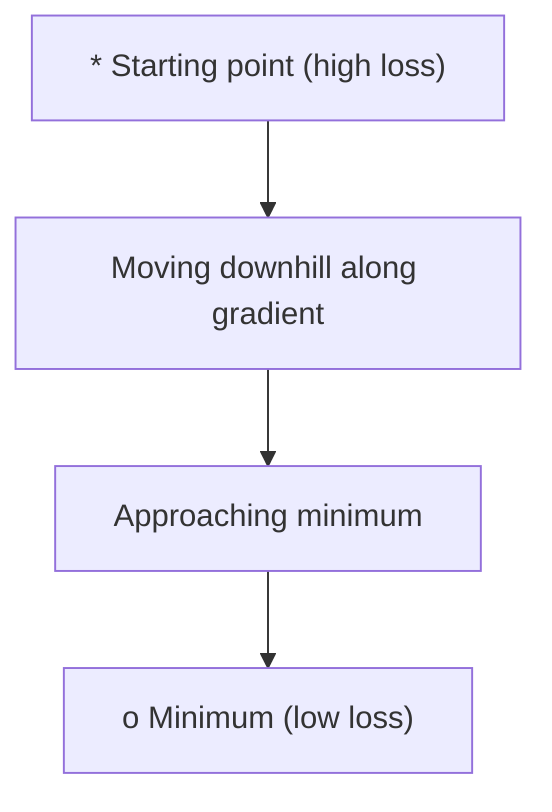
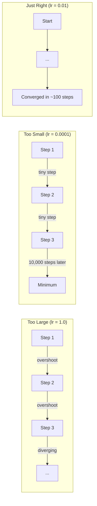
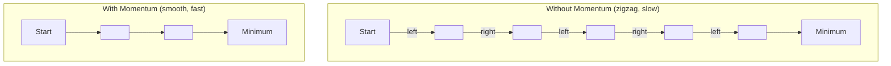
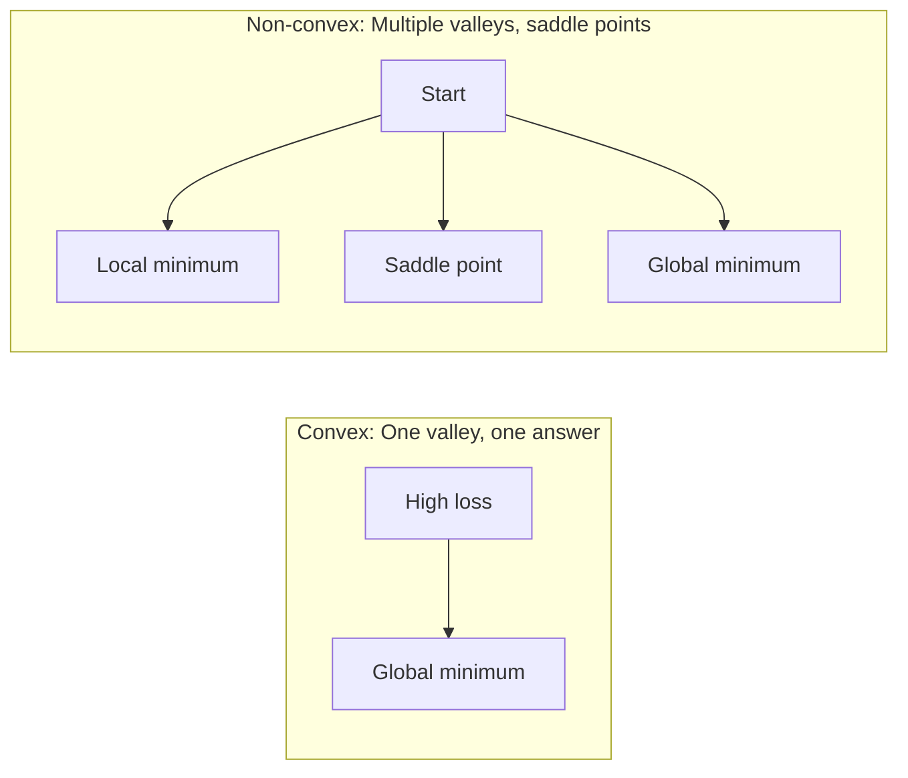
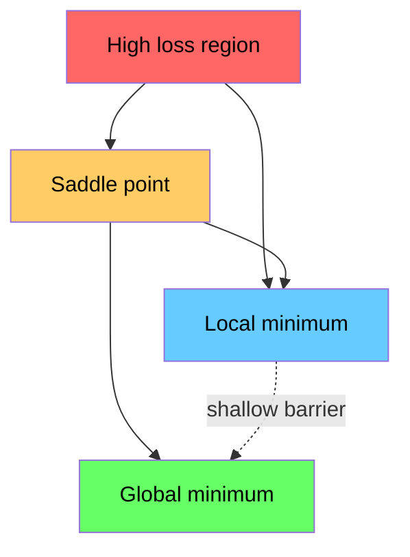

# अनुकूलन

> एक तंत्रिका नेटवर्क को प्रशिक्षित करना, मूलतः, नयतम बिंदु को खोजने के लिए है

**Type:** Build
**Language:**पायथन
**Prerequisites:** Phase 1, Lessons 04-05 (Derivatives, Gradients)
**Time:** ~75 minutes

## 学习目标
- शून्य से वैनिला ग्रेडिएंट गिरावट  गति के एसजीडी को प्राप्त करने के साथ-साथ आदम
- तुलना करें Rosenbrock फ़ंक्शन ऊपर का अनुकूलक 收 प्रदर्शन,并解释为什么亚当会为每重自适应调整学习率
- 区分凸与非凸 损失 परिदृश्य,并解释坐标在高维空间中的作用
- पढ़ना प्रशिक्षण स्थिरता को बढ़ाने के लिए शिक्षा दर कार्यक्रमों को विन्यस्त करना

## 问题
आपके पास एक हानि फ़ंक्शन है―― यह आपको बताता है कि मॉडल गलत है और इसमें कई प्रकार के विभाजन हैं―― आपके पास ग्रेडिएंट हैं―― वे आपको बताते हैं कि नुकसान को किस दिशा में खराब कर देगा―― अब आपको एक नीचे की रणनीति की आवश्यकता है――

सबसे सरल तरीका बहुत सरल हैः朝渐进的反方向移动── एक कॉल सीखने की दर के साथ क्रमशः घटाना है──重复执行── यह है कि क्रमशः घटना है, और यह वास्तव में प्रभावी है── लेकिन有效有前提── सीखने की दर 太大, आप सीधे पूरे घाटी से होकर दोनों तरफ आ फिरेंगे── 学习率 太小, आप हजारों अनावश्यक कदमों से उत्तर की ओर धीमे चढ़ेंगे── जब आप सaddle point पर पहुंचेंगे, तब भी यदि न्यूनतम नहीं मिला, तो आप भी आंदोलन बंद कर देंगे──

गहरे सीखने के भीतर प्रत्येक अनुकूलक एक ही प्रश्न का उत्तर दे रहा हैः कैसे तेजी से और अधिक विश्वसनीय रूप से घाटी के नीचे तक पहुँचें?

## 概念
### अनुकूलन का क्या अर्थ है

अनुकूलन () एक प्रकार का कार्य है जो एक प्रकार के कार्य को न्यूनतम (या अधिकतम) करने में सक्षम बनाता है। मशीन लर्निंग में, यह प्रकार का कार्य हानि है।

```
minimize L(w) where:
  L = loss function
  w = model weights (could be millions of parameters)
```

### ग्रेडिएंट अवतरण (वैनिला)

️️️️️️️️️️️️️️️️️️️️️️️️️️️️️️️️️️️️️️️️️️️️️️️️️️️️️️️️️️️️️️️️️️️️️️️️️️️️️️️️️️️️️️️️️️️️️️️️️️️️️️️️️️️️️️️️️️️️️️️️️️️️️️️️️️️️️️️️️️️️️️️️️️️️️️️️️️️️️️️️️️️️️️️️️️️️️️️️️️️️️️️️️️️️️️️️️️️️️️️️️️️️️️️️️️️️️️️️️️️️️️️️️️️️️️️️️️️️️️️️️️️️️️️️️️️️️️️️️️️️️️️️️️️️️️️️️️️️️️️️️️️️️️️️️️️️️️️️️️️️️️️️️️️️️️️️️️️️️️️️️️️️️️️️️️️️️️️️️️️️️️️️️️️️️️️️️️️️️️️️️️️️️️️️️️️️️️️️️️️️️️️️️️️️️️️️️️️️️️️️️️️️️️️️️️️️️️️️️️️️️️️️️️️️️️️️️️️️️️️️️️️️️️️️️️️️️️️️️️️️️️️️️️️️️️️️️️️️️️️️️️️️️️️️️️️️️️️️️️️️️️️️️️️️

```
w = w - lr * gradient
```

यह पूरी तरह से एक है।



### सीखने की दरः सबसे महत्वपूर्ण हाइपरपरमैटर

सीखने की दर  नियंत्रण                                                                                                                                                                                                                                                                                                                                                                                                                                                                                                                         



कोई सूत्र नहीं है जो सीधे सही सीखने की दर दे सकता है। आपको इसे प्रयोग से ढूंढने की आवश्यकता है।

### एसजीडी बनाम बैच बनाम मिनी बैच

वैनिला ग्रेडिएंट गिरावट, एक कदम आगे बढ़ने से पहले, पूरे डेटासेट में होगा ऊपर गणना ग्रेडिएंट। इसे बैच ग्रेडिएंट गिरावट कहा जाता है। यह स्थिर है, लेकिन धीमा है।

स्टोकास्टिक ग्रेडिएंट गिरावट (SGD) एकल के साथ नमूना पर गणना ग्रेडिएंट,并立即更新──它噪音大,但快──

मिनी-बैच ग्रेडिएंट अवतरण 折中处理──先在一个小批量 (32、64、128、256 个样本) 上计算 ग्रेडिएंट,然后更新── यह वास्तव में हम सभी द्वारा वास्तव में उपयोग की जाने वाली विधि है──

| Variant | Batch size | Gradient quality | Speed per step | Noise |
|---------|-----------|-----------------|---------------|-------|
| Batch GD | 整个 dataset | 精确 | 慢 | 无 |
| SGD | 1 个样本 | 噪声很大 | 快 | 高 |
| Mini-batch | 32-256 | 良好估计 | 均衡 | 中等 |

एसजीडी और मिनी बैच के बीच की शोर बग नहीं है। यह स्थानीय न्यूनतम स्तर और सaddle points से बचने में मदद करता है।

### गतिः पहाड़ के नीचे घूमती छोटी गेंद

वैनिला ग्रेडिएंट की गिरावट केवल वर्तमान ग्रेडिएंट को देखते हुए ही होती है। यदि ग्रेडिएंट की गति घटती है तो यह बहुत धीमी गति से प्रगति करता है।

```
v = beta * v + gradient
w = w - lr * v
```

类比是: एक पहाड़ के नीचे घूमने वाली गेंद― यह प्रत्येक छोटे से कोम्पन पर रुकने और फिर से शुरू नहीं होती― यह एक संगत दिशा में गति जमा करती है, और कंपन को दबा देती है―



`beta`(आमतौर पर 0.9) नियंत्रण बनाए रखना कितना ऐतिहासिक जानकारी──beta 越高,momentum 越强,路径 越平滑, लेकिन दिशा परिवर्तन की प्रतिक्रिया भी 越慢──

### एडमःअनुकूली सीखने की दरें

विभिन्न वजनों को विभिन्न सीखने की दरों की आवश्यकता होती है। किसी को बहुत कम ग्रेडिएंट का वजन प्राप्त होता है, लेकिन अंततः बड़े ग्रेडिएंट को प्राप्त करने पर बड़े कदम उठाना चाहिए।

एडम ((अनुकूली क्षण अनुमान) प्रत्येक वजन के लिए होगा दो चीजें के साथः

1. प्रथम क्षण ((m):ग्रेडिएंट्स का चल रहा औसत (((समान गति)
2. दूसरा क्षण ((v):वर्ग ग्रेडिएंट का चल रहा औसत ((ग्रेडिएंट ग्रेडिएंट)

```
m = beta1 * m + (1 - beta1) * gradient
v = beta2 * v + (1 - beta2) * gradient^2

m_hat = m / (1 - beta1^t)    bias correction
v_hat = v / (1 - beta2^t)    bias correction

w = w - lr * m_hat / (sqrt(v_hat) + epsilon)
```

`sqrt(v_hat)`️️️️️️️️️️️️️️️️️️️️️️️️️️️️️️️️️️️️️️️️️️️️️️️️️️️️️️️️️️️️️️️️️️️️️️️️️️️️️️️️️️️️️️️️️️️️️️️️️️️️️️️️️️️️️️️️️️️️️️️️️️️️️️️️️️️️️️️️️️️️️️️️️️️️️️️️️️️️️️️️️️️️️️️️️️️️️️️️️️️️️️️

默认 हाइपरपरपरमीटर्स:`lr=0.001, beta1=0.9, beta2=0.999, epsilon=1e-8` ये मान अधिकांश समस्याओं पर प्रभावशाली नहीं होते

### सीखने की दर के कार्यक्रम

固定的学习率是一种折中── प्रारंभिक प्रशिक्षण,你希望步子大一些,以便快速取得进展── प्रशिक्षण के बाद के दौर में,你希望步子小一些,以便在最小的附近精调──

常见 शेड्यूल:

| Schedule | Formula | Use case |
|----------|---------|----------|
| Step decay | lr = lr * factor every N epochs | 简单，手动控制 |
| Exponential decay | lr = lr_0 * decay^t | 平滑降低 |
| Cosine annealing | lr = lr_min + 0.5 * (lr_max - lr_min) * (1 + cos(pi * t / T)) | Transformers，现代训练 |
| Warmup + decay | 线性上升，然后 decay | 大模型，防止早期不稳定 |

### कंवेक्स बनाम गैर-कंवेक्स

घुमावदार फ़ंक्शन 只有一个最小──渐进的下降──总能找到它──像 `f(x) = x^2`इस प्रकार की चतुर्भुज संकुचित है।

तंत्रिका नेटवर्क हानि कार्य गैर-कंकुष्ठ हैं। उनमें कई स्थानीय न्यूनतम हैं।



實踐中,高维神經網絡中的局部最小很少是真正的问题──大部分局部最小的損失值都接近全球最小──

### भू-भाग का नुकसान

हानि सभी भारों का एक कार्य है। एक मॉडल के लिए जिसमें 100,000 भार हैं, हानि परिदृश्य 1,000,001 维空间 में मौजूद है। हम वजन स्थान के बीच दो यादृच्छिक दिशाओं का चयन करते हैं, और इन दिशाओं के साथ हानि को चित्रित करते हैं, जिससे एक 2D सतह दिखाई दे।



तेज न्यूनतम 泛化较差──平坦 न्यूनतम 泛化较好── यह भी अंतिम परीक्षण सटीकता में गति के साथ SGD 上经常优于亚当的原因之一: इसकी आवाज मॉडल को तेज न्यूनतम के बीच रुकने से रोकती है──


```figure
gradient-descent
```

##  इसे निर्माण
### 步骤 1: एक परीक्षण समारोह परिभाषित करें

रोसेनब्रोक फ़ंक्शन क्लासिक अनुकूलन बेंचमार्क है। इसका न्यूनतम 位于 (1, 1), स्थित है, एक संकीर्ण 曲 के एक घाटी में, आसानी से पाया जा सकता है, लेकिन इसके आगे बढ़ने के लिए बहुत मुश्किल है।

```
f(x, y) = (1 - x)^2 + 100 * (y - x^2)^2
```

```python
def rosenbrock(params):
    x, y = params
    return (1 - x) ** 2 + 100 * (y - x ** 2) ** 2

def rosenbrock_gradient(params):
    x, y = params
    df_dx = -2 * (1 - x) + 200 * (y - x ** 2) * (-2 * x)
    df_dy = 200 * (y - x ** 2)
    return [df_dx, df_dy]
```

### 步骤 2: वैनिला ग्रेडिएंट गिरावट

```python
class GradientDescent:
    def __init__(self, lr=0.001):
        self.lr = lr

    def step(self, params, grads):
        return [p - self.lr * g for p, g in zip(params, grads)]
```

### 步骤 3: गति के साथ एसजीडी

```python
class SGDMomentum:
    def __init__(self, lr=0.001, momentum=0.9):
        self.lr = lr
        self.momentum = momentum
        self.velocity = None

    def step(self, params, grads):
        if self.velocity is None:
            self.velocity = [0.0] * len(params)
        self.velocity = [
            self.momentum * v + g
            for v, g in zip(self.velocity, grads)
        ]
        return [p - self.lr * v for p, v in zip(params, self.velocity)]
```

### 步骤 4: आदम

```python
class Adam:
    def __init__(self, lr=0.001, beta1=0.9, beta2=0.999, epsilon=1e-8):
        self.lr = lr
        self.beta1 = beta1
        self.beta2 = beta2
        self.epsilon = epsilon
        self.m = None
        self.v = None
        self.t = 0

    def step(self, params, grads):
        if self.m is None:
            self.m = [0.0] * len(params)
            self.v = [0.0] * len(params)

        self.t += 1

        self.m = [
            self.beta1 * m + (1 - self.beta1) * g
            for m, g in zip(self.m, grads)
        ]
        self.v = [
            self.beta2 * v + (1 - self.beta2) * g ** 2
            for v, g in zip(self.v, grads)
        ]

        m_hat = [m / (1 - self.beta1 ** self.t) for m in self.m]
        v_hat = [v / (1 - self.beta2 ** self.t) for v in self.v]

        return [
            p - self.lr * mh / (vh ** 0.5 + self.epsilon)
            for p, mh, vh in zip(params, m_hat, v_hat)
        ]
```

### 步骤 5: चलाएँ और तुलना करें

```python
def optimize(optimizer, func, grad_func, start, steps=5000):
    params = list(start)
    history = [params[:]]
    for _ in range(steps):
        grads = grad_func(params)
        params = optimizer.step(params, grads)
        history.append(params[:])
    return history

start = [-1.0, 1.0]

gd_history = optimize(GradientDescent(lr=0.0005), rosenbrock, rosenbrock_gradient, start)
sgd_history = optimize(SGDMomentum(lr=0.0001, momentum=0.9), rosenbrock, rosenbrock_gradient, start)
adam_history = optimize(Adam(lr=0.01), rosenbrock, rosenbrock_gradient, start)

for name, history in [("GD", gd_history), ("SGD+M", sgd_history), ("Adam", adam_history)]:
    final = history[-1]
    loss = rosenbrock(final)
    print(f"{name:6s} -> x={final[0]:.6f}, y={final[1]:.6f}, loss={loss:.8f}")
```

预期输出:आदम 收最快──带动的 SGD 路径更平滑──वानीला GD 狭窄山谷中进展缓慢──

## इसका उपयोग करें
实践中, PyTorch या JAX Optimizers का उपयोग करें── वे पैरामीटर समूहों, वजन घटाने, ग्रेडिएंट क्लिपिंग और GPU त्वरण को संसाधित करते हैं──

```python
import torch

model = torch.nn.Linear(784, 10)

sgd = torch.optim.SGD(model.parameters(), lr=0.01, momentum=0.9)
adam = torch.optim.Adam(model.parameters(), lr=0.001)
adamw = torch.optim.AdamW(model.parameters(), lr=0.001, weight_decay=0.01)

scheduler = torch.optim.lr_scheduler.CosineAnnealingLR(adam, T_max=100)
```

经验法则:

- से आदम (अदाम)  (अदाम)  (अदाम)  (अदाम)  (अदाम)  (अदाम)  (अदाम)  (अदाम)  (अदाम)  (अदाम)  (अदाम)  (अदाम)  (अदाम)  (अदाम)  (अदाम)  (अदाम)  (अदाम)  (अदाम)  (अदाम)  (अदाम)  (अदाम)  (अदाम)  (अदाम)  (अदाम)  (अदाम)  (अदाम)  (अदाम)  (अदाम)  (अदाम)  (अदाम)  (अदाम) )  (अदाम)  (अदाम)  (अदाम) )  (अदाम)  (अदाम)  (अदाम)
- जब आपको सर्वोत्तम अंतिम सटीकता की आवश्यकता होती है, और अधिक समायोजन लागत को सहन करने में सक्षम होते हैं, तो गति के साथ SGD ((lr=0.01, गति=0.9) 
- के लिए ट्रांसफार्मर उपयोग एडमW(带 विघटित वजन घटाने के एडम)
- कई युगों से अधिक समय तक प्रशिक्षण के लिए, हमेशा सीखने की दर का उपयोग करें।
- यदि प्रशिक्षण अस्थिर हो, तो सीखने की दर कम हो जाए, यदि प्रशिक्षण बहुत धीमा हो, तो इसे बढ़ाएं।

## 交付 यह
इस वर्ग में एक उपयुक्त अनुकूलन अनुकूलन के लिए एक त्वरित उत्पाद है।`outputs/prompt-optimizer-guide.md`

इस में निर्मित ऑप्टिमाइज़र कक्षाएं चरण 3 में फिर से दिखाई देंगे, तब हम शून्य से प्रशिक्षण एक तंत्रिका नेटवर्क होगा।

## अभ्यास
1. **Learning rate sweep.**रोसेनब्रोक फ़ंक्शन में ऊपर सीखने की दरों का उपयोग करना [0.0001, 0.0005, 0.001, 0.005, 0.01] 运行 वनीला ग्रेडिएंट गिरावट── प्रत्येक सीखने की दर के लिए, 5000 步后绘图或印最终损失──找到仍能收的最大学习率──

2. **Momentum comparison.**Rosenbrock फ़ंक्शन में ऊपर गतिमान मानों का उपयोग करें [0.0, 0.5, 0.9, 0.99] 运行带动态的 SGD──跟踪每一步的损失──哪个动态值 收最快?哪个会超越?

3. **Saddle point escape.**定义函数 `f(x, y) = x^2 - y^2`(मूल बिंदु पर एक सaddle point है) ∼ से (0.01, 0.01) 开始── तुलना करें वैनिला GD、带动态 的 SGD 和亚当的行为── कौन सा सaddle point से भाग सकता है?

4. **Implement learning rate decay.**√ ग्रेडिएंटडिसेन्ट वर्ग 添加 eksponential decay अनुसूची:`lr = lr_0 * 0.999^step` तुलना करें रोसेनब्रोक फ़ंक्शन ऊपर उपयोग क्षय के साथ उपयोग नहीं क्षय के प्राप्ति  प्रदर्शन

## 关键术语
| Term | What people say | What it actually means |
|------|----------------|----------------------|
| Gradient descent | “Go downhill” | 通过减去按 learning rate 缩放后的 Gradient 来更新 weights。最基础的 Optimizer。 |
| Learning rate | “Step size” | 控制每次更新让 weights 移动多远的标量。太大会导致发散。太小会浪费计算。 |
| Momentum | “Keep rolling” | 将过去的 Gradients 累积到一个 velocity Vector 中。抑制震荡，并加速沿一致方向的移动。 |
| SGD | “Random sampling” | Stochastic gradient descent。用随机子集而不是完整 dataset 计算 Gradient。实践中几乎总是指 mini-batch SGD。 |
| Mini-batch | “A chunk of data” | 用于估计 Gradient 的一小部分训练数据（32-256 个样本）。平衡速度与 Gradient 准确性。 |
| Adam | “The default optimizer” | Adaptive Moment Estimation。跟踪每个 weight 的 Gradients 和 squared gradients 的 running averages，从而为每个 weight 提供自己的 learning rate。 |
| Bias correction | “Fix the cold start” | Adam 的 first 和 second moments 初始化为零。Bias correction 在早期步骤中通过除以 (1 - beta^t) 进行补偿。 |
| Learning rate schedule | “Change lr over time” | 在训练过程中调整 learning rate 的函数。早期大步，后期小步。 |
| Convex function | “One valley” | 任意 local minimum 都是 global minimum 的函数。Gradient descent 总能找到它。Neural Network losses 不是 convex。 |
| Saddle point | “Flat but not a minimum” | Gradient 为零，但在某些方向上是 minimum、在另一些方向上是 maximum 的点。高维空间中很常见。 |
| Loss landscape | “The terrain” | 在 weight space 上绘制出的 Loss function。通过沿两个随机方向切片来可视化。 |
| Convergence | “Getting there” | Optimizer 已到达一个继续更新也无法显著降低 Loss 的点。 |

## 延伸阅读
- [Sebastian Ruder: An overview of gradient descent optimization algorithms](https://ruder.io/optimizing-gradient-descent/)- सभी प्रमुख अनुकूलक के लिए एक व्यापक विवरण
- [Why Momentum Really Works (Distill)](https://distill.pub/2017/momentum/)- गति गतिशीलता का परस्पर दृश्यता
- [Adam: A Method for Stochastic Optimization (Kingma & Ba, 2014)](https://arxiv.org/abs/1412.6980)- आदिम आदम कागज, आसान पढ़ने और सरल
- [Visualizing the Loss Landscape of Neural Nets (Li et al., 2018)](https://arxiv.org/abs/1712.09913)-  दिखाएँ तेज बनाम सपाट न्यूनतम का कागज
