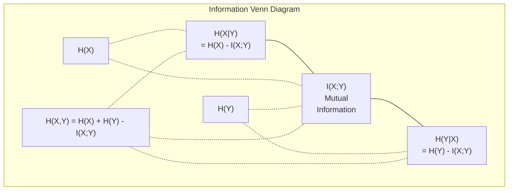

# सूचना सिद्धांत

> सूचना सिद्धांत चकित को मापने हेतु  हानि कार्य 建立在之上──

**Type:** Learn
**Language:**पायथन
**Prerequisites:** Phase 1, Lesson 06 (Probability)
**Time:** ~60 分钟

## 学习目标

- शून्य गणना से एंट्रोपी, क्रॉस-एंट्रोपी और केएल विभेदन,并 व्याख्या उनके बीच संबंध
- 推导为什么最大化日志可能性等价格最大化日志-संभाव्यता के लिए न्यूनतम क्रॉस-एन्ट्रोपी हानि
- 计算 विशेषताएं और लक्ष्य  के बीच आपसी जानकारी, क्रमबद्ध विशेषता महत्व के लिए
-                                                                                                                                                                                                                                                               

## 问题

आप प्रशिक्षण में प्रत्येक वर्गीकरण मॉडल के बीच में सभी को तैनात करेंगे `CrossEntropyLoss()` आप प्रत्येक भाषा मॉडल 文文中都会见复杂性── आप VAE、蒸化和 RLHF में पढ़ेंगे KL विभेदन── ये अवधारणाएं एक दूसरे से नहीं टूटती हैं── वे एक ही विचार पर अलग-अलग बाहरी कपड़े पहनती हैं──

सूचना सिद्धांत ने आपको अनिश्चितता के तर्क प्रदान किया, संपीड़न और भविष्यवाणी की भाषा प्रदान की। 1948 में क्लॉड शैनन ने इसे विकसित किया, संचार समस्या को हल करने के लिए। परिणाम यह है कि न्यूरल नेटवर्क को भी एक संचार समस्या हैः मॉडल अभी भी सीखते हुए वजन के माध्यम से प्रयास कर रहा है।

यह पाठ हर सूत्र को शून्य से बनाकर दिखाएगा, आपको यह देखने देगा कि वे कहां से आए हैं, और यह क्यों प्रभावी है।

## 概念

### 信息量(असती हैरानी)

जब कुछ भी हो सकता है, तो यह अधिक जानकारी ले जाता है।

概率为 p के घटनाओं की जानकारी मात्रा हैः

```
I(x) = -log(p(x))
```

उपयोग में 2 के लिए नीचे के लॉग  प्राप्त बिट्स  उपयोग प्राकृतिक लॉग  प्राप्त nats ∙ एक ही विचार, अलग अलग इकाई ∙

```
Event              Probability    Surprise (bits)
Fair coin heads    0.5            1.0
Rolling a 6        0.167          2.58
1-in-1000 event    0.001          9.97
Certain event      1.0            0.0
```

确定事件带带零信息. आप पहले से ही जानते हैं कि यह होगा.

### एंट्रोपी (औसत आश्चर्य)

एंट्रोपी एक वितरण है जिसमें सभी संभावित परिणामों की अपेक्षा आश्चर्यजनक है।

```
H(P) = -sum( p(x) * log(p(x)) )  for all x
```

公平硬币对二元变量 具有最大的 Entropy:1 बिट──偏置硬币(99% 正面) 具有低的 Entropy:0.08 बिट──你已经知道会发生什么,因此每次抛几乎不会告诉你任何信息──

```
Fair coin:    H = -(0.5 * log2(0.5) + 0.5 * log2(0.5)) = 1.0 bit
Biased coin:  H = -(0.99 * log2(0.99) + 0.01 * log2(0.01)) = 0.08 bits
```

एंट्रोपी एक वितरण को मापती है, जिसमें अनिश्चितता है।

### क्रॉस-एंट्रोपी (आप प्रति दिन उपयोग के नुकसान समारोह)

क्रॉस-एंट्रोपी  मापें जब आप वितरण का उपयोग Q 来编码 वास्तविक से वितरण P के घटनाओं में, औसत आश्चर्य है कितना 

```
H(P, Q) = -sum( p(x) * log(q(x)) )  for all x
```

P सही वितरण है (लेबल) ◊ Q आपके मॉडल की भविष्यवाणियां हैं ◊ यदि Q  P  से पूरी तरह मेल खाता है, तो पार-एंट्रोपी यानि एंट्रोपी ◊ कोई भी असंगतता  इसे बड़ा बना देगा ◊

वर्गीकरण में, P एक-गर्म वेक्टर है, वास्तविक वर्ग का अनुमान 1, अन्य सभी 0 है।

```
H(P, Q) = -log(q(true_class))
```

यही वर्गीकरण का पूर्ण क्रॉस-एंट्रोपी हानि सूत्र है। अधिकतम सटीक वर्ग का पूर्वानुमान संभावना है।

### KL विभेदन (वितरण  के बीच दूरी)

केएल विभेदन  मापने के लिए Q का उपयोग करें न कि P का अतिरिक्त आश्चर्य होगा 

```
D_KL(P || Q) = sum( p(x) * log(p(x) / q(x)) )  for all x
             = H(P, Q) - H(P)
```

क्रॉस-एंट्रोपी है एंट्रोपी加 KL विभेदन。由于 सच्चे वितरण का एंट्रोपी, प्रशिक्षण के दौरान सामान्य है, न्यूनतम क्रॉस-एंट्रोपी等等等于最小化 KL विभेदन。आप मॉडल के वितरण को सही वितरण की ओर ले जा रहे हैं。

KL विचलन 不是对称的:D_KL(P  Q) != D_KL(Q  P)  यह वास्तविक दूरी मीट्रिक नहीं है

### परस्पर सूचना

आपसी जानकारी  मापने को जाने एक चर                                                                                                                                                                                                                                                                                                                                                                                                                                                                                                                   

```
I(X; Y) = H(X) - H(X|Y)
        = H(X) + H(Y) - H(X, Y)
```

यदि X और Y  स्वतंत्र हैं, तो आपसी जानकारी 零  है। जानिए उनमें से एक आपको दूसरे की कोई भी जानकारी नहीं बताएगा। यदि वे पूरी तरह से संबंधित हैं, तो आपसी जानकारी किसी चर की एंट्रोपी की तरह है।

फ़ीचर चयन में, फ़ीचर और लक्ष्य के बीच आपसी जानकारी उच्च, इसका मतलब है कि फ़ीचर में उपयोगिता है। आपसी जानकारी 低, इसका मतलब है कि यह शोर है।

### सशर्त प्रवेश

H(Y X) 衡量观察到X 后, Y के बारे में अभी भी बहुत अनिश्चितता शेष है

```
H(Y|X) = H(X,Y) - H(X)
```

两个极端:
- यदि X 完全决定 Y, तो H(YX ) = 0── जाने X  के बारे में Y  के बारे में पूरी अनिश्चितता को समाप्त करेगा── उदाहरण: X = 摄氏温度, Y = 华氏温度──
- यदि X से Y  नहीं कोई जानकारी है, तो H  Y  X) = H )                                                                                                                                                                                                                                                   

सशर्त एंट्रोपी 始终非负,并且永远不超过 H(Y):

```
0 <= H(Y|X) <= H(Y)
```

मशीन लर्निंग में, सशर्त एंट्रोपी निर्णय के पेड़ों में प्रकट होती है। प्रत्येक विभाजन में, एल्गोरिथ्म H(Y=X) को चुनता है।

### संयुक्त एंट्रोपी

H(X,Y) X 和 Y के एकजुट वितरण की एंट्रोपी है。

```
H(X,Y) = -sum sum p(x,y) * log(p(x,y))   for all x, y
```

关键性质:

```
H(X,Y) <= H(X) + H(Y)
```

जब X और Y 独立时等号成立── यदि वे जानकारी साझा करते हैं, तो संयुक्त प्रविष्टि अपने स्वयं के प्रविष्टि से कम होती है 之和── यह  अभाव  के प्रविष्टि ही पारस्परिक जानकारी है──



इन संबंधोंः
- H(X,Y) = H(X) + H(Y
- X;Y) = H(X) - H(IX
- H(X,Y) = H(X) + H(Y) - I(X;Y)

### आपसी जानकारी (Deep Dive)

पारस्परिक जानकारी I(X;Y) 量化知道一个变量会减少关于另一个变量的多少不确定性──

```
I(X;Y) = H(X) - H(X|Y)
       = H(Y) - H(Y|X)
       = H(X) + H(Y) - H(X,Y)
       = sum sum p(x,y) * log(p(x,y) / (p(x) * p(y)))
```

性质:
- I(X;Y) >= 0 始终成立──观察某事永远不会让你失去信息──
- जब और केवल जब X 和 Y 独立时,I(X;Y) = 0。
- I(X;Y) = I(Y;X)。 यह एक सीबीएसई है, जो कि सीएल विचलन से अलग है।
- I(X;X) = H(X)。 एक चर के साथ स्वयं को साझा करें

**用于 feature selection 的 mutual information。**ML में, आप लक्ष्य के लिए जानकारी की मात्रा चाहते हैं। आपसी जानकारी आपको लक्ष्य के लिए जानकारी की मात्रा के लिए एक सिद्धांतात्मक विधि प्रदान करती हैः

1. प्रत्येक विशेषता X_i के लिए, गणना I(X_i; Y), जिसमें Y लक्ष्य चर है。
2. 按MI स्कोर 排序 विशेषताएँ──
3. रखिये पहले के लक्षण

यह सुविधा और लक्ष्य के बीच किसी भी संबंध के लिए लागू होता हैः रैखिक, गैर-रेखिक, एकांत या अन्य संबंध।

| Method | Detects | Computational cost | Handles categorical? |
|--------|---------|-------------------|---------------------|
| Pearson correlation | Linear relationships | O(n) | No |
| Spearman correlation | Monotonic relationships | O(n log n) | No |
| Mutual information | 任意 statistical dependency | O(n log n) with binning | Yes |

### लेबल स्मूथिंग और क्रॉस-एंट्रोपी

标准 वर्गीकरण कठिन लक्ष्य का उपयोग करें:[0, 0, 1, 0]──true class 的概率为 1,其他全部为 0── लेबल चिकनाई 会用软目标 替换它们:

```
soft_target = (1 - epsilon) * hard_target + epsilon / num_classes
```

जब epsilon = 0.1 且有4 个类 时:
- कठिन लक्ष्य: [0, 0, 1, 0]
- नरम लक्ष्य: [0.025, 0.025, 0.925, 0.025]

视角看, लेबल चिकनाई  बढ़ गया लक्ष्य वितरण का एंट्रोपी── हार्ड एक-हॉट लक्ष्य का एंट्रोपी 为 0,也就是没有不确定性──软目标 具有正正的エント्रोपी──

यह मददगार क्यों हैः
- 防止 मॉडल 将 logits 推向极端值(在交叉 Entropy 下, 完美匹配 एक गर्म लक्ष्य 无限大的 logits की आवश्यकता)
- 作为规范化:model 不能100% आत्मविश्वास
-  सुधारने के लिए माप:预测概率更好地 प्रतिबिंबित वास्तविक अनिश्चितता
- संकुचित प्रशिक्षण व्यवहार और निष्कर्ष  व्यवहार के बीच अंतर

प्रयोग लेबल चिकनाई का क्रॉस-एंट्रोपी हानि 变为:

```
L = (1 - epsilon) * CE(hard_target, prediction) + epsilon * H_uniform(prediction)
```

दूसरा, एक समान से दूर होने की भविष्यवाणी को दंडित करना, अर्थात सीधे विश्वास को नियमित करना।

### क्यों क्रॉस-एंट्रोपी वर्गीकरण हानि का केंद्र है

तीनों दृष्टिकोण, एक ही निष्कर्ष

**Information Theory 视角。**क्रॉस-एंट्रोपी आपके मॉडल का उपयोग करके वितरण को मापें वास्तविक वितरण के बजाय  कितना बिट्स बर्बाद किया गया है  इसे न्यूनतम बनाने से आपका मॉडल  वास्तविकता का सबसे अधिक प्रभावी एन्कोडर बन जाएगा

**Maximum likelihood 视角。**对于 N 个 true classes 为 y_i के प्रशिक्षण नमूने:

```
Likelihood     = product( q(y_i) )
Log-likelihood = sum( log(q(y_i)) )
Negative log-likelihood = -sum( log(q(y_i)) )
```

अंतिम एक पंक्ति क्रॉस-एंट्रोपी हानि है। न्यूनतम क्रॉस-एंट्रोपी = अधिकतम प्रशिक्षण डेटा।

**Gradient 视角。**क्रॉस-एंट्रोपी  关于逻辑的渐进式 简单地是(预测 - true) ⋅干净、稳定、计算快速── यही कारण है कि यह सॉफ्टमैक्स  परिपूर्ण संयोजन के साथ है──

### बिट्स बनाम नट्स

एकमात्र अंतर लॉग का निचला अंक है।

```
log base 2   -> bits      (information theory tradition)
log base e   -> nats      (machine learning convention)
log base 10  -> hartleys  (rarely used)
```

1 nat = 1/ln(2) bits = 1.4427 bits。PyTorch 和 TensorFlow 默认使用自然 log(nats)。

### उलझन

भ्रम क्रॉस-एंट्रोपी का सूचक है। यह आपको मॉडल के बारे में बताता है। अनिश्चित, समान संभावित चयन की प्रभावी संख्या।

```
Perplexity = 2^H(P,Q)   (if using bits)
Perplexity = e^H(P,Q)   (if using nats)
```

50 के भाषा मॉडल के लिए उलझन, औसत पर, जैसे कि 50 के अगले टोकन के बीच औसत चयन के रूप में उलझन में होना चाहिए।

GPT-2 सामान्य बेंचमार्क में ऊपर तक लगभग 30 की जटिलता को प्राप्त करती है। आधुनिक मॉडल अच्छे डोमेन में व्यक्तिगत स्तर तक पहुंच सकते हैं।


```figure
entropy-kl
```

##  इसे निर्माण

### 第 1 步:सूचना सामग्री एवं एंट्रॉपी

```python
import math

def information_content(p, base=2):
    if p <= 0 or p > 1:
        return float('inf') if p <= 0 else 0.0
    return -math.log(p) / math.log(base)

def entropy(probs, base=2):
    return sum(
        p * information_content(p, base)
        for p in probs if p > 0
    )

fair_coin = [0.5, 0.5]
biased_coin = [0.99, 0.01]
fair_die = [1/6] * 6

print(f"Fair coin entropy:   {entropy(fair_coin):.4f} bits")
print(f"Biased coin entropy: {entropy(biased_coin):.4f} bits")
print(f"Fair die entropy:    {entropy(fair_die):.4f} bits")
```

### 步骤 2: क्रॉस-एंट्रोपी और KL विचलन

```python
def cross_entropy(p, q, base=2):
    total = 0.0
    for pi, qi in zip(p, q):
        if pi > 0:
            if qi <= 0:
                return float('inf')
            total += pi * (-math.log(qi) / math.log(base))
    return total

def kl_divergence(p, q, base=2):
    return cross_entropy(p, q, base) - entropy(p, base)

true_dist = [0.7, 0.2, 0.1]
good_model = [0.6, 0.25, 0.15]
bad_model = [0.1, 0.1, 0.8]

print(f"Entropy of true dist:     {entropy(true_dist):.4f} bits")
print(f"CE (good model):          {cross_entropy(true_dist, good_model):.4f} bits")
print(f"CE (bad model):           {cross_entropy(true_dist, bad_model):.4f} bits")
print(f"KL divergence (good):     {kl_divergence(true_dist, good_model):.4f} bits")
print(f"KL divergence (bad):      {kl_divergence(true_dist, bad_model):.4f} bits")
```

### 步骤 3: क्रॉस-एंट्रोपी वर्गीकरण हानि के रूप में

```python
def softmax(logits):
    max_logit = max(logits)
    exps = [math.exp(z - max_logit) for z in logits]
    total = sum(exps)
    return [e / total for e in exps]

def cross_entropy_loss(true_class, logits):
    probs = softmax(logits)
    return -math.log(probs[true_class])

logits = [2.0, 1.0, 0.1]
true_class = 0

probs = softmax(logits)
loss = cross_entropy_loss(true_class, logits)

print(f"Logits:      {logits}")
print(f"Softmax:     {[f'{p:.4f}' for p in probs]}")
print(f"True class:  {true_class}")
print(f"Loss:        {loss:.4f} nats")
print(f"Perplexity:  {math.exp(loss):.2f}")
```

### 步骤 4: क्रॉस-एंट्रोपी नकारात्मक लॉग-संभाव्यता के बराबर है

```python
import random

random.seed(42)

n_samples = 1000
n_classes = 3
true_labels = [random.randint(0, n_classes - 1) for _ in range(n_samples)]
model_logits = [[random.gauss(0, 1) for _ in range(n_classes)] for _ in range(n_samples)]

ce_loss = sum(
    cross_entropy_loss(label, logits)
    for label, logits in zip(true_labels, model_logits)
) / n_samples

nll = -sum(
    math.log(softmax(logits)[label])
    for label, logits in zip(true_labels, model_logits)
) / n_samples

print(f"Cross-entropy loss:      {ce_loss:.6f}")
print(f"Negative log-likelihood: {nll:.6f}")
print(f"Difference:              {abs(ce_loss - nll):.2e}")
```

### 步骤 5: पारस्परिक सूचना

```python
def mutual_information(joint_probs, base=2):
    rows = len(joint_probs)
    cols = len(joint_probs[0])

    margin_x = [sum(joint_probs[i][j] for j in range(cols)) for i in range(rows)]
    margin_y = [sum(joint_probs[i][j] for i in range(rows)) for j in range(cols)]

    mi = 0.0
    for i in range(rows):
        for j in range(cols):
            pxy = joint_probs[i][j]
            if pxy > 0:
                mi += pxy * math.log(pxy / (margin_x[i] * margin_y[j])) / math.log(base)
    return mi

independent = [[0.25, 0.25], [0.25, 0.25]]
dependent = [[0.45, 0.05], [0.05, 0.45]]

print(f"MI (independent): {mutual_information(independent):.4f} bits")
print(f"MI (dependent):   {mutual_information(dependent):.4f} bits")
```

## इसका उपयोग करें

प्रयोग NumPy समान अवधारणाओं को व्यक्त करने के लिए, यानि आप अभ्यास में उपयोग करेंगे जिस तरह सेः

```python
import numpy as np

def np_entropy(p):
    p = np.asarray(p, dtype=float)
    mask = p > 0
    result = np.zeros_like(p)
    result[mask] = p[mask] * np.log(p[mask])
    return -result.sum()

def np_cross_entropy(p, q):
    p, q = np.asarray(p, dtype=float), np.asarray(q, dtype=float)
    mask = p > 0
    return -(p[mask] * np.log(q[mask])).sum()

def np_kl_divergence(p, q):
    return np_cross_entropy(p, q) - np_entropy(p)

true = np.array([0.7, 0.2, 0.1])
pred = np.array([0.6, 0.25, 0.15])
print(f"Entropy:    {np_entropy(true):.4f} nats")
print(f"Cross-ent:  {np_cross_entropy(true, pred):.4f} nats")
print(f"KL div:     {np_kl_divergence(true, pred):.4f} nats")
```

तुम शून्य से बनाया है ।`torch.nn.CrossEntropyLoss()`内部 में क्या किया जाता है── अब आप जानते हैं कि प्रशिक्षण के दौरान नुकसान क्यों घटता हैः आपके मॉडल का अनुमानित वितरण सही वितरण के करीब है, जो कि जानकारी की मात्रा के साथ मापने के लिए है──

## अभ्यास

1. 假设英文字母表服从统一分布(26 个字母), इसकी एंट्रॉपी की गणना करें।

2. 某模型对真级为 1 样本输出logits [5.0, 2.0, 0.5]──手算交叉 Entropy हानि, फिर अपने `cross_entropy_loss`कार्य 验证── किस प्रकार के लॉजिट्स शून्य हानि देंगे?

3. 证明 KL विभेदन 不是对称的──选择两个分布 P 和 Q,计算 D_KL(P     ) 和 D_K                                                                                                                                                                                                                                           

4. 构建一个函数,为一段符号预测 序列计算困难――给定一个由 (true_token_index, predicted_logits) जोड़े 组成的列表,返回该序列的困难──

## 关键术语

| Term | What people say | What it actually means |
|------|----------------|----------------------|
| Information content | “Surprise” | 编码一个事件所需的 bits（或 nats）数量：-log(p) |
| Entropy | “Randomness” | 一个 distribution 中所有 outcomes 的平均 surprise。衡量不可约 uncertainty。 |
| Cross-entropy | “The loss function” | 使用 model distribution Q 编码来自 true distribution P 的事件时的平均 surprise。 |
| KL divergence | “Distance between distributions” | 使用 Q 而不是 P 所浪费的额外 bits。等于 cross-entropy 减 entropy。不是对称的。 |
| Mutual information | “How related are X and Y” | 知道 Y 后，关于 X 的 uncertainty 减少量。为零表示独立。 |
| Softmax | “Turn logits into probabilities” | 取指数并归一化。将任意 real-valued vector 映射为有效 probability distribution。 |
| Perplexity | “How confused the model is” | Cross-entropy 的指数。model 在每一步从中选择的有效 vocabulary size。 |
| Bits | “Shannon's unit” | 使用以 2 为底的 log 衡量的信息。一个 bit 解决一次公平抛硬币。 |
| Nats | “ML's unit” | 使用 natural log 衡量的信息。PyTorch 和 TensorFlow 默认使用。 |
| Negative log-likelihood | “NLL loss” | 对 one-hot labels 来说，与 cross-entropy loss 完全相同。最小化它会最大化正确 predictions 的概率。 |

## 延伸阅读

- [Shannon 1948: A Mathematical Theory of Communication](https://people.math.harvard.edu/~ctm/home/text/others/shannon/entropy/entropy.pdf)- मूल लेख, आज भी आसान पढ़ने के लिए
- [Visual Information Theory (Chris Olah)](https://colah.github.io/posts/2015-09-Visual-Information/)- एंट्रोपी और KL विचलन के लिए सबसे अच्छा दृश्यता व्याख्या
- [PyTorch CrossEntropyLoss docs](https://pytorch.org/docs/stable/generated/torch.nn.CrossEntropyLoss.html)- ढांचा कैसे अपने नए निर्माण की सामग्री को प्राप्त करने के लिए
