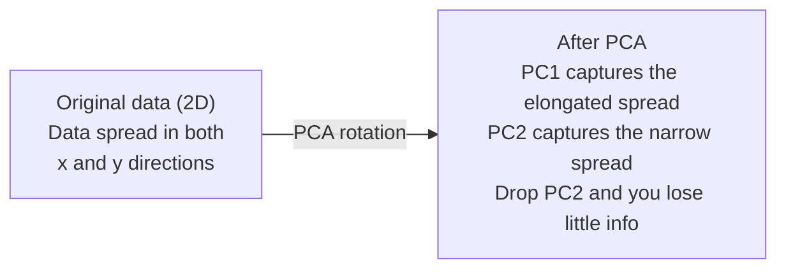

# आयामों में कमी

> उच्च स्तर के डेटा में संरचना है।

**Type:** Build
**Language:**पायथन
**Prerequisites:** Phase 1, Lessons 01（Linear Algebra Intuition）、02（Vectors, Matrices & Operations）、03（Eigenvalues & Eigenvectors）、06（Probability & Distributions）
**Time:** ~90 分钟

## सीखने के लक्ष्य

- 零 से प्राप्त करने के लिए पीसीए:सेंटर डेटा ✓ गणना कोवरिएंसी मैट्रिक्स ✓ स्वयं को गठित करना, परियोजनाएं चलाना
- प्रयोग समझाया भिन्नता अनुपात 和 कोहनी विधि  चुनें मुख्य घटकों का संख्या
- 2D में दृश्यमान MNIST अंकों के प्रभावों की तुलना करें, और उनके वजन की व्याख्या करें
- उपयोग带 RBF कर्नेल का कर्नेल PCA 分离标准 PCA 无法处理的非线性数据结构

## समस्या

आप एक नमूना है जिसमें 784 विशेषताएं शामिल हैं डेटासेट। हो सकता है कि यह हाथ से लिखे गए डिजिटल पिक्सेल मानों है। हो सकता है कि यह जीन अभिव्यक्ति स्तर है। हो सकता है कि यह उपयोगकर्ता व्यवहार संकेत है। आप 784 आयामों को नहीं देख सकते हैं। आप उन्हें नहीं लिख सकते हैं। आप उन्हें सोच भी नहीं सकते हैं।

लेकिन इन 784 विशेषताओं में से अधिकांश अपर्याप्त हैं। वास्तविक जानकारी एक बहुत ही छोटी सतह पर मौजूद है। एक हाथ से लिखे गए "7" को वर्णन करने के लिए 784 से अधिक स्वतंत्र संख्या की आवश्यकता नहीं है।

आयामीकरण में कमी उस छोटे से सतह को ढूंढ लेगी― यह आपके 784 आयामी डेटा को 2、10 या 50 आयामों तक संकुचित कर देती है, जबकि महत्वपूर्ण संरचना को बरकरार रखती है―

## अवधारणा

### आयामता का शाप

उच्च आयाम अंतरिक्ष का सीधा संबंध नहीं है। आयाम बढ़ने के साथ, तीन चीजें विफल हो जाती हैं।

**距离变得没有意义。**उच्च स्तर पर, किसी भी दो यादृच्छिक बिंदुओं के बीच की दूरी एक ही मूल्य तक पहुंच जाती है। यदि प्रत्येक बिंदु अन्य प्रत्येक बिंदुओं से अलग है, तो निकटतम पड़ोसी खोज विफल हो जाएगी।

```
Dimension    Avg distance ratio (max/min between random points)
2            ~5.0
10           ~1.8
100          ~1.2
1000         ~1.02
```

**体积集中在角落。**d 维 इकाई हाइपरक्यूब में 2  个角── 100 维 में, लगभग सभी वस्तुएं कोने में हैं, केंद्र से दूर── डेटा बिंदुएं किनारे तक फैलेंगी, जबकि आपके मॉडल आंतरिक क्षेत्र में डेटा की कमी होगी──

**你需要指数级更多的数据。**एक ही स्थान में समान नमूना घनत्व बनाए रखने के लिए, 2D से 20D तक का अर्थ है कि आपको 10^18 गुना डेटा की आवश्यकता है।

### पीसीएः महत्वपूर्ण दिशाएं खोजें

मुख्य घटक विश्लेषण (PCA) डेटा परिवर्तन के सबसे बड़े धुरी को ढूंढता है। यह आपके坐标系 को घुमाता है, जिससे प्रथम धुरी सबसे अधिक भिन्नता को पकड़ता है, द्वितीय धुरी सबसे अधिक भिन्नता को पकड़ता है, इस प्रकार के सुझावों के अनुसार।

算法:

```
1. Center the data        (subtract the mean from each feature)
2. Compute covariance     (how features move together)
3. Eigendecomposition     (find the principal directions)
4. Sort by eigenvalue     (biggest variance first)
5. Project               (keep top k eigenvectors, drop the rest)
```

क्यों अपना स्वयं का उपयोग करें?कोवैरिएंस मैट्रिक्स सममित और सकारात्मक अर्ध-परिभाषित है। इसके स्वयं वेक्टर सुविधा अंतरिक्ष के बीच में उभयचर दिशाएं हैं।



- **Before PCA:**डेटा क्लाउड 沿 x 和 y 两个轴呈对角线扩散
- **After PCA:**坐标系 घूर्णन, जिससे PC1 को अधिकतम भिन्नता के दिशा में समायोजित किया जा सकता है
- **Dimensionality reduction:** PC2 छोड़ देगा डेटा को PC1 पर प्रोजेक्ट करेगा, केवल बहुत कम जानकारी खो देगा

### स्पष्ट भिन्नता अनुपात

प्रत्येक मुख्य घटक कुल भिन्नता का एक भाग पकड़ लेता है।

```
Component    Eigenvalue    Explained ratio    Cumulative
PC1          4.73          0.473              0.473
PC2          2.51          0.251              0.724
PC3          1.12          0.112              0.836
PC4          0.89          0.089              0.925
...
```

जब संचयी व्याख्या भिन्नता  0.95  तक पहुँचती है, तो आप जानते हैं कि ये घटक  95% की जानकारी को पकड़ लेते हैं  उसके बाद सामग्री ज्यादातर शोर है

### घटकों की संख्या चुनना

तीन प्रकार की रणनीति

1. **Threshold.**90-95% के भिन्नता को समझाने के लिए पर्याप्त घटक बनाए रखें।
2. **Elbow method.**चित्रण प्रत्येक घटक के स्पष्ट भिन्नता── खोज स्पष्ट तेजी से नीचे बिंदु──
3. **Downstream performance.**पीसीए को पूर्व प्रसंस्करण के रूप में उपयोग करना।

### t-SNE: पड़ोसों को संरक्षित करें

t-विभाजित स्टोकास्टिक पड़ोसी एम्बेडिंग (t-SNE) एक दृश्य डिजाइन के लिए है। यह 2D या 3D में उच्च आकार के डेटा को मैगरेट करता है, जबकि कुछ बिंदुओं को एक दूसरे के करीब रखता है।

直觉是: मूल अंतरिक्ष में, बिन्दु के बीच की दूरी के आधार पर एक संभावना वितरण की गणना करें── निकट बिंदु उच्च संभावना प्राप्त करें── दूर बिंदु कम संभावना प्राप्त करें── फिर एक 2D 排布 को ढूंढें, जिससे समान संभावना वितरण 成立── 784 维中是邻的点, 2D में अभी भी पड़ोसी के रूप में बने रहें──

t-SNE की महत्वपूर्ण विशेषताएंः
- गैर-रेखीय। यह पीसीए के जटिल विविधताओं को विकसित कर सकता है।
- स्टोकास्टिक── भिन्न परिचालन भिन्न लेआउट उत्पन्न करेगा──
- भ्रम 参数控制考虑多少邻居 (परिभाषित सीमाः 5-50)
- 输出中集群  के बीच की दूरी कोई मायने नहीं रखती है  केवल समूहों का ही कोई मायने रखती है 
- बड़े डेटासेट में 上很慢──默认是O(n^2)──

### UMAP: तेजी से, बेहतर वैश्विक संरचना

यूनिफ़ॉर्म मनिफोल्ड एप्रोक्सिमेशन एंड प्रोजेक्शन (UMAP) का कामकाज t-SNE के समान है, लेकिन दो फायदे हैंः
- 更快── यह निकटतम-पड़ोसी ग्राफ का उपयोग करता है, बजाय सभी जोड़ी दूरी की गणना करने के लिए
- बेहतर वैश्विक संरचना― आउटपुट में क्लस्टरों के सापेक्ष स्थानों की तुलना में अधिक बार t-SNE से अधिक है।

UMAP में उच्च स्तर के अंतरिक्ष में एक वजनदार ग्राफ का निर्माण करना, फिर एक निम्न स्तर की लेआउट की तलाश करना, जितना संभव हो उतना इस ग्राफ को बनाए रखना।

关键参数:
- `n_neighbors`: कितने पड़ोसियों ने स्थानीय संरचना को परिभाषित किया है?
- `min_dist`: आउटपुट मध्य बिंदु अधिक निकट एकत्रित होते हैं। कम मूल्य अधिक घनी क्लस्टर उत्पन्न करते हैं।

### किसको कब इस्तेमाल करना है

| Method | Use case | Preserves | Speed |
|--------|----------|-----------|-------|
| PCA | Preprocessing before training | Global variance | Fast (exact), works on millions of samples |
| PCA | Quick exploratory visualization | Linear structure | Fast |
| t-SNE | Publication-quality 2D plots | Local neighborhoods | Slow (< 10k samples ideal) |
| UMAP | 2D visualization at scale | Local + some global structure | Medium (handles millions) |
| PCA | Feature reduction for models | Variance-ranked features | Fast |
| t-SNE / UMAP | Understanding cluster structure | Cluster separation | Medium to slow |

 अनुभव विधि: पीसीए के साथ पूर्व प्रसंस्करण और डेटा संपीड़न करें── जब आपको 2 डी में दृश्य संरचना में आवश्यकता हो, तो टी-एसएनई या यूएमएपी का उपयोग करें──

### कर्नेल पीसीए

标准 PCA                                                                                                                                                                                                                                                             

कर्नेल पीसीए में कर्नेल फ़ंक्शन द्वारा प्रेरित उच्च-विशिष्टता अंतरिक्ष में लागू पीसीए, स्पष्ट रूप से इस अंतरिक्ष में स्थितियों की गणना नहीं करता है।

算法:
1. 计算 कर्नेल मैट्रिक्स K, जिसमें K_ij = k(x_i, x_j)
2. सुविधाओं अंतरिक्ष में मध्य केंद्र कर्नेल मैट्रिक्स
3. केन्द्रित कर्नेल मैट्रिक्स के लिए अपने स्वयं के संरचना
4. 顶部 eigenvectors(按1/sqrt(eigenvalue) 缩放)就是 प्रोजेक्शन

常见 कर्नेल फ़ंक्शन:

| Kernel | Formula | Good for |
|--------|---------|----------|
| RBF (Gaussian) | exp(-gamma * \|\|x - y\|\|^2) | 大多数 nonlinear data、smooth manifolds |
| Polynomial | (x . y + c)^d | Polynomial relationships |
| Sigmoid | tanh(alpha * x . y + c) | Neural network-like mappings |

何時使用内核 PCA而不是标准 PCA:

| Criterion | Standard PCA | Kernel PCA |
|-----------|-------------|------------|
| Data structure | Linear subspace | Nonlinear manifold |
| Speed | O(min(n^2 d, d^2 n)) | O(n^2 d + n^3) |
| Interpretability | Components are linear combinations of features | Components lack direct feature interpretation |
| Scalability | Works on millions of samples | Kernel matrix is n x n, memory-limited |
| Reconstruction | Direct inverse transform | Requires pre-image approximation |

经典例:2D के मध्य के एकाग्र वृत्तों में दो वृत्त बिंदु, एक वृत्त दूसरे वृत्त के अंदर है। मानक PCA दोनों को एक ही रेखा पर प्रक्षेपित करेगा, यह वर्गीकरण के लिए  उपयोग नहीं करेगा। RBF कर्नेल के कर्नेल PCA को आंतरिक और बाहरी वृत्त को अलग-अलग क्षेत्रों में मैपिंग करेगा, जिससे वे रैखिक रूप से अलग हो सकें।

### पुनर्निर्माण त्रुटि

आप 784 आयामों को 50 आयामों तक संपीड़ित किया है. आप क्या खो दिया है?

测量 पुनर्निर्माण त्रुटिः
1. k 维:X_reduced = X @ W_k
2. 重建:X_hat = X_reduced @ W_k^T
3. 计算 MSE:mean((X - X_hat) ^2)

् ापसीए के लिए, पुनर्निर्माण त्रुटि और स्पष्ट भिन्नता के लिए स्पष्ट संबंध हैः

```
Reconstruction error = sum of eigenvalues NOT included
Total variance = sum of ALL eigenvalues
Fraction lost = (sum of dropped eigenvalues) / (sum of all eigenvalues)
```

प्रत्येक घटक का स्पष्ट भिन्नता अनुपात हैः

```
explained_ratio_k = eigenvalue_k / sum(all eigenvalues)
```

घटकों के लिए संचयी व्याख्या भिन्नता संख्या का चित्रण, प्राप्त होगा "उल्लू" वक्र──अनुकूल घटकों संख्या में स्थित हैः
- 曲线变平的位置(收益递减)
- संचयी भिन्नता  आपके सीमा पार की स्थिति(आमतौर पर 0.90 या 0.95)
- डाउनस्ट्रीम कार्य प्रदर्शन 进入平台期的位置

पुनर्निर्माण त्रुटि को केवल चयन करने के लिए नहीं बल्कि विसंगतियों की पहचान के लिए भी इस्तेमाल किया जा सकता हैः उच्च नमूना अपवाद हैं, वे उप-स्थान के अनुरूप नहीं हैं जो सीखने में हैं। यह उत्पादन प्रणालियों में पीसीए पर आधारित विसंगतियों की पहचान के लिए आधार है।


```figure
pca-axes
```

## इसे बनाओ

### चरण 1: पीसीए खरोंच से

```python
import numpy as np

class PCA:
    def __init__(self, n_components):
        self.n_components = n_components
        self.components = None
        self.mean = None
        self.eigenvalues = None
        self.explained_variance_ratio_ = None

    def fit(self, X):
        self.mean = np.mean(X, axis=0)
        X_centered = X - self.mean

        cov_matrix = np.cov(X_centered, rowvar=False)

        eigenvalues, eigenvectors = np.linalg.eigh(cov_matrix)

        sorted_idx = np.argsort(eigenvalues)[::-1]
        eigenvalues = eigenvalues[sorted_idx]
        eigenvectors = eigenvectors[:, sorted_idx]

        self.components = eigenvectors[:, :self.n_components].T
        self.eigenvalues = eigenvalues[:self.n_components]
        total_var = np.sum(eigenvalues)
        self.explained_variance_ratio_ = self.eigenvalues / total_var

        return self

    def transform(self, X):
        X_centered = X - self.mean
        return X_centered @ self.components.T

    def fit_transform(self, X):
        self.fit(X)
        return self.transform(X)
```

### चरण 2: सिंथेटिक डेटा पर परीक्षण

```python
np.random.seed(42)
n_samples = 500

t = np.random.uniform(0, 2 * np.pi, n_samples)
x1 = 3 * np.cos(t) + np.random.normal(0, 0.2, n_samples)
x2 = 3 * np.sin(t) + np.random.normal(0, 0.2, n_samples)
x3 = 0.5 * x1 + 0.3 * x2 + np.random.normal(0, 0.1, n_samples)

X_synthetic = np.column_stack([x1, x2, x3])

pca = PCA(n_components=2)
X_reduced = pca.fit_transform(X_synthetic)

print(f"Original shape: {X_synthetic.shape}")
print(f"Reduced shape:  {X_reduced.shape}")
print(f"Explained variance ratios: {pca.explained_variance_ratio_}")
print(f"Total variance captured: {sum(pca.explained_variance_ratio_):.4f}")
```

### चरण 3: 2D में MNIST अंक

```python
from sklearn.datasets import fetch_openml

mnist = fetch_openml("mnist_784", version=1, as_frame=False, parser="auto")
X_mnist = mnist.data[:5000].astype(float)
y_mnist = mnist.target[:5000].astype(int)

pca_mnist = PCA(n_components=50)
X_pca50 = pca_mnist.fit_transform(X_mnist)
print(f"50 components capture {sum(pca_mnist.explained_variance_ratio_):.2%} of variance")

pca_2d = PCA(n_components=2)
X_pca2d = pca_2d.fit_transform(X_mnist)
print(f"2 components capture {sum(pca_2d.explained_variance_ratio_):.2%} of variance")
```

### चरण 4: स्क्लेयरन की तुलना करें

```python
from sklearn.decomposition import PCA as SklearnPCA
from sklearn.manifold import TSNE

sklearn_pca = SklearnPCA(n_components=2)
X_sklearn_pca = sklearn_pca.fit_transform(X_mnist)

print(f"\nOur PCA explained variance:     {pca_2d.explained_variance_ratio_}")
print(f"Sklearn PCA explained variance: {sklearn_pca.explained_variance_ratio_}")

diff = np.abs(np.abs(X_pca2d) - np.abs(X_sklearn_pca))
print(f"Max absolute difference: {diff.max():.10f}")

tsne = TSNE(n_components=2, perplexity=30, random_state=42)
X_tsne = tsne.fit_transform(X_mnist)
print(f"\nt-SNE output shape: {X_tsne.shape}")
```

### चरण 5: UMAP तुलना

```python
try:
    from umap import UMAP

    reducer = UMAP(n_components=2, n_neighbors=15, min_dist=0.1, random_state=42)
    X_umap = reducer.fit_transform(X_mnist)
    print(f"UMAP output shape: {X_umap.shape}")
except ImportError:
    print("Install umap-learn: pip install umap-learn")
```

## इसका प्रयोग करें

पीसीए को वर्गीकृत करने के लिए उपयोग करें  पूर्व प्रसंस्करण:

```python
from sklearn.decomposition import PCA as SklearnPCA
from sklearn.linear_model import LogisticRegression
from sklearn.model_selection import train_test_split
from sklearn.metrics import accuracy_score

X_train, X_test, y_train, y_test = train_test_split(
    X_mnist, y_mnist, test_size=0.2, random_state=42
)

results = {}
for k in [10, 30, 50, 100, 200]:
    pca_k = SklearnPCA(n_components=k)
    X_tr = pca_k.fit_transform(X_train)
    X_te = pca_k.transform(X_test)

    clf = LogisticRegression(max_iter=1000, random_state=42)
    clf.fit(X_tr, y_train)
    acc = accuracy_score(y_test, clf.predict(X_te))
    var_captured = sum(pca_k.explained_variance_ratio_)
    results[k] = (acc, var_captured)
    print(f"k={k:>3d}  accuracy={acc:.4f}  variance={var_captured:.4f}")
```

प्रदर्शन 784 से कम होगा।

## इसे भेजें

本课会产出:
- `outputs/skill-dimensionality-reduction.md`- एक विशिष्ट कार्य के लिए उपयुक्त आयामों की कमी का चयन करने के लिए उपयोग किया जाने वाला  तकनीकी कौशल

## व्यायाम

1. 修改 PCA वर्ग 以支持 `inverse_transform`△ 10、50 和 200 个 घटकों का उपयोग करके MNIST अंकों का पुनर्निर्माण करें──分别打印重建错误(原始数据 के औसत वर्ग अंतर के मुकाबले)

2. एक ही MNIST उपसमूह में ऊपर चलाने t-SNE,असंक्रामकता मूल्य分别为 5、30 和 100── वर्णन आउटपुट कैसे बदलता है── क्यों संक्रामकता क्लस्टर तन्यता को प्रभावित करेगी?

3.  एक 50  विशेषताएं हैं  लेकिन केवल 5  सूचनात्मक विशेषताएं के डेटा सेट का उपयोग करें `sklearn.datasets.make_classification`生成) ・应用 PCA,并检查解释了变量曲线 是否正确识别出数据实际上是五维的──

## प्रमुख शर्तें

| Term | What people say | What it actually means |
|------|----------------|----------------------|
| Curse of dimensionality | "Too many features" | 随着维度增长，距离、体积和数据密度都会表现得反直觉。Models 需要指数级更多的数据来补偿。 |
| PCA | "Reduce dimensions" | 旋转你的坐标系，使各轴与 maximum variance 的方向对齐，然后丢弃 low-variance axes。 |
| Principal component | "An important direction" | Covariance matrix 的一个 eigenvector。Feature space 中数据变化最大的方向。 |
| Explained variance ratio | "How much info this component has" | 一个 principal component 捕获的 total variance 比例。对前 k 个 ratios 求和，就能看到 k 个 components 保留了多少信息。 |
| Covariance matrix | "How features correlate" | 一个 symmetric matrix，其中 entry (i,j) 衡量 feature i 和 feature j 如何共同变化。Diagonal entries 是各自的 variances。 |
| t-SNE | "That cluster plot" | 一种 nonlinear 方法，通过保留 pairwise neighborhood probabilities 将高维数据映射到 2D。适合可视化，不适合 preprocessing。 |
| UMAP | "Faster t-SNE" | 一种基于 topological data analysis 的 nonlinear 方法。既保留 local structure，也保留部分 global structure。比 t-SNE 更容易扩展。 |
| Perplexity | "A t-SNE knob" | 控制每个点考虑的有效邻居数量。低 perplexity 聚焦非常 local 的结构。高 perplexity 捕获更宽泛的模式。 |
| Manifold | "The surface the data lives on" | Embedding在更高维空间中的低维表面。一张在 3D 中揉皱的纸是一个 2D manifold。 |

## आगे पढ़ना

- [A Tutorial on Principal Component Analysis](https://arxiv.org/abs/1404.1100)(शिलेंस) - से零开始清晰推导 पीसीए
- [How to Use t-SNE Effectively](https://distill.pub/2016/misread-tsne/)(Wattenberg et al.) - 关于 t-SNE 陷和参数选择的交互式指南
- [UMAP documentation](https://umap-learn.readthedocs.io/)- UMAP के लेखक के सिद्धांत एवं अभ्यास मार्गदर्शन से
