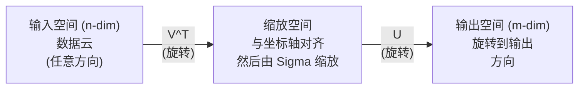
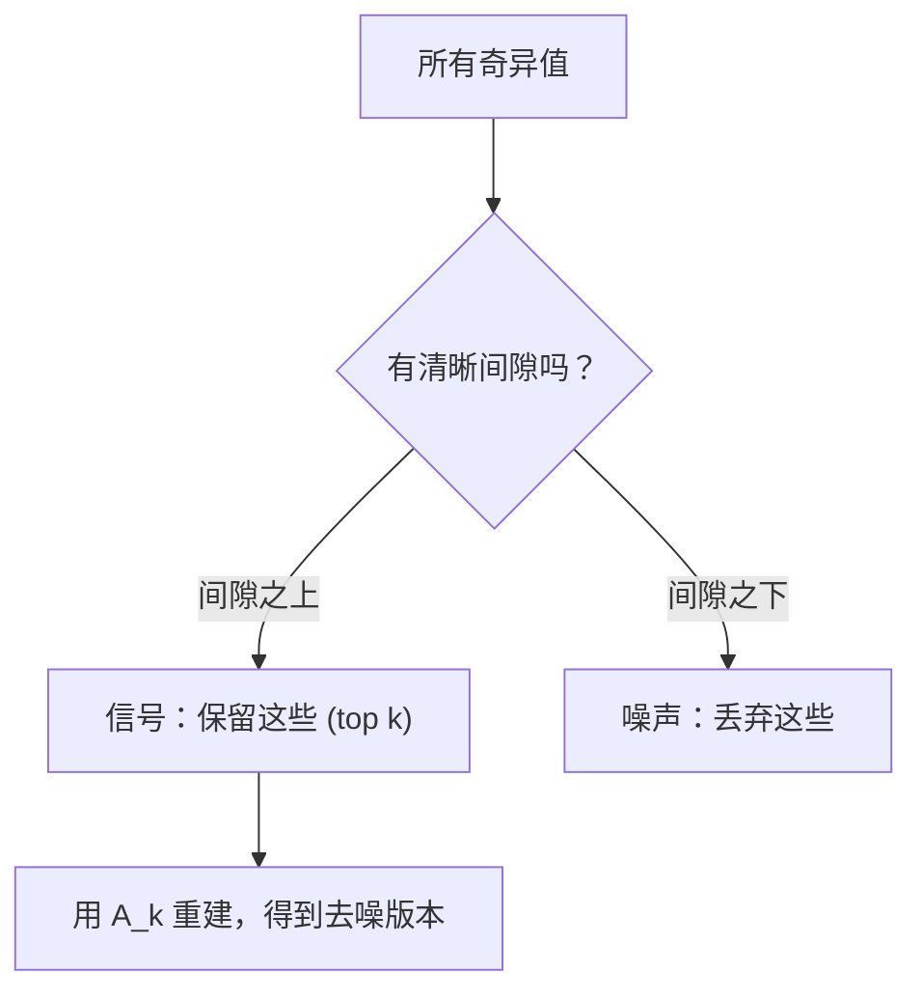

# एकल मूल्य विघटन

> एसवीडी है रैखिक तत्वों में स्विस सैन्य उपकरण। प्रत्येक मैट्रिक्स में एसवीडी है। प्रत्येक डेटा वैज्ञानिक को एसवीडी की आवश्यकता है।

**Type:** Build
**Languages:** Python, Julia
**Prerequisites:** Phase 1，Lessons 01 (Linear Algebra Intuition)、02 (Vectors & Matrices Operations)、03 (Matrix Transformations)
**Time:** ~120 minutes

## 学习目标
-  शक्ति पुनरावृत्ति 实现 SVD,并解释 U、Sigma 和 V^T के几何含义
-                                                                                                                                                                                                                                                                                                                                                                                                                                                                                                                              
- SVD के माध्यम से गणना मूर-पेनरोज के छद्म विपरीत,  प्रणाली के लिए हल करने के लिए
- एसवीडी को पीसीए 推系统 (लैटिनेंट फैक्टर) और एनएलपी के भीतर लैटिनेंट सेमेटिक एनालिसिस से जोड़ें 

## 问题
आपके पास 1000x2000 का मैट्रिक्स है। यह उपयोगकर्ता-फिल्म रेटिंग है। यह एक छवि के विज़ुअल मान का भी हो सकता है। आपको इसे संपीड़ित करने की आवश्यकता है, या इसके साथ छिपे हुए संरचना को खोजने की आवश्यकता है, या इसका उपयोग एक न्यूनतम वर्ग प्रणाली को हल करने के लिए किया जाता है।

एसवीडी किसी भी मैट्रिक्स हेतु उपयुक्त है। किसी भी आकार हेतु। किसी भी रैंक हेतु। कोई भी शर्त नहीं है। यह मैट्रिक्स को तीन तत्वों में विभाजित करता है, यह इस मैट्रिक्स को अंतरिक्ष के लिए परिवर्तन की भू-संरचना का खुलासा करता है। यह संपूर्ण रैखिक तत्वों में सबसे आम है।

## 概念
### SVD में क्या करना है

प्रत्येक मैट्रिक्स, चाहे वह किस प्रकार का हो, क्रमशः तीन ऑपरेशन निष्पादित करेगा: घूर्णन, संकुचन, घूर्णन।

```
A = U * Sigma * V^T

      m x n     m x m    m x n    n x n
     (任意)    (旋转)   (缩放)   (旋转)
```

给定任意矩阵 A,SVD इसे निम्न में विभाजित करेगाः
- V^T 旋转输入空间(n 维) में वेक्टर
- सिग्मा  प्रत्येक अक्ष के साथ संकुचित करना
- U 将结果旋转到输出空间 (输出空间)



यह आपको बता देगाः यह मैट्रिक्स पहले V^T घुमाकर गोले में प्रवेश करेगी, फिर सिग्मा के साथ इसे घुमाकर गोले में फैलाएगी, अंत में यू गोले में घुमाकर गोले में गलाएगी यह असमान मूल्य इस गोले के प्रत्येक अक्ष की लंबाई है

### पूर्ण विघटन

对于形为 m x n का मैट्रिक्स ए:

```
A = U * Sigma * V^T

其中：
  U     是 m x m，正交 (U^T U = I)
  Sigma 是 m x n，对角（奇异值位于对角线上）
  V     是 n x n，正交 (V^T V = I)

奇异值 sigma_1 >= sigma_2 >= ... >= sigma_r > 0
其中 r = rank(A)
```

U की पंक्तियों को बाईं ओर अजीब वैक्टरों के रूप में जाना जाता है। V की पंक्तियों को दाईं ओर अजीब वैक्टरों के रूप में जाना जाता है। सिग्मा के विपरीत तत्वों को अजीब वैल्यू कहा जाता है।

### बाएं एकल वेक्टर  एकल मान  दाएं एकल वेक्टर

एसवीडी के प्रत्येक घटक में अलग-अलग अर्थ हैं।

**Right singular vectors（V 的列）：**它们为输入空间 (R^n) 构成一组正规基础――它们是输入空间中的方向,矩阵会将这些方向映射到输出空间中的正交方向――它们可以看作域的自然坐标系――

**Singular values（Sigma 的对角线）：**它们是缩放因子──第一个奇异值告诉你,矩阵 沿第一个右边奇异向量 方向将向量 拉伸多少──奇异值为零意味着矩阵将该方向完全压──

**Left singular vectors（U 的列）：**它们为输出空间(R^m) गठन एक समूह ऑर्थोनोर्मल आधार──第 i 个左奇异向量是第 i个右奇异向量 经过缩放后在输出空间中落到的方向──

उनके बीच संबंधः

```
A * v_i = sigma_i * u_i

Matrix A 接收第 i 个右奇异Vector v_i，
用 sigma_i 对其缩放，并将其映射到第 i 个左奇异Vector u_i。
```

यह किसी भी मैट्रिक्स के लिए क्या कर रहा है के प्रतिबिंब को दर्शाता है।

### बाहरी उत्पाद रूप

SVD को रैंक-1 मैट्रिक्स के साथ लिखा जा सकता हैः

```
A = sigma_1 * u_1 * v_1^T + sigma_2 * u_2 * v_2^T + ... + sigma_r * u_r * v_r^T

每一项 sigma_i * u_i * v_i^T 都是一个 rank-1 Matrix（一个 outer product）。
完整 Matrix 是 r 个这类 Matrix 的和，其中 r 是 rank。
```

इस प्रकार निम्न-रैंक अनुमान का आधार है। प्रत्येक में एक स्तर की संरचना जोड़ी जाती है। पहला सबसे महत्वपूर्ण एकल मॉडल को पकड़ता है। दूसरा सबसे महत्वपूर्ण मॉडल को पकड़ता है। इस प्रकार के सुझावों के आधार पर, यह अनुरोध और किसी भी दिए गए रैंक में सर्वोत्तम दृष्टिकोण प्राप्त किया जा सकता है।

```
Rank-1 approx:    A_1 = sigma_1 * u_1 * v_1^T
                  (捕获主导模式)

Rank-2 approx:    A_2 = sigma_1 * u_1 * v_1^T + sigma_2 * u_2 * v_2^T
                  (捕获两个最重要的模式)

Rank-k approx:    A_k = top k 项之和
                  (根据 Eckart-Young theorem，这是最优的)
```

### अपने-अपने संरचना के संबंध

SVD और स्व-संयोजन का गहन संबंध है। A का अनूठा मान और अनूठा वेक्टर सीधे A^T A और A^T के स्व-मूल्यों से स्वयं वेक्टरों से आता है।

```
A^T A = V * Sigma^T * U^T * U * Sigma * V^T
      = V * Sigma^T * Sigma * V^T
      = V * D * V^T

其中 D = Sigma^T * Sigma 是一个对角 Matrix，其对角线上为 sigma_i^2。

因此：
- 右奇异Vector (V) 是 A^T A 的 eigenvectors
- 奇异值的平方 (sigma_i^2) 是 A^T A 的 eigenvalues

类似地：
A A^T = U * Sigma * V^T * V * Sigma^T * U^T
      = U * Sigma * Sigma^T * U^T

因此：
- 左奇异Vector (U) 是 A A^T 的 eigenvectors
- A A^T 的 eigenvalues 也都是 sigma_i^2
```

इस संपर्क आपको तीन बातें बताता हैः
1. 奇异值总是实数且非负 (अर्थात्, वास्तविक संख्या और गैर-负)  ये सकारात्मक अर्ध-परिभाषित मैट्रिक्स के स्व-मूल्यों के वर्गमूल हैं) 
2. आप ए^टी ए के माध्यम से अपनी संरचना बनाकर एसवीडी की गणना कर सकते हैं, लेकिन यह वर्ग स्थिति संख्या और संख्यात्मक सटीकता का नुकसान होगा।
3. जब ए है और सममित सकारात्मक अर्ध-परिभाषित 时,SVD 和 स्वनिर्माण एक ही बात है।

### घटित एसवीडीःकम श्रेणी का अनुमान

इकार्ट-युंग-मिरस्की प्रमेय ं दिखाता है, A का सर्वश्रेष्ठ रैंक-k निकटतम  () फ़्रोबीनियस मानदंड और स्पेक्ट्रल मानदंड में नीचे) केवल शीर्ष k 个奇异值 और उसके संबंधित वेक्टर ं को बनाए रखने के माध्यम से प्राप्त किया जा सकता हैः

```
A_k = U_k * Sigma_k * V_k^T

其中：
  U_k     是 m x k  (U 的前 k 列)
  Sigma_k 是 k x k  (Sigma 的左上 k x k 块)
  V_k     是 n x k  (V 的前 k 列)

近似误差 = sigma_{k+1}  (在 spectral norm 下)
         = sqrt(sigma_{k+1}^2 + ... + sigma_r^2)  (在 Frobenius norm 下)
```

यह न केवल एक अच्छा निकटता है, यह सबसे अच्छा दर्जा है, जो निकटता के बारे में साबित हो सकता है, कोई अन्य रैंक-के मैट्रिक्स नहीं है जो ए के करीब हो सकता है।

| Component | Relative magnitude | Kept in rank-3 approx? |
|-----------|-------------------|------------------------|
| sigma_1 | 最大 | 是 |
| sigma_2 | 大 | 是 |
| sigma_3 | 中等偏大 | 是 |
| sigma_4 | 中等 | 否（误差） |
| sigma_5 | 中等偏小 | 否（误差） |
| sigma_6 | 小 | 否（误差） |
| sigma_7 | 很小 | 否（误差） |
| sigma_8 | 极小 | 否（误差） |

保留 top 3:A_3 捕获三个最大的奇异值──误差 = शेष मूल्य(sigma_4到sigma_8) 

यदि विस्मयकारी मूल्य घटता है तो बहुत कम है, एक बहुत छोटा K मैट्रिक्स के अधिकांश जानकारी को पकड़ सकता है।

### SVD का उपयोग करके छवि संपीड़न

灰度图像是像素强度组成的矩阵――一张800x600 图像有480,000 个值――SVD 让你用更少的值来接近它――

```
原始图像：800 x 600 = 480,000 个值

rank k 的 SVD：
  U_k:      800 x k 个值
  Sigma_k:  k 个值
  V_k:      600 x k 个值
  总计:     k * (800 + 600 + 1) = k * 1401 个值

  k=10:   14,010 个值   (原始的 2.9%)
  k=50:   70,050 个值  (原始的 14.6%)
  k=100: 140,100 个值  (原始的 29.2%)

  k 越小，压缩率越好，
  但视觉质量会下降。
```

关键洞察: प्राकृतिक छवियों के विचित्र मूल्य तेजी से घटते हैं। पहले कुछ विचित्र मूल्य बड़े पैमाने पर संरचनाओं को पकड़ते हैं।

### एसवीडी उपयोग करने के लिए प्रणाली

नेटफ्लिक्स पुरस्कार 让这一点广为人知──你有一个用户电影评分矩阵,其中大多数条目是缺失的──

```
             Movie1  Movie2  Movie3  Movie4  Movie5
  User1      [  5      ?       3       ?       1  ]
  User2      [  ?      4       ?       2       ?  ]
  User3      [  3      ?       5       ?       ?  ]
  User4      [  ?      ?       ?       4       3  ]

  ? = 未知评分
```

核心思想: इस रेटिंग में मैट्रिक्स 具有低排名──用户的品味不是完全独立──有少数潜伏因素──动作对剧情、旧对新、理性对感官) 能够解释大多数偏好──

के लिए) Matrix SVD, इसे निम्न में विभाजित किया जाएगाः
- U:लैटिन फ़ाक्टर स्पेस 中的用户配置
- सिग्मा: प्रत्येक लटेंट कारक का महत्व
- V^T:लैटिनेंट फैक्टर स्पेस 中的电影资料

उपयोगकर्ता किसी फिल्म के लिए पूर्वानुमान रेटिंग, यह है कि उपयोगकर्ता प्रोफ़ाइल और फिल्म प्रोफ़ाइल के डॉट उत्पाद (((द्वारा अजीब मूल्य वृद्धि) ⋅ निम्न-श्रेणी अनुमानित होगा भरने में कमी वाली条目。

實踐中,你會使用西蒙弗蘭克的增量SVD或ALS (Simon Funk's incremental SVD or ALS) ️ (alternating least squares) ️) ️ यह प्रकार सीधे डेटा के अभाव के परिवर्तनों का सामना कर सकता है️ लेकिन मूल विचार एक ही हैः SVD के माध्यम से लातेंट कारक विघटन करना️

### एनएलपी 中的SVD:लैटिनेंट सेमेटिक एनालिसिस

लटेंट सेमेटिक एनालिसिस (LSA), जिसे लटेंट सेमेटिक इंडेक्सिंग (LSI) भी कहा जाता है, SVD 应用于 टर्म-डॉक्यूमेंट मैट्रिक्स──

```
             Doc1   Doc2   Doc3   Doc4
  "cat"      [  3      0      1      0  ]
  "dog"      [  2      0      0      1  ]
  "fish"     [  0      4      1      0  ]
  "pet"      [  1      1      1      1  ]
  "ocean"    [  0      3      0      0  ]

rank k=2 的 SVD 之后：

  每个文档变成 2D “概念空间”中的一个点。
  每个词项变成同一个 2D 空间中的一个点。
  主题相似的文档会聚在一起。
  含义相似的词项会聚在一起。

  "cat" 和 "dog" 最终会靠近彼此（陆地宠物）。
  "fish" 和 "ocean" 最终会靠近彼此（水相关概念）。
  如果 Doc1 和 Doc3 共享相似主题，它们会聚在一起。
```

LSA मूल ग्रंथों में से भाषाई समानता को पकड़ने के सबसे पहले सफल तरीकों में से एक है। यह इसलिए प्रभावी है, क्योंकि समानार्थी शब्द अक्सर समान ग्रंथों में दिखाई देते हैं, इसलिए एसवीडी उन्हें एक ही लटेंट आयामों में वर्गीकृत करेगा।

### शोर घटाने के लिए एसवीडी

शोर के आंकड़े आमतौर पर संकेतों को शीर्ष अजीब मानों में केंद्रित करते हैं, जबकि शोर सभी अजीब मानों पर फैलता है।

**干净信号的奇异值：**

| Component | Magnitude | Type |
|-----------|-----------|------|
| sigma_1 | 非常大 | 信号 |
| sigma_2 | 大 | 信号 |
| sigma_3 | 中等 | 信号 |
| sigma_4 | 接近零 | 可忽略 |
| sigma_5 | 接近零 | 可忽略 |

**有噪声信号的奇异值（噪声会加到所有分量上）：**

| Component | Magnitude | Type |
|-----------|-----------|------|
| sigma_1 | 非常大 | 信号 |
| sigma_2 | 大 | 信号 |
| sigma_3 | 中等 | 信号 |
| sigma_4 | 小 | 噪声 |
| sigma_5 | 小 | 噪声 |
| sigma_6 | 小 | 噪声 |
| sigma_7 | 小 | 噪声 |



यह संकेत प्रसंस्करण, वैज्ञानिक माप और डेटा सफाई के लिए प्रयोग किया जाता है। किसी भी समय, जब तक आपकी मैट्रिक्स को अतिरिक्त शोर प्रदूषण, ट्रंकित एसवीडी एक सिद्धांत है शोर विखंडन विधि है।

### एसवीडी के माध्यम से झूठी उलटा

मूर-पेनरोज के प्यूडोइंवर्स ए+ मैट्रिक्स इन्वर्शन को अप्रचलित और अजीब मैट्रिक्स में विकसित करेगा। एसवीडी इसकी गणना को बहुत सरल बना देगा।

```
如果 A = U * Sigma * V^T，那么：

A+ = V * Sigma+ * U^T

其中 Sigma+ 的构造方式为：
  1. 转置 Sigma（交换行和列）
  2. 将每个非零对角元素 sigma_i 替换为 1/sigma_i
  3. 零保持为零

对于 A (m x n)：      A+ 是 (n x m)
对于 Sigma (m x n)：  Sigma+ 是 (n x m)
```

यदि Ax = b 没有精确解(超定系统), तो x = A + b 就是最小的平方 解(最小化的Ax - b 时时的解)

```
超定系统（方程数多于未知数）：

  [1  1]         [3]
  [2  1] x   =   [5]       不存在精确解。
  [3  1]         [6]

  x_ls = A+ b = V * Sigma+ * U^T * b

  这给出了使残差平方和最小的 x。
  结果与 normal equations (A^T A)^(-1) A^T b 相同，
  但数值上更稳定。
```

### संख्यात्मक स्थिरता 优势

计算 A^T A का स्वनिर्माण 会平方奇异值(A^T A के स्वमूल्य हैं सिग्मा_i^2)。 यह वर्ग स्थिति संख्या है, जिससे संख्यात्मक मूल्य त्रुटि को बढ़ाया जाता है。

```
示例：
  A 的奇异值为 [1000, 1, 0.001]
  A 的 condition number：1000 / 0.001 = 10^6

  A^T A 的 eigenvalues 为 [10^6, 1, 10^{-6}]
  A^T A 的 condition number：10^6 / 10^{-6} = 10^{12}

  直接计算 SVD：使用 condition number 10^6
  通过 A^T A 计算：使用 condition number 10^{12}
                   （额外损失 6 位精度）
```

现代 SVD 算法(गोलब-कहान द्विभाषीकरण) सीधे में A 上工作,从不构建 A^T A── यही कारण है कि आपको हमेशा प्राथमिकता से उपयोग करना चाहिए `np.linalg.svd(A)`, बजाय `np.linalg.eig(A.T @ A)`

### पीसीए से कनेक्शन

पीसीए यानि केंद्रीकृत डेटा के लिए एसवीडी करना है। यह एक प्रकार का नहीं है।

```
给定数据 Matrix X (n_samples x n_features)，已中心化（减去均值）：

Covariance Matrix: C = (1/(n-1)) * X^T X

PCA 寻找 C 的 eigenvectors。但：

  X = U * Sigma * V^T    (X 的 SVD)

  X^T X = V * Sigma^2 * V^T

  C = (1/(n-1)) * V * Sigma^2 * V^T

所以 principal components 恰好就是右奇异Vector V。
每个 component 的 explained variance 是 sigma_i^2 / (n-1)。

在 sklearn 中，PCA 使用 SVD 实现，而不是 eigendecomposition。
它更快，数值上也更稳定。
```

इसका मतलब है कि आप पाठ 10 में आयामीकरण में कमी के बारे में जो कुछ भी सीखते हैं, उसके नीचे SVD है।


```figure
svd-rank-reconstruction
```

##  इसे निर्माण
### 步骤 1: बिजली पुनरावृत्ति का उपयोग करके खरोंच से SVD

सोचः सबसे बड़ा अजीब वैल्यू और उसके वेक्टर को खोजने के लिए, आप A^T A( या A^T) पावर इटरेशन का उपयोग कर सकते हैं।

```python
import numpy as np

def power_iteration(M, num_iters=100):
    n = M.shape[1]
    v = np.random.randn(n)
    v = v / np.linalg.norm(v)

    for _ in range(num_iters):
        Mv = M @ v
        v = Mv / np.linalg.norm(Mv)

    eigenvalue = v @ M @ v
    return eigenvalue, v

def svd_from_scratch(A, k=None):
    m, n = A.shape
    if k is None:
        k = min(m, n)

    sigmas = []
    us = []
    vs = []

    A_residual = A.copy().astype(float)

    for _ in range(k):
        AtA = A_residual.T @ A_residual
        eigenvalue, v = power_iteration(AtA, num_iters=200)

        if eigenvalue < 1e-10:
            break

        sigma = np.sqrt(eigenvalue)
        u = A_residual @ v / sigma

        sigmas.append(sigma)
        us.append(u)
        vs.append(v)

        A_residual = A_residual - sigma * np.outer(u, v)

    U = np.column_stack(us) if us else np.empty((m, 0))
    S = np.array(sigmas)
    V = np.column_stack(vs) if vs else np.empty((n, 0))

    return U, S, V
```

### 步骤 2: NumPy के साथ परीक्षण और तुलना

```python
np.random.seed(42)
A = np.random.randn(5, 4)

U_ours, S_ours, V_ours = svd_from_scratch(A)
U_np, S_np, Vt_np = np.linalg.svd(A, full_matrices=False)

print("Our singular values:", np.round(S_ours, 4))
print("NumPy singular values:", np.round(S_np, 4))

A_reconstructed = U_ours @ np.diag(S_ours) @ V_ours.T
print(f"Reconstruction error: {np.linalg.norm(A - A_reconstructed):.8f}")
```

### 步骤 3: छवि संपीड़न डेमो

```python
def compress_image_svd(image_matrix, k):
    U, S, Vt = np.linalg.svd(image_matrix, full_matrices=False)
    compressed = U[:, :k] @ np.diag(S[:k]) @ Vt[:k, :]
    return compressed

image = np.random.seed(42)
rows, cols = 200, 300
image = np.random.randn(rows, cols)

for k in [1, 5, 10, 20, 50]:
    compressed = compress_image_svd(image, k)
    error = np.linalg.norm(image - compressed) / np.linalg.norm(image)
    original_size = rows * cols
    compressed_size = k * (rows + cols + 1)
    ratio = compressed_size / original_size
    print(f"k={k:>3d}  error={error:.4f}  storage={ratio:.1%}")
```

### 步骤 4: शोर में कमी

```python
np.random.seed(42)
clean = np.outer(np.sin(np.linspace(0, 4*np.pi, 100)),
                 np.cos(np.linspace(0, 2*np.pi, 80)))
noise = 0.3 * np.random.randn(100, 80)
noisy = clean + noise

U, S, Vt = np.linalg.svd(noisy, full_matrices=False)
denoised = U[:, :5] @ np.diag(S[:5]) @ Vt[:5, :]

print(f"Noisy error:    {np.linalg.norm(noisy - clean):.4f}")
print(f"Denoised error: {np.linalg.norm(denoised - clean):.4f}")
print(f"Improvement:    {(1 - np.linalg.norm(denoised - clean) / np.linalg.norm(noisy - clean)):.1%}")
```

### 步骤 5: झूठी उल्टा

```python
A = np.array([[1, 1], [2, 1], [3, 1]], dtype=float)
b = np.array([3, 5, 6], dtype=float)

U, S, Vt = np.linalg.svd(A, full_matrices=False)
S_inv = np.diag(1.0 / S)
A_pinv = Vt.T @ S_inv @ U.T

x_svd = A_pinv @ b
x_lstsq = np.linalg.lstsq(A, b, rcond=None)[0]
x_pinv = np.linalg.pinv(A) @ b

print(f"SVD pseudoinverse solution:  {x_svd}")
print(f"np.linalg.lstsq solution:   {x_lstsq}")
print(f"np.linalg.pinv solution:    {x_pinv}")
```

## इसका उपयोग करें
完整可运行 डेमो 位于 `code/svd.py`◊运行 यह SVD को चित्र संपीड़न 推系统、लैटिनेंट सेमेटिक विश्लेषण 和 शोर घटाने में प्रयोग किया जा सकता है

```bash
python svd.py
```

`code/svd.jl`中的 जुलिया 版本使用 जुलिया मूल `svd()`函数和 `LinearAlgebra`पैकेज 演示相同概念──

```bash
julia svd.jl
```

## 交付 यह
本课会产出:
- `outputs/skill-svd.md`- एक कौशल का उपयोग करने के लिए समझने के लिए कैसे और कैसे वास्तविक परियोजनाओं में लागू करने के लिए एसवीडी

## अभ्यास
1. शून्य से पूर्ण एसवीडी को प्राप्त करने के लिए, पावर इटरेशन का उपयोग न करें।

2. एक वास्तविक ग्रेड छवि को लोड करें (या इसे ग्रेड में परिवर्तित करें) ➡️ 1 ➡️ 5 ➡️ 10 ➡️ 25 ➡️ 50 ➡️ 100 ➡️ इसे नीचे दबाएं प्रत्येक श्रेणी के लिए, गणना की गई संपीड़न दर और सापेक्ष त्रुटि ➡️ छवि को देखने में स्वीकार्य रैंक ढूंढें ➡️

3. 构建一个微型推系统――创建一个10x8的用户电影评分矩阵,其中包含一些已知条目──使用行平均值填充缺失条目──计算SVD 并重建排列-3 近似──使用重建矩阵 预测缺失评分──验证预测结果是合理──

4.  एक 100x50 के दस्तावेज़-अवधि मैट्रिक्स का निर्माण करें, जिसमें 3  संश्लेषित विषय शामिल हैं प्रत्येक विषय में 5  संबंधित शब्द हैं  अतिरिक्त शोर  अनुप्रयोग SVD,并验证 शीर्ष 3  विचित्र मान स्पष्ट रूप से शेष विचित्र मानों से बड़े हैं  प्रलेखन को 3D लटेंट स्थान में प्रक्षेपित करें,并检查 करें कि एक ही विषय से दस्तावेज एकत्र हुए हैं

5. 生成一个干净的低级矩阵(排名 3,大小 50x40),并不同水平下添加高斯噪音(sigma = 0.1、0.5、1.0、2.0) 对每一个噪音水平,通过 k=1到40 扫描并测量对干净矩阵的重建错误,找到最优截断级别──绘制最优的 k 如何随噪音水平变化而而而而而而而而而而而而而而而而而而而而而而而而而而而而而而而而而而而而而而而而而而而而而而而而而而而而而而而而而而而而而而而而而而而而而而而而而而而而而而而而而而而而而而而而而而而而而而而而而而而而而而而而而而而而而而而而而而而而而而而而而而而而而而而而而而而而而而而而而而而而而而而而而而而而而而而而而而而而而而而而而而而而而而而而而而而而而而而而而而而而而而而而而而而而而而而而而而而而而而而而而而而而而而而而而而而而而而而而而而而而而而而而而而而而而而而而而而而而而而而而而而而而而而而而而而而而而而而而而而而而而而而而而而而而而而而而而而而而而而而而而而而而而而而而而而而而而而而而而而而而而而而而而而而而而而而而而而而而而而而而而而而而而而而而而而而而而而而而而而而而而而而而而而而而而而而而而而而而而而而而而而而而而而而而而而而而而而而而而而而而而而而而而而而而而而而而而而而而而而而而而而而而而而而而而而而

## 关键术语
| Term | What people say | What it actually means |
|------|----------------|----------------------|
| SVD | “Factor 任意 Matrix” | 将 A 分解为 U Sigma V^T，其中 U 和 V 是正交的，Sigma 是具有非负元素的对角 Matrix。适用于任意形状的任意 Matrix。 |
| Singular value | “这个 component 有多重要” | Sigma 的第 i 个对角元素。衡量 Matrix 沿第 i 个 principal direction 拉伸的程度。总是非负，并按降序排列。 |
| Left singular vector | “输出方向” | U 的一列。第 i 个右奇异Vector 经过 sigma_i 缩放后映射到的输出空间方向。 |
| Right singular vector | “输入方向” | V 的一列。输入空间中的一个方向，Matrix 会将其映射到第 i 个左奇异Vector（经过 sigma_i 缩放后）。 |
| Truncated SVD | “Low-rank approximation” | 只保留 top k 个奇异值及其 Vector。生成原始 Matrix 的可证明最佳 rank-k 近似（Eckart-Young theorem）。 |
| Rank | “真实维度” | 非零奇异值的数量。告诉你 Matrix 实际使用了多少个独立方向。 |
| Pseudoinverse | “广义逆” | V Sigma+ U^T。对非零奇异值取倒数，零保持为零。为非方阵或奇异 Matrix 求解 least-squares 问题。 |
| Condition number | “对误差有多敏感” | sigma_max / sigma_min。大的 condition number 意味着很小的输入变化会造成很大的输出变化。SVD 直接揭示这一点。 |
| Latent factor | “隐藏变量” | SVD 发现的 low-rank space 中的一个维度。在推荐中，latent factor 可能对应类型偏好。在 NLP 中，它可能对应一个主题。 |
| Frobenius norm | “Matrix 的总大小” | 所有元素平方和的平方根。等于所有奇异值平方和的平方根。用于衡量近似误差。 |
| Eckart-Young theorem | “SVD 给出最佳压缩” | 对任意目标 rank k，truncated SVD 会在所有可能的 rank-k Matrix 中最小化近似误差。 |
| Power iteration | “找到最大的 eigenvector” | 反复用 Matrix 乘以一个随机 Vector 并归一化。会收敛到具有最大 eigenvalue 的 eigenvector。它是许多 SVD 算法的构建模块。 |

## 延伸阅读
- [Gilbert Strang: Linear Algebra and Its Applications, Chapter 7](https://math.mit.edu/~gs/linearalgebra/)- एसवीडी और इसके अनुप्रयोगों के बारे में गहन व्याख्या
- [3Blue1Brown: But what is the SVD?](https://www.youtube.com/watch?v=vSczTbgc8Rc)- एसवीडी के बारे में
- [We Recommend a Singular Value Decomposition](https://www.ams.org/publicoutreach/feature-column/fcarc-svd)- अमेरिकन मैथमेटिकल सोसाइटी  प्रदान करना आसान समझाने के लिए विवरण
- [Netflix Prize and Matrix Factorization](https://sifter.org/~simon/journal/20061211.html)- साइमन फंक  के बारे में एसवीडी उपयोग करने के लिए सिफारिश की मूल ब्लॉग लेख
- [Latent Semantic Analysis](https://en.wikipedia.org/wiki/Latent_semantic_analysis)- एनएलपी में एसवीडी के शुरुआती अनुप्रयोग
- [Numerical Linear Algebra by Trefethen and Bau](https://people.maths.ox.ac.uk/trefethen/text.html)- एसवीडी एल्गोरिथ्म और उसके संख्येय गुणों की समझ
